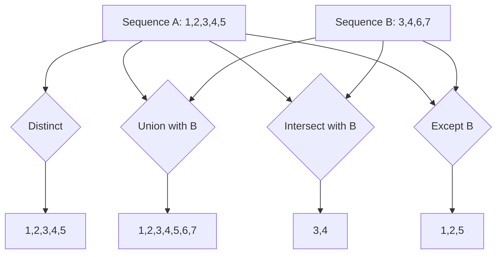
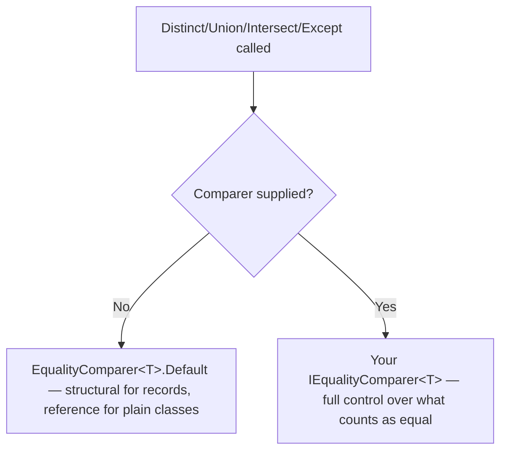

# Set Operators: Distinct, Union, Intersect, Except

## Introduction

Before reading this lesson, you should already be comfortable with **[Custom Aggregation with Aggregate](../04-linq/04-12-custom-aggregation-with-aggregate.md)**. This lesson leaves aggregation behind and turns to a different family of operators entirely: the **set operators** — `Distinct`, `Union`, `Intersect`, and `Except` — which compare a sequence against itself or against a second sequence and answer questions about membership and overlap, the same way mathematical set operations do.

By the end of this lesson, you will be able to:

- Use `Distinct`, `Union`, `Intersect`, and `Except` to remove duplicates from and compare two sequences
- Use the `...By` key-selector overloads — `DistinctBy`, `UnionBy`, `IntersectBy`, `ExceptBy` (since .NET 6) — to judge uniqueness by a single projected key
- Explain how these operators determine equality by default, using `EqualityComparer<T>.Default`
- Supply a custom `IEqualityComparer<T>` to override that default equality logic
- Choose the correct set operator for a given "combine or compare two sequences" requirement

## Set Operators — A Layman's Perspective

Imagine two neighborhood library branches — Downtown and Uptown — that a city library system has decided to merge into a single, larger central branch. Before the physical books can be shelved together, the head librarian has to answer several very specific questions by comparing the two branches' catalogs against each other, and each question calls for a genuinely different kind of comparison.

The first question is the simplest: within Downtown's own catalog alone, are there any duplicate entries — the same title accidentally logged twice under two different catalog numbers? Weeding those out, so each title appears exactly once, is purely a "clean up one list" task; nothing about it involves the other branch at all.

The second question is bigger: what does the *combined* central catalog look like, once both branches' collections are merged and every duplicate title — appearing in both branches — is only counted once? This is a "put everything together, but don't double-count anything" task, and it needs both catalogs at once to answer.

The third question flips the emphasis: which titles do *both* branches already carry, independently of each other? These are the overlapping titles — useful to know, because owning the same book twice across two branches might mean one copy could be donated or relocated instead of duplicated in the new central branch.

The fourth question flips it again: which titles does Downtown carry that Uptown does *not*? This tells the librarian exactly what Downtown alone is contributing to the merger that wouldn't otherwise exist in the combined system — the titles that would be lost if only Uptown's shelf were kept.

Every one of these questions has the same shape: given one or two piles of books, is this specific title present, present in both, or present in only one? A librarian who tried to answer all four questions using the exact same "walk down the shelf and check" method every time would be working much harder than necessary — different questions call for different comparison strategies, even though every one of them ultimately just asks "which titles show up where?" LINQ's set operators are precisely this: four distinct comparison strategies, applied to one or two sequences of data instead of two library shelves.

## Set Operators — A Programming Language Perspective

`Distinct`, `Union`, `Intersect`, and `Except` are extension methods on `IEnumerable<T>` in `System.Linq`. `Distinct()` returns the unique elements of a single sequence; `Union()`, `Intersect()`, and `Except()` each take a second sequence and return, respectively, the combined set of unique elements from both, the elements common to both, and the elements present in the first but absent from the second — all four results contain no duplicates. Unlike the immediate-execution aggregation operators from the previous two lessons, all four set operators use **deferred execution**, returning an `IEnumerable<T>` that isn't enumerated until you iterate it. By default, element comparison uses `EqualityComparer<T>.Default` — structural, per-property equality for `record` types, but reference equality for ordinary classes that haven't overridden `Equals`/`GetHashCode`. Each operator also accepts an optional `IEqualityComparer<T>` argument, and since .NET 6, key-selector `...By` overloads (`DistinctBy`, `UnionBy`, `IntersectBy`, `ExceptBy`) let you judge equality by one projected key instead of the whole object.

## How to Use Set Operators in C#

Before applying these operators to full objects, it helps to see all four side by side against two small sequences of numbers, where the overlap is easy to verify by eye.


*Figure 1: `Distinct` cleans up one sequence; `Union`, `Intersect`, and `Except` each compare two sequences with a different result rule.*

```csharp
// Program.cs — .NET 10 / C# 14

int[] branchA = { 1, 2, 3, 4, 4, 5 };
int[] branchB = { 3, 4, 6, 7 };

var distinctA = branchA.Distinct();
var union = branchA.Union(branchB);
var intersect = branchA.Intersect(branchB);
var except = branchA.Except(branchB);

Console.WriteLine($"Distinct A: {string.Join(", ", distinctA)}");
Console.WriteLine($"Union: {string.Join(", ", union)}");
Console.WriteLine($"Intersect: {string.Join(", ", intersect)}");
Console.WriteLine($"Except (A - B): {string.Join(", ", except)}");
```

**Console Output:**

```text
Distinct A: 1, 2, 3, 4, 5
Union: 1, 2, 3, 4, 5, 6, 7
Intersect: 3, 4
Except (A - B): 1, 2, 5
```

`branchA` had a duplicate `4`, so `Distinct` drops it. `Union` combines both arrays, keeping each value exactly once and preserving first-seen order across both sequences. `Intersect` keeps only the values `3` and `4`, which appear in both arrays. `Except` keeps only the values from `branchA` that never appear in `branchB` — `1`, `2`, and `5`. All four operators used `int`'s default equality, which compares values directly, to decide what counted as "the same."

Default equality behaves differently once you move from primitives to your own types:

```csharp
// Program.cs — .NET 10 / C# 14 — DistinctBy with a key selector

record BookCopy(string Isbn, string CopyId);

List<BookCopy> copies =
[
    new BookCopy("978-0-13-468599-1", "COPY-01"),
    new BookCopy("978-0-13-468599-1", "COPY-02"),
    new BookCopy("978-1-59327-584-6", "COPY-01")
];

// DistinctBy (.NET 6+) judges uniqueness by a projected key, not the whole
// object — here, only the first copy of each distinct ISBN is kept.
var distinctTitles = copies.DistinctBy(copy => copy.Isbn);

foreach (BookCopy copy in distinctTitles)
{
    Console.WriteLine($"{copy.Isbn} ({copy.CopyId})");
}
```

**Console Output:**

```text
978-0-13-468599-1 (COPY-01)
978-1-59327-584-6 (COPY-01)
```

A plain `Distinct()` on `copies` would have kept all three records, because `BookCopy` is a `record`, and its default structural equality compares *both* `Isbn` and `CopyId` — two copies of the same book with different copy IDs count as unequal records. `DistinctBy(copy => copy.Isbn)` narrows the equality check down to just the ISBN, so only the first copy encountered for each distinct ISBN survives, exactly the "one entry per title" result a card catalog needs.

## Real-Time Example: Merging Catalogs in Library/Inventory Management

We extend the Library/Inventory Management case study with the branch-merger scenario introduced above — the Downtown and Uptown branch catalogs, each a `List<Book>` — and answer all four librarian questions with LINQ's set operators, plus one final question that requires overriding the default equality with a custom `IEqualityComparer<T>`.

```csharp
// Program.cs — .NET 10 / C# 14 — Real-Time Example

List<Book> downtownBranch =
[
    new Book("978-0-13-468599-1", "Effective C#"),
    new Book("978-1-59327-584-6", "The C Programming Language"),
    new Book("978-0-596-00712-6", "Head First Design Patterns")
];

List<Book> uptownBranch =
[
    new Book("978-1-59327-584-6", "The C Programming Language"),
    new Book("978-0-13-468599-1", "Effective C#"),
    new Book("978-1-4919-0397-1", "Programming C# 10")
];

// Union: the combined catalog across both branches, duplicates removed.
// Book is a record, so equality compares Isbn and Title structurally —
// no custom comparer is needed for two identical records to match.
var combinedCatalog = downtownBranch.Union(uptownBranch);
Console.WriteLine("Combined catalog (Union):");
foreach (Book book in combinedCatalog)
{
    Console.WriteLine($"  {book.Title}");
}

// Intersect: titles both branches already carry — candidates to stop
// duplicating in the merged central branch.
var sharedTitles = downtownBranch.Intersect(uptownBranch);
Console.WriteLine("Carried by both branches (Intersect):");
foreach (Book book in sharedTitles)
{
    Console.WriteLine($"  {book.Title}");
}

// Except: titles Downtown has that Uptown doesn't — what Downtown alone
// contributes to the merger.
var downtownOnly = downtownBranch.Except(uptownBranch);
Console.WriteLine("Downtown-only titles (Except):");
foreach (Book book in downtownOnly)
{
    Console.WriteLine($"  {book.Title}");
}

// A librarian typing titles by hand introduces casing inconsistencies —
// a custom IEqualityComparer<T> compares by title only, case-insensitively,
// instead of relying on the record's default structural equality.
List<Book> uptownMisTyped =
[
    new Book("978-0-13-468599-1", "effective c#"),
    new Book("978-1-59327-584-6", "THE C PROGRAMMING LANGUAGE")
];

var titleOnlyComparer = new BookTitleComparer();
var stillSharedIgnoringCase = downtownBranch.Intersect(uptownMisTyped, titleOnlyComparer);
Console.WriteLine("Shared titles ignoring case (custom IEqualityComparer<T>):");
foreach (Book book in stillSharedIgnoringCase)
{
    Console.WriteLine($"  {book.Title}");
}

record Book(string Isbn, string Title);

class BookTitleComparer : IEqualityComparer<Book>
{
    public bool Equals(Book? x, Book? y) =>
        string.Equals(x?.Title, y?.Title, StringComparison.OrdinalIgnoreCase);

    public int GetHashCode(Book obj) =>
        obj.Title.ToUpperInvariant().GetHashCode();
}
```

**Console Output:**

```text
Combined catalog (Union):
  Effective C#
  The C Programming Language
  Head First Design Patterns
  Programming C# 10
Carried by both branches (Intersect):
  Effective C#
  The C Programming Language
Downtown-only titles (Except):
  Head First Design Patterns
Shared titles ignoring case (custom IEqualityComparer<T>):
  Effective C#
  The C Programming Language
```

The last block is the important one: `uptownMisTyped` holds records that are *not* structurally equal to their Downtown counterparts, because `Title` is capitalized differently — the default record equality would treat `"Effective C#"` and `"effective c#"` as different books entirely, and a plain `Intersect` would have found no overlap at all. Supplying `BookTitleComparer` overrides that default, comparing only the title, case-insensitively, and the shared titles reappear correctly. In a real catalog-merge tool, this is exactly the difference between silently losing matches to inconsistent data entry and correctly reconciling them.

## Default Equality vs Custom IEqualityComparer&lt;T&gt;

Every set operator in this lesson needs some way to decide whether two elements "are the same," and that decision is never optional — it's just sometimes invisible, because `EqualityComparer<T>.Default` supplies it automatically when you don't pass anything else.


*Figure 2: Every set operator needs an equality rule; the default is implicit and structural for records, while a custom comparer makes the rule explicit and overridable.*

| Aspect | Default equality (`EqualityComparer<T>.Default`) | Custom `IEqualityComparer<T>` |
|---|---|---|
| For `record` types | Structural — compares every positional property | Still applies; overrides the default for that one call |
| For plain classes | Reference equality, unless `Equals`/`GetHashCode` are overridden | Explicit, reusable comparison logic supplied per call |
| Where it's applied | Implicitly, with no extra argument needed | Passed as an extra argument to `Distinct`, `Union`, `Intersect`, or `Except` |
| Typical use case | Value types, records, and classes with overridden equality | Case-insensitive comparisons, partial-field comparisons, business-rule equality |
| Lighter-weight alternative | N/A | The `...By` overloads (`DistinctBy`, etc.), when comparing by a single key is enough |

## Types of Set-Related Operators in C#

`Distinct`, `Union`, `Intersect`, and `Except` are the core set operators, but several related tools extend or complement them:

1. **`DistinctBy` / `UnionBy` / `IntersectBy` / `ExceptBy`** *(since .NET 6)* — key-selector overloads of each operator in this lesson, judging uniqueness by one projected key instead of the whole object.
2. **[Grouping with GroupBy](../04-linq/04-08-grouping-with-groupby.md)** — a related way of organizing a sequence around a key, though it partitions elements into groups rather than filtering by membership.
3. **[Partitioning: Skip, Take, SkipWhile, TakeWhile](../04-linq/04-14-partitioning-skip-take.md)** — the next lesson's operators, which narrow a sequence by *position* rather than set membership.
4. **`HashSet<T>`** *(Module 03)* — the mutable collection type these set operators conceptually mirror; reach for it directly when you need a live, ongoing set rather than a one-time query result.
5. **Custom `IEqualityComparer<T>` implementations** — reusable equality logic, like the `BookTitleComparer` above, that can be shared across any LINQ operator that accepts a comparer.

## What You've Learned & What's Next

`Distinct`, `Union`, `Intersect`, and `Except` answer four distinct questions about overlap and uniqueness across one or two sequences, and every one of them depends on an equality decision that's either made implicitly by `EqualityComparer<T>.Default` or explicitly by a custom `IEqualityComparer<T>` you supply. The Library/Inventory example showed both sides of that coin: record types get correct structural equality for free, but real-world data entry inconsistencies often mean you need to override that default deliberately.

Continue your learning journey with **[Partitioning: Skip, Take, SkipWhile, TakeWhile](../04-linq/04-14-partitioning-skip-take.md)**, where we shift from filtering by set membership to filtering by position within a sequence.

---
*Applies to: .NET 10 / C# 14. Last reviewed 2026-08-16.*
