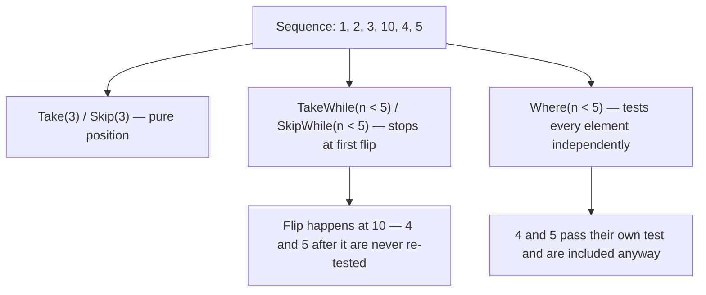
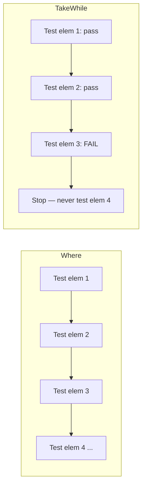

# Partitioning: Skip, Take, SkipWhile, TakeWhile

## Introduction

Before reading this lesson, you should already be comfortable with **[Set Operators: Distinct, Union, Intersect, Except](../04-linq/04-13-set-operators-in-linq.md)**. This lesson turns to a different kind of narrowing entirely: **partitioning**, where instead of filtering elements by value, you slice a sequence by *position* — the first few, everything after the first few, or a run of elements that lasts only as long as some condition keeps holding.

By the end of this lesson, you will be able to:

- Use `Skip` and `Take` together to implement pagination-style partitioning over a sequence
- Use `SkipWhile` and `TakeWhile` to partition a sequence based on a predicate evaluated in order, not against every element independently
- Explain precisely how `SkipWhile`/`TakeWhile` differ from `Where` — they stop evaluating at the first flip, rather than testing every element
- Use `Chunk` (since .NET 6) to split a sequence into fixed-size batches
- Predict the exact elements returned by `Skip`, `Take`, `SkipWhile`, and `TakeWhile` for a given sequence and count or predicate

## Partitioning — A Layman's Perspective

Picture a small print shop's front counter, where a long spool of numbered receipts prints out every order as it comes in, and a clerk needs to work through them in a few different ways depending on the task at hand.

The first task is simple pagination: a manager wants to review "page two" of this morning's receipts — not the first ten, not the whole spool, just the next ten after the first batch. The clerk doesn't need to read a single word on any receipt to do this; they just count off the first ten, set them aside, and hand over the next ten. Position alone decides what gets shown — the actual content of any given receipt is completely irrelevant to this task.

The second task is different: the clerk is asked to keep processing receipts automatically for as long as they're marked "priority," and to stop the instant a non-priority receipt shows up, handing everything from that point onward to a supervisor for manual review — even if a priority receipt appears again three receipts later. This is not "pull out every priority receipt, wherever it happens to sit in the pile" — that would mean digging through the entire spool and cherry-picking. It's "keep going only as long as the streak holds, and the moment the streak breaks, stop checking and hand off the rest, no matter what's actually printed on those later receipts." The clerk isn't allowed to peek ahead and resume the priority streak later; once it breaks, it's broken for good, for the rest of the spool.

The third task is what happens *before* the streak breaks, viewed from the other side: everything the clerk skipped past while waiting for something to change. If the clerk were instead told to skip every receipt until the first *non*-priority one showed up, and then hand over literally everything after that point — priority or not, without checking each one again — that's the mirror image of the second task. The clerk stops re-checking the moment the condition first fails, and just hands over the remaining stack as-is.

Notice how different this is from a fourth possible task: "go through the entire spool and pull out every priority receipt, wherever it is." That task really would require checking every single receipt on its own merits, cherry-picking regardless of position — which is a completely different kind of work from "keep going until the pattern breaks, then stop checking." Both are useful. They are just not the same job, and confusing them is exactly the mistake this lesson exists to prevent.

## Partitioning — A Programming Language Perspective

`Skip(int count)` and `Take(int count)`, extension methods on `IEnumerable<T>` in `System.Linq`, partition a sequence purely by position: `Skip` discards the first `count` elements and yields the rest; `Take` yields only the first `count` elements and discards the rest. Neither inspects element values at all. `SkipWhile(Func<T, bool> predicate)` and `TakeWhile(Func<T, bool> predicate)` partition by a predicate instead, but critically, they evaluate that predicate **in sequence order and stop evaluating it the moment it flips** — `TakeWhile` yields elements only until the predicate first returns `false`, then stops enumerating entirely, regardless of whether later elements would have passed; `SkipWhile` discards elements only until the predicate first returns `false`, then yields every remaining element unconditionally, without testing them again. This is the essential difference from `Where`, which evaluates its predicate against *every* element independently, with no memory of position at all. `Chunk(int size)`, added in .NET 6, splits a sequence into consecutive arrays of at most `size` elements each — the last chunk may be smaller if the sequence doesn't divide evenly. All of these operators use deferred execution.

## How to Use Partitioning Operators in C#

Before applying these operators to a realistic scenario, it helps to see `Skip`/`Take` and `SkipWhile`/`TakeWhile` applied to the same sequence side by side with `Where`, so the position-based/value-based distinction becomes unmistakable.


*Figure 1: `Skip`/`Take` ignore element values entirely; `TakeWhile`/`SkipWhile` stop testing at the first flip; `Where` tests every element on its own merits.*

```csharp
// Program.cs — .NET 10 / C# 14

int[] numbers = { 1, 2, 3, 10, 4, 5 };

// Skip/Take: partition by position — the first 3, or everything after them.
var firstThree = numbers.Take(3);
var afterFirstThree = numbers.Skip(3);

Console.WriteLine($"Take(3): {string.Join(", ", firstThree)}");
Console.WriteLine($"Skip(3): {string.Join(", ", afterFirstThree)}");

// TakeWhile/SkipWhile: partition by a predicate, but stop testing at the
// first element that breaks the pattern — even if later elements would
// have passed the same test again.
var takeWhileSmall = numbers.TakeWhile(n => n < 5);
var skipWhileSmall = numbers.SkipWhile(n => n < 5);

Console.WriteLine($"TakeWhile(n < 5): {string.Join(", ", takeWhileSmall)}");
Console.WriteLine($"SkipWhile(n < 5): {string.Join(", ", skipWhileSmall)}");

// Where tests every element independently — it never stops at a failure.
var whereSmall = numbers.Where(n => n < 5);
Console.WriteLine($"Where(n < 5): {string.Join(", ", whereSmall)}");
```

**Console Output:**

```text
Take(3): 1, 2, 3
Skip(3): 10, 4, 5
TakeWhile(n < 5): 1, 2, 3
SkipWhile(n < 5): 10, 4, 5
Where(n < 5): 1, 2, 3, 4, 5
```

This is the key contrast to notice: `TakeWhile(n < 5)` stops the instant it reaches `10`, so `4` and `5` — which are individually less than `5` — are never even considered; they come *after* the flip. `SkipWhile(n < 5)` behaves the same way in reverse: it stops testing the moment `10` fails the predicate, and from that point on it includes *everything* unconditionally, which is why `4` and `5` appear in its output even though they'd pass the `< 5` test on their own. `Where(n < 5)`, by contrast, checks every element independently and correctly includes `4` and `5` alongside `1`, `2`, and `3`, because it never "gives up" testing after one failure. Confusing `TakeWhile`/`SkipWhile` with `Where` is one of the most common LINQ mistakes, precisely because on already-sorted data the two can look identical — until they don't.

## Real-Time Example: Partitioning Orders in E-Commerce Order Processing

We extend the E-Commerce Order Processing case study with a morning order queue, using three genuinely different partitioning needs: paginating order history for an admin dashboard, automatically fast-tracking a priority streak on the fulfillment line, and batching the remaining backlog for a rate-limited shipping-label API.

```csharp
// Program.cs — .NET 10 / C# 14 — Real-Time Example

List<Order> orderHistory =
[
    new Order("ORD-7001", 45.00m, true),
    new Order("ORD-7002", 120.00m, true),
    new Order("ORD-7003", 78.50m, true),
    new Order("ORD-7004", 15.25m, false),
    new Order("ORD-7005", 200.00m, true),
    new Order("ORD-7006", 60.00m, false),
    new Order("ORD-7007", 33.10m, true)
];

// Pagination: an admin dashboard showing "page 2" of order history,
// 3 orders per page — pure position-based partitioning.
const int pageSize = 3;
var pageTwo = orderHistory.Skip(pageSize).Take(pageSize);
Console.WriteLine("Order history — page 2:");
foreach (Order order in pageTwo)
{
    Console.WriteLine($"  {order.OrderId} — {order.Total:C}");
}

// TakeWhile: the fulfillment line auto-processes priority orders, but
// stops the instant it hits a non-priority order — even though later
// orders (ORD-7005, ORD-7007) are priority too, they need manual triage
// once the automatic streak has broken.
var autoProcessed = orderHistory.TakeWhile(order => order.IsPriority);
Console.WriteLine("Auto-processed priority orders (TakeWhile):");
foreach (Order order in autoProcessed)
{
    Console.WriteLine($"  {order.OrderId}");
}

// Chunk (.NET 6+): the shipping-label API only accepts 3 orders per call,
// so the remaining backlog is split into fixed-size batches.
Order[] remainingOrders = orderHistory.Skip(3).ToArray();
int batchNumber = 1;
foreach (Order[] batch in remainingOrders.Chunk(3))
{
    Console.WriteLine($"Shipping label batch {batchNumber}: {string.Join(", ", batch.Select(o => o.OrderId))}");
    batchNumber++;
}

record Order(string OrderId, decimal Total, bool IsPriority);
```

**Console Output:**

```text
Order history — page 2:
  ORD-7004 — $15.25
  ORD-7005 — $200.00
  ORD-7006 — $60.00
Auto-processed priority orders (TakeWhile):
  ORD-7001
  ORD-7002
  ORD-7003
Shipping label batch 1: ORD-7004, ORD-7005, ORD-7006
Shipping label batch 2: ORD-7007
```

Each partitioning need here would have failed with the wrong operator. Pagination needs `Skip`/`Take`, since a dashboard page has nothing to do with which orders are priority. The fulfillment line specifically needs `TakeWhile`, not `Where(order => order.IsPriority)` — a `Where` clause would have auto-processed `ORD-7005` and `ORD-7007` too, silently skipping right past `ORD-7004` and `ORD-7006`, which is exactly the behavior that would let a flagged order slip through fulfillment without the manual review it's supposed to trigger. `Chunk` guarantees the shipping-label API never receives more than three orders per call, regardless of how large the backlog grows.

## TakeWhile/SkipWhile vs Where

Both `TakeWhile`/`SkipWhile` and `Where` narrow a sequence using a predicate, which makes them easy to confuse — but they answer fundamentally different questions. `Where` asks "does this element, on its own, satisfy the condition?" for every element, independently. `TakeWhile`/`SkipWhile` ask "has the pattern broken yet?" and, once it has, they stop asking the question at all for the rest of the sequence.


*Figure 2: `Where` keeps testing every element to the end; `TakeWhile`/`SkipWhile` stop testing the moment the predicate first flips.*

| Aspect | `Where(predicate)` | `TakeWhile(predicate)` / `SkipWhile(predicate)` |
|---|---|---|
| Evaluates predicate on | Every single element, independently | Elements in order, until the predicate result flips once |
| Result depends on | Only each element's own value | Also the *position* where the predicate first fails/succeeds |
| Elements after a "failing" element | May still be included, if they individually pass | Never re-tested once the flip has happened |
| Typical use case | General filtering, order-independent | Sorted or streamed data where a stop condition is meaningful |
| Real-world analogy | Checking every receipt on its own merits | Processing receipts off a spool until the rule breaks, then stopping |

## Types of Partitioning Operators in C#

`Skip`, `Take`, `SkipWhile`, and `TakeWhile` are the core partitioning operators, but a few related tools round out this family:

1. **`Chunk`** *(since .NET 6)* — splits a sequence into fixed-size batches, as demonstrated above for the rate-limited shipping-label API.
2. **[Element Operators: First, Single, Any, All](../04-linq/04-15-element-operators-first-single-any-all.md)** — the next lesson, for pulling a single specific element rather than a partitioned range.
3. **[Ordering with OrderBy and ThenBy](../04-linq/04-07-ordering-with-orderby-thenby.md)** — usually applied *before* `Skip`/`Take`, since pagination only makes sense over a stable, well-defined order.
4. **Out-of-range `Skip`/`Take` counts** — both clamp gracefully rather than throwing; `Take(-1)` or a count larger than the sequence simply returns fewer elements or none at all.
5. **[Filtering with Where](../04-linq/04-04-filtering-with-where.md)** — the value-based counterpart to this lesson's position-based partitioning.

## What You've Learned & What's Next

`Skip` and `Take` partition a sequence purely by position, ignoring element values entirely, while `SkipWhile` and `TakeWhile` partition by a predicate but stop evaluating it forever at the first flip — a fundamentally different behavior from `Where`, which tests every element on its own merits regardless of position. Mixing these up, as the fulfillment-line example showed, isn't just a style choice — it can silently change which records get processed.

Continue your learning journey with **[Element Operators: First, Single, Any, All](../04-linq/04-15-element-operators-first-single-any-all.md)**, where we move from partitioning ranges to pulling out — or checking for — individual elements.

---
*Applies to: .NET 10 / C# 14. Last reviewed 2026-08-16.*
