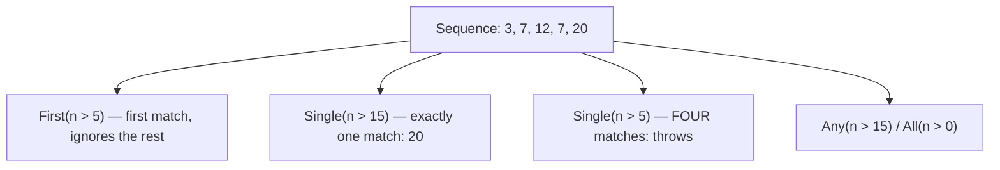
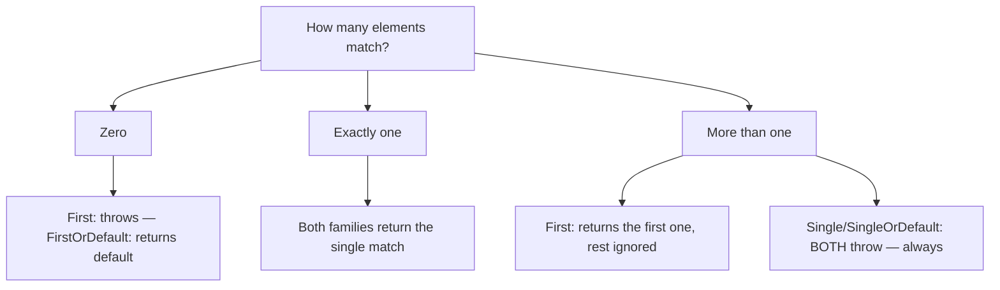

# Element Operators: First, Single, Any, All

## Introduction

Before reading this lesson, you should already be comfortable with **[Partitioning: Skip, Take, SkipWhile, TakeWhile](../04-linq/04-14-partitioning-skip-take.md)**. This lesson moves from partitioning ranges to a narrower, sharper question: pulling out — or simply checking for — a single specific element. The **element operators** — `First`, `FirstOrDefault`, `Single`, `SingleOrDefault`, `Any`, and `All` — each answer a subtly different version of "is there one, and what is it?"

By the end of this lesson, you will be able to:

- Use `First`/`FirstOrDefault` to retrieve the first matching element, or a default value if none exists
- Use `Single`/`SingleOrDefault` to retrieve exactly one matching element, and explain why `Single` throws when *more than one* match is found, not only when there are zero
- Use `Any` and `All` to check predicate conditions across a sequence without retrieving any element at all
- Distinguish the exact exception-throwing behavior of each operator across zero-match, one-match, and multiple-match scenarios
- Choose the correct element operator for a given requirement — "give me the first," "give me the only one," or "tell me whether any/all match"

## Element Operators — A Layman's Perspective

Picture a bank teller working at two very different counters in the same branch. At the first counter, the teller looks up a customer's account using their account number in the core banking system. Account numbers are supposed to be unique — the entire banking system is built on the assumption that exactly one account exists for any given account number. So if the teller's lookup ever came back with *two* different account records for the same account number, that would not be a "just grab one and move on" situation. That would be a serious data-integrity alarm — a sign that something in the system has gone badly wrong — and the correct response is to stop everything and flag it loudly, not silently pick whichever record showed up first and hope it's the right one.

At the second counter, a different teller is asked to find "the most recent transaction" on an account with a long, busy history. Here, the situation is completely different: of course there are many transactions on the account — that's expected and completely normal. The teller isn't looking for "the only one that exists"; they're looking for whichever one happens to be first once the list is sorted by date. Finding many transactions isn't an error here at all — it's the ordinary state of affairs, and the teller simply wants the front of that ordered line, with zero concern about how many others are sitting behind it.

Now imagine two more, entirely different questions the branch manager might ask. "Does this account have *any* flagged suspicious transactions?" doesn't require identifying which transaction is suspicious, or how many — it just needs a yes-or-no answer, and the manager can stop checking the instant a single flagged transaction turns up. And "are *all* of this month's transactions reconciled?" is the mirror image — it needs every single transaction to pass the check, and the manager can stop the instant even one of them fails.

These four questions — "give me the one and only," "give me whichever is first," "does at least one match," and "do they all match" — sound similar in casual conversation, but they carry genuinely different guarantees and genuinely different failure behavior. A banking system that quietly treated "the only account with this number" the same way it treats "the most recent transaction" would be one duplicate-account bug away from a very bad day.

## Element Operators — A Programming Language Perspective

`First(predicate)` and `FirstOrDefault(predicate)` return the first element in a sequence that satisfies the predicate (or the first element overall, with no predicate). `First` throws `InvalidOperationException` if no such element exists; `FirstOrDefault` instead returns `default(T)` (or an explicit default value, via an overload available since .NET 6). Neither cares how many matching elements exist in total — only the first one found. `Single(predicate)` and `SingleOrDefault(predicate)` are stricter: they require that **at most one** element matches. `Single` throws `InvalidOperationException` both when zero elements match *and* when more than one element matches; `SingleOrDefault` returns the default value on zero matches but **still throws on more than one match** — the "OrDefault" suffix only relaxes the zero-match case, never the multiple-match case. `Any(predicate)` returns `true` the instant it finds one matching element, short-circuiting the rest of the sequence; called with no predicate, it simply checks whether the sequence has any elements at all. `All(predicate)` returns `true` only if every element matches, short-circuiting to `false` the instant one element fails — and is vacuously `true` on an empty sequence, since no element exists to violate the condition.

## How to Use Element Operators in C#

Before applying these operators to a business scenario, it helps to see all four families run against the same sequence across zero-match, one-match, and multiple-match cases, since that's exactly where their behavior diverges.


*Figure 1: `First` never cares how many matches exist beyond the one it returns; `Single` throws the moment a second match appears.*

```csharp
// Program.cs — .NET 10 / C# 14

int[] numbers = { 3, 7, 12, 7, 20 };

// First / FirstOrDefault: return the first match; don't care how many exist.
int firstOver5 = numbers.First(n => n > 5);
int firstOver100 = numbers.FirstOrDefault(n => n > 100);

Console.WriteLine($"First(n > 5): {firstOver5}");
Console.WriteLine($"FirstOrDefault(n > 100): {firstOver100}");

// Single / SingleOrDefault: require AT MOST one match.
int singleOver15 = numbers.Single(n => n > 15);
int singleOver100 = numbers.SingleOrDefault(n => n > 100);

Console.WriteLine($"Single(n > 15): {singleOver15}");
Console.WriteLine($"SingleOrDefault(n > 100): {singleOver100}");

try
{
    int singleOver5 = numbers.Single(n => n > 5);
    Console.WriteLine(singleOver5);
}
catch (InvalidOperationException ex)
{
    Console.WriteLine($"Single(n > 5) threw: {ex.Message}");
}

// Any / All: check existence and universality without retrieving any element.
bool anyOver15 = numbers.Any(n => n > 15);
bool allPositive = numbers.All(n => n > 0);

Console.WriteLine($"Any(n > 15): {anyOver15}");
Console.WriteLine($"All(n > 0): {allPositive}");
```

**Console Output:**

```text
First(n > 5): 7
FirstOrDefault(n > 100): 0
Single(n > 15): 20
SingleOrDefault(n > 100): 0
Single(n > 5) threw: Sequence contains more than one matching element
Any(n > 15): True
All(n > 0): True
```

`First(n > 5)` returns `7` — the first element greater than 5 — without caring that `12`, `7`, and `20` also qualify further down the sequence. `Single(n > 15)` succeeds because exactly one element, `20`, is greater than 15. `Single(n > 5)`, however, throws — not because nothing matched, but because *four* elements (`7`, `12`, `7`, `20`) matched, and `Single` treats "too many" as just as invalid as "too few." Note the exact exception message: `"Sequence contains more than one matching element"` — a distinctly different message from the one you'd see on a zero-match `Single` call, `"Sequence contains no matching element"`. `Any` and `All` never needed to retrieve an element at all; they only ever answer `true` or `false`.

## Real-Time Example: Element Operators in Banking/ATM Account Lookup

We extend the Banking/ATM case study with two lookups that must use different element operators for correctness, not just style: finding an account by its (supposedly unique) account number, and finding the most recent transaction on that account, alongside `Any`/`All` checks a compliance report would run.

```csharp
// Program.cs — .NET 10 / C# 14 — Real-Time Example

List<Account> accounts =
[
    new Account("ACC-1001", "Riya Sharma"),
    new Account("ACC-1002", "Miguel Torres"),
    new Account("ACC-1003", "Amara Okafor")
];

// Single: account numbers are supposed to be unique across the whole bank —
// if this lookup ever finds more than one match, that's a data-integrity
// alarm, not a "just pick one" situation, so it must throw rather than
// silently return the first record it happens to find.
Account account = accounts.Single(a => a.AccountNumber == "ACC-1002");
Console.WriteLine($"Account found: {account.Owner} ({account.AccountNumber})");

List<Transaction> transactions =
[
    new Transaction("Payroll deposit", 1500.00m, new DateTime(2026, 8, 1), true),
    new Transaction("ATM withdrawal", -60.00m, new DateTime(2026, 8, 5), true),
    new Transaction("Online purchase", -34.99m, new DateTime(2026, 8, 12), false),
    new Transaction("Interest credit", 2.15m, new DateTime(2026, 8, 15), true)
];

// First: many transactions are expected to exist — we just want whichever
// one is most recent, with no assumption that it's the only one.
Transaction mostRecent = transactions
    .OrderByDescending(t => t.Date)
    .First();
Console.WriteLine($"Most recent transaction: {mostRecent.Description} on {mostRecent.Date:d}");

// Any: does this account have at least one unreconciled transaction?
bool hasUnreconciled = transactions.Any(t => !t.Reconciled);
Console.WriteLine($"Has unreconciled transactions: {hasUnreconciled}");

// All: are every one of this month's transactions reconciled?
bool allReconciled = transactions.All(t => t.Reconciled);
Console.WriteLine($"All transactions reconciled: {allReconciled}");

record Account(string AccountNumber, string Owner);
record Transaction(string Description, decimal Amount, DateTime Date, bool Reconciled);
```

**Console Output:**

```text
Account found: Miguel Torres (ACC-1002)
Most recent transaction: Interest credit on 8/15/2026
Has unreconciled transactions: True
All transactions reconciled: False
```

The account lookup deliberately uses `Single`, not `First`. If two account records ever existed for `"ACC-1002"` — a data-integrity bug somewhere upstream — `First` would silently return one of them and the teller would never know anything was wrong; `Single` throws immediately, surfacing the corruption the moment it's queried instead of masking it. The transaction lookup deliberately uses `First`, because "most recent transaction" has no expectation of uniqueness — many transactions legitimately exist, and only their sort order matters. The `Any`/`All` checks answer a compliance question — "is everything reconciled?" — without the report ever needing to know *which* transaction failed, just that at least one did.

## First/FirstOrDefault vs Single/SingleOrDefault

The defining difference between these two families isn't what happens on zero matches — both handle that case, just with different fallback behavior. It's what happens when **more than one** element matches: `First`/`FirstOrDefault` happily returns the first one and ignores the rest, while `Single`/`SingleOrDefault` treats it as an error every time, with no exception for the `OrDefault` variant.


*Figure 2: The two families agree on zero and one match; they diverge sharply the moment a second match appears.*

| Aspect | `First` / `FirstOrDefault` | `Single` / `SingleOrDefault` |
|---|---|---|
| Zero matches | `First` throws; `FirstOrDefault` returns default | `Single` throws; `SingleOrDefault` returns default |
| Exactly one match | Returns it | Returns it |
| More than one match | Returns the first one found; extras are silently ignored | Both throw `InvalidOperationException` — the `OrDefault` suffix does not help here |
| Communicates to the reader | "I expect at least one; I don't care if there are more" | "I expect exactly one; more than one is a bug" |
| Typical use case | Most recent record, first match in a sorted list | Unique-key lookups — account numbers, primary keys, emails |

## Types of Element Operators in C#

`First`, `Single`, `Any`, and `All` are the core element operators, but a few related tools are worth knowing:

1. **`ElementAt` / `ElementAtOrDefault`** — retrieve the element at a specific index, throwing or returning a default value if the index is out of range.
2. **`Any()` with no predicate** — an efficient existence check for "does this sequence have any elements at all," preferable to `Count() > 0` since it stops at the first element instead of counting the whole sequence.
3. **`Contains`** — a specialized existence check for "does this exact value appear," related to `Any` but comparing values directly instead of evaluating a predicate.
4. **[Partitioning: Skip, Take, SkipWhile, TakeWhile](../04-linq/04-14-partitioning-skip-take.md)** — the previous lesson's range-based operators, contrasted here with this lesson's single-element operators.
5. **[Zip and Combining Sequences](../04-linq/04-16-zip-and-combining-sequences.md)** — the next lesson, which pairs up elements across two sequences instead of pulling a single element from one.

## What You've Learned & What's Next

`First`/`FirstOrDefault` and `Single`/`SingleOrDefault` look similar but make very different promises: `First` returns whichever match comes first and never complains about extras, while `Single` guarantees exactly one match exists and throws the instant that guarantee is violated — whether by zero matches or by more than one. `Any` and `All` answer existence and universality questions without retrieving any element at all. Choosing correctly, as the account-lookup example showed, is often the difference between surfacing a data bug immediately and quietly masking it.

Continue your learning journey with **[Zip and Combining Sequences](../04-linq/04-16-zip-and-combining-sequences.md)**, where we move from operating on a single sequence to pairing up elements across two sequences at once.

---
*Applies to: .NET 10 / C# 14. Last reviewed 2026-08-16.*
