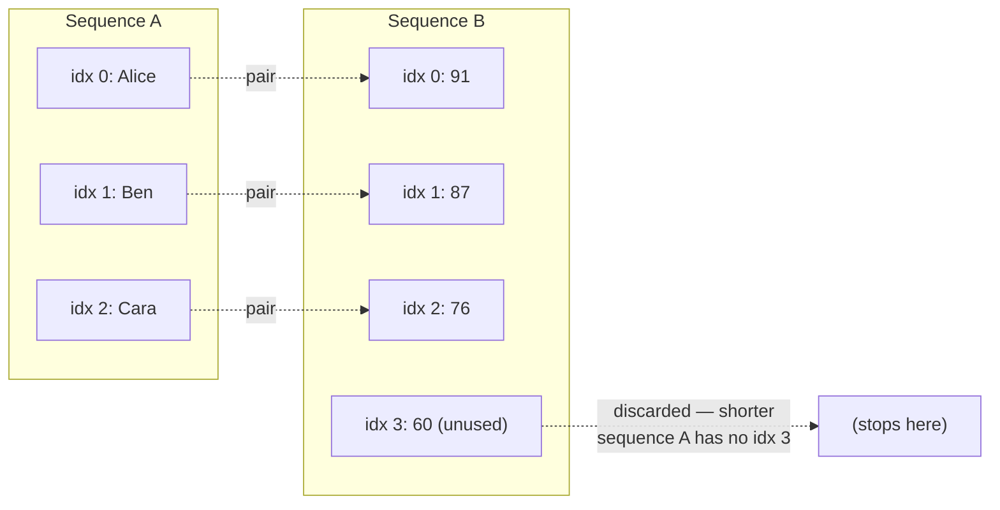
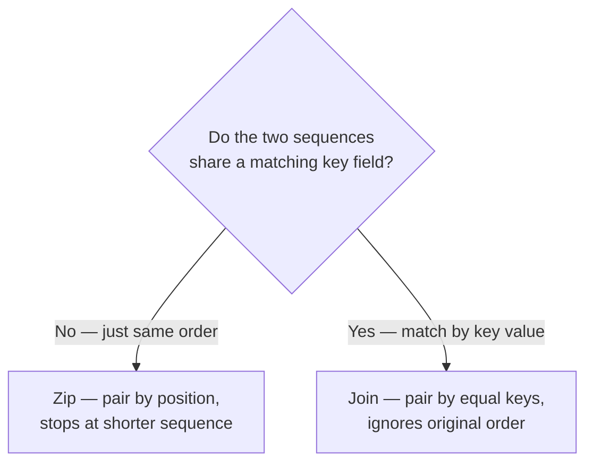

# Zip and Combining Sequences

## Introduction

Before reading this lesson, you should already be comfortable with **[Element Operators: First, Single, Any, All](../04-linq/04-15-element-operators-first-single-any-all.md)**, which taught you how to pull a single element out of a sequence based on a condition. This lesson takes a different shape of problem: instead of reaching into one sequence, you're combining two — or three — sequences together, position by position, into a single new sequence. That operator is `Zip`.

By the end of this lesson, you will be able to:

- Explain what `Zip` does and how it pairs elements positionally from multiple sequences
- Use the two-sequence and three-sequence overloads of `Zip`, including the tuple-returning overload
- Predict the length of a `Zip` result when the input sequences have different lengths
- Combine parallel arrays or lists into strongly-typed records using `Zip`
- Recognize when `Zip` is the right tool versus when a join or a dictionary lookup would be more appropriate

## Zip — A Layman's Perspective

Picture two people at opposite ends of a long dinner table, each responsible for setting down a stack of items in front of every chair. One person walks down the row of chairs placing a fork at each seat. The other walks the same row, at the same pace, placing a knife at each seat. Nobody is checking names or matching anything up by looking at who's sitting where — they simply move down the row together, and whatever chair the fork-person is at, the knife-person is at too. Chair one gets a fork and a knife. Chair two gets a fork and a knife. And so on, purely by virtue of walking the row in lockstep.

Now imagine one of them runs out of items early — say there are only eight forks but ten knives, because someone miscounted. What happens at chair nine? There's no fork left to place, so the sensible thing to do is stop setting the table entirely at that point, rather than placing a lonely knife with no partner. A table setting where some chairs have knives-only and others have complete pairs is worse than a shorter table that is fully and consistently set. This is exactly the discipline a "stop at the shortest" pairing process follows: it never produces a half-finished pair, and it simply calls it done the moment either supply runs dry.

This scenario is precisely what a zipper on a jacket does too — which is where the technique borrows its name. A zipper has two rows of teeth, and it works by interlocking the *first* tooth on the left with the *first* tooth on the right, the second with the second, and so on down the line, purely by position, with no regard for what's printed on each individual tooth. If one side of the zipper is physically shorter than the other, the zipper simply stops closing at that point — it doesn't invent an extra tooth to keep matching.

Bring this back to a software scenario. Suppose a small mail-order business tracks its daily shipments in two separate lists that were exported from two different systems: a list of tracking numbers, and a list of carrier names, both written down in the same shipment order. Nobody attached a tracking number directly to a carrier name in either list — the connection between the two lives entirely in the fact that entry three in one list corresponds to entry three in the other, purely by *position*. To make sense of the data, you need exactly the "walk both rows together, pairing as you go" process described above: take the first tracking number with the first carrier, the second tracking number with the second carrier, and stop pairing the moment either list runs out. That positional pairing, with no regard for the values themselves and no lookup key involved, is exactly what the `Zip` operator gives you in code — it walks two (or three) sequences side by side and produces one new sequence of paired-up results, stopping cleanly the instant the shorter of the sequences is exhausted.

## Zip — A Programming Language Perspective

`Zip` is a LINQ standard query operator, defined as an extension method on `IEnumerable<T>` in the `System.Linq` namespace, that merges two (or three) sequences by enumerating them in lockstep and combining the element at each shared index into a single result element. Unlike `Join`, `Zip` performs no key comparison at all — pairing is purely positional, based on enumeration order, not on matching values. The two-sequence overload `Zip<TFirst, TSecond>(IEnumerable<TFirst>, IEnumerable<TSecond>)` returns `IEnumerable<(TFirst First, TSecond Second)>`, a sequence of named-tuple pairs, when no selector delegate is supplied. An overload accepting a `Func<TFirst, TSecond, TResult>` selector lets you project each pair directly into a custom shape instead of a tuple. Since .NET 6, a three-sequence overload — `Zip<TFirst, TSecond, TThird>` — combines three sequences at once into `IEnumerable<(TFirst, TSecond, TThird)>`. `Zip` is lazily evaluated like most LINQ operators: enumeration of all input sequences advances together, one step at a time, and the resulting sequence's length always equals the length of the *shortest* input sequence, silently discarding any excess elements from longer sequences.

## How to Use Zip in C#

`Zip` is called on any `IEnumerable<T>` and takes one or two additional sequences as arguments. Without a selector, it returns a sequence of `(First, Second)` tuples (or `(First, Second, Third)` for three sequences) that you can immediately deconstruct in a `foreach`. With a selector delegate, you skip the intermediate tuple entirely and produce your target type directly.


*Figure 1: `Zip` walks both sequences at the same index and stops the instant the shorter sequence runs out — the fourth score has no matching name, so it is silently dropped.*

```csharp
// Program.cs — .NET 10 / C# 14

string[] names = ["Alice", "Ben", "Cara"];
int[] scores = [91, 87, 76, 60]; // one extra element — Zip will ignore it

// Overload with no selector: returns a sequence of (First, Second) tuples.
IEnumerable<(string First, int Second)> paired = names.Zip(scores);

foreach ((string name, int score) in paired)
{
    Console.WriteLine($"{name}: {score}");
}

Console.WriteLine($"Paired count: {paired.Count()}");

// Overload with a selector: project each pair directly into a formatted string.
IEnumerable<string> summaries = names.Zip(scores, (name, score) => $"{name} scored {score}");
foreach (string summary in summaries)
{
    Console.WriteLine(summary);
}
```

**Console Output:**

```text
Alice: 91
Ben: 87
Cara: 76
Paired count: 3
Alice scored 91
Ben scored 87
Cara scored 76
```

Notice that `scores` has four elements but `names` only has three, and the result — in both calls — only ever contains three pairs. `Zip` never throws for mismatched lengths and never pads the shorter sequence with default values; it simply stops as soon as either input sequence is exhausted, which is why the trailing `60` in `scores` never appears anywhere in the output.

## Real-Time Example: Zip in E-Commerce Order Processing

We extend the E-Commerce Order Processing case study with a common integration scenario: a warehouse system exports two parallel CSV-derived lists for a single shipment batch — one list of order IDs, one list of the tracking numbers the carrier assigned, both in the same batch order — and the two lists must be recombined into a single sequence of `ShipmentRecord` values before they can be emailed to customers.

```csharp
// Program.cs — .NET 10 / C# 14 — Real-Time Example

record ShipmentRecord(string OrderId, string TrackingNumber, string Carrier);

string[] orderIds = ["ORD-7001", "ORD-7002", "ORD-7003", "ORD-7004"];
string[] trackingNumbers = ["1Z999AA10123456784", "1Z999AA10123456785", "1Z999AA10123456786"];
string[] carriers = ["UPS", "UPS", "FedEx", "UPS"]; // one order didn't ship yet — no tracking number

// Three-sequence Zip (available since .NET 6): pair order, tracking number, and carrier
// all at once. The result length is governed by trackingNumbers, the shortest sequence —
// ORD-7004 has no tracking number yet, so it is correctly excluded from this batch.
IEnumerable<ShipmentRecord> shipmentBatch = orderIds
    .Zip(trackingNumbers, carriers)
    .Select(triple => new ShipmentRecord(triple.First, triple.Second, triple.Third));

Console.WriteLine("Shipment notifications ready to send:");
foreach (ShipmentRecord record in shipmentBatch)
{
    Console.WriteLine($"  {record.OrderId} -> {record.Carrier} tracking {record.TrackingNumber}");
}

int notShippedCount = orderIds.Length - trackingNumbers.Length;
Console.WriteLine($"Orders awaiting tracking assignment: {notShippedCount}");
```

**Console Output:**

```text
Shipment notifications ready to send:
  ORD-7001 -> UPS tracking 1Z999AA10123456784
  ORD-7002 -> UPS tracking 1Z999AA10123456785
  ORD-7003 -> FedEx tracking 1Z999AA10123456786
Orders awaiting tracking assignment: 1
```

This is exactly the situation `Zip` is built for: two or three data feeds that arrived from different places but share a common positional order, with no shared key column to `Join` on. Critically, the fact that `Zip` silently stops at the shortest sequence turned out to be *correct* behavior here — `ORD-7004` genuinely has no tracking number yet, so excluding it from the notification batch avoided sending a broken email with a missing tracking link. In a real system you would typically also log or alert on that length mismatch, since a silently dropped order is easy to overlook if nobody is watching the counts.

## Zip vs Join

Both `Zip` and `Join` combine two sequences into one, which makes them easy to confuse, but they solve fundamentally different problems. `Zip` pairs elements by their *position* in the enumeration — it has no concept of a key and does not care whether the values at matching positions have any logical relationship to each other at all; it is purely mechanical. `Join`, by contrast, pairs elements by *matching key values* — it walks both sequences looking for elements whose keys are equal, regardless of where each element sits positionally, and it can produce zero, one, or many matches per element depending on how many keys collide. Use `Zip` when two sequences are already known to correspond index-for-index, such as parallel arrays exported from the same ordered source. Use `Join` when two sequences share a logical key (like a `CustomerId` or `Sku`) but are not necessarily in the same order or the same length, and the correspondence must be established by value rather than by position.


*Figure 2: The deciding question is whether a correspondence needs to be looked up by key or is already guaranteed by shared ordering.*

| Aspect | `Zip` | `Join` |
|---|---|---|
| Matching basis | Positional index in enumeration order | Equality of a key selector's output |
| Handles mismatched order | No — assumes both sequences are already aligned | Yes — reorders logically by key match |
| Result length | Length of the shortest input sequence | Number of key matches found (can be 0, 1, or many per element) |
| Typical use case | Parallel arrays/lists from the same ordered export | Relating two different collections by a shared identifier (e.g. `CustomerId`) |

## Types of Sequence-Combining Operators in C#

`Zip` is one of several ways LINQ lets you bring multiple sequences together — each fits a different relationship between the data:

1. **Join operators (`Join`, `GroupJoin`)** — combining two sequences by matching key values rather than position, covered earlier in this module.
2. **Set operators (`Concat`, `Union`, `Intersect`, `Except`)** — combining sequences end-to-end or by set membership rather than pairing element-for-element, also covered earlier in this module.
3. **[ToLookup and Lookup Tables](../04-linq/04-17-tolookup-and-lookup-tables.md)** — building an indexable, multi-value structure to relate one sequence to another by key, the next lesson in this module.
4. **The `Zip(first, second)` tuple overload** — the no-selector form used above, ideal for quick inline pairing without defining a projection.
5. **The `Zip(first, second, third)` three-sequence overload** — available since .NET 6, for combining exactly three parallel sequences at once, as shown in the Real-Time Example.

## What You've Learned & What's Next

`Zip` combines two or three sequences by walking them in lockstep and pairing up whatever sits at each shared position, stopping cleanly the moment the shortest sequence runs out rather than padding or throwing. It's the right tool specifically when sequences are already known to correspond index-for-index — parallel arrays, parallel exports, or parallel results from independent computations — and the wrong tool when a real key-based relationship exists, which calls for `Join` instead.

Continue your learning journey with **[ToLookup and Lookup Tables](../04-linq/04-17-tolookup-and-lookup-tables.md)**, where we build an eagerly-materialized, indexable, multi-value structure that complements the deferred, key-matching world of `Join` and `GroupBy`.

---
*Applies to: .NET 10 / C# 14. Last reviewed 2026-08-16.*
