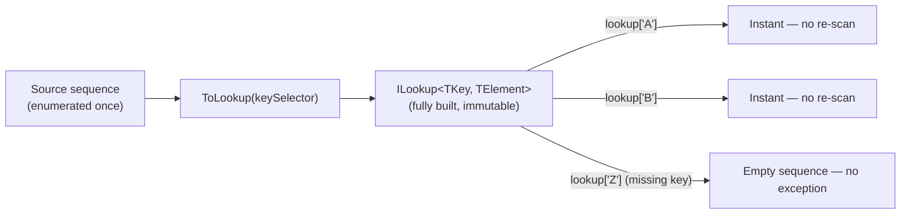
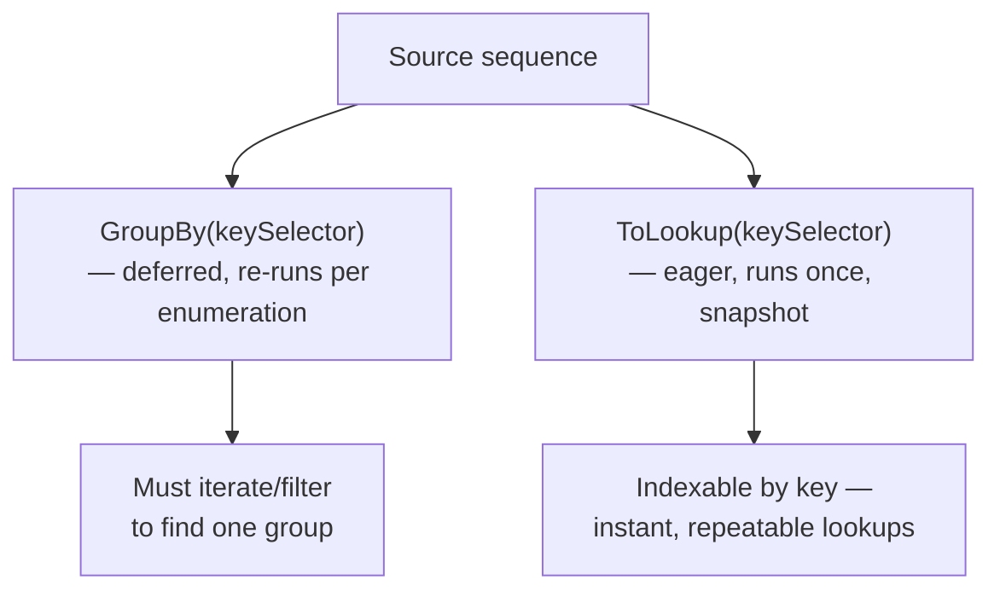

# ToLookup and Lookup Tables

## Introduction

Before reading this lesson, you should already be comfortable with **[Zip and Combining Sequences](../04-linq/04-16-zip-and-combining-sequences.md)**, and — from earlier in this module — with `GroupBy`, since this lesson exists largely to contrast with it. `GroupBy` gives you a lazy, one-pass-through sequence of groups. This lesson introduces `ToLookup`, which gives you something that looks similar on the surface but behaves in a meaningfully different way: an eagerly-built, indexable, dictionary-like structure you can query by key over and over again.

By the end of this lesson, you will be able to:

- Explain what `ILookup<TKey, TElement>` is and how it differs from `IDictionary<TKey, TValue>`
- Build a lookup table from any sequence using `ToLookup`
- Look up all values for a given key instantly, including keys that don't exist (without throwing)
- Explain precisely how `ToLookup` differs from `GroupBy` in terms of execution timing and reusability
- Choose between `ToLookup` and `GroupBy` based on whether a result needs to be queried repeatedly or consumed once

## ToLookup and Lookup Tables — A Layman's Perspective

Picture a library that keeps a card catalog for its fiction section, organized by author's last name. Every card drawer is labeled with a range of letters, and inside each drawer, cards are grouped so that every book by "Christie" sits together, every book by "King" sits together, and so on. Here's the important part: a librarian built this entire catalog once, in a dedicated afternoon, going through every single book on the shelves and filing a card for it into the correct drawer. By the time a patron walks up asking "what books do you have by King?", the librarian doesn't need to walk the shelves again — they open the "K" drawer, and the answer is already sitting there, fully organized, ready to be handed over instantly. A patron can ask the same question five times in one afternoon, or a different patron can ask about "Christie" ten minutes later, and every single time the catalog answers instantly, because the expensive work of sorting the whole collection happened exactly once, up front.

Now compare that to a different, much lazier approach some smaller library might take: instead of a pre-built catalog, a librarian promises to walk the shelves and group books by author *only when someone actually asks*. If nobody ever asks, nobody ever walks the shelves — which sounds efficient, until three different patrons ask about three different authors in the same afternoon, and the librarian ends up walking the entire collection three separate times, redoing the same grouping work over and over because nothing was kept from the first walk-through.

Both approaches produce the same grouped information eventually, but they make a completely different bet about how the result will be used. The card catalog bets that patrons will ask multiple questions, so it front-loads the work once and then serves every question instantly and repeatedly — the cost of building it is paid up front, exactly once, no matter how many times it gets consulted afterward. The lazy walk-the-shelves-on-demand approach bets that maybe nobody will ask at all, so it avoids doing any work until the very last moment — but that bet backfires badly the moment more than one question actually comes in, because each question re-triggers the entire walk from scratch.

This is precisely the distinction between a lookup table and a lazily-grouped query in code. When you know you'll be asking the same "give me everything under this key" question repeatedly — pulling up every transaction for one account, every book by one author, every order from one customer, again and again across a program's lifetime — you want the card-catalog approach: build the whole index once, eagerly, and then every subsequent lookup by key is essentially instantaneous. `ToLookup` is that pre-built card catalog. It walks the entire source sequence exactly once, right when you call it, and hands you back a structure indexed by key that answers any "give me everything under this key" question immediately from then on, no re-scanning required.

## ToLookup and Lookup Tables — A Programming Language Perspective

`ILookup<TKey, TElement>`, defined in `System.Linq`, is an immutable, dictionary-like data structure that maps each key to a sequence of zero or more associated elements — unlike `IDictionary<TKey, TValue>`, which maps each key to exactly one value, `ILookup<TKey, TElement>` is inherently one-to-many by design, and indexing into it with a key that doesn't exist returns an empty sequence rather than throwing a `KeyNotFoundException`. You build one by calling the `ToLookup` extension method on any `IEnumerable<T>`, supplying a key selector (and optionally an element selector and an `IEqualityComparer<TKey>`). Critically, `ToLookup` is an **eager**, immediate-execution operator — calling it enumerates the entire source sequence once, right there, and returns a fully-populated, read-only structure with no further connection to the original source. This is the opposite of `GroupBy`, which is **deferred**: a `GroupBy` query does not touch the source sequence at all until it is enumerated, and every fresh enumeration of it re-runs the grouping logic from scratch against the source as it exists at that moment.

## How to Build and Use a Lookup Table in C#

Calling `ToLookup` with a key selector groups the source sequence by that key immediately, in one pass. Indexing the resulting `ILookup<TKey, TElement>` with square brackets returns the sequence of elements for that key — or an empty sequence if the key was never seen, with no exception thrown either way.


*Figure 1: `ToLookup` walks the source once and builds a fully indexed structure; every subsequent key access is instant and never throws for a missing key.*

```csharp
// Program.cs — .NET 10 / C# 14

string[] words = ["apple", "avocado", "banana", "blueberry", "cherry", "apricot"];

// ToLookup enumerates 'words' exactly once, right here, and builds the full index.
ILookup<char, string> byFirstLetter = words.ToLookup(word => word[0]);

Console.WriteLine("Words starting with 'a':");
foreach (string word in byFirstLetter['a'])
{
    Console.WriteLine($"  {word}");
}

Console.WriteLine($"Contains key 'z': {byFirstLetter.Contains('z')}");

// Indexing a missing key returns an empty sequence — never throws.
Console.WriteLine($"Words starting with 'z': {byFirstLetter['z'].Count()}");

Console.WriteLine($"Total distinct keys: {byFirstLetter.Count}");
```

**Console Output:**

```text
Words starting with 'a':
  apple
  avocado
  apricot
Contains key 'z': False
Words starting with 'z': 0
```

The important line is the second-to-last one: indexing `byFirstLetter['z']` for a key that was never seen returns a valid, empty `IEnumerable<string>` rather than throwing, which is very different from how `Dictionary<TKey, TValue>`'s indexer behaves for a missing key. Because `ToLookup` already scanned `words` once when it was called, every one of these lookups — `byFirstLetter['a']`, `.Contains('z')`, `byFirstLetter['z']` — is served directly from the already-built structure, with no re-scanning of `words` happening anywhere in this block.

## Real-Time Example: ToLookup in Banking/ATM Transaction History

We extend the Banking/ATM case study with a transaction history screen: a customer's full list of `Transaction` records needs to be queried repeatedly by account number — once to render the account summary screen, and again moments later when the customer taps into a specific account's detail view. Because the same grouped data will be queried more than once in the same session, `ToLookup` is the right choice over a deferred `GroupBy`.

```csharp
// Program.cs — .NET 10 / C# 14 — Real-Time Example

record Transaction(string AccountNumber, string Type, decimal Amount);

List<Transaction> allTransactions =
[
    new("ACC-1001", "Deposit", 500.00m),
    new("ACC-1002", "Withdrawal", 120.00m),
    new("ACC-1001", "Withdrawal", 75.50m),
    new("ACC-1003", "Deposit", 1000.00m),
    new("ACC-1001", "Deposit", 250.00m),
];

// Built once, eagerly, when the transaction screen first loads.
ILookup<string, Transaction> transactionsByAccount =
    allTransactions.ToLookup(t => t.AccountNumber);

// First query: render the account summary for ACC-1001.
Console.WriteLine("Account summary for ACC-1001:");
decimal runningBalance = 0m;
foreach (Transaction t in transactionsByAccount["ACC-1001"])
{
    runningBalance += t.Type == "Deposit" ? t.Amount : -t.Amount;
    Console.WriteLine($"  {t.Type}: {t.Amount:C} (balance: {runningBalance:C})");
}

// Second query, moments later: the customer looks up an account with no transactions today.
Console.WriteLine($"Transactions for ACC-9999 (no activity): {transactionsByAccount["ACC-9999"].Count()}");

// Third query: reuse the same already-built lookup for a completely different account.
Console.WriteLine("Account summary for ACC-1003:");
foreach (Transaction t in transactionsByAccount["ACC-1003"])
{
    Console.WriteLine($"  {t.Type}: {t.Amount:C}");
}
```

**Console Output:**

```text
Account summary for ACC-1001:
  Deposit: $500.00 (balance: $500.00)
  Withdrawal: $75.50 (balance: $424.50)
  Deposit: $250.00 (balance: $674.50)
Transactions for ACC-9999 (no activity): 0
Account summary for ACC-1003:
  Deposit: $1,000.00
```

Notice `transactionsByAccount` was built exactly once, from `allTransactions`, and then queried three separate times for three different account numbers — including `ACC-9999`, an account with zero transactions, which returned an empty sequence rather than throwing or requiring a defensive `ContainsKey`-style check first. Had this screen instead used `allTransactions.GroupBy(t => t.AccountNumber)`, each of those three lookups would have needed its own separate `.Where(g => g.Key == accountNumber)` filter re-scanning the entire `allTransactions` list from scratch, three times over, for what should have been three instant index lookups into data that was already fully grouped after the first pass.

## ToLookup vs GroupBy

`ToLookup` and `GroupBy` both organize a flat sequence into groups keyed by some selector, and their outputs even print identically if you enumerate them naively — which is exactly why the distinction matters. `GroupBy` is deferred: calling it does no work immediately, and the grouping logic re-runs in full against the live source sequence every single time the result is enumerated, which means it also reflects any changes made to the source between enumerations. `ToLookup` is immediate: calling it enumerates the source exactly once, right then, and produces a completely detached, immutable snapshot that never changes afterward, no matter what happens to the original source sequence later. `GroupBy`'s result is only a sequence of `IGrouping<TKey, TElement>` — to find one specific group by key, you must filter or search through that sequence. `ToLookup`'s result is directly indexable by key, with `O(1)`-style lookups and safe misses, much closer in shape to a dictionary than to a plain sequence.


*Figure 2: `GroupBy` produces a lazy sequence of groups you must search; `ToLookup` produces an already-indexed snapshot you can query directly by key.*

| Aspect | `ToLookup` | `GroupBy` |
|---|---|---|
| Execution timing | Immediate — runs when called | Deferred — runs on enumeration |
| Result type | `ILookup<TKey, TElement>` (indexable) | `IEnumerable<IGrouping<TKey, TElement>>` (sequence) |
| Access by key | Direct indexer, `O(1)`-style, never throws on miss | Must filter/search the group sequence |
| Reflects later source changes | No — frozen snapshot at call time | Yes — re-evaluates source on each enumeration |
| Best for | Repeated key-based lookups against the same data | A single pass processing each group once |

## Types of Grouping and Lookup Constructs in C#

`ToLookup` sits alongside a small family of grouping-related tools, each suited to a different access pattern:

1. **`GroupBy`** — the deferred, sequence-of-groups counterpart contrasted above; ideal for a single streaming pass over groups.
2. **`Dictionary<TKey, TValue>` and `TryGetValue`** — the right choice when each key maps to exactly *one* value rather than a collection of values.
3. **[Zip and Combining Sequences](../04-linq/04-16-zip-and-combining-sequences.md)** — combining sequences positionally rather than by key, the previous lesson in this module.
4. **[Writing Custom LINQ Operators](../04-linq/04-18-writing-custom-linq-operators.md)** — the next lesson, where you'll build your own reusable query operators, potentially including custom grouping/lookup helpers.
5. **`ILookup<TKey, TElement>.Contains(key)`** — a fast, allocation-free way to test key existence without triggering an indexer access.

## What You've Learned & What's Next

`ToLookup` trades the laziness of `GroupBy` for an eagerly-built, immutable, key-indexable snapshot — worth the up-front pass over the source exactly when the same grouped data will be queried by key more than once, as in the banking transaction history example. Reach for `GroupBy` instead when you only need to stream through each group a single time.

Continue your learning journey with **[Writing Custom LINQ Operators](../04-linq/04-18-writing-custom-linq-operators.md)**, where we build our own reusable, chainable extension methods on `IEnumerable<T>` using `yield return`, extending the same deferred-execution model these built-in operators rely on.

---
*Applies to: .NET 10 / C# 14. Last reviewed 2026-08-16.*
