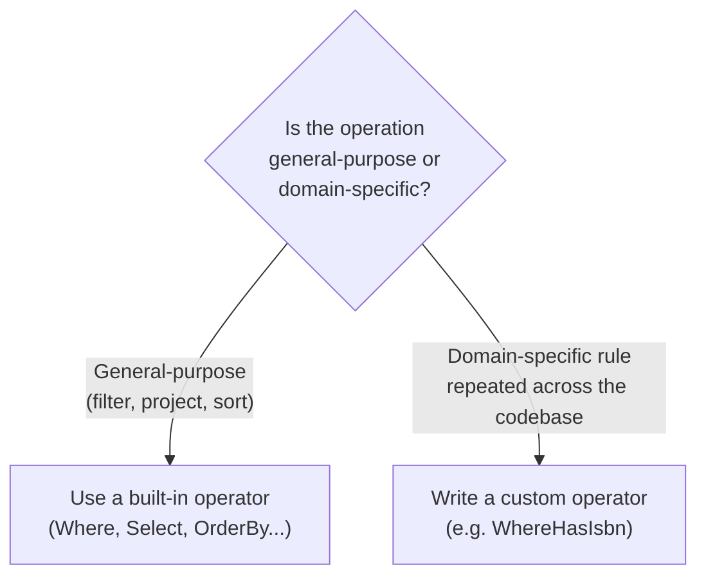

# Writing Custom LINQ Operators

## Introduction

Before reading this lesson, you should already be comfortable with **[ToLookup and Lookup Tables](../04-linq/04-17-tolookup-and-lookup-tables.md)**, and with two ideas from earlier in the curriculum: **[Custom Iterators with yield](../03-collections-generics/03-14-custom-iterators-with-yield.md)** from Module 03, and **[Extension Methods in C#](../02-oop/02-23-extension-methods-in-csharp.md)** from Module 02. Every LINQ operator you've used so far — `Where`, `Select`, `GroupBy`, `Zip`, `ToLookup` — is, under the hood, just an extension method on `IEnumerable<T>`. Nothing about them is magic or compiler-privileged. This lesson proves that by having you write one yourself.

By the end of this lesson, you will be able to:

- Explain why every LINQ operator is "just" an extension method on `IEnumerable<T>` or `IQueryable<T>`
- Write a custom deferred-execution LINQ operator using `yield return`
- Chain a custom operator together with built-in LINQ operators in the same fluent pipeline
- Build a reusable `WhereNotNull` operator that filters out null elements with proper nullable-reference-type support
- Recognize the pitfalls of writing a custom operator that isn't actually lazy (e.g. accidentally materializing the whole sequence up front)

## Writing Custom LINQ Operators — A Layman's Perspective

Think about a factory assembly line where several stations already exist: one station trims excess material off each part, another station paints each part, a third station packages each part into a box. Workers on the floor don't think of these as three unrelated, hand-built machines — they think of them as interchangeable *stations*, each one built to the exact same physical interface: a part comes in on the conveyor belt on one side, and a (possibly transformed) part goes out on the conveyor belt on the other side. Because every station shares that same interface, you can bolt them together in any order you like, and parts flow through the whole line continuously, one at a time, without ever needing to be fully unloaded and re-loaded between stations.

Now suppose the factory has a new, very specific need that none of the existing stations quite covers: some parts arrive on the belt without a serial number stamped on them at all — a defect from an earlier process — and every downstream station chokes on those blank parts. Nobody needs to special-order some exotic new machine from an equipment catalog to solve this. Any competent floor engineer can build a new station, following the exact same conveyor-belt-in, conveyor-belt-out interface every other station already uses: a simple gate that lets a part through untouched if it has a serial number, and quietly lifts it off the belt if it doesn't. Once that gate is bolted onto the line using the same universal connectors as everything else, it behaves exactly like a station the factory shipped with — workers can slot it in before the painting station, after the trimming station, anywhere at all, and the belt keeps flowing continuously through it exactly as it did through the built-in stations.

This is the real insight behind writing your own LINQ operator. `Where`, `Select`, `OrderBy`, and every other operator you've used are not special machinery baked into C# — they're stations built to one universal interface: take an `IEnumerable<T>` in, hand an `IEnumerable<T>` out, and process elements one at a time as they flow past, rather than demanding the entire belt-load up front. Once you understand that interface, you're not limited to the stations the factory shipped with. If your specific pipeline needs a station nobody built for you — filtering out nulls before they reach the rest of the query, skipping every other element, or some other narrow, repeatable need specific to your own codebase — you can bolt one together yourself, using the exact same conveyor-belt contract, and it will chain into `.Where()`, `.Select()`, and every other built-in station exactly as if it always belonged there.

## Writing Custom LINQ Operators — A Programming Language Perspective

A custom LINQ operator is simply a `static` extension method defined in a `static` class, taking `this IEnumerable<T> source` (or a generic `this IEnumerable<TSource> source`) as its first parameter and returning `IEnumerable<TResult>`. To preserve LINQ's defining characteristic — deferred, streaming execution — the method body should be an iterator method, implemented with one or more `yield return` statements, rather than one that eagerly builds and returns a `List<T>` or array. When the C# compiler sees `yield return` inside a method, it transforms that method into a compiler-generated state machine that produces elements lazily, one at a time, only as the consumer advances the enumeration — exactly the same mechanism that powers every built-in LINQ operator's implementation in the .NET runtime source. Because the method signature matches the `this IEnumerable<T>` extension-method convention, C#'s extension method syntax lets it be called with the same dot-chaining syntax as any built-in operator, and it can be freely interleaved with `Where`, `Select`, and the rest in a single fluent pipeline, each one wrapping the previous iterator without materializing anything until a terminal operation like `ToList()` or `foreach` finally pulls elements through the whole chain.

## How to Write a Custom LINQ Operator in C#

A well-behaved custom operator validates its arguments eagerly (so a `null` source throws immediately, not on first enumeration) but defers the actual filtering/transforming work into a separate local iterator method marked with `yield return`, which is the idiomatic pattern for combining eager argument validation with lazy execution.


*Figure 1: Argument validation happens immediately when the method is called; the actual filtering only happens element-by-element once something enumerates the result.*

```csharp
// Program.cs — .NET 10 / C# 14

static class EnumerableExtensions
{
    // Public entry point: validates arguments eagerly, then delegates to the
    // private iterator so a null 'source' throws immediately, not on first MoveNext().
    public static IEnumerable<T> WhereNotNull<T>(this IEnumerable<T?> source) where T : class
    {
        ArgumentNullException.ThrowIfNull(source);
        return WhereNotNullIterator(source);
    }

    private static IEnumerable<T> WhereNotNullIterator<T>(IEnumerable<T?> source) where T : class
    {
        foreach (T? item in source)
        {
            if (item is not null)
            {
                yield return item;
            }
        }
    }
}

string?[] rawNames = ["Alice", null, "Ben", null, "Cara"];

// Chains naturally with a built-in LINQ operator in the same fluent pipeline.
List<string> cleanNames = rawNames
    .WhereNotNull()
    .Select(name => name.ToUpperInvariant())
    .ToList();

Console.WriteLine($"Raw count: {rawNames.Length}, clean count: {cleanNames.Count}");
foreach (string name in cleanNames)
{
    Console.WriteLine($"  {name}");
}
```

**Console Output:**

```text
Raw count: 5, clean count: 3
  ALICE
  BEN
  CARA
```

`WhereNotNull` behaves exactly like a built-in LINQ operator here: it slots directly between the source array and `.Select()` with no special syntax, and it never allocates an intermediate collection to hold the filtered results — each non-null name flows through `yield return` straight into `.Select()`'s own iterator, one element at a time, all the way to `.ToList()`, which is the only point in this entire pipeline where a concrete list actually gets built.

## Real-Time Example: A Custom Operator for Library/Inventory Management

We extend the Library/Inventory Management case study with a recurring, codebase-specific need: many catalog records import `Book` objects where the `Isbn` field may legitimately be `null` for older items that predate ISBN registration, and nearly every report in the system needs to skip those incomplete records the same way. Rather than repeating a `.Where(b => b.Isbn is not null)` filter in a dozen different reports, we write one custom operator, `WhereHasIsbn`, once.

```csharp
// Program.cs — .NET 10 / C# 14 — Real-Time Example

record Book(string Title, string? Isbn, int CopiesAvailable);

static class LibraryQueryExtensions
{
    // A domain-specific custom operator: only books with a usable ISBN are
    // eligible for the barcode-reprint report. Deferred, streaming, and
    // reusable across every report in the codebase.
    public static IEnumerable<Book> WhereHasIsbn(this IEnumerable<Book> source)
    {
        ArgumentNullException.ThrowIfNull(source);
        return Iterator(source);

        static IEnumerable<Book> Iterator(IEnumerable<Book> source)
        {
            foreach (Book book in source)
            {
                if (!string.IsNullOrWhiteSpace(book.Isbn))
                {
                    yield return book;
                }
            }
        }
    }
}

List<Book> catalog =
[
    new("Clean Code", "9780132350884", 3),
    new("A Local History (1962 reprint)", null, 1),
    new("The Pragmatic Programmer", "9780135957059", 0),
    new("Parish Records Vol. 2", null, 2),
];

// The custom operator chains with built-in LINQ operators exactly like a native one.
List<string> reprintCandidates = catalog
    .WhereHasIsbn()
    .Where(b => b.CopiesAvailable > 0)
    .Select(b => $"{b.Title} ({b.Isbn})")
    .ToList();

Console.WriteLine("Books eligible for barcode reprint:");
foreach (string entry in reprintCandidates)
{
    Console.WriteLine($"  {entry}");
}

int skippedForMissingIsbn = catalog.Count(b => string.IsNullOrWhiteSpace(b.Isbn));
Console.WriteLine($"Skipped (no ISBN on file): {skippedForMissingIsbn}");
```

**Console Output:**

```text
Books eligible for barcode reprint:
  Clean Code (9780132350884)
Skipped (no ISBN on file): 2
```

Only *Clean Code* survives both filters: *The Pragmatic Programmer* has an ISBN but zero copies available, and the two older records are excluded by `WhereHasIsbn` itself for having no ISBN at all. The real payoff isn't visible in this one report — it's that every other report in the Library/Inventory system that also needs "only books with a real ISBN" now calls the same `WhereHasIsbn()` extension method instead of repeating the same `string.IsNullOrWhiteSpace` check inline everywhere, which means the rule for what counts as "a usable ISBN" lives in exactly one place.

## Custom Operators vs Built-In Operators

A hand-written custom operator and a built-in LINQ operator are implemented identically under the hood — both are `static` extension methods over `IEnumerable<T>`, and both typically use `yield return` to stay lazy — so the real distinction is scope and stability, not mechanism. Built-in operators like `Where` and `Select` are general-purpose, exhaustively tested by the .NET team, and instantly recognizable to any C# developer reading your code. A custom operator like `WhereHasIsbn` is deliberately narrow and specific to one codebase's domain rules, trading that universal recognizability for the ability to name a repeated, domain-specific filtering or projection rule once and reuse it everywhere, rather than scattering the same raw predicate across dozens of call sites where it's easy for one copy to drift out of sync with the others.


*Figure 2: Reach for a built-in operator for general-purpose transformations; write a custom one when the same domain-specific rule keeps getting repeated inline.*

| Aspect | Built-in operator | Custom operator |
|---|---|---|
| Implementation mechanism | Extension method + `yield return` iterator | Same — extension method + `yield return` iterator |
| Scope | General-purpose, applies to any sequence | Domain-specific, named after a codebase's own rule |
| Discoverability | Instantly recognizable to any C# developer | Requires familiarity with your codebase's own extensions |
| Maintenance | Maintained by the .NET team | Maintained by your team — one place to update the rule |
| Typical use case | Generic filtering/projection/ordering | A repeated domain rule (e.g. "has a usable ISBN") |

## Types of Custom Query Extensibility in C#

Writing your own operator is one of several ways to extend or customize LINQ's behavior:

1. **[Extension Methods in C#](../02-oop/02-23-extension-methods-in-csharp.md)** — the general-purpose language feature that every custom LINQ operator (and every built-in one) is built on top of.
2. **[Custom Iterators with yield](../03-collections-generics/03-14-custom-iterators-with-yield.md)** — the mechanism that keeps a custom operator lazy and streaming instead of eagerly materializing.
3. **Custom `IEqualityComparer<T>`** — extending operators like `Distinct`, `GroupBy`, and `ToLookup` with your own notion of equality, without writing a whole new operator.
4. **[ToLookup and Lookup Tables](../04-linq/04-17-tolookup-and-lookup-tables.md)** — the previous lesson, an example of a built-in operator that trades laziness for an indexable snapshot.
5. **[LINQ Performance Considerations](../04-linq/04-19-linq-performance-considerations.md)** — the next lesson, where the same deferred-execution habits that make custom operators efficient also explain where LINQ pipelines can quietly become expensive.

## What You've Learned & What's Next

Every LINQ operator — built-in or your own — is just an extension method over `IEnumerable<T>` that stays lazy by using `yield return` internally, which means you're never limited to the operator set .NET ships with. When a specific filtering or projection rule keeps repeating itself across your codebase, as `WhereHasIsbn` did across the Library/Inventory reports, writing a small, well-named custom operator once keeps that rule in exactly one place and lets it chain naturally alongside `Where`, `Select`, and every other operator you've already learned.

Continue your learning journey with **[LINQ Performance Considerations](../04-linq/04-19-linq-performance-considerations.md)**, where we look at how deferred execution — the same mechanism that makes custom operators work — can also introduce subtle performance costs like multiple enumeration if you're not careful.

---
*Applies to: .NET 10 / C# 14. Last reviewed 2026-08-16.*
