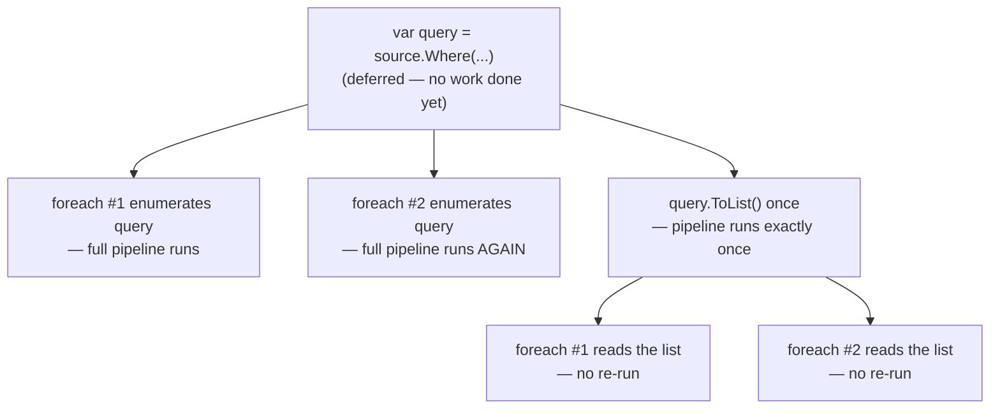
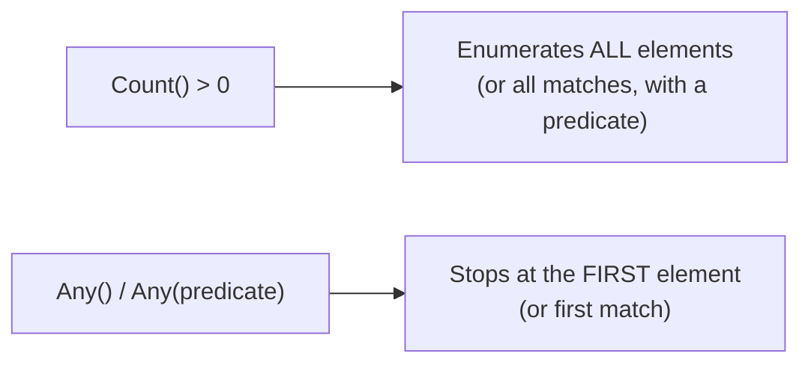

# LINQ Performance Considerations

## Introduction

Before reading this lesson, you should already be comfortable with **[Writing Custom LINQ Operators](../04-linq/04-18-writing-custom-linq-operators.md)** and, really, with deferred execution as it's threaded through this entire module — every `Where`, `Select`, `OrderBy`, and `GroupBy` call you've written so far has been a *promise* to do work later, not work done immediately. This lesson is where that promise's cost finally gets examined directly: what happens when you accidentally cash in that promise more than once, and how to write LINQ that stays fast as data grows.

By the end of this lesson, you will be able to:

- Explain why enumerating the same deferred LINQ query more than once silently re-runs the entire query each time
- Recognize and fix multiple-enumeration bugs, especially against non-list sources like database queries or file reads
- Choose `Any()` over `Count() > 0` (and `Any(predicate)` over `Where(predicate).Count() > 0`) for existence checks
- Explain why placing `Where` before `OrderBy` in a pipeline reduces total work
- Decide when calling `ToList()` to materialize a query early helps performance versus when it hurts it

## LINQ Performance Considerations — A Layman's Perspective

Imagine you've hired a research assistant and you ask them a single, simple-sounding question: "How many books in the city archive mention the year 1850?" Your assistant doesn't have that number memorized — nobody does — so they walk to the archive, page through every single record, count the ones that qualify, and come back with an answer. That trip took an hour, because the archive is enormous.

Now imagine, ten minutes later, you ask a second, seemingly unrelated question: "Can you list the titles of those same books?" If your assistant is inexperienced, they might not think to reuse anything from the first trip — they simply walk back to the archive and redo the *entire* page-by-page search from scratch, another full hour, even though it's fundamentally the same search they just finished. A seasoned assistant would have realized during the first trip that you were likely to ask a follow-up, and would have written down the qualifying titles as they went, so the second question could be answered instantly from that notepad instead of requiring a second hour-long trip to the archive.

Here's a related but different trap: suppose your actual question was simpler than it looked — "Are there *any* books in the archive from 1850?" A careless assistant might still walk every single shelf, tally the full count, and then tell you whether that final number was greater than zero. But that's enormously wasteful for the question actually being asked. The moment they find the *first* qualifying book, on maybe the second shelf out of two hundred, they already have their answer — "yes" — and could turn around and report back immediately, without ever needing to see the other one hundred ninety-eight shelves. A count is not what "are there any at all" requires; a single match is enough to stop looking.

And a third trap: suppose the real request was "list every book from 1850, sorted alphabetically by title." An inefficient assistant might sort every single book in the *entire* archive by title first, and only afterward walk down that giant sorted list picking out the 1850 ones. That means sorting hundreds of thousands of books that were never going to matter in the first place. A sharper assistant filters down to the small handful of 1850 books *first*, and only then alphabetizes that much smaller pile — the sorting work shrinks dramatically because it's only ever applied to books that actually survived the filter.

All three of these traps map directly onto real LINQ mistakes: re-running an entire query because you enumerated it twice without saving the result, using a full count when a simple existence check would stop at the first match, and sorting before filtering instead of after. LINQ's deferred, promise-based execution model is powerful, but exactly like a research assistant who takes every instruction literally and does no extra thinking, it will happily redo the exact same expensive trip to the archive as many times as you ask it to, unless you write your queries with that cost in mind.

## LINQ Performance Considerations — A Programming Language Perspective

Most LINQ operators over `IEnumerable<T>` — `Where`, `Select`, `OrderBy`, `GroupBy`, and others — use deferred execution, meaning the operator itself does no enumeration work when called; it only builds up a description of the query. That query only actually runs when something enumerates it: a `foreach` loop, a call to `ToList()`/`ToArray()`, or an aggregation like `Count()` or `Sum()`. If a variable holding a deferred query is enumerated more than once — two separate `foreach` loops, or a `.Count()` call followed later by a `foreach` over the same variable — the *entire* query, including any expensive source (a database round-trip, a file read, an API call) or any expensive projection, re-executes from scratch on every single enumeration, with no caching in between. `Count()` enumerates the whole sequence to produce an exact total, while `Any()` (with no arguments, or with a predicate) stops at the very first qualifying element and returns immediately — an asymptotically cheaper operation for a pure existence check. Because filtering and sorting are independent, deferred operators, reordering them in a chain — `Where(...).OrderBy(...)` versus `OrderBy(...).Where(...)` — changes how many elements the expensive `OrderBy` step ultimately has to sort, even though both orderings are logically equivalent in output. Calling `ToList()` forces immediate, one-time enumeration, trading memory for the elimination of repeated-enumeration cost — a net win when a result is reused, and a net loss when it forces materialization of data that a caller would otherwise have kept streaming (e.g. via further composition or early termination with `Take`/`First`).

## How to Spot and Fix Multiple Enumeration in C#

The single most common LINQ performance bug is holding a deferred query in a variable and enumerating it more than once without realizing each enumeration re-runs the whole pipeline. The fix is almost always to materialize the result once, with `ToList()` or `ToArray()`, the moment you know it will be consumed more than a single time.


*Figure 1: Enumerating the same deferred query twice re-runs the whole pipeline twice; materializing once with `ToList()` before reuse runs it exactly once.*

```csharp
// Program.cs — .NET 10 / C# 14

int evaluationCount = 0;

IEnumerable<int> numbers = Enumerable.Range(1, 5);

// A deferred query — the side effect inside Select proves when it actually runs.
IEnumerable<int> query = numbers.Select(n =>
{
    evaluationCount++;
    return n * n;
});

// Enumerating it twice without materializing re-runs the whole pipeline twice.
List<int> firstPass = query.ToList();
List<int> secondPass = query.ToList();
Console.WriteLine($"Evaluations after two un-materialized passes: {evaluationCount}");

// Fix: materialize once, then reuse the already-built list freely.
evaluationCount = 0;
List<int> materialized = numbers.Select(n =>
{
    evaluationCount++;
    return n * n;
}).ToList();

List<int> reuse1 = materialized.ToList();
List<int> reuse2 = materialized.ToList();
Console.WriteLine($"Evaluations after materializing once, then reusing twice: {evaluationCount}");
```

**Console Output:**

```text
Evaluations after two un-materialized passes: 10
Evaluations after materializing once, then reusing twice: 5
```

Five elements evaluated twice gives ten total evaluations in the first block — proof that `query` re-ran its entire `Select` projection from scratch on each of the two `ToList()` calls. In the second block, the projection runs exactly five times, once per element, because `materialized` is already a concrete `List<int>`; calling `.ToList()` on a list that already exists just copies it, it doesn't re-run any deferred LINQ logic.

## Real-Time Example: Optimizing a Banking/ATM Statement Query

We extend the Banking/ATM case study with a monthly statement generator that must, for one account: check whether *any* overdraft occurred that month (a yes/no fact shown as a warning banner), and separately list the ten most recent transactions sorted by date. Both operations start from the same underlying `IEnumerable<Transaction>` pulled from storage, so getting the ordering and enumeration right avoids doing unnecessary work twice.

```csharp
// Program.cs — .NET 10 / C# 14 — Real-Time Example

record Transaction(DateOnly Date, string Type, decimal Amount, decimal BalanceAfter);

List<Transaction> monthlyTransactions =
[
    new(new DateOnly(2026, 8, 1), "Deposit", 1200.00m, 1200.00m),
    new(new DateOnly(2026, 8, 4), "Withdrawal", 1450.00m, -250.00m), // overdraft
    new(new DateOnly(2026, 8, 6), "Deposit", 300.00m, 50.00m),
    new(new DateOnly(2026, 8, 10), "Withdrawal", 40.00m, 10.00m),
    new(new DateOnly(2026, 8, 15), "Deposit", 900.00m, 910.00m),
];

// Existence check: Any() stops at the first overdraft found instead of scanning
// and counting every transaction just to compare the count against zero.
bool hadOverdraft = monthlyTransactions.Any(t => t.BalanceAfter < 0);
Console.WriteLine(hadOverdraft
    ? "WARNING: This account was overdrawn at least once this month."
    : "No overdrafts this month.");

// Filter-before-sort: narrow to withdrawals first, THEN sort that smaller set,
// rather than sorting every transaction and filtering afterward.
List<Transaction> recentWithdrawals = monthlyTransactions
    .Where(t => t.Type == "Withdrawal")
    .OrderByDescending(t => t.Date)
    .ToList(); // materialized once because the statement re-reads this list twice below

Console.WriteLine("Recent withdrawals (most recent first):");
foreach (Transaction t in recentWithdrawals)
{
    Console.WriteLine($"  {t.Date}: {t.Amount:C}");
}

// Reusing the already-materialized list — no re-filtering, no re-sorting.
decimal totalWithdrawn = recentWithdrawals.Sum(t => t.Amount);
Console.WriteLine($"Total withdrawn this month: {totalWithdrawn:C}");
```

**Console Output:**

```text
WARNING: This account was overdrawn at least once this month.
Recent withdrawals (most recent first):
  2026-08-10: $40.00
  2026-08-04: $1,450.00
Total withdrawn this month: $1,490.00
```

`Any(t => t.BalanceAfter < 0)` found the August 4th overdraft on its very first qualifying match and stopped immediately, rather than continuing to scan the remaining transactions just to produce an exact count that the banner never needed. Filtering to withdrawals before sorting meant `OrderByDescending` only ever had two records to sort instead of all five, and calling `ToList()` once on `recentWithdrawals` meant the later `Sum()` call read an already-built list instead of silently re-running the `Where`/`OrderByDescending` pipeline a second time against the original data.

## Count() vs Any() for Existence Checks

`Count() > 0` and `Any()` can look interchangeable because they both answer a true/false question about whether a sequence has elements, but they do meaningfully different amounts of work to get there. `Count()` (with no predicate) enumerates every element in the sequence to produce an exact total — unless the source happens to implement `ICollection<T>`, in which case LINQ can short-circuit to a cached `.Count` property, but that optimization disappears the moment any deferred operator like `Where` sits in the chain beforehand. `Any()` never needs an exact total; it enumerates only as far as the first element (or the first element matching a predicate) and returns `true` immediately, never touching the rest of the sequence. The gap widens further with a predicate: `Where(predicate).Count() > 0` filters the *entire* sequence down to matches and only then counts them, while `Any(predicate)` stops at the very first match.


*Figure 2: `Count()` must see every element to produce an exact total; `Any()` only needs to see one to answer a yes/no question.*

| Aspect | `Count() > 0` | `Any()` / `Any(predicate)` |
|---|---|---|
| Purpose | Exact element/match total | Existence check only |
| Elements examined | All of them (unless `ICollection<T>` fast-path applies) | Stops at the first (matching) element |
| Cost on a large sequence | O(n) always | O(1) best case, O(n) worst case (no match at all) |
| Correct use case | You actually need the number | You only need yes/no |

## Types of LINQ Performance Techniques in C#

Beyond the three techniques covered in depth above, several related habits keep LINQ pipelines efficient:

1. **`Any()` over `Count() > 0`** — covered above; the default choice for any pure existence check.
2. **Filter before sort/project** — placing `Where` ahead of `OrderBy`/`Select` in a chain so expensive steps run against fewer elements.
3. **Materializing with `ToList()`/`ToArray()` before reuse** — covered above; eliminates repeated re-execution of a deferred query, at the cost of memory.
4. **`FirstOrDefault(predicate)` over `Where(predicate).FirstOrDefault()`** — semantically identical, but the single-call form makes the short-circuiting intent explicit and avoids an intermediate deferred `Where` wrapper.
5. **Deferred vs. immediate execution** — the foundational distinction covered earlier in this module that this entire lesson's performance advice builds on.

## What You've Learned & What's Next

LINQ's deferred execution model is a strength, not a hidden trap, as long as you remember three things: enumerating the same un-materialized query twice re-runs it twice, an existence check should stop at the first match instead of counting everything, and filtering before sorting keeps the expensive sort step working over fewer elements. `ToList()` is the tool that converts a reusable deferred query into a stable, one-time-computed snapshot — call it once you know a result will be read more than once, and skip it when a query is only ever walked a single time.

Continue your learning journey with **[LINQ to XML](../04-linq/04-20-linq-to-xml.md)**, where this module's query techniques get applied to querying and transforming XML documents directly.

---
*Applies to: .NET 10 / C# 14. Last reviewed 2026-08-16.*
