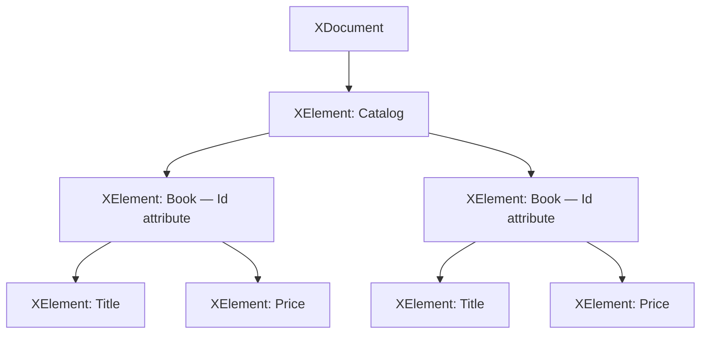
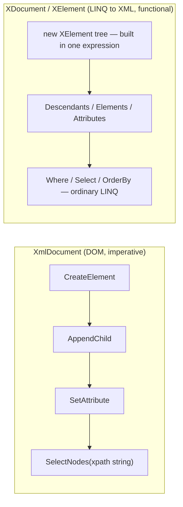

# LINQ to XML

## Introduction

Before reading this lesson, you should already be comfortable with **[LINQ Performance Considerations](../04-linq/04-19-linq-performance-considerations.md)** — in particular, deferred execution and the cost of re-enumerating a query. In this lesson we point every LINQ operator you already know at a new kind of source: XML. **LINQ to XML**, found in the `System.Xml.Linq` namespace, lets you build, read, and query XML documents using the exact same `Where`, `Select`, and `OrderBy` vocabulary you've used against lists and dictionaries all through this module — no separate XML-specific query language required.

By the end of this lesson, you will be able to:

- Explain how LINQ to XML differs from the older, DOM-style `XmlDocument` API
- Build an XML document functionally using nested `XElement` and `XAttribute` constructors
- Query XML content with ordinary LINQ operators via `Descendants()`, `Elements()`, and `Attributes()`
- Read element and attribute values into strongly-typed C# values using `XElement`'s explicit conversion operators
- Export an in-memory collection to a well-formed XML document and query it back

## LINQ to XML — A Layman's Perspective

Picture a set of gift boxes, wrapped and nested inside one another. The biggest box has a label on its lid — maybe a shipping sticker — and inside it aren't loose items, but more boxes, each with its own label, and inside those, either more boxes still or a small handwritten note. This is exactly the shape of an XML document: an outermost container holding nested containers, each one taggable with a label (an element name) and sometimes a small sticky note attached to the outside of the box itself (an attribute), separate from whatever is packed inside.

Now imagine two very different ways of finding something inside that stack of boxes. The old-fashioned way is to open the outer box, look inside, pick up the next box down, open that one, look inside, pick up the next box down, and so on — one level at a time, by hand, keeping track of exactly which box you're in at every step. This is tedious even for three or four levels of nesting, and it gets dramatically worse the deeper the boxes go, because you have to write out, explicitly, every single "open this, then open that" step yourself. This is what working with the older `XmlDocument` API feels like: methods like `SelectSingleNode` and manual `ChildNodes` traversal that make you navigate level by level, by hand.

The better way is to hand the entire stack of boxes to an assistant and simply state what you're looking for, regardless of how deep it's buried: "Bring me every box labeled 'Book' — no matter which box it's nested inside — where the sticky note says the price is under $50." The assistant doesn't care whether that box is one level down or five; it searches the *entire* stack at once and hands back exactly the matches, still labeled and unopened, ready for you to read. You never had to write out the individual "open this box, then that box" steps — you stated the *condition* you wanted, and the search itself was somebody else's problem.

That second approach is exactly what LINQ to XML feels like in practice. An `XElement` behaves like one of those labeled boxes: it has a name, it may carry small attribute "stickers," and it may contain either text or more `XElement` boxes nested inside. And because `XElement` exposes methods like `Descendants()` that return an ordinary `IEnumerable<XElement>` — every matching box across every level of nesting, flattened into one sequence — you can hand that sequence straight to `Where`, `Select`, and `OrderBy`, the same operators you already trust, instead of writing a new, unfamiliar traversal by hand. The nesting doesn't disappear, but you stop having to think about it one level at a time.

## LINQ to XML — A Programming Language Perspective

`System.Xml.Linq` centers on two types: `XDocument`, representing an entire XML document, and `XElement`, representing a single node and everything nested beneath it. Both support **functional construction** — an entire tree is built in one expression, by passing child `XElement`, `XAttribute`, and text content directly into a parent element's constructor, rather than imperatively calling `CreateElement`/`AppendChild` as the older `System.Xml.XmlDocument` API requires. `XElement` exposes `Elements()` (direct children only — one level deep) and `Descendants()` (every matching element at any depth, flattened), both returning `IEnumerable<XElement>`, so they compose directly with any LINQ operator covered earlier in this module. `XAttribute` values and element text are read back via explicit conversion operators — `(string)element`, `(int)element.Attribute("Id")` — which parse the underlying XML text into the requested .NET type. These types have been part of the BCL since .NET 3.5 and remain unchanged in shape in .NET 10.

## How to Query and Build XML with LINQ in C#

Building an XML tree with `XElement` reads almost like the XML itself: each constructor call names an element, and its arguments are that element's attributes, child elements, or text content, in any order. Querying it back out uses `Descendants(name)` to find every matching element regardless of nesting depth, then ordinary LINQ operators to filter and project, exactly as you would over a `List<T>`.


*Figure 1: An `XDocument` wraps a tree of `XElement` nodes; attributes hang off individual elements rather than forming separate nodes of their own.*

```csharp
// Program.cs — .NET 10 / C# 14
using System.Xml.Linq;

XDocument catalog = new(
    new XElement("Catalog",
        new XElement("Book",
            new XAttribute("Id", "B-100"),
            new XElement("Title", "C# in Depth"),
            new XElement("Price", "42.50")),
        new XElement("Book",
            new XAttribute("Id", "B-200"),
            new XElement("Title", "Pro .NET Memory Management"),
            new XElement("Price", "55.00"))));

Console.WriteLine(catalog);

var cheapBooks = catalog.Descendants("Book")
    .Where(book => (double)book.Element("Price")! < 50.0)
    .Select(book => new
    {
        Id = (string)book.Attribute("Id")!,
        Title = (string)book.Element("Title")!
    });

Console.WriteLine();
Console.WriteLine("Books under $50:");
foreach (var book in cheapBooks)
{
    Console.WriteLine($"  {book.Id}: {book.Title}");
}
```

**Console Output:**

```text
<Catalog>
  <Book Id="B-100">
    <Title>C# in Depth</Title>
    <Price>42.50</Price>
  </Book>
  <Book Id="B-200">
    <Title>Pro .NET Memory Management</Title>
    <Price>55.00</Price>
  </Book>
</Catalog>

Books under $50:
  B-100: C# in Depth
```

`catalog.Descendants("Book")` walks the whole tree and returns both `Book` elements as a flat `IEnumerable<XElement>`, regardless of how deeply they were nested — here that's one level, but the call would look identical at five levels deep. From there, `Where` reads each book's `Price` element back as a `double` using `XElement`'s explicit conversion operator, and `Select` projects the matches into a small anonymous type. Nothing about the `Where`/`Select` calls themselves is XML-specific — only the source, `Descendants("Book")`, is.

## Real-Time Example: Exporting the Library Catalog to XML

We extend the Library/Inventory Management case study with an export feature: taking an in-memory catalog of `Book` records and producing a well-formed XML document a partner system — say, a regional library network — could consume, then querying that same document straight back for two operational reports.

```csharp
// Program.cs — .NET 10 / C# 14 — Real-Time Example
using System.Xml.Linq;

List<Book> catalog =
[
    new Book("978-0-13-468599-1", "The Pragmatic Programmer", "David Thomas", Copies: 4, Available: 1),
    new Book("978-1-59327-584-6", "Eloquent JavaScript", "Marijn Haverbeke", Copies: 3, Available: 0),
    new Book("978-0-596-00712-6", "Head First Design Patterns", "Eric Freeman", Copies: 2, Available: 2),
];

// Functional construction: the whole XML tree is described in one expression. Passing an
// IEnumerable<XElement> (the result of Select) as content flattens it automatically —
// one Book element per catalog entry, no manual loop or AppendChild call required.
XDocument catalogXml = new(
    new XElement("LibraryCatalog",
        catalog.Select(book =>
            new XElement("Book",
                new XAttribute("Isbn", book.Isbn),
                new XElement("Title", book.Title),
                new XElement("Author", book.Author),
                new XElement("Copies", book.Copies),
                new XElement("Available", book.Available)))));

Console.WriteLine(catalogXml);

// Querying straight back out of the XML — as if it had just been loaded from disk via
// XDocument.Load(path) rather than built in memory a moment ago.
var needsRestock = catalogXml.Descendants("Book")
    .Where(book => (int)book.Element("Available")! == 0)
    .Select(book => (string)book.Element("Title")!);

int totalCopies = catalogXml.Descendants("Book")
    .Sum(book => (int)book.Element("Copies")!);

Console.WriteLine();
Console.WriteLine("Titles needing restock (Available = 0):");
foreach (string title in needsRestock)
{
    Console.WriteLine($"  {title}");
}
Console.WriteLine($"Total copies across the catalog: {totalCopies}");

record Book(string Isbn, string Title, string Author, int Copies, int Available);
```

**Console Output:**

```text
<LibraryCatalog>
  <Book Isbn="978-0-13-468599-1">
    <Title>The Pragmatic Programmer</Title>
    <Author>David Thomas</Author>
    <Copies>4</Copies>
    <Available>1</Available>
  </Book>
  <Book Isbn="978-1-59327-584-6">
    <Title>Eloquent JavaScript</Title>
    <Author>Marijn Haverbeke</Author>
    <Copies>3</Copies>
    <Available>0</Available>
  </Book>
  <Book Isbn="978-0-596-00712-6">
    <Title>Head First Design Patterns</Title>
    <Author>Eric Freeman</Author>
    <Copies>2</Copies>
    <Available>2</Available>
  </Book>
</LibraryCatalog>

Titles needing restock (Available = 0):
  Eloquent JavaScript
Total copies across the catalog: 9
```

Notice that the query at the bottom never touches the original `List<Book>` at all — it runs entirely against the XML tree, exactly as it would if a partner branch had sent this document over a network and this system had loaded it fresh. That is the practical value of LINQ to XML in a real inventory system: the export format and the query capability come from the same document, using the same `Where`/`Select`/`Sum` operators as every other lesson in this module, rather than a bespoke XML-parsing routine written by hand.

## LINQ to XML vs the DOM-Style XmlDocument API

Before LINQ to XML existed, `System.Xml.XmlDocument` was the standard way to work with XML in .NET, and it is still present today for legacy code and for scenarios needing DTD/schema validation APIs it exposes directly. The two approaches differ less in *what* they can represent — both can model any well-formed XML — and more in *how* you build and query it. `XmlDocument` is imperative: you call `CreateElement`, then `AppendChild`, then `SetAttribute`, one statement per node, and you query it with XPath strings passed to `SelectNodes`/`SelectSingleNode`, which are evaluated as untyped text with no compiler checking. LINQ to XML is functional and declarative: an entire tree is described in one nested expression, and querying uses the same strongly-typed `IEnumerable<XElement>` LINQ operators as everything else in this module.


*Figure 2: The DOM API builds and queries a tree through separate, imperative method calls; LINQ to XML builds the tree in one expression and queries it with the same operators used everywhere else in C#.*

| Aspect | `XmlDocument` (DOM) | `XDocument` / `XElement` (LINQ to XML) |
|---|---|---|
| Construction style | Imperative: `CreateElement`, `AppendChild`, `SetAttribute` calls | Functional: nested constructors describe the whole tree in one expression |
| Querying | XPath strings via `SelectNodes`/`SelectSingleNode`, evaluated as untyped text | Ordinary LINQ operators (`Where`, `Select`, `OrderBy`) over a strongly-typed `IEnumerable<XElement>` |
| Compile-time checking | None — a mistyped XPath string only fails at runtime | Partial — element/attribute names are still strings, but the surrounding LINQ pipeline is compiler-checked |
| Namespace | `System.Xml` | `System.Xml.Linq` |
| Typical use today | Legacy codebases, or code that needs the DOM's schema/DTD validation surface | New .NET 10 code reading, writing, or querying XML |

## Types of XML APIs and Building Blocks in C#

LINQ to XML is built from a small set of cooperating types, and it sits alongside a few related XML technologies worth knowing by name:

1. **`XElement` and `XAttribute`** — the workhorse types for building and reading individual nodes and the attributes attached to them.
2. **`XDocument`** — wraps a single root `XElement` and represents a whole loadable/saveable XML document, including optional declarations and processing instructions.
3. **`Descendants()` vs `Elements()`** — recursive, any-depth traversal versus shallow, direct-children-only traversal; picking the wrong one is the most common LINQ to XML mistake.
4. **XPath extensions (`XPathSelectElement`, `XPathEvaluate`)** — in the `System.Xml.XPath` namespace, for developers who prefer XPath-style query strings layered on top of `XElement` instead of LINQ operators.
5. **[LINQ Performance Considerations](../04-linq/04-19-linq-performance-considerations.md)** — deferred execution and materialization rules apply here too, since `Descendants()` returns a lazily-evaluated `IEnumerable<XElement>`.
6. **[LINQ to Objects vs LINQ to Entities](../04-linq/04-21-linq-to-objects-vs-entities.md)** — next lesson, contrasting today's fully in-memory XML queries with queries that get translated into SQL instead.

## What You've Learned & What's Next

LINQ to XML replaces the old, imperative DOM API with functional tree construction and lets you query XML using the exact same `Where`, `Select`, and `Sum` operators this whole module has built up — `Descendants()` is simply another `IEnumerable<T>` source. The Library Catalog example proved the point end-to-end: build the tree once, export it, then query it back for a restocking report using nothing but ordinary LINQ.

Continue your learning journey with **[LINQ to Objects vs LINQ to Entities](../04-linq/04-21-linq-to-objects-vs-entities.md)**, where the same LINQ syntax you've used against lists, dictionaries, and now XML meets a database — and where it stops running locally and starts getting translated into SQL instead.

---
*Applies to: .NET 10 / C# 14. Last reviewed 2026-08-16.*
