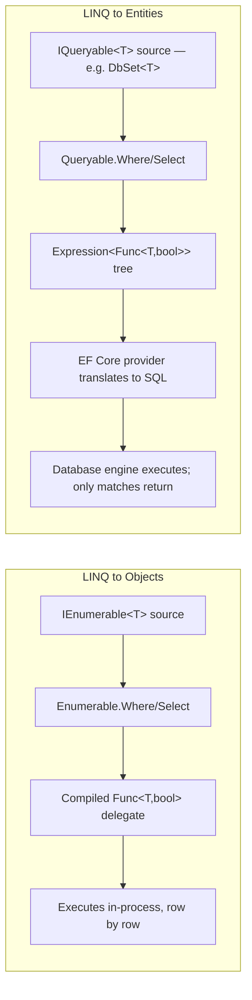
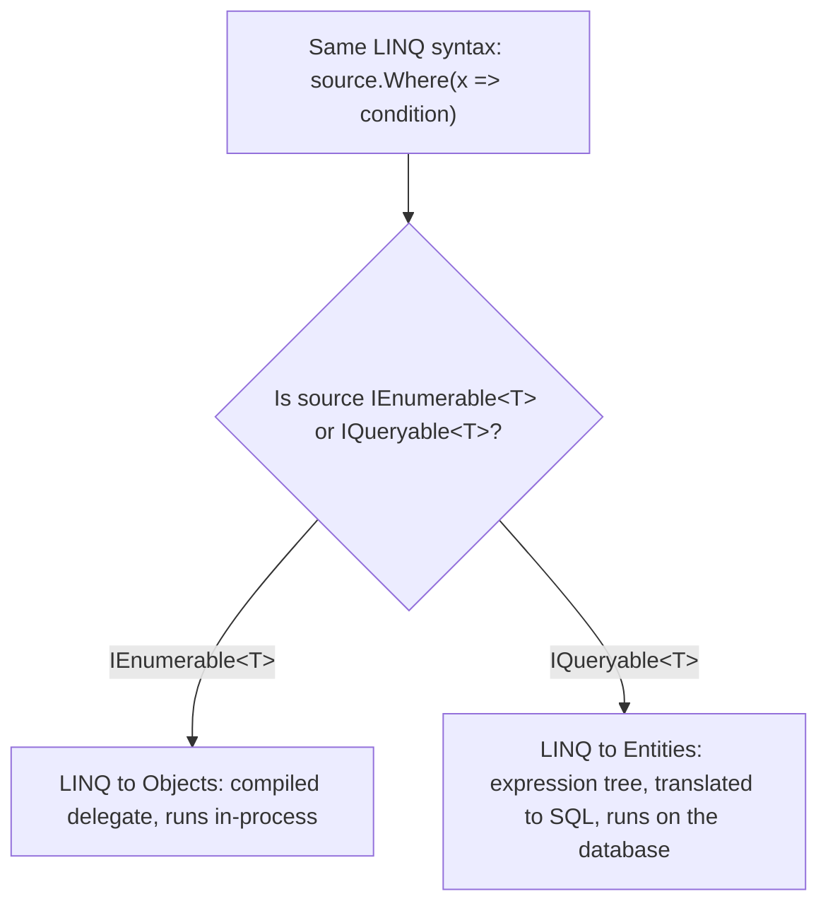

# LINQ to Objects vs LINQ to Entities

## Introduction

Before reading this lesson, you should already be comfortable with **[LINQ to XML](../04-linq/04-20-linq-to-xml.md)** and, more broadly, with every LINQ operator this module has covered so far — all of it run, so far, against ordinary in-memory collections. This lesson names that fact explicitly and then breaks it: the exact same `Where`, `Select`, and `OrderBy` syntax you've used all module long can also run against a *database*, and when it does, almost everything about how it executes changes underneath, even though the C# on screen looks identical.

By the end of this lesson, you will be able to:

- Explain the difference between `IEnumerable<T>` (LINQ to Objects) and `IQueryable<T>` (LINQ to Entities) at the type level
- Describe how Entity Framework Core translates a LINQ query into SQL rather than executing it directly in .NET
- Recognize why identical-looking LINQ syntax can execute in two completely different places
- Identify the symptoms of an accidental "client-side evaluation" performance trap
- Explain why this distinction matters before Module 11 introduces EF Core in full

## LINQ to Objects vs LINQ to Entities — A Layman's Perspective

Imagine two ways of getting a meal. In the first, you personally have every ingredient already in your own kitchen — the whole pantry, the whole fridge — and when a recipe calls for something, you reach out and grab it with your own hands, right there, immediately. If the recipe says "chop everything under two inches," you can chop absolutely anything you like, however oddly shaped or unusual, because you're the one holding the knife and you understand every ingredient personally. This is what running a LINQ query against a `List<T>` feels like: every value is already sitting in memory, in your own process, and the CLR can execute any C# expression at all against it, no matter how quirky.

In the second way, you're not cooking at all. You're a customer at a restaurant, describing your order out loud to a waiter, who has to convert your spoken request into a written ticket in the kitchen's own language and pass it through a service window to a remote kitchen you can't see into. As long as your request uses phrases the waiter already knows how to translate — "no onions," "well done," "sorted by price" — the entire order gets prepared efficiently, from scratch, in that remote kitchen, and only the finished plate comes back to your table. But suppose you ask for something with no equivalent phrase in the kitchen's language: some deeply personal, invented preparation step that only makes sense standing in your own kitchen with your own tools. A well-run restaurant's waiter stops right there and tells you plainly that this particular request can't be filled as written. A poorly run one does something far worse: it quietly has the entire remote pantry — every last ingredient in the building — hauled out to your table so you can do that one odd step yourself, right there, in front of everyone, even if the pantry held ten thousand items and your recipe only needed three of them. Nothing on the menu warned you this could happen. The order read the same as any other; only the bill for all that unnecessary hauling gives away that something went badly wrong.

That second scenario is not a hypothetical inconvenience — it is a specific, real failure mode that shows up in production systems the moment a query "compiles, runs, and returns the right answer" while secretly dragging an entire remote table across the network first. The whole discipline of writing efficient database-backed LINQ is really the discipline of a good customer: learning exactly which phrases your particular kitchen already knows how to translate, and phrasing every order in those terms, so nothing ever needs to be hauled back to your own kitchen to be finished by hand.

That is the exact tension this lesson names. LINQ to Objects is cooking with everything already in your own kitchen — total flexibility, because it all runs locally, in-process. LINQ to Entities is placing an order with a remote kitchen through a waiter who must translate your request into a different language before anyone touches an ingredient — enormously more efficient when it works, and easy to misuse in a way that looks completely fine until the ticket for it arrives.

## LINQ to Objects vs LINQ to Entities — A Programming Language Perspective

LINQ to Objects operates against any type implementing `IEnumerable<T>`. The compiler resolves its query operators to `System.Linq.Enumerable`, whose methods accept ordinary compiled delegates — `Func<T, bool>`, `Func<T, TResult>` — executed directly by the CLR, one element at a time, inside the current process. LINQ to Entities operates against `IQueryable<T>` — most commonly a `DbSet<T>` from Entity Framework Core. The exact same query syntax now resolves instead to `System.Linq.Queryable`, whose methods accept an `Expression<Func<T, bool>>`: not a runnable delegate, but a data structure describing the query as an expression tree — code represented as data. EF Core's query provider inspects that tree only when enumeration begins (still deferred, as covered earlier in this module), translates as much of it as it can into a single SQL statement, sends that SQL to the database engine, and materializes only the returned rows into C# objects. The practical consequence: `IEnumerable<T>` queries always run locally; `IQueryable<T>` queries are *descriptions* of work, executed somewhere else — a distinction Module 11 builds on directly.

## How to Tell LINQ to Objects and LINQ to Entities Apart in C#

The clearest way to see this distinction without a real database yet is to compare the *static types* two structurally identical queries produce. `List<T>.AsQueryable()` re-wraps an in-memory list as `IQueryable<T>`, simulating the shape of the pipeline a real `DbSet<T>` would use — though, since there is no database here, its provider still executes locally in the end.


*Figure 1: Identical C# syntax compiles to two different pipelines depending on whether the source is `IEnumerable<T>` or `IQueryable<T>`.*

```csharp
// Program.cs — .NET 10 / C# 14

List<int> prices = [12, 45, 8, 99, 23, 5];

// LINQ to Objects: prices is IEnumerable<int>; Where compiles to Enumerable.Where,
// which takes a compiled Func<int, bool> delegate and runs entirely in this process.
IEnumerable<int> inMemoryQuery = prices.Where(p => p > 20);

// LINQ to Entities-style: AsQueryable() re-wraps the same list as IQueryable<int>.
// The identical-looking Where call now compiles to Queryable.Where instead, building
// an Expression<Func<int, bool>> — a real EF Core DbSet<T> is IQueryable<T> from the
// start; here AsQueryable() only simulates the *shape* of that pipeline.
IQueryable<int> queryableQuery = prices.AsQueryable().Where(p => p > 20);

Console.WriteLine($"inMemoryQuery is IQueryable<int>: {inMemoryQuery is IQueryable<int>}");
Console.WriteLine($"queryableQuery is IQueryable<int>: {queryableQuery is IQueryable<int>}");
Console.WriteLine($"In-memory result:  {string.Join(", ", inMemoryQuery)}");
Console.WriteLine($"Queryable result:  {string.Join(", ", queryableQuery)}");
```

**Console Output:**

```text
inMemoryQuery is IQueryable<int>: False
queryableQuery is IQueryable<int>: True
In-memory result:  45, 99, 23
Queryable result:  45, 99, 23
```

Both queries return identical results — `45, 99, 23` — because both correctly filter the same five numbers. But `inMemoryQuery`'s runtime type never implements `IQueryable<int>`, while `queryableQuery`'s does, confirming they took two different roads to the same answer. Against a real EF Core `DbSet<T>`, that second road would end in a generated SQL `SELECT` statement instead of a delegate running in this process.

## Real-Time Example: Two Repository Shapes Over the E-Commerce Order Catalog

We extend the E-Commerce Order Processing case study with two repository-shaped methods over the same `Order` data: one honestly typed `IEnumerable<Order>` for data already sitting in memory, and one typed `IQueryable<Order>` in the shape a real Module 11 EF Core repository would return from `dbContext.Orders`.

```csharp
// Program.cs — .NET 10 / C# 14 — Real-Time Example

List<Order> orders =
[
    new Order("ORD-9001", "Amara Chen", new DateTime(2026, 7, 3),  184.50m, IsPriority: true),
    new Order("ORD-9002", "Ben Okafor", new DateTime(2026, 7, 6),   42.00m, IsPriority: false),
    new Order("ORD-9003", "Amara Chen", new DateTime(2026, 7, 10), 310.25m, IsPriority: true),
    new Order("ORD-9004", "Priya Nair", new DateTime(2026, 7, 11),  76.99m, IsPriority: false),
];

// Repository shape #1 — LINQ to Objects. `orders` is a List<Order> already sitting fully
// in memory, so IEnumerable<T> is the honest return type: every Where/OrderBy call below
// compiles to Enumerable.Where/OrderBy and runs directly against these four objects here.
IEnumerable<Order> highValueInMemory = orders
    .Where(o => o.Total >= 100m)
    .OrderByDescending(o => o.Total);

Console.WriteLine("LINQ to Objects — high-value orders (in-memory List<Order>):");
foreach (Order o in highValueInMemory)
{
    Console.WriteLine($"  {o.OrderId} — {o.CustomerName} — {o.Total:C}");
}

// Repository shape #2 — LINQ to Entities-style. In a real Module 11 app, `orders` here
// would be `dbContext.Orders`, a DbSet<Order> already implementing IQueryable<Order>.
// AsQueryable() only stands in for that shape — the SAME Where/OrderBy syntax below
// compiles to Queryable.Where/OrderBy, building an expression tree a real EF Core
// provider would translate into a single SQL SELECT ... WHERE Total >= 100
// ORDER BY Total DESC statement, materializing only the matching rows.
IQueryable<Order> queryableOrders = orders.AsQueryable();
IQueryable<Order> highValueQueryable = queryableOrders
    .Where(o => o.Total >= 100m)
    .OrderByDescending(o => o.Total);

Console.WriteLine();
Console.WriteLine($"Is the LINQ to Objects result an IQueryable<Order>? {highValueInMemory is IQueryable<Order>}");
Console.WriteLine($"Is the LINQ to Entities-style result an IQueryable<Order>? {highValueQueryable is IQueryable<Order>}");

// THE PITFALL: this line compiles fine here (AsQueryable() executes locally), but against
// a REAL EF Core DbSet<Order> it would throw InvalidOperationException at enumeration
// time, because IsRushCandidate is an ordinary C# method with no SQL equivalent — modern
// EF Core (3.0+) refuses to silently pull the whole Orders table to the client just to run
// it locally. The fix in a real app is to inline logic EF Core CAN translate to SQL
// (o.PlacedAt.DayOfWeek == DayOfWeek.Friday) instead of calling out to a C# method.
IEnumerable<Order> rushCandidates = orders.Where(o => IsRushCandidate(o));
Console.WriteLine();
Console.WriteLine("Rush-candidate orders (safe here — runs entirely as LINQ to Objects):");
foreach (Order o in rushCandidates)
{
    Console.WriteLine($"  {o.OrderId} — placed on a {o.PlacedAt.DayOfWeek}");
}

static bool IsRushCandidate(Order o) => o.IsPriority && o.PlacedAt.DayOfWeek == DayOfWeek.Friday;

record Order(string OrderId, string CustomerName, DateTime PlacedAt, decimal Total, bool IsPriority);
```

**Console Output:**

```text
LINQ to Objects — high-value orders (in-memory List<Order>):
  ORD-9003 — Amara Chen — $310.25
  ORD-9001 — Amara Chen — $184.50

Is the LINQ to Objects result an IQueryable<Order>? False
Is the LINQ to Entities-style result an IQueryable<Order>? True

Rush-candidate orders (safe here — runs entirely as LINQ to Objects):
  ORD-9001 — placed on a Friday
  ORD-9003 — placed on a Friday
```

Both `Where`/`OrderByDescending` chains above look identical to any other query in this module — that's precisely the point. `IsRushCandidate` runs safely here only because everything is LINQ to Objects; the comment marks exactly where a real EF Core query would need rewriting to stay SQL-translatable. Knowing which shape you're holding — `IEnumerable<T>` or `IQueryable<T>` — before adding a custom method call is what separates a query that stays fast at scale from one that silently degrades the moment the `Orders` table grows past a handful of rows.

## LINQ to Objects vs LINQ to Entities

The core contrast is where the work happens: LINQ to Objects always executes locally, inside the .NET process, against data already resident in memory; LINQ to Entities describes work to be executed remotely, by a database engine, and only pulls back the rows that survive the translated `WHERE`/`ORDER BY`/`JOIN` clauses. Both use the same C# operator names, and both defer execution until enumeration begins — but "deferred until enumeration" means something different in each case: for LINQ to Objects it means "the delegate hasn't run yet"; for LINQ to Entities it means "the SQL hasn't even been generated yet." A query that would be perfectly fine performance-wise as LINQ to Objects — filtering with an arbitrary C# method, say — can be a serious liability as LINQ to Entities, either failing outright or silently pulling far more data across the network than intended.


*Figure 2: The compiler picks one of two completely different execution pipelines based solely on the static type of the query's source — the syntax that triggers each path is identical.*

| Aspect | LINQ to Objects | LINQ to Entities |
|---|---|---|
| Underlying interface | `IEnumerable<T>` | `IQueryable<T>` |
| Compiles to | `System.Linq.Enumerable`, compiled `Func<T,...>` delegates | `System.Linq.Queryable`, `Expression<Func<T,...>>` trees |
| Where it executes | In the .NET process, row by row | Translated to SQL, executed by the database engine |
| Data transferred | Already in memory — nothing to transfer | Only the rows the SQL `WHERE`/`JOIN` actually match |
| Failure mode for unsupported logic | Just works — C# can express anything | May throw `InvalidOperationException` ("could not be translated") at enumeration time, in EF Core 3.0+ |
| Typical source | `List<T>`, arrays, any in-memory collection | `DbSet<T>` in EF Core, covered fully starting in Module 11 |

## Types of LINQ "Flavors" in .NET

LINQ to Objects and LINQ to Entities are the two flavors every C# developer meets constantly, but the same query engine underlies a few others worth knowing by name:

1. **LINQ to Objects (`IEnumerable<T>`)** — this lesson's baseline, the flavor every `List<T>`/array query in this module has used so far.
2. **LINQ to Entities (`IQueryable<T>` + EF Core)** — covered in full starting in Module 11, where `DbContext`/`DbSet<T>` put this lesson's theory into practice against a real database.
3. **[LINQ to XML](../04-linq/04-20-linq-to-xml.md)** — a third flavor from earlier in this module: the same operators, with `XElement`/`XDocument` as the source instead of a database or a list.
4. **LINQ to DataSet** — an older ADO.NET-era flavor querying `DataTable`/`DataSet` objects; rarely written in new .NET 10 code, but still present in legacy systems.
5. **PLINQ (Parallel LINQ)** — `.AsParallel()`, a LINQ to Objects variant that fans work across multiple CPU cores instead of running on a single thread.
6. **[Real-Time LINQ: Querying the E-Commerce Order Catalog](../04-linq/04-22-real-time-linq-order-catalog.md)** — next lesson, the module capstone, putting every LINQ to Objects operator covered so far to work together.

## What You've Learned & What's Next

The same LINQ syntax can mean two entirely different things depending on a single static type: `IEnumerable<T>` runs locally as compiled delegates, while `IQueryable<T>` builds an expression tree a provider like EF Core translates into SQL and executes remotely. Losing sight of that distinction is exactly how an innocent-looking filter turns into an accidental full-table pull across the network — a trap worth recognizing well before Module 11 puts a real database behind it.

Continue your learning journey with **[Real-Time LINQ: Querying the E-Commerce Order Catalog](../04-linq/04-22-real-time-linq-order-catalog.md)**, the Module 04 capstone, where every operator covered across this entire module — `Where`, `Select`, `GroupBy`, `Join`, `OrderBy`, and more — comes together in one richer E-Commerce reporting scenario.

---
*Applies to: .NET 10 / C# 14. Last reviewed 2026-08-16.*
