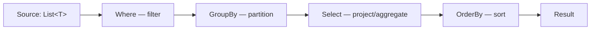
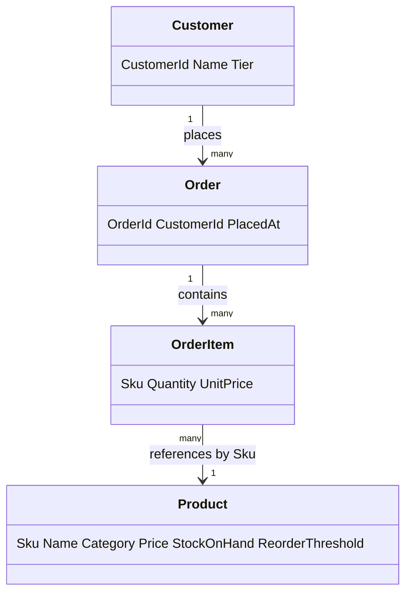
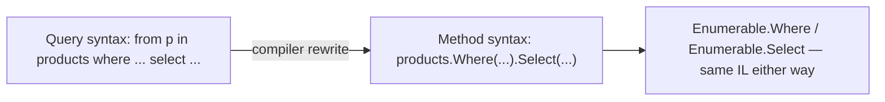

# Real-Time LINQ: Querying the E-Commerce Order Catalog

## Introduction

Before reading this lesson, you should already be comfortable with **[LINQ to Objects vs LINQ to Entities](../04-linq/04-21-linq-to-objects-vs-entities.md)** and, really, with the entire arc of Module 04 — filtering with `Where`, projecting with `Select` and `SelectMany`, sorting with `OrderBy`, partitioning with `GroupBy`, combining sequences with `Join`, rolling up numbers with `Sum`/`Average`/`Aggregate`, and answering yes/no questions with `Any`/`All`. This lesson is the module's capstone, and it introduces no new operator at all. Instead, it asks the question every lesson before it was quietly building toward: **what happens when you stop using these operators one at a time, and start chaining many of them together to answer a real business question?**

By the end of this lesson, you will be able to:

- Chain `Where`, `Select`, `Join`, `SelectMany`, `GroupBy`, `OrderBy`, and `Aggregate`/`Sum` into a single multi-step reporting pipeline
- Build realistic business reports — top customers by spend, products needing restock, average order value per month — from one shared object model
- Use `SelectMany` to flatten nested order line items before re-aggregating them
- Use `Any`/`All` to answer direct yes/no business questions over a query result
- Explain why a declarative LINQ chain reads closer to the business requirement than the equivalent hand-written loops

## Chaining LINQ Operators — A Layman's Perspective

Picture a factory floor built as a single assembly line, made up of several small, specialized workstations placed one after another. The first station's only job is to reject anything that doesn't belong on the line at all — a simple, narrow filter, and nothing more. The second station doesn't filter anything; its only job is to take whatever arrives and split it apart into smaller, more specific pieces, because the next few stations need to work on those pieces individually rather than on the bulky whole. The third station gathers those pieces back up again, sorting them into labeled bins by some shared trait, so that everything belonging together ends up in the same bin. The fourth station walks along the row of bins and, for each one, adds up a running total. The fifth and final station takes the finished bins and lines them up in order, biggest total first, ready to be shipped out as a finished report.

No single station on that line could produce the finished report by itself. The filtering station doesn't know how to total anything. The splitting station doesn't know how to sort into bins. The totaling station has no idea what order the final report should appear in. Each station does exactly one narrow, well-understood job, and hands its output down the line to the next station, which does its own narrow job on top of that. The magic isn't in any individual station — it's in the fact that a manager can walk up to this line, watch material flow through five specialized, simple steps, and read the entire multi-step business process at a glance, station by station, left to right, without needing to trace a tangle of wiring hidden inside any one machine.

That is exactly what chaining LINQ operators together feels like, and it is the entire point of this capstone lesson. `Where` is the narrow rejection station. `SelectMany` is the station that breaks bulky nested data into smaller individual pieces. `GroupBy` is the station that sorts those pieces into labeled bins. `Sum` and `Average` are the totaling stations. `OrderBy`/`OrderByDescending` is the station that lines the finished bins up in the right order. None of these operators, on its own, can answer a real business question like "who are our top five customers by total spend this quarter?" But strung together, one feeding directly into the next, they answer it completely — and just like a well-built assembly line, you can read the whole business process off the code itself, one station at a time, left to right, rather than reverse-engineering it from a tangle of nested loops and temporary variables.

Every operator introduced across this entire module was really just one of these specialized stations, built and tested in isolation. This lesson is where they finally all run on the same line at once.

## Chaining LINQ Operators — A Programming Language Perspective

Every LINQ operator introduced in this module returns `IEnumerable<T>` (or, for scalar results like `Sum`/`Average`/`Any`, a single value) — a uniform contract that lets any operator's output become the next operator's input, indefinitely. `Join` combines two sequences relationally, pairing elements whose keys match, much like a SQL `INNER JOIN`. `SelectMany` flattens a sequence-of-sequences into a single flat sequence — essential when each `Order` in this lesson's dataset carries its own nested list of `OrderItem` values that must be flattened before they can be summed or grouped across orders. `GroupBy` partitions a sequence into `IGrouping<TKey, TElement>` buckets, each itself an `IEnumerable<TElement>` that can be aggregated with `Sum`, `Average`, or the general-purpose `Aggregate`. Because the whole pipeline is still deferred, as covered earlier in this module, none of it executes until the final result is enumerated — the chain is only a *description* of the report until then, exactly the same principle that separated LINQ to Objects from LINQ to Entities in the previous lesson.

## How to Chain LINQ Operators in C#

Before building the full report below, it helps to see the assembly-line shape in miniature: filter out noise, partition into groups, then total each group — three stations, three operators, one pipeline.


*Figure 1: Each LINQ operator is a single-purpose station; chaining them builds a full report without ever writing a manual loop.*

```csharp
// Program.cs — .NET 10 / C# 14

List<Sale> sales =
[
    new Sale("Books", 25.00m),
    new Sale("Books", 15.00m),
    new Sale("Electronics", 120.00m),
    new Sale("Electronics", 45.00m),
    new Sale("Toys", 8.00m),
];

var categoryTotals = sales
    .Where(s => s.Amount > 10m)
    .GroupBy(s => s.Category)
    .Select(g => new { Category = g.Key, Total = g.Sum(s => s.Amount) })
    .OrderByDescending(c => c.Total);

foreach (var c in categoryTotals)
{
    Console.WriteLine($"{c.Category}: {c.Total:C}");
}

record Sale(string Category, decimal Amount);
```

**Console Output:**

```text
Electronics: $165.00
Books: $40.00
```

`Where` drops the $8.00 toy sale before it ever reaches `GroupBy`, so `GroupBy` only ever partitions sales already known to be worth counting. `Select` then reduces each group down to one summary row using `Sum`, and `OrderByDescending` puts the largest category first. Four operators, four narrow jobs, one finished report — this is the exact same shape the much richer example below uses, just with fewer stations on the line.

## Real-Time Example: Reporting Across the E-Commerce Order Catalog

We build a single, richer E-Commerce Order Processing scenario: five customers, six products, and nine orders, each order carrying its own nested list of line items. From this one dataset we answer three real business questions a reporting dashboard would actually ask, chaining together `Join`, `SelectMany`, `GroupBy`, `Select`, `Sum`, `OrderByDescending`, `Take`, `All`, `Aggregate`, `Where`, `OrderBy`, `Any`, and `Average` along the way.


*Figure 2: One domain model feeds all three reports below — `Order` and `OrderItem` for spend and monthly trends, `Product` for restocking.*

```csharp
// Program.cs — .NET 10 / C# 14 — Real-Time Example

List<Customer> customers =
[
    new Customer("C1", "Amara Chen", "Gold"),
    new Customer("C2", "Ben Okafor", "Silver"),
    new Customer("C3", "Priya Nair", "Gold"),
    new Customer("C4", "Diego Alvarez", "Standard"),
    new Customer("C5", "Fatima Hassan", "Silver"),
];

List<Product> products =
[
    new Product("SKU-100", "Wireless Mouse", "Accessories", 24.99m, 40, 20),
    new Product("SKU-200", "Mechanical Keyboard", "Accessories", 89.99m, 8, 15),
    new Product("SKU-300", "USB-C Hub", "Accessories", 34.50m, 25, 10),
    new Product("SKU-400", "27-inch Monitor", "Displays", 249.99m, 5, 10),
    new Product("SKU-500", "Webcam HD", "Accessories", 45.00m, 12, 12),
    new Product("SKU-600", "Laptop Stand", "Accessories", 29.99m, 30, 15),
];

List<Order> orders =
[
    new Order("ORD-7001", "C1", new DateTime(2026, 5, 4),
    [
        new OrderItem("SKU-100", 2, 24.99m),
        new OrderItem("SKU-200", 1, 89.99m),
    ]),
    new Order("ORD-7002", "C2", new DateTime(2026, 5, 18),
    [
        new OrderItem("SKU-300", 3, 34.50m),
    ]),
    new Order("ORD-7003", "C1", new DateTime(2026, 6, 2),
    [
        new OrderItem("SKU-400", 1, 249.99m),
        new OrderItem("SKU-500", 2, 45.00m),
    ]),
    new Order("ORD-7004", "C3", new DateTime(2026, 6, 10),
    [
        new OrderItem("SKU-100", 5, 24.99m),
    ]),
    new Order("ORD-7005", "C4", new DateTime(2026, 6, 21),
    [
        new OrderItem("SKU-600", 2, 29.99m),
        new OrderItem("SKU-300", 1, 34.50m),
    ]),
    new Order("ORD-7006", "C3", new DateTime(2026, 7, 1),
    [
        new OrderItem("SKU-400", 2, 249.99m),
    ]),
    new Order("ORD-7007", "C1", new DateTime(2026, 7, 15),
    [
        new OrderItem("SKU-200", 2, 89.99m),
        new OrderItem("SKU-500", 1, 45.00m),
    ]),
    new Order("ORD-7008", "C2", new DateTime(2026, 7, 22),
    [
        new OrderItem("SKU-100", 4, 24.99m),
        new OrderItem("SKU-600", 1, 29.99m),
    ]),
    new Order("ORD-7009", "C5", new DateTime(2026, 7, 28),
    [
        new OrderItem("SKU-400", 1, 249.99m),
    ]),
];

// ----- Report 1: Top 5 customers by total spend -----
// Join brings each order's customer name/tier alongside it; SelectMany flattens every
// order's nested line items into one flat sequence; GroupBy rolls those flattened
// lines back up per customer so Sum can total each customer's spend in one pass.
var topCustomers = orders
    .Join(customers,
        order => order.CustomerId,
        customer => customer.CustomerId,
        (order, customer) => new { order, customer })
    .SelectMany(x => x.order.Items.Select(item => new
    {
        x.customer.CustomerId,
        x.customer.Name,
        x.customer.Tier,
        LineTotal = item.Quantity * item.UnitPrice
    }))
    .GroupBy(x => new { x.CustomerId, x.Name, x.Tier })
    .Select(g => new
    {
        g.Key.Name,
        g.Key.Tier,
        TotalSpend = g.Sum(x => x.LineTotal)
    })
    .OrderByDescending(c => c.TotalSpend)
    .Take(5)
    .ToList();

Console.WriteLine("Top 5 Customers by Total Spend:");
int rank = 1;
foreach (var c in topCustomers)
{
    Console.WriteLine($"  {rank}. {c.Name} ({c.Tier}) — {c.TotalSpend:C}");
    rank++;
}

bool allGoldTier = topCustomers.All(c => c.Tier == "Gold");
Console.WriteLine($"All top 5 customers are Gold tier? {allGoldTier}");

string skuSummary = orders
    .Where(o => o.CustomerId == "C1")
    .SelectMany(o => o.Items)
    .Select(i => i.Sku)
    .Distinct()
    .Aggregate((left, right) => $"{left}, {right}");
Console.WriteLine($"SKUs purchased by top customer (Amara Chen): {skuSummary}");

// ----- Report 2: Products that need restocking -----
List<Product> lowStock = products
    .Where(p => p.StockOnHand <= p.ReorderThreshold)
    .OrderBy(p => p.StockOnHand)
    .ToList();

Console.WriteLine();
Console.WriteLine("Products needing restock (StockOnHand <= ReorderThreshold):");
foreach (Product p in lowStock)
{
    Console.WriteLine($"  {p.Name} ({p.Sku}): {p.StockOnHand} on hand, reorder at {p.ReorderThreshold}");
}
Console.WriteLine($"Any products need restocking? {lowStock.Any()}");

// ----- Report 3: Average order value per month -----
var monthlyAverages = orders
    .GroupBy(o => new DateTime(o.PlacedAt.Year, o.PlacedAt.Month, 1))
    .Select(g => new
    {
        Month = g.Key,
        AverageValue = Math.Round(
            g.Average(o => o.Items.Sum(i => i.Quantity * i.UnitPrice)),
            2,
            MidpointRounding.AwayFromZero)
    })
    .OrderBy(x => x.Month);

Console.WriteLine();
Console.WriteLine("Average Order Value by Month:");
foreach (var m in monthlyAverages)
{
    Console.WriteLine($"  {m.Month:yyyy-MM}: {m.AverageValue:C}");
}

record Customer(string CustomerId, string Name, string Tier);
record Product(string Sku, string Name, string Category, decimal Price, int StockOnHand, int ReorderThreshold);
record OrderItem(string Sku, int Quantity, decimal UnitPrice);
record Order(string OrderId, string CustomerId, DateTime PlacedAt, List<OrderItem> Items);
```

**Console Output:**

```text
Top 5 Customers by Total Spend:
  1. Amara Chen (Gold) — $704.94
  2. Priya Nair (Gold) — $624.93
  3. Fatima Hassan (Silver) — $249.99
  4. Ben Okafor (Silver) — $233.45
  5. Diego Alvarez (Standard) — $94.48
All top 5 customers are Gold tier? False
SKUs purchased by top customer (Amara Chen): SKU-100, SKU-200, SKU-400, SKU-500

Products needing restock (StockOnHand <= ReorderThreshold):
  27-inch Monitor (SKU-400): 5 on hand, reorder at 10
  Mechanical Keyboard (SKU-200): 8 on hand, reorder at 15
  Webcam HD (SKU-500): 12 on hand, reorder at 12
Any products need restocking? True

Average Order Value by Month:
  2026-05: $121.74
  2026-06: $186.47
  2026-07: $276.23
```

Every one of these three reports would take a noticeably longer, more error-prone hand-written loop to produce correctly — nested `foreach` loops with manually maintained running-total dictionaries, manual sort calls, and manual empty-check guards. Here, each report reads as a straight-line description of the business question it answers: "join orders to customers, flatten to line items, group by customer, total, sort, take the top five." That readability is not a stylistic nicety — it is what makes a report like this trustworthy enough to hand to a stakeholder without a lengthy code review, and easy enough to extend (add a fourth report, add a new filter) without restructuring everything around it.

## Method Syntax vs Query Syntax — The Module's Final Word

Every query in this lesson used **method syntax** — chained extension methods like `.Where(...).GroupBy(...).Select(...)`. C# also offers **query syntax**, a SQL-like comprehension (`from ... where ... select`) that the compiler rewrites, at compile time, into the identical method calls. Neither is "more correct" — they compile to the same IL — but their coverage differs: every LINQ operator has a method-syntax form, while only a subset (`where`, `select`, `orderby`, `group ... by`, `join`, `let`) has a query-syntax keyword. Operators central to this lesson's reports — `GroupBy` with a custom result selector, `Aggregate`, `Take` — either have no query-syntax keyword at all or read more awkwardly in one, which is exactly why every report above used method syntax throughout.


*Figure 3: Query syntax is not a separate execution engine — the compiler rewrites it into method syntax before anything runs.*

```csharp
// Program.cs — .NET 10 / C# 14 — Method syntax vs Query syntax

List<Product> products =
[
    new Product("SKU-200", "Mechanical Keyboard", "Accessories", 89.99m, 8, 15),
    new Product("SKU-400", "27-inch Monitor", "Displays", 249.99m, 5, 10),
    new Product("SKU-500", "Webcam HD", "Accessories", 45.00m, 12, 12),
    new Product("SKU-600", "Laptop Stand", "Accessories", 29.99m, 30, 15),
];

// Method syntax — the style used throughout this lesson and this module.
var methodSyntaxResult = products
    .Where(p => p.StockOnHand <= p.ReorderThreshold)
    .OrderBy(p => p.StockOnHand)
    .Select(p => p.Name);

// Query syntax — an identical query, expressed as a comprehension the compiler
// rewrites into the exact same Where/OrderBy/Select calls above.
var querySyntaxResult =
    from p in products
    where p.StockOnHand <= p.ReorderThreshold
    orderby p.StockOnHand
    select p.Name;

Console.WriteLine("Method syntax result: " + string.Join(", ", methodSyntaxResult));
Console.WriteLine("Query syntax result:  " + string.Join(", ", querySyntaxResult));

record Product(string Sku, string Name, string Category, decimal Price, int StockOnHand, int ReorderThreshold);
```

**Console Output:**

```text
Method syntax result: 27-inch Monitor, Mechanical Keyboard, Webcam HD
Query syntax result:  27-inch Monitor, Mechanical Keyboard, Webcam HD
```

| Aspect | Method syntax | Query syntax |
|---|---|---|
| Appearance | Chained extension methods: `.Where(...).Select(...)` | SQL-like comprehension: `from ... where ... select` |
| Operator coverage | Every LINQ operator has a method-syntax form | Only a subset (`where`, `select`, `orderby`, `group ... by`, `join`, `let`) has a keyword |
| Compiles to | Direct calls to `Enumerable`/`Queryable` extension methods | Rewritten by the compiler into those same extension-method calls |
| Best fit | `GroupBy` with custom projections, `Join`, `Aggregate`, or any chain beyond query syntax's keyword set | Queries that read naturally as relational statements, especially multiple `join`s |
| Mixing | N/A | Freely mixable — e.g. `(from p in products select p).Sum(p => p.Price)` — since query syntax always reduces to method calls |

## Types of LINQ Operators Used in This Capstone

This capstone drew on the majority of the operator families covered across Module 04 — each is worth revisiting individually if any part of the reports above felt unfamiliar:

1. **Filtering and projection (`Where`, `Select`, `SelectMany`)** — the two operators used in nearly every query above, including flattening `Order.Items` before grouping.
2. **Grouping and joining (`GroupBy`, `Join`)** — the two operators that turned flat order data into "by customer" and "by month" reports.
3. **Aggregation (`Sum`, `Average`, `Aggregate`)** — the rollup operators behind total spend, average order value, and the SKU summary string.
4. **Quantifiers (`Any`, `All`)** — yes/no business questions answered directly over a sequence, with no manual loop.
5. **[LINQ to Objects vs LINQ to Entities](../04-linq/04-21-linq-to-objects-vs-entities.md)** — everything in this lesson ran as LINQ to Objects; Module 11 repeats these same query shapes against a real database.
6. **[LINQ to XML](../04-linq/04-20-linq-to-xml.md)** — a reminder that these same operators (`Where`, `Select`, `Descendants`) work identically over XML, not just object collections.

## What You've Learned & What's Next

No single LINQ operator this module introduced could, on its own, answer "who are our top customers?" or "what needs restocking?" — but chained together, `Where`, `Select`, `SelectMany`, `GroupBy`, `Join`, `OrderBy`, and `Sum`/`Aggregate`/`Any`/`All` turned one shared `Order`/`OrderItem`/`Customer`/`Product` model into three genuinely useful business reports, each reading as a straight-line description of the question it answers. That closes out Module 04 — every operator this module covered now has a home in real, composed reporting logic, not just an isolated example.

Continue your learning journey with **[Introduction to Exception Handling](../05-exception-handling/05-01-introduction-to-exception-handling.md)**, the first lesson of Module 05, where you'll learn how to keep code like the reports above running safely even when the data underneath it isn't as clean as it was here.

---
*Applies to: .NET 10 / C# 14. Last reviewed 2026-08-16.*
