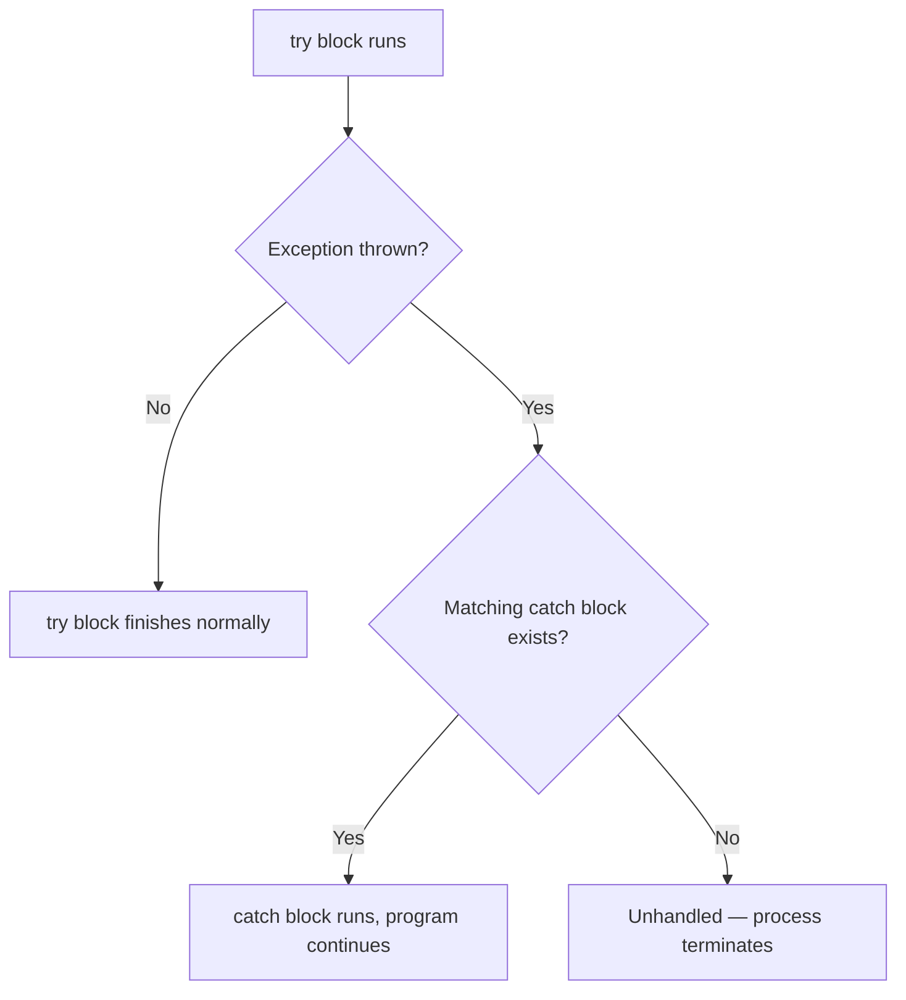
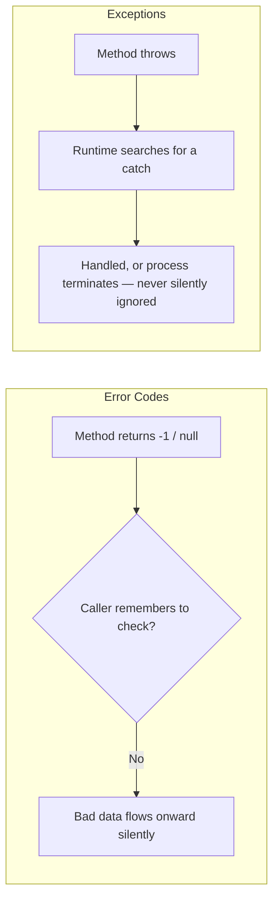

# Introduction to Exception Handling

## Introduction

Before reading this lesson, you should already be comfortable with **[Real-Time LINQ: Querying the E-Commerce Order Catalog](../04-linq/04-22-real-time-linq-order-catalog.md)**, and with the general idea that programs process data that isn't always as clean as the sample datasets used to teach a language feature. Every LINQ pipeline in Module 04 assumed well-formed input — numbers that were actually numbers, references that were never missing. Real systems don't get that guarantee. Files go missing, network calls time out, users type letters into a quantity field, and divisors turn out to be zero. This lesson introduces **exception handling** — the mechanism C# and .NET provide for detecting, signaling, and reacting to exactly these kinds of abnormal conditions without letting them silently corrupt your program or bring it down without explanation.

By the end of this lesson, you will be able to:

- Define what an exception is and how it differs from an ordinary return value
- Explain why C# and the .NET runtime rely on exceptions rather than error codes for abnormal conditions
- Describe what happens to a program when an exception is thrown but never caught
- Write a minimal `try`/`catch` block that catches a thrown exception and lets the program continue
- Identify the `throw` statement and recognize that an exception is itself an object
- Recognize, at a high level, that exceptions are meant for *abnormal* conditions, not everyday control flow

## Exception Handling — A Layman's Perspective

Picture the fire alarm system in a large office building. On an ordinary day, nobody thinks about it at all — employees arrive, sit at their desks, attend meetings, and go home, and the alarm system sits there silently in the background, doing nothing, because nothing has gone wrong. That silence is the normal, expected path through the day. Nobody writes a memo every morning explaining that today, once again, there was no fire; the absence of an alarm *is* the information.

Now suppose smoke starts pouring out of a break-room toaster. The moment the smoke detector notices it, everything changes. The alarm doesn't wait for someone to notice the smoke on their own, and it doesn't quietly log the problem in a binder for someone to review next week. It interrupts *everything*, immediately and loudly, no matter what anyone in the building happens to be doing at that exact second — a meeting in progress, a phone call, someone halfway through lunch. That's the nature of a real emergency: it doesn't politely wait its turn in whatever process was already running.

Once the alarm sounds, the building has a plan for exactly this. A designated response team — maybe building security, maybe the fire warden on that floor — is trained to handle it: they know where the extinguishers are, they know the evacuation routes, and they take over from that point onward. Employees don't need to personally understand how to fight a kitchen fire; they just need to recognize the alarm and know who's supposed to respond to it. If, on some rare and badly managed day, nobody had ever assigned a response team at all, the alarm would just keep blaring with no one taking charge, and the emergency would escalate until the entire building had to be evacuated and the fire department stepped in from outside — a far more disruptive, far more expensive outcome than if a trained team had intervened early.

This is the shape of exception handling in a program. Under normal conditions, code just runs — no alarms, no special handling, nothing remarkable happening. But when something genuinely goes wrong — a file that should exist doesn't, a number that should parse cleanly doesn't — the program doesn't have to silently keep going with garbage data, and it doesn't have to rely on someone remembering to check a status flag after every single operation. It raises an alarm immediately, at the exact moment the problem is detected, and hands control to whichever part of the program has been designated to respond. If no part of the program has been assigned that responsibility, the "building" — your running process — doesn't quietly limp along either. It shuts down entirely, with the .NET runtime playing the role of the fire department that steps in when no internal response team exists, printing out what went wrong and terminating the program.

That's the entire premise this lesson is built on: an exception is an alarm for an abnormal condition, and handling it well means having the right team ready to respond *before* the alarm ever sounds.

## Exception Handling — A Programming Language Perspective

In C#, an **exception** is an object — an instance of `System.Exception` or one of its derived types — that represents an abnormal condition encountered while a program is running. Rather than a method returning a special sentinel value (`-1`, `null`, or an error-code enum) that the caller must remember to check, a method encountering a problem it cannot resolve on its own uses the `throw` keyword to raise that exception object. The .NET runtime then immediately suspends the method's normal execution and begins searching up the call stack for a `catch` block whose declared exception type matches the thrown object. If one is found, execution resumes there; if the search reaches the top of the call stack without finding a match, the runtime's default unhandled-exception handling takes over, and the process terminates. This lesson introduces the smallest possible version of that mechanism — `throw`, `try`, and `catch` — before Lesson 05-02 examines `try`/`catch`/`finally` in full depth.

## How to Write a Minimal try/catch Block in C#

A `try` block wraps code that might fail. Immediately after it, one or more `catch` blocks each declare the exception type they know how to handle. If the code inside `try` throws an exception whose type matches a `catch` block, control jumps straight there — skipping whatever remaining statements were still queued up inside `try` — and execution continues normally after the `catch` block finishes.


*Figure 1: A thrown exception either finds a matching `catch` and the program continues, or it doesn't and the process ends.*

```csharp
// Program.cs — .NET 10 / C# 14

string[] inputs = ["10", "twenty", "30"];

foreach (string input in inputs)
{
    try
    {
        int number = int.Parse(input);
        Console.WriteLine($"Parsed value: {number}");
    }
    catch (FormatException)
    {
        Console.WriteLine($"Could not parse '{input}' as a number.");
    }
}

Console.WriteLine("Done processing all inputs.");
```

**Console Output:**

```text
Parsed value: 10
Could not parse 'twenty' as a number.
Parsed value: 30
Done processing all inputs.
```

`int.Parse("twenty")` throws a `FormatException` because the string isn't a valid integer. Without the `try`/`catch`, that exception would propagate straight out of the `foreach` loop, skip the remaining `"30"` entry entirely, and terminate the program before `"Done processing all inputs."` ever printed. With the `catch` block in place, the loop reports the bad entry and simply moves on to `"30"`, which parses fine. Notice that only the exact statements between the point of failure and the end of the `try` block are skipped — `int.Parse` never gets to return a value, but the loop itself, and everything after it, keeps running.

If that `catch` block were removed entirely, the story would be very different: the `FormatException` would have nowhere to go, so it would propagate all the way out of `Main`, and the .NET runtime's default unhandled-exception behavior would take over — printing the exception's type and message to standard error, printing a full stack trace, and terminating the process with a non-zero exit code. No further lines of the program would run at all, including the loop's remaining iterations and the final `Console.WriteLine`. That silent, total shutdown is exactly the cost this lesson opened with, and it's the reason a deliberate `catch` block, placed exactly where a failure is expected and recoverable, matters so much.

## Real-Time Example: Exception Handling in E-Commerce Order Processing

We continue building on the `OrderItem`-style data introduced across Module 04's E-Commerce Order Processing capstone. In a real order-intake pipeline, order line items don't arrive as neatly constructed `record` instances — they arrive as raw text from an upstream feed (a file upload, a partner's API, a batch job), and some fraction of that text is always malformed. Here, a batch of raw order lines in `"Sku,Quantity,UnitPrice"` format is parsed one line at a time, and a `try`/`catch` around the parsing logic keeps one corrupted line from taking down the entire batch.

```csharp
// Program.cs — .NET 10 / C# 14 — Real-Time Example

string[] rawOrderLines =
[
    "SKU-100,2,24.99",
    "SKU-200,1,89.99",
    "SKU-300,abc,34.50",      // corrupted quantity from the intake feed
    "SKU-400,1,249.99",
    "SKU-500,3,",             // missing unit price
];

List<OrderItem> acceptedItems = [];
int rejectedCount = 0;

foreach (string line in rawOrderLines)
{
    string[] fields = line.Split(',');

    try
    {
        string sku = fields[0];
        int quantity = int.Parse(fields[1]);
        decimal unitPrice = decimal.Parse(fields[2]);

        var item = new OrderItem(sku, quantity, unitPrice);
        acceptedItems.Add(item);
        Console.WriteLine($"Accepted: {item.Sku} x{item.Quantity} @ {item.UnitPrice:C}");
    }
    catch (FormatException)
    {
        Console.WriteLine($"Rejected line '{line}': one or more fields were not in a valid number format.");
        rejectedCount++;
    }
}

Console.WriteLine();
Console.WriteLine($"Batch complete: {acceptedItems.Count} accepted, {rejectedCount} rejected.");
decimal batchTotal = acceptedItems.Sum(i => i.Quantity * i.UnitPrice);
Console.WriteLine($"Total value of accepted items: {batchTotal:C}");

record OrderItem(string Sku, int Quantity, decimal UnitPrice);
```

**Console Output:**

```text
Accepted: SKU-100 x2 @ $24.99
Accepted: SKU-200 x1 @ $89.99
Rejected line 'SKU-300,abc,34.50': one or more fields were not in a valid number format.
Accepted: SKU-400 x1 @ $249.99
Rejected line 'SKU-500,3,': one or more fields were not in a valid number format.

Batch complete: 3 accepted, 2 rejected.
Total value of accepted items: $389.96
```

`int.Parse("abc")` and `decimal.Parse("")` both throw `FormatException`, and both are caught by the same `catch` block, so neither corrupted line stops the batch — it's simply counted as rejected and the loop moves on. Without this `try`/`catch`, the very first bad line (`"SKU-300,abc,34.50"`, the third line processed) would have thrown an unhandled exception and terminated the entire batch job before `"SKU-400"` and `"SKU-500"` were ever even looked at, and before any total could be reported. This is exactly the kind of resilience real order-processing systems depend on: one bad record shouldn't be able to silently take an entire day's batch down with it.

## Exceptions vs Error Codes

Before exceptions became the dominant convention, many languages (and plenty of older .NET-adjacent APIs, like Win32's `HRESULT` codes) signaled failure through an ordinary return value — a special integer, a `null`, or an enum meaning "something went wrong." The defining weakness of that approach is that it's entirely opt-in: nothing stops a caller from ignoring the return value, and a forgotten check simply lets bad data flow silently downstream until it causes a much stranger failure somewhere far from the actual mistake. Exceptions flip that default. A thrown exception cannot be silently ignored — it either finds a `catch` block somewhere up the call stack, or it terminates the program. There is no third option where the problem is quietly dropped on the floor.


*Figure 2: Error codes rely on the caller remembering to check; exceptions are enforced by the runtime itself.*

| Aspect | Error Codes | Exceptions |
|---|---|---|
| Signaling mechanism | A special return value (`-1`, `null`, an enum) | A thrown object that interrupts normal flow |
| Can be silently ignored? | Yes — nothing forces the caller to check | No — propagates until caught or the process ends |
| Carries rich data? | Usually just a code or a flag | A full object: message, stack trace, and (as later lessons show) custom properties |
| Propagating across many layers | Every layer must manually check and re-return the code | Propagates automatically through any number of call-stack frames |

## Types of Exception Handling Constructs in C#

This lesson only scratched the surface with a single `catch` block. The rest of this module builds out the full picture:

1. **[try/catch/finally in Depth](../05-exception-handling/05-02-try-catch-finally-in-depth.md)** — ordering multiple `catch` blocks, guaranteed cleanup with `finally`, and how exceptions propagate up the call stack.
2. **[The Exception Class Hierarchy](../05-exception-handling/05-03-exception-class-hierarchy.md)** — the built-in exception types you'll see constantly, and catching by base type vs. specific type.
3. **[Custom Exceptions](../05-exception-handling/05-04-custom-exceptions.md)** — defining your own exception types to carry domain-specific context.
4. **[Exception Filters (when clause)](../05-exception-handling/05-05-exception-filters-when-clause.md)** — matching a `catch` block conditionally, based on runtime state.
5. **[Exceptions vs the Result Pattern](../05-exception-handling/05-08-exceptions-vs-result-pattern.md)** — a look at when a return-value-based approach is actually the better fit, even in modern C#.

## What You've Learned & What's Next

An exception is an object representing an abnormal condition, raised with `throw` and caught with a matching `catch` block; unlike an error code, it can't be silently ignored, and an uncaught exception terminates the entire program. A single, well-placed `try`/`catch` — as shown in both the parsing demo and the order-intake batch above — is often enough to turn a program-ending failure into a single skipped record and a line of diagnostic output.

Continue your learning journey with **[try/catch/finally in Depth](../05-exception-handling/05-02-try-catch-finally-in-depth.md)**, where you'll learn how to order multiple `catch` blocks correctly, guarantee cleanup code runs with `finally` no matter what happens, and trace exactly how an exception propagates up through several layers of method calls.

---
*Applies to: .NET 10 / C# 14. Last reviewed 2026-08-16.*
