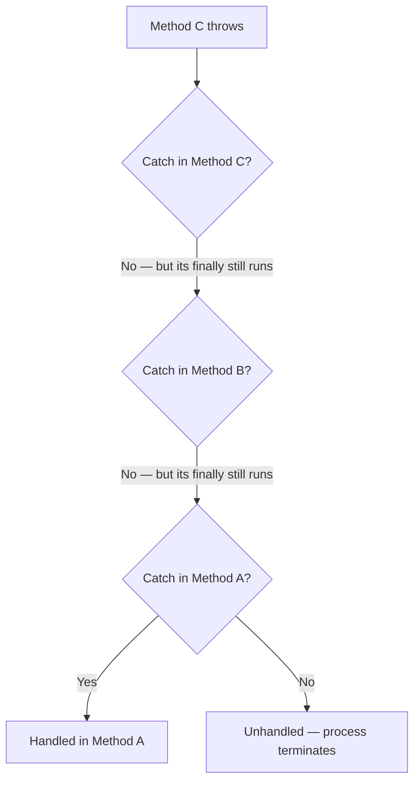
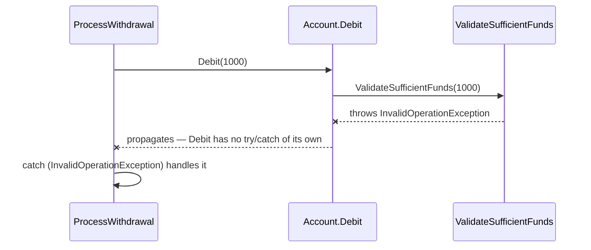
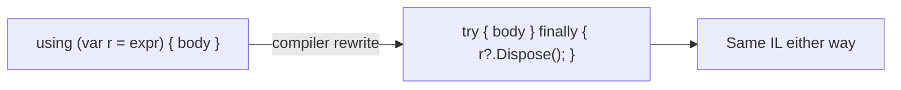

# try/catch/finally in Depth

## Introduction

Before reading this lesson, you should already be comfortable with **[Introduction to Exception Handling](../05-exception-handling/05-01-introduction-to-exception-handling.md)** — what an exception is, why C# uses `throw`/`catch` instead of error codes, and the cost of leaving one unhandled. That lesson used a single `catch` block to keep things simple. Real code is rarely that tidy: a single `try` often needs to react differently to different kinds of failures, and it almost always needs to guarantee that certain cleanup work happens whether or not anything went wrong at all. This lesson goes deep on the full `try`/`catch`/`finally` construct, on the `using` statement that builds on top of it, and on exactly how an exception travels once it leaves the method that threw it.

By the end of this lesson, you will be able to:

- Order multiple `catch` blocks from most specific to least specific, and explain why the compiler enforces that order
- Explain that a `finally` block always runs — even when the `try` block returns, throws, or the method's caller never catches the exception
- Trace what happens when both a `return` statement and a `finally` block are present in the same method
- Explain the `using` statement as compiler-generated syntactic sugar over a `try`/`finally` that calls `Dispose()`
- Describe how an exception propagates up through multiple call-stack frames, running each frame's `finally` block along the way, until a matching `catch` is found

## try/catch/finally — A Layman's Perspective

Picture a busy restaurant kitchen during dinner service. When something goes wrong on the line — a dish comes back burnt, a customer reports an allergic reaction, someone knocks over a pot — the kitchen doesn't send every problem to the same person. There's a hierarchy of specialists, and it matters enormously which one gets called first. The allergy-response specialist knows exactly what to do the instant a reaction is reported: stop that dish, pull the ingredient list, notify the front of house. A more general "kitchen incident" supervisor could technically handle an allergic reaction too, in the sense that they'd eventually notice something was wrong, but calling them first would be a mistake — they'd waste precious time figuring out what kind of problem it even was, when the allergy specialist would have known immediately. So the kitchen's standing order is: call the most specific specialist who can actually recognize this exact problem, and only fall back to the general supervisor for problems nobody more specific was trained for. Call them in the wrong order — general supervisor first — and the specific specialists become pointless; the supervisor would have already swallowed every incident before they ever got a chance to respond.

Now picture the very end of the night, once dinner service is over. Regardless of how the night went — a smooth, uneventful shift, a night with a couple of dropped dishes that got handled fine, or even a night bad enough that half the kitchen had to evacuate over a small grease fire — there is one closing routine that always happens. The head server walks the floor, extinguishes every candle, locks the register, switches off the ovens, and locks the doors. This closing routine doesn't care whether the shift succeeded or failed, and it doesn't get skipped just because something went badly wrong earlier in the night. If anything, it matters *more* on a bad night — leaving the ovens on after an evacuation would turn one problem into a much bigger one. This closing routine is unconditional. It's not one of the specialists who only shows up for a particular kind of incident; it's the one thing on the checklist that runs no matter what else did or didn't happen.

Finally, think about what happens when a problem occurs on the line and nobody in the kitchen is actually equipped to handle it — say, a structural issue with the building itself. The kitchen staff can't fix that. What they *can* do is make sure their own closing routine still runs — ovens off, doors locked — and then pass the problem up to whoever is above them: the restaurant manager, and if necessary, the building's own emergency services above that. The problem keeps moving up the chain of responsibility, one level at a time, until someone with the right authority and knowledge can actually resolve it — and at every level it passes through, that level's own "closing checklist" still runs on the way out, even though the actual problem hasn't been solved yet.

That's the complete shape of `try`, `catch`, and `finally` in C#. Multiple `catch` blocks are the kitchen's ordered list of specialists — most specific first. `finally` is the unconditional closing checklist that runs no matter what happened in the `try` block, success or failure alike. And propagation is the problem moving up through the restaurant's own chain of command, one level's closing checklist firing at a time, until it either finds someone equipped to resolve it or reaches the very top with no one left to ask.

## try/catch/finally — A Programming Language Perspective

A `try` block wraps code that might throw. Each `catch` clause after it declares an exception type; the CLR matches the thrown object's runtime type against each `catch` in the order they're written, top to bottom, and executes the first one that matches — including matches through inheritance. Because of that ordering rule, placing a more general exception type before a more derived one is a compile error (`CS0160`, "a previous catch clause already catches all exceptions of this or of a super type"), since the more specific clause underneath it could never be reached. A `finally` block, if present, is guaranteed by the CLR to execute during the `try` block's exit — whether that exit is normal completion, a `return`, a `break`/`continue` out of an enclosing loop, or an exception being thrown — and it runs *before* control actually leaves the surrounding method, even if a `return` statement inside `try` or `catch` has already computed the value to be returned. The `using` statement is compiler sugar: `using (var r = expr) { body }` is rewritten by the compiler into a `try`/`finally` whose `finally` calls `r.Dispose()` — the full `IDisposable` mechanism behind it is covered in Module 08.

## How to Order catch Blocks and Guarantee Cleanup with finally

Before combining everything, it helps to see the propagation shape on its own: when an exception isn't caught in the method that threw it, the runtime unwinds one frame at a time, running each frame's `finally` block, until a matching `catch` is found — or the process terminates if none ever is.


*Figure 1: An exception unwinds one call-stack frame at a time, running each frame's `finally` block, until a matching `catch` is found.*

```csharp
// Program.cs — .NET 10 / C# 14

Console.WriteLine($"Result: {Divide(10, 2)}");
Console.WriteLine($"Result: {Divide(10, 0)}");

static int Divide(int numerator, int denominator)
{
    try
    {
        int result = numerator / denominator;
        return result;
    }
    catch (DivideByZeroException ex)
    {
        Console.WriteLine($"Caught: {ex.Message}");
        return 0;
    }
    catch (ArithmeticException ex)
    {
        // Reachable for other arithmetic errors (e.g., OverflowException); never hit
        // here because DivideByZeroException, being more specific, is listed first.
        Console.WriteLine($"Caught general arithmetic error: {ex.Message}");
        return -1;
    }
    finally
    {
        Console.WriteLine($"Finally: attempted {numerator} / {denominator}");
    }
}
```

**Console Output:**

```text
Finally: attempted 10 / 2
Result: 5
Caught: Attempted to divide by zero.
Finally: attempted 10 / 0
Result: 0
```

Two things are worth noticing here. First, `DivideByZeroException` is listed before `ArithmeticException` — its own base type — because the compiler requires the more specific type first; swapping the order would make the second `catch` unreachable and fail to compile. Second, and more surprising the first time you see it: in the successful call, `Divide(10, 2)` hits `return result;` inside the `try` block, but `"Finally: attempted 10 / 2"` still prints *before* `"Result: 5"` does. The `finally` block runs after the return value has been computed but before control actually leaves the method — the same guarantee applies to the `return 0;` inside the `catch` block on the second call.

## Real-Time Example: try/catch/finally in Banking/ATM Withdrawal Processing

We build a small Banking/ATM scenario: an `Account` that validates funds before debiting, a `ProcessWithdrawal` method that wraps the whole operation, and an `AccountLock` resource acquired for the duration of the withdrawal so no other transaction can touch the same account at the same time. The validation failure happens two calls deep — inside `Account.Debit`, which calls a private `ValidateSufficientFunds` — demonstrating that an exception with no `catch` in either of those two methods still propagates cleanly up to the `catch` in `ProcessWithdrawal`. The `using` declaration guarantees the lock is released whether the withdrawal succeeds or fails.


*Figure 2: The exception is thrown two calls deep and propagates, unhandled, through `Debit` before `ProcessWithdrawal`'s `catch` finally handles it.*

```csharp
// Program.cs — .NET 10 / C# 14 — Real-Time Example

class AccountLock : IDisposable
{
    public string AccountId { get; }

    public AccountLock(string accountId)
    {
        AccountId = accountId;
        Console.WriteLine($"  [Lock] Acquired lock on account {AccountId}.");
    }

    public void Dispose()
    {
        Console.WriteLine($"  [Lock] Released lock on account {AccountId}.");
    }
}

class Account(string accountId, decimal balance)
{
    public string AccountId { get; } = accountId;
    public decimal Balance { get; private set; } = balance;

    public void Debit(decimal amount)
    {
        ValidateSufficientFunds(amount);
        Balance -= amount;
    }

    private void ValidateSufficientFunds(decimal amount)
    {
        if (amount > Balance)
        {
            throw new InvalidOperationException(
                $"Insufficient funds: requested {amount:C} but balance is {Balance:C}.");
        }
    }
}

static void ProcessWithdrawal(Account account, decimal amount)
{
    using AccountLock accountLock = new(account.AccountId);

    try
    {
        account.Debit(amount);
        Console.WriteLine($"  Withdrawal approved: {amount:C} from {account.AccountId}. New balance: {account.Balance:C}");
    }
    catch (InvalidOperationException ex)
    {
        Console.WriteLine($"  Withdrawal declined: {ex.Message}");
    }
    finally
    {
        Console.WriteLine($"  [Audit] Withdrawal attempt on {account.AccountId} closed.");
    }
}

Account checking = new("ACC-001", 500m);

Console.WriteLine("Attempt 1: withdraw $200");
ProcessWithdrawal(checking, 200m);

Console.WriteLine();
Console.WriteLine("Attempt 2: withdraw $1000");
ProcessWithdrawal(checking, 1000m);
```

**Console Output:**

```text
Attempt 1: withdraw $200
  [Lock] Acquired lock on account ACC-001.
  Withdrawal approved: $200.00 from ACC-001. New balance: $300.00
  [Audit] Withdrawal attempt on ACC-001 closed.
  [Lock] Released lock on account ACC-001.

Attempt 2: withdraw $1000
  [Lock] Acquired lock on account ACC-001.
  Withdrawal declined: Insufficient funds: requested $1,000.00 but balance is $300.00.
  [Audit] Withdrawal attempt on ACC-001 closed.
  [Lock] Released lock on account ACC-001.
```

Notice the ordering in the declined attempt: the exception is thrown inside `ValidateSufficientFunds`, propagates unhandled through `Debit`, and is only actually caught two frames up in `ProcessWithdrawal`; the explicit `finally` logs the audit line; and only after that does the compiler-generated `finally` behind the `using` declaration release the lock. In a real ATM system, that lock release matters as much as the transaction outcome itself — an account left locked after a declined withdrawal would block every subsequent transaction against it, which is exactly the kind of resource leak `finally` and `using` exist to prevent.

## finally vs the using Statement

`finally` is the general-purpose guarantee: whatever code you write inside it runs no matter how the `try` block exits. `using` is a narrower, purpose-built tool that solves one specific and extremely common case of that same problem — releasing an `IDisposable` resource — without requiring you to write the `try`/`finally` and the `Dispose()` call yourself. Every `using` statement or declaration is really just a `try`/`finally` the compiler writes for you; reaching for `using` whenever the cleanup is "call `Dispose()`" removes an entire category of bugs where a developer forgets the cleanup call, places it in the wrong branch, or forgets to guard against the resource being `null`.


*Figure 3: `using` is not a separate mechanism — the compiler rewrites it into the equivalent `try`/`finally` before anything runs.*

| Aspect | Manual `try`/`finally` + `Dispose()` | `using` statement/declaration |
|---|---|---|
| Who calls `Dispose()` | The developer, explicitly, inside `finally` | The compiler, automatically, every time |
| Risk of forgetting cleanup | Real — easy to omit or misplace | None — the compiler always emits the call |
| Null resource handling | Must be checked manually before calling `Dispose()` | Compiler emits a null-conditional `Dispose()` call automatically |
| Readability with several resources | Nested `try`/`finally` blocks stack up quickly | Multiple `using` declarations read as flat, sequential lines |

## Types of try/catch/finally Related Constructs in C#

1. **[The Exception Class Hierarchy](../05-exception-handling/05-03-exception-class-hierarchy.md)** — the built-in exception types you'll most often be writing `catch` clauses for.
2. **[Custom Exceptions](../05-exception-handling/05-04-custom-exceptions.md)** — defining your own exception types when the built-in ones don't carry enough context.
3. **[`IDisposable` and the `using` Statement](../08-memory-management/08-04-idisposable-and-using-statement.md)** — the full treatment of the pattern this lesson only introduced as sugar over `try`/`finally`.
4. **[Inner Exceptions and Exception Wrapping](../05-exception-handling/05-06-inner-exceptions-and-wrapping.md)** — what to do when a `catch` block needs to re-throw as a different, more meaningful exception type.
5. **[Exceptions vs the Result Pattern](../05-exception-handling/05-08-exceptions-vs-result-pattern.md)** — an alternative approach for situations where throwing isn't the best fit at all.

## What You've Learned & What's Next

`catch` blocks are matched top to bottom, so the compiler requires specific types before their own base types; `finally` runs unconditionally, even around a `return`, and even while an exception is still unwinding past a frame with no matching `catch`; and `using` is simply a safer, compiler-guaranteed way of writing one particular kind of `finally` block. Together, these three keep both correctness and cleanup intact even when a failure happens several calls deep, exactly as seen with the withdrawal declined two frames below where it was ultimately handled.

Continue your learning journey with **[The Exception Class Hierarchy](../05-exception-handling/05-03-exception-class-hierarchy.md)**, where you'll meet the built-in exception types you'll be writing `catch` clauses for constantly, and learn when catching by a shared base type is the right call versus when it hides more than it helps.

---
*Applies to: .NET 10 / C# 14. Last reviewed 2026-08-16.*
