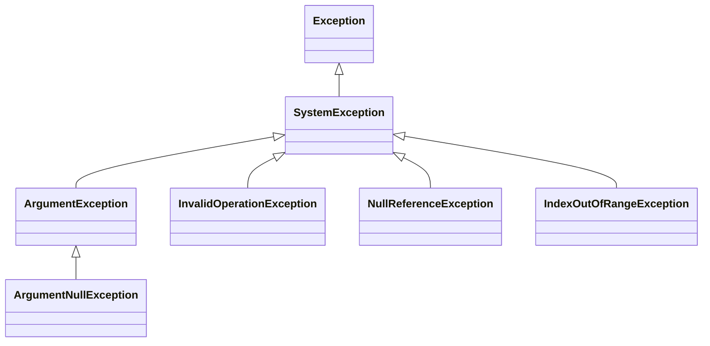
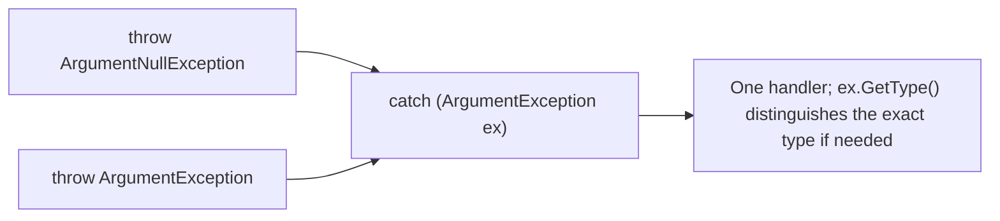

# The Exception Class Hierarchy

## Introduction

Before reading this lesson, you should already be comfortable with **[try/catch/finally in Depth](../05-exception-handling/05-02-try-catch-finally-in-depth.md)** — how multiple `catch` blocks are ordered, why `finally` always runs, and how an exception propagates up the call stack. That lesson deliberately used only one or two exception types at a time. In real code you'll run into a whole family of built-in exception types, and they aren't scattered randomly — they form an actual class hierarchy rooted at `System.Exception`, with meaningful parent/child relationships between them. Understanding that hierarchy is what lets you decide, with confidence, whether a `catch` block should target one exact type or an entire family of related ones at once.

By the end of this lesson, you will be able to:

- Describe `System.Exception` as the root of every exception type and name the information it provides to every derived type
- Recognize the commonly thrown built-in exceptions: `ArgumentException`, `ArgumentNullException`, `InvalidOperationException`, `NullReferenceException`, and `IndexOutOfRangeException`
- Explain the parent/child relationship between `ArgumentNullException` and `ArgumentException`
- Catch an entire family of exceptions with one base-type `catch` block, or a single exact type with a specific one
- Justify, in your own words, why catching a bare `Exception` in production code is considered an anti-pattern

## The Exception Class Hierarchy — A Layman's Perspective

Picture a large regional postal sorting center that handles every parcel passing through it. Every single item that comes through the door — a letter, a fragile vase, a crate of live plants, a box of frozen food — is, first and foremost, just a "package." That's the broadest category there is, and every package, no matter what's inside it, carries the same basic paperwork: a tracking number, a destination address, a weight. That basic paperwork is the one thing every package has in common, and it's useful precisely because it applies to absolutely everything that comes through the center.

But the sorting center doesn't stop there, because "it's a package" isn't enough information to actually handle most of them correctly. Fragile items get their own more specific category, with extra handling instructions stapled on: "this side up," "do not stack." Within that fragile category, there's an even more specific sub-category for glassware specifically, with its own extra padding requirements that go beyond what a generically fragile item needs. Perishables get their own entirely separate category with refrigeration requirements. A worker sorting parcels needs to recognize which category — general package, fragile, glass specifically, perishable — each item actually belongs to, because the correct handling genuinely depends on it. Treating a crate of glassware as just "a package" and tossing it onto the same conveyor as everything else is how it arrives broken.

Now imagine a worker at the center who's grown tired of learning all these categories and just decides to treat every single item, regardless of what it is, with one identical generic procedure: scan the tracking number, put it in the truck. That worker technically "handles" everything — nothing gets stuck at their station — but they've thrown away the entire point of having categories in the first place. The glassware breaks because it needed padding. The perishables spoil because they needed refrigeration. And worse, from the outside, it looks like the sorting center is running just fine — every parcel got a tracking scan and left the building — right up until customers start complaining that their vases arrived in pieces. The problem wasn't caught; it was just quietly waved through by someone treating every distinct category as if it were identical to the most generic one.

That's the shape of the exception hierarchy in C#. `System.Exception` is "it's a package" — the one thing every single exception has in common, carrying the basic paperwork every exception type inherits: a `Message`, a `StackTrace`, sometimes an `InnerException`. Types like `ArgumentException` are a more specific category, with more specific handling expectations, and `ArgumentNullException` is more specific still, a sub-category of `ArgumentException` itself. A `catch` block that only ever catches the broad, generic `Exception` type is the tired postal worker: it "handles" everything in the sense that nothing crashes, but it throws away the ability to respond correctly to a real programming bug versus an expected, recoverable condition — and it can just as easily paper over a serious problem as a minor one, all while looking, from the outside, like everything is running fine.

## The Exception Class Hierarchy — A Programming Language Perspective

Every exception type in .NET ultimately derives from `System.Exception`, which supplies the members every exception carries regardless of its specific type: `Message`, `StackTrace`, `InnerException`, `Data`, and others. Most of the built-in exceptions you'll encounter day to day — `ArgumentException`, `InvalidOperationException`, `NullReferenceException`, `IndexOutOfRangeException` — derive from `System.SystemException`, itself a direct child of `Exception`. Within that family, some types form their own deeper chains: `ArgumentNullException` derives from `ArgumentException`, meaning every `ArgumentNullException` *is* an `ArgumentException`, just a more specific one thrown for the single case of a `null` argument rather than any other invalid one. When the CLR searches `catch` clauses for a match, it uses this same is-a relationship: a `catch (ArgumentException ex)` block matches an actual `ArgumentNullException` object too, because of that inheritance chain — which is exactly why catch-ordering rules (most specific first, covered in the previous lesson) matter whenever more than one type in the same family is being handled.

## How to Catch by Base Type vs Specific Type in C#

The hierarchy below covers the five built-in exception types this lesson focuses on. Notice that `ArgumentNullException` sits underneath `ArgumentException` specifically, while the other three sit as siblings, one level up from `Exception` itself.


*Figure 1: `ArgumentNullException` is a specific kind of `ArgumentException`; the others sit as separate branches off the same root.*

```csharp
// Program.cs — .NET 10 / C# 14

void Validate(string? name, int age)
{
    if (name is null)
    {
        throw new ArgumentNullException(nameof(name));
    }

    if (age < 0)
    {
        throw new ArgumentException("Age cannot be negative.", nameof(age));
    }

    Console.WriteLine($"Valid: {name}, age {age}");
}

(string? Name, int Age)[] inputs =
[
    ("Amara", 30),
    (null, 25),
    ("Ben", -5),
];

foreach (var (name, age) in inputs)
{
    try
    {
        Validate(name, age);
    }
    catch (ArgumentNullException ex)
    {
        Console.WriteLine($"Missing required value: {ex.Message}");
    }
    catch (ArgumentException ex)
    {
        Console.WriteLine($"Invalid argument: {ex.Message}");
    }
}
```

**Console Output:**

```text
Valid: Amara, age 30
Missing required value: Value cannot be null. (Parameter 'name')
Invalid argument: Age cannot be negative. (Parameter 'age')
```

The `catch (ArgumentNullException ex)` block is listed first because it's the more specific type; if it were listed second, the compiler would reject the code as unreachable, since the `ArgumentException` clause above it would already match every `ArgumentNullException` too. Notice how both messages automatically include `(Parameter 'name')` or `(Parameter 'age')` — that formatting comes from the exception's own constructor, not from anything this code built by hand, which is one of the small conveniences of using the right built-in type instead of a plain `Exception` with a hand-written string.

## Real-Time Example: Exception Hierarchy in Library/Inventory Checkout

We build a small Library/Inventory Management scenario: a `catalog` of `Book` records keyed by ISBN, a `patrons` directory keyed by patron ID, and a fixed array of five `shelfCodes`. A batch of checkout requests is processed one at a time, and each one exercises a different member of the hierarchy this lesson covers — a missing ISBN, a book with no copies left, a patron ID that isn't on file, and a shelf index that doesn't exist.

```csharp
// Program.cs — .NET 10 / C# 14 — Real-Time Example

record Book(string Isbn, string Title, int CopiesAvailable);
record Patron(string PatronId, string Name);

string[] shelfCodes = ["A1", "A2", "B1", "B2", "C1"]; // 5 shelf locations, indexes 0-4

Dictionary<string, Book> catalog = new()
{
    ["978-0-13-468599-1"] = new Book("978-0-13-468599-1", "Effective C#", 2),
    ["978-1-59-327584-6"] = new Book("978-1-59-327584-6", "The C# Player's Guide", 0),
};

Dictionary<string, Patron> patrons = new()
{
    ["P-100"] = new Patron("P-100", "Amara Chen"),
    ["P-200"] = new Patron("P-200", "Ben Okafor"),
};

(string? Isbn, string PatronId, int ShelfIndex)[] checkoutRequests =
[
    ("978-0-13-468599-1", "P-100", 2),
    (null, "P-200", 0),
    ("978-1-59-327584-6", "P-100", 1),
    ("978-0-13-468599-1", "P-999", 0),
    ("978-0-13-468599-1", "P-200", 9),
];

foreach (var request in checkoutRequests)
{
    try
    {
        if (request.Isbn is null)
        {
            throw new ArgumentNullException(nameof(request.Isbn), "An ISBN must be supplied to check out a book.");
        }

        Book book = catalog[request.Isbn];

        if (book.CopiesAvailable <= 0)
        {
            throw new InvalidOperationException($"No copies of '{book.Title}' are currently available.");
        }

        // Not decremented here — this batch focuses on exception handling, not inventory mutation.
        Patron? patron = patrons.GetValueOrDefault(request.PatronId);
        string patronName = patron.Name; // no null check — throws if the patron wasn't found

        string shelf = shelfCodes[request.ShelfIndex];

        Console.WriteLine($"Checked out '{book.Title}' to {patronName} (shelf {shelf}).");
    }
    catch (ArgumentNullException ex)
    {
        Console.WriteLine($"Missing required field: {ex.Message}");
    }
    catch (InvalidOperationException ex)
    {
        Console.WriteLine($"Checkout blocked: {ex.Message}");
    }
    catch (NullReferenceException)
    {
        Console.WriteLine("Checkout blocked: patron record not found.");
    }
    catch (IndexOutOfRangeException)
    {
        Console.WriteLine("Checkout blocked: shelf index does not exist.");
    }
}
```

**Console Output:**

```text
Checked out 'Effective C#' to Amara Chen (shelf B1).
Missing required field: An ISBN must be supplied to check out a book. (Parameter 'Isbn')
Checkout blocked: No copies of 'The C# Player's Guide' are currently available.
Checkout blocked: patron record not found.
Checkout blocked: shelf index does not exist.
```

Each rejected request fails for a genuinely different reason, and each one is caught by the specific `catch` block that matches it — a missing ISBN by `ArgumentNullException`, an empty inventory by `InvalidOperationException`, an unknown patron ID by `NullReferenceException` (because `patron` comes back `null` from the dictionary lookup and is dereferenced without a check), and an out-of-range shelf index by `IndexOutOfRangeException`. A real library system built this way can report exactly what went wrong with each request — instead of one generic "checkout failed" message — which matters enormously when a librarian is trying to figure out why a specific request didn't go through.

## Catching by Base Type vs Specific Type

Sometimes you genuinely want one `catch` block to handle an entire family of related exceptions the same way — logging and rejecting any kind of argument problem, for instance, regardless of whether it was `null` or simply invalid. Other times you want to react differently depending on the exact type — perhaps prompting a user to supply a missing value versus asking them to correct an invalid one. Both are legitimate, and the choice comes down to whether the different members of the family genuinely deserve different handling.

```csharp
// Program.cs — .NET 10 / C# 14 — Catching by base type

void Checkout(string? isbn)
{
    if (isbn is null)
    {
        throw new ArgumentNullException(nameof(isbn));
    }

    if (isbn.Length != 17) // simplified ISBN-13-with-dashes length check
    {
        throw new ArgumentException("ISBN must be 17 characters including dashes.", nameof(isbn));
    }

    Console.WriteLine($"Processing ISBN {isbn}.");
}

string?[] testIsbns = [null, "123", "978-0-13-468599-1"];

foreach (string? isbn in testIsbns)
{
    try
    {
        Checkout(isbn);
    }
    catch (ArgumentException ex) // catches ArgumentNullException too — it derives from ArgumentException
    {
        Console.WriteLine($"Rejected: {ex.GetType().Name} — {ex.Message}");
    }
}
```

**Console Output:**

```text
Rejected: ArgumentNullException — Value cannot be null. (Parameter 'isbn')
Rejected: ArgumentException — ISBN must be 17 characters including dashes. (Parameter 'isbn')
Processing ISBN 978-0-13-468599-1.
```


*Figure 2: A single base-type `catch` block matches every derived type in its family — `ex.GetType()` recovers which exact one fired.*

| Aspect | Catch by Base Type | Catch by Specific Type |
|---|---|---|
| Handler count | One `catch` block handles the whole family | One `catch` block per exact type |
| Distinguishing which error occurred | Requires `ex.GetType()` or an `is` pattern check | Automatic — the `catch` clause itself identifies it |
| Best for | Uniform handling, e.g. log-and-reject any argument problem | Tailored recovery per error, e.g. prompting differently for a missing vs. invalid value |
| Risk | Can blur together errors that deserve different responses | More repetitive if several related types need identical handling anyway |

A closely related, stronger rule deserves its own callout: never catch a bare `catch (Exception ex)` in production code just to "make the error go away." A bare `Exception` catch matches absolutely everything — including genuine programming bugs like a `NullReferenceException` from a missed null check, or `OutOfMemoryException` signaling the process is in real trouble — and silently treating all of those identically to an expected, recoverable condition hides exactly the failures you most need to notice. Catch the narrowest type (or family) that you actually know how to recover from, and let anything else propagate so it surfaces where it can be diagnosed.

## Types of Built-In Exceptions Covered in This Module

1. **[Custom Exceptions](../05-exception-handling/05-04-custom-exceptions.md)** — defining your own type when none of the built-in ones carry the context you need.
2. **[Exception Filters (when clause)](../05-exception-handling/05-05-exception-filters-when-clause.md)** — matching a `catch` block conditionally, based on more than just the exception's type.
3. **[try/catch/finally in Depth](../05-exception-handling/05-02-try-catch-finally-in-depth.md)** — the catch-ordering rules this lesson's hierarchy directly depends on.
4. **[Inner Exceptions and Exception Wrapping](../05-exception-handling/05-06-inner-exceptions-and-wrapping.md)** — carrying an original exception forward inside a new, more meaningful one.
5. **[Global Exception Handling](../05-exception-handling/05-07-global-exception-handling.md)** — a single top-level safety net for exceptions that escape every local `catch` block.

## What You've Learned & What's Next

Every exception derives from `System.Exception`, but the built-in types you'll meet constantly — `ArgumentException`, `ArgumentNullException`, `InvalidOperationException`, `NullReferenceException`, `IndexOutOfRangeException` — form real parent/child relationships, and the checkout batch above showed each one firing for a genuinely different reason. Catching by base type is a deliberate, useful choice when a whole family deserves the same response; catching a bare `Exception` is not the same thing, and it's the one habit this lesson asked you to rule out entirely.

Continue your learning journey with **[Custom Exceptions](../05-exception-handling/05-04-custom-exceptions.md)**, where you'll learn to define your own exception types — complete with the standard constructor conventions and custom properties — for the domain-specific failures the built-in hierarchy simply doesn't have a type for.

---
*Applies to: .NET 10 / C# 14. Last reviewed 2026-08-16.*
