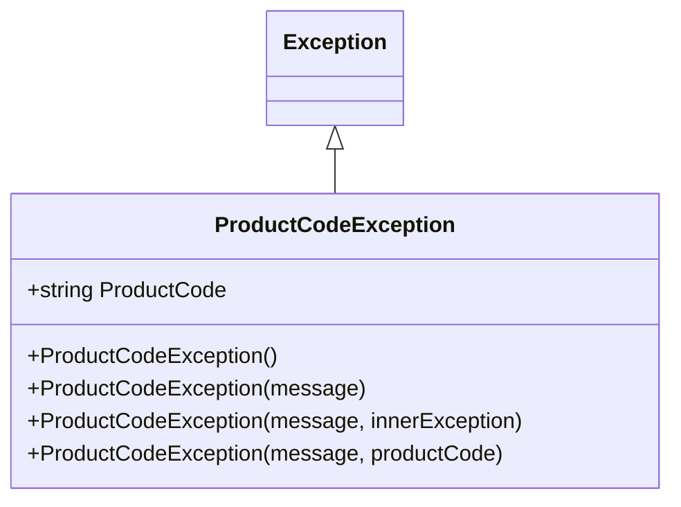
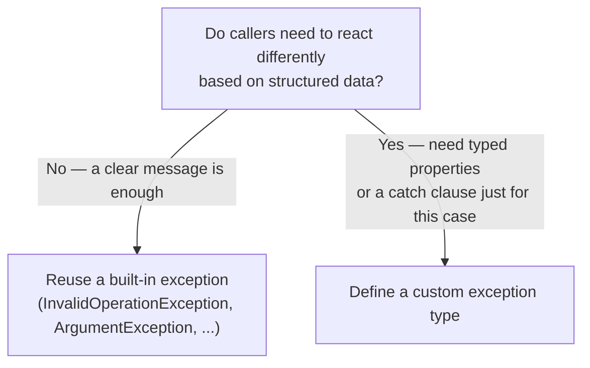

# Custom Exceptions

## Introduction

Before reading this lesson, you should already be comfortable with **[The Exception Class Hierarchy](../05-exception-handling/05-03-exception-class-hierarchy.md)** — `System.Exception` as the root type, the built-in exceptions derived from it, and catching by base type vs. specific type. Those built-in types cover a lot of ground, but they can't cover everything: `InvalidOperationException` can tell a caller that a withdrawal was rejected, but it has no built-in place to carry *which* account, *how much* was requested, or *what* the actual balance was. This lesson shows you how to define your own exception type — one that behaves exactly like a built-in one when caught generically, but carries exactly the structured, domain-specific context your own code needs.

By the end of this lesson, you will be able to:

- Derive a custom exception class from `System.Exception`, or from a more specific built-in type when that's the better semantic fit
- Implement the three standard constructors convention so your exception type behaves like any built-in one
- Add custom properties to a custom exception to carry domain-specific context beyond a plain message string
- Throw and catch a custom exception exactly like a built-in one, including accessing its extra properties from a `catch` block
- Judge, for a given failure, whether a custom exception type is actually warranted or whether it's overkill

## Custom Exceptions — A Layman's Perspective

Picture an insurance company that processes every incoming claim through a general "incident report" form. That form has a handful of fields every claim needs no matter what happened: a claimant's name, a date, a short free-text description of what went wrong. For years, every kind of claim — a fender bender, a flooded basement, a stolen laptop — got funneled through that same generic form, and a claims adjuster reading it had to comb through the free-text description to figure out the details that actually mattered for that specific kind of claim: what was the other car's plate number, how many inches did the water rise, what was the laptop's serial number. None of that was ever *guaranteed* to be there, because the form had no dedicated field for it — it depended entirely on whether the person filling out the form happened to mention it in the paragraph of prose.

At some point, the company realizes that vehicle collision claims are common enough, and different enough from every other kind of claim, that they deserve their own specialized form — one that still has all the same basic fields every claim needs, but adds dedicated fields just for this case: the other driver's insurance provider, the estimated speed of impact, the point of contact on the vehicle. Now, an adjuster processing a collision claim doesn't have to parse a paragraph hoping the right details were mentioned — they're guaranteed to be sitting in a labeled field, every single time, because the form itself requires it. That specialized form doesn't replace the general incident report; it *is* one, just a more specific, more useful version of it for one recurring, well-understood category of claim.

But the company doesn't create a brand-new specialized form for every single claim that comes in. A one-off, bizarre claim that will probably never happen again — someone's claim was denied because a squirrel chewed through a very specific wire in a very specific way — doesn't get its own permanent form with its own dedicated fields. That would be a huge amount of design and printing effort for a form that might get used exactly once. For that kind of claim, the general incident report, with its free-text description doing the work, is entirely sufficient. The decision of whether to build a specialized form always comes down to the same question: will this exact category of situation recur often enough, and does it carry structured details specific enough, that a dedicated form actually pays for itself?

That's precisely the judgment call behind a custom exception type in C#. `System.Exception` is the general incident report — the one thing every exception can rely on. A custom exception, like an `InsufficientFundsException` carrying the account ID, the requested amount, and the available balance as real, typed properties, is the specialized collision-claim form: still an incident report underneath, but one that guarantees the structured details a recurring, well-understood business rule actually needs, instead of hoping they were mentioned somewhere in a message string.

## Custom Exceptions — A Programming Language Perspective

A custom exception is a class that derives from `System.Exception` directly, or from a more specific existing exception type when the failure genuinely *is* a more specific case of that type. By long-standing .NET convention — one still followed today and flagged by static analyzers (such as rule `CA1032`) when it's missing — a well-formed custom exception type supplies three standard constructors: a parameterless one, one accepting a `string message`, and one accepting a `string message` plus an `Exception innerException`. These mirror the constructors every built-in exception type supports, so your custom type remains constructible, catchable, and serializable in every way a caller would expect from *any* exception. Beyond those three, it's entirely normal — and this is the actual point of writing a custom type at all — to add one or more additional constructors, plus plain `{ get; }` auto-properties, that capture domain-specific context at the moment the exception is thrown, so a `catch` block can read structured data (`ex.AccountId`, `ex.RequestedAmount`) instead of parsing a formatted string.

## How to Define a Custom Exception in C#

A minimal custom exception type looks almost exactly like any other class, with one difference: it derives from `Exception` (or a suitable subtype) and forwards its `message` parameter to the base constructor with `: base(message)`.


*Figure 1: The three standard constructors, plus a domain-specific fourth overload that captures the extra `ProductCode` property.*

```csharp
// Program.cs — .NET 10 / C# 14

try
{
    ValidateProductCode("BAD");
}
catch (ProductCodeException ex)
{
    Console.WriteLine($"Validation failed: {ex.Message}");
    Console.WriteLine($"Offending code: {ex.ProductCode}");
}

static void ValidateProductCode(string code)
{
    if (!code.StartsWith("SKU-"))
    {
        throw new ProductCodeException($"'{code}' is not a recognized product code format.", code);
    }
}

class ProductCodeException : Exception
{
    public string ProductCode { get; }

    public ProductCodeException()
    {
        ProductCode = string.Empty;
    }

    public ProductCodeException(string message)
        : base(message)
    {
        ProductCode = string.Empty;
    }

    public ProductCodeException(string message, Exception innerException)
        : base(message, innerException)
    {
        ProductCode = string.Empty;
    }

    public ProductCodeException(string message, string productCode)
        : base(message)
    {
        ProductCode = productCode;
    }
}
```

**Console Output:**

```text
Validation failed: 'BAD' is not a recognized product code format.
Offending code: BAD
```

The first three constructors exist purely so `ProductCodeException` behaves like any well-formed exception type — constructible with no arguments, with just a message, or with a message and an inner exception, for whatever generic tooling or logging code expects that shape to exist. The fourth constructor is the one this specific type actually earns its keep with: it captures `ProductCode` as a real, strongly-typed property, so the `catch` block above reads `ex.ProductCode` directly instead of trying to parse `"BAD"` back out of the message text.

## Real-Time Example: Custom Exceptions in Banking/ATM Withdrawals

We continue building on the `Account` class from the previous lesson's ATM scenario, replacing the generic `InvalidOperationException` it used to signal a declined withdrawal with a proper `InsufficientFundsException` — one that carries the account ID, the requested amount, and the available balance as typed properties, so the code handling the decline can build a structured audit entry instead of just echoing a message string back.

```csharp
// Program.cs — .NET 10 / C# 14 — Real-Time Example

class InsufficientFundsException : Exception
{
    public string AccountId { get; }
    public decimal RequestedAmount { get; }
    public decimal AvailableBalance { get; }

    public InsufficientFundsException()
    {
        AccountId = string.Empty;
    }

    public InsufficientFundsException(string message)
        : base(message)
    {
        AccountId = string.Empty;
    }

    public InsufficientFundsException(string message, Exception innerException)
        : base(message, innerException)
    {
        AccountId = string.Empty;
    }

    public InsufficientFundsException(string accountId, decimal requestedAmount, decimal availableBalance)
        : base($"Account {accountId} has insufficient funds: requested {requestedAmount:C} but only {availableBalance:C} is available.")
    {
        AccountId = accountId;
        RequestedAmount = requestedAmount;
        AvailableBalance = availableBalance;
    }
}

class Account(string accountId, decimal balance)
{
    public string AccountId { get; } = accountId;
    public decimal Balance { get; private set; } = balance;

    public void Debit(decimal amount)
    {
        if (amount > Balance)
        {
            throw new InsufficientFundsException(AccountId, amount, Balance);
        }

        Balance -= amount;
    }
}

static void ProcessWithdrawal(Account account, decimal amount)
{
    try
    {
        account.Debit(amount);
        Console.WriteLine($"Approved: {amount:C} from {account.AccountId}. New balance: {account.Balance:C}");
    }
    catch (InsufficientFundsException ex)
    {
        Console.WriteLine($"Declined: {ex.Message}");
        Console.WriteLine($"  [Audit] account={ex.AccountId} requested={ex.RequestedAmount:C} available={ex.AvailableBalance:C}");
    }
}

Account savings = new("ACC-777", 250m);

ProcessWithdrawal(savings, 100m);
ProcessWithdrawal(savings, 300m);
```

**Console Output:**

```text
Approved: $100.00 from ACC-777. New balance: $150.00
Declined: Account ACC-777 has insufficient funds: requested $300.00 but only $150.00 is available.
  [Audit] account=ACC-777 requested=$300.00 available=$150.00
```

The declined withdrawal's `catch` block never has to parse anything out of `ex.Message` to build the audit line — `ex.AccountId`, `ex.RequestedAmount`, and `ex.AvailableBalance` are already sitting there as real `decimal` and `string` values, exactly as they were at the moment `Debit` detected the problem. A generic `InvalidOperationException` could have delivered the same human-readable message, but it would have forced any code further up the stack that needed the account ID or the exact amounts — a fraud-monitoring system, a retry policy, an audit log — to re-parse them out of free text, which is exactly the fragility a custom exception type exists to avoid.

## Custom Exception vs Reusing a Built-In Exception

The judgment call from this lesson's opening analogy comes down to one question: does anything downstream need to react differently based on structured data this failure carries, or is a clear message enough? If a `catch` block, a logging system, or a retry policy needs to branch on specific values — the exact account, the exact amount, the exact status code — a custom type with real properties earns its cost. If the only thing anyone will ever do with the failure is display or log a message, a built-in exception with a well-written message string is simpler and just as effective.


*Figure 2: The deciding factor is whether downstream code needs to act on structured data, not just read a message.*

| Aspect | Built-in Exception (e.g., `InvalidOperationException`) | Custom Exception (e.g., `InsufficientFundsException`) |
|---|---|---|
| Setup cost | None — already exists | A small class with 3+ constructors to write and maintain |
| Structured context | Only what fits inside a message string | Strongly typed properties (`AccountId`, `RequestedAmount`, ...) |
| Can callers catch it specifically? | Only by catching a type also used for unrelated errors elsewhere | Yes — a `catch` clause naming the exact type catches only this business rule |
| When it's the right choice | One-off validation, quick internal checks, prototypes | A recurring domain rule that other code needs to detect and react to programmatically |

## Types of Exception-Related Constructs Covered So Far

1. **[Exception Filters (when clause)](../05-exception-handling/05-05-exception-filters-when-clause.md)** — matching a `catch` block conditionally, using properties like the ones this lesson just added.
2. **[Inner Exceptions and Exception Wrapping](../05-exception-handling/05-06-inner-exceptions-and-wrapping.md)** — wrapping a lower-level exception inside a custom one without losing the original.
3. **[The Exception Class Hierarchy](../05-exception-handling/05-03-exception-class-hierarchy.md)** — the built-in types a custom exception sits alongside, and derives from.
4. **[Global Exception Handling](../05-exception-handling/05-07-global-exception-handling.md)** — a top-level safety net for any exception, custom or built-in, that escapes every local `catch`.
5. **[Exceptions vs the Result Pattern](../05-exception-handling/05-08-exceptions-vs-result-pattern.md)** — an alternative to throwing at all, for failures that are common enough to be part of normal control flow.

## What You've Learned & What's Next

A custom exception derives from `Exception` (or a more specific built-in type), supplies the three standard constructors so it behaves like any exception type, and adds typed properties to carry exactly the domain context a recurring failure needs — as `InsufficientFundsException` did with the account ID, requested amount, and available balance. Reach for a custom type when downstream code genuinely needs to react to structured data; reuse a built-in exception when a clear message is all anyone will ever need from it.

Continue your learning journey with **[Exception Filters (when clause)](../05-exception-handling/05-05-exception-filters-when-clause.md)**, where you'll use the custom properties a type like `InsufficientFundsException` carries to decide, at the moment an exception is thrown, whether a given `catch` block should even handle it at all.

---
*Applies to: .NET 10 / C# 14. Last reviewed 2026-08-16.*
