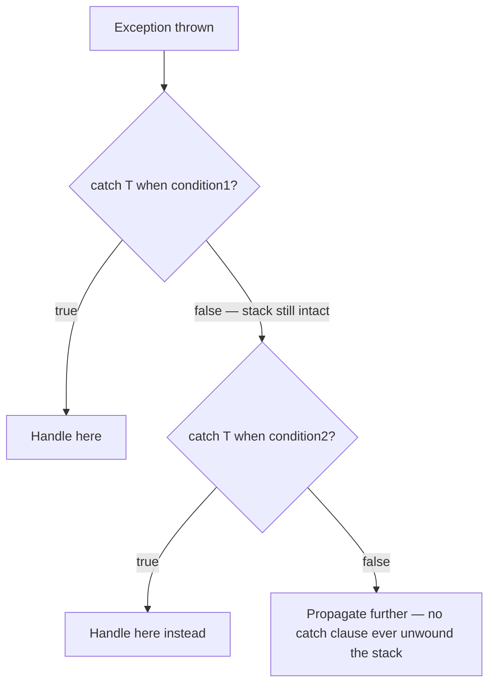
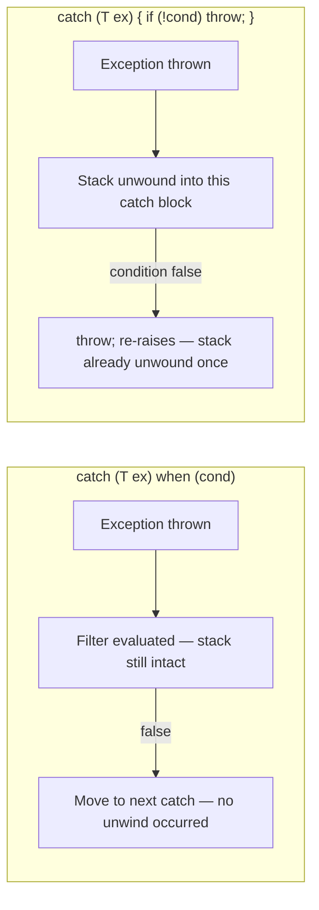

# Exception Filters (when clause)

## Introduction

Before reading this lesson, you should already be comfortable with **[Custom Exceptions](../05-exception-handling/05-04-custom-exceptions.md)** — deriving your own exception types and giving them properties like `StatusCode` or `AccountId` that carry structured, domain-specific context. Those properties are useful for more than just logging: they let you decide, at the exact moment an exception is caught, whether a particular `catch` block should even handle it at all. This lesson covers the `when` clause — a way to attach a runtime condition directly to a `catch` block, so it only matches when both the exception's type *and* some additional condition are true.

By the end of this lesson, you will be able to:

- Write a `catch (T ex) when (condition)` clause that matches conditionally, not just by exception type
- Explain how an exception filter differs from catching unconditionally and checking a condition inside the `catch` block
- Use multiple `catch` clauses for the same exception type, each filtered by a different condition
- Preserve the original stack trace by rethrowing with the bare `throw;` statement after logging
- Apply exception filters to distinguish a transient, retryable failure from a permanent one

## Exception Filters — A Layman's Perspective

Picture an airport security checkpoint during a busy travel day. Every passenger who sets off the metal detector gets flagged for the exact same reason — the alarm went off — but what happens next depends on more than just that one fact. A security officer glances at additional information in that instant, before the passenger is ever pulled aside: is this a routine alarm from a belt buckle, or does the passenger's boarding pass show they're flagged for additional screening for an unrelated reason? Is it the middle of a normal afternoon, or is the checkpoint currently operating under an elevated alert level that changes how even a routine alarm gets treated? The officer checks all of this on the spot, in the moment the alarm sounds, without the passenger having been pulled out of line yet. If none of the extra conditions apply, the passenger simply walks through, waved on as if the alarm had barely registered at all — nothing about their day was actually interrupted.

Now compare that to a much clumsier way the checkpoint could be run: pull every single passenger who sets off the alarm fully out of the line first, into a separate holding area, and only *then* start asking questions to figure out whether they actually needed to be pulled aside at all. By the time anyone gets around to checking the boarding pass or the current alert level, the passenger has already been removed from the queue, patted down, and had their bag opened — all before anyone determined whether any of that was actually warranted. If it turns out they didn't need any extra screening after all, they get sent back to rejoin the line, but the disruption already happened. Something was needlessly unwound that didn't need to be.

The airport's actual, well-run checkpoint process is the better model, and it depends entirely on being able to check the extra conditions *before* committing to pulling someone aside — evaluating everything relevant while the passenger is still standing right there in the ordinary flow of the line, and only actually diverting them if the checks come back positive. A checkpoint that can do this smoothly can also apply completely different follow-up procedures depending on exactly which condition triggered the extra scrutiny — one officer trained to handle boarding-pass flags, an entirely different response team on standby only for the rare case where the alert level itself is elevated — all without ever creating unnecessary disruption for the vast majority of passengers who trigger the alarm for a routine, harmless reason.

That is exactly what an exception filter gives you in C#. The `when` clause is the officer's on-the-spot check, evaluated while the "passenger" — the thrown exception — hasn't actually been pulled out of the normal flow of execution yet. If the condition doesn't hold, execution moves on exactly as if that `catch` block had never been considered at all, with nothing disrupted. And just like the checkpoint, you can stack up several differently filtered responses for the very same kind of alarm, each one handling a different condition without ever needlessly unwinding anything that didn't actually need it.

## Exception Filters — A Programming Language Perspective

A `catch (T ex) when (booleanExpression)` clause attaches a runtime condition to a `catch` block. The CLR evaluates that boolean expression *while the stack is still intact* — before the exception is considered "caught" by this clause at all — and only unwinds into the `catch` block's body if the expression evaluates to `true`. If it evaluates to `false`, the runtime behaves exactly as if this `catch` clause didn't match, moving on to the next `catch` clause (or propagating further up the call stack) with the stack still untouched. This differs meaningfully from writing `catch (T ex) { if (!condition) throw; ... }`, which unwinds the stack into the `catch` block *before* the condition is even checked, and which — unless the rethrow uses the bare `throw;` statement rather than `throw ex;` — can silently reset the exception's original stack trace to point at the rethrow site instead of where the exception actually originated. Introduced in C# 6 and unchanged since, exception filters remain a stable, current idiom in C# 14 — not a recent addition, but still the correct tool whenever a `catch` block's applicability depends on more than the exception's type alone.

## How to Write an Exception Filter in C#

Multiple `catch` clauses can target the exact same exception type, each guarded by a different `when` condition — the runtime checks them top to bottom, and the first one whose filter evaluates to `true` is the one that actually handles the exception.


*Figure 1: Each `when` condition is checked before the stack unwinds; a `false` filter leaves execution exactly as if that clause were never there.*

```csharp
// Program.cs — .NET 10 / C# 14

int[] statusCodes = [503, 400, 503];

foreach (int code in statusCodes)
{
    try
    {
        CallRemoteService(code);
    }
    catch (RemoteServiceException ex) when (ex.StatusCode >= 500)
    {
        Console.WriteLine($"Transient failure ({ex.StatusCode}): will retry. {ex.Message}");
    }
    catch (RemoteServiceException ex) when (ex.StatusCode < 500)
    {
        Console.WriteLine($"Permanent failure ({ex.StatusCode}): will not retry. {ex.Message}");
    }
}

static void CallRemoteService(int statusCode)
{
    throw new RemoteServiceException($"Remote call failed with status {statusCode}.", statusCode);
}

class RemoteServiceException(string message, int statusCode) : Exception(message)
{
    public int StatusCode { get; } = statusCode;
}
```

**Console Output:**

```text
Transient failure (503): will retry. Remote call failed with status 503.
Permanent failure (400): will not retry. Remote call failed with status 400.
Transient failure (503): will retry. Remote call failed with status 503.
```

Both `catch` clauses declare the exact same exception type, `RemoteServiceException` — what separates them is entirely the `when` condition. For status `503`, the first filter (`>= 500`) evaluates to `true` and that clause handles it; for status `400`, the first filter evaluates to `false`, so the runtime moves on to the second clause, whose filter (`< 500`) matches instead. No exception here is ever caught by the "wrong" clause, and no stack unwinding happens until a filter actually returns `true`.

## Real-Time Example: Exception Filters in E-Commerce Payment Processing

We continue building on the E-Commerce Order Processing domain, this time modeling a checkout's call to a payment gateway. `SubmitOrder` retries a transient gateway failure (status `503` and above) up to a configured limit, logging each retry through a helper function called directly from inside the filter expression — a well-known pattern that takes advantage of filters running without unwinding the stack. A permanent failure (status below `500`) is logged once and then rethrown with the bare `throw;` statement, preserving the original stack trace for whoever catches it further up the call chain.

```csharp
// Program.cs — .NET 10 / C# 14 — Real-Time Example

record Order(string OrderId, decimal Total);

class PaymentGatewayException(string message, int statusCode) : Exception(message)
{
    public int StatusCode { get; } = statusCode;
}

static void ChargeCard(Order order, int statusCode)
{
    if (statusCode != 200)
    {
        throw new PaymentGatewayException(
            $"Gateway rejected order {order.OrderId} with status {statusCode}.",
            statusCode);
    }

    Console.WriteLine($"  Payment captured for {order.OrderId}: {order.Total:C}");
}

static bool LogTransientFailure(PaymentGatewayException ex)
{
    Console.WriteLine($"  [Log] Transient gateway error logged: {ex.Message}");
    return true;
}

static void SubmitOrder(Order order, Queue<int> simulatedResponses, int maxRetries)
{
    int attempt = 0;

    while (true)
    {
        attempt++;
        int statusCode = simulatedResponses.Dequeue();

        try
        {
            ChargeCard(order, statusCode);
            return;
        }
        catch (PaymentGatewayException ex) when (ex.StatusCode >= 500 && attempt < maxRetries && LogTransientFailure(ex))
        {
            Console.WriteLine($"  Retrying order {order.OrderId} (attempt {attempt + 1} of {maxRetries})...");
        }
        catch (PaymentGatewayException ex)
        {
            Console.WriteLine($"  [Log] Giving up on order {order.OrderId}: {ex.Message}");
            throw; // preserves the original stack trace for the caller
        }
    }
}

Order order1 = new("ORD-9001", 129.99m);
Order order2 = new("ORD-9002", 59.00m);

Console.WriteLine($"Submitting {order1.OrderId} (two transient failures, then success)...");
SubmitOrder(order1, new Queue<int>([503, 503, 200]), maxRetries: 3);

Console.WriteLine();
Console.WriteLine($"Submitting {order2.OrderId} (permanent failure)...");
try
{
    SubmitOrder(order2, new Queue<int>([400]), maxRetries: 3);
}
catch (PaymentGatewayException ex)
{
    Console.WriteLine($"Checkout failed for {order2.OrderId}: {ex.Message}");
}
```

**Console Output:**

```text
Submitting ORD-9001 (two transient failures, then success)...
  [Log] Transient gateway error logged: Gateway rejected order ORD-9001 with status 503.
  Retrying order ORD-9001 (attempt 2 of 3)...
  [Log] Transient gateway error logged: Gateway rejected order ORD-9001 with status 503.
  Retrying order ORD-9001 (attempt 3 of 3)...
  Payment captured for ORD-9001: $129.99

Submitting ORD-9002 (permanent failure)...
  [Log] Giving up on order ORD-9002: Gateway rejected order ORD-9002 with status 400.
Checkout failed for ORD-9002: Gateway rejected order ORD-9002 with status 400.
```

For `ORD-9002`, the first filter's `ex.StatusCode >= 500` is `false` (status `400`), so `&&` short-circuits and `LogTransientFailure` is never even called — the runtime falls through to the unconditional second `catch`, logs the failure once, and rethrows with `throw;`. Because that's a bare rethrow rather than `throw ex;`, the exception that reaches the outer `catch` in the top-level code still carries its original stack trace, pointing back at `ChargeCard`, exactly where the failure actually happened — not at the `throw;` statement inside `SubmitOrder`. This is precisely the shape a production retry policy takes: keep retrying what's worth retrying, and hand off anything else with its diagnostic trail fully intact.

## Exception Filter vs Catch-Then-Rethrow

Both approaches can end up producing the same visible behavior — an exception either gets handled here or it doesn't — but they differ in when the stack actually unwinds and how easy it is to preserve the original trace by accident versus by careful discipline.


*Figure 2: A filter never unwinds the stack until it matches; catch-then-rethrow always unwinds first, then decides.*

| Aspect | `when` filter | Catch-then-check-then-rethrow |
|---|---|---|
| Stack state during the condition check | Untouched — the exception hasn't been "caught" yet | Already unwound into this `catch` block |
| Effect on the original stack trace if propagated | Fully preserved — the filter never actually caught it | Preserved only with a bare `throw;`, never with `throw ex;` |
| Multiple conditions on the same type | Several `catch (T ex) when (...)` clauses, cleanly separated | One `catch` block with nested `if`/`else if` logic |
| Side effects during evaluation | Possible, as with `LogTransientFailure` above, but worth using sparingly | Same logging reads as ordinary, conventionally placed statements |

## Types of Exception-Related Constructs Covered So Far

1. **[Inner Exceptions and Exception Wrapping](../05-exception-handling/05-06-inner-exceptions-and-wrapping.md)** — carrying an original exception forward as the `InnerException` of a new one.
2. **[Custom Exceptions](../05-exception-handling/05-04-custom-exceptions.md)** — the domain-specific properties, like `StatusCode` above, that exception filters so often key off of.
3. **[Global Exception Handling](../05-exception-handling/05-07-global-exception-handling.md)** — a single top-level safety net for whatever still escapes every filtered and unfiltered `catch` block.
4. **[Retry Patterns with Polly](../05-exception-handling/05-09-retry-patterns-with-polly.md)** — a production-grade retry library that formalizes the hand-rolled retry loop built in this lesson.
5. **[Logging Exceptions — Best Practices](../05-exception-handling/05-10-logging-exceptions-best-practices.md)** — how to log the kind of diagnostic detail this lesson's filters captured, without losing it.

## What You've Learned & What's Next

A `catch (T ex) when (condition)` clause matches conditionally, evaluating its condition while the stack is still intact, so a `false` filter leaves execution completely undisturbed and lets the next `catch` clause — or the caller — take over instead. Chaining several filtered clauses on the same exception type, as the payment-processing example did for transient versus permanent gateway failures, lets one exception type drive very different responses without ever unwinding the stack needlessly, and a bare `throw;` keeps the original failure's stack trace intact all the way to whoever ultimately handles it.

Continue your learning journey with **[Inner Exceptions and Exception Wrapping](../05-exception-handling/05-06-inner-exceptions-and-wrapping.md)**, where you'll learn how to catch a lower-level exception and wrap it inside a new, more meaningful one — without ever losing the original exception that caused it.

---
*Applies to: .NET 10 / C# 14. Last reviewed 2026-08-16.*
