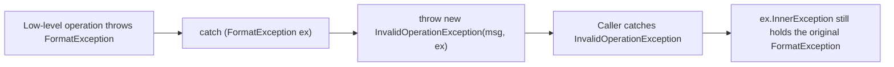
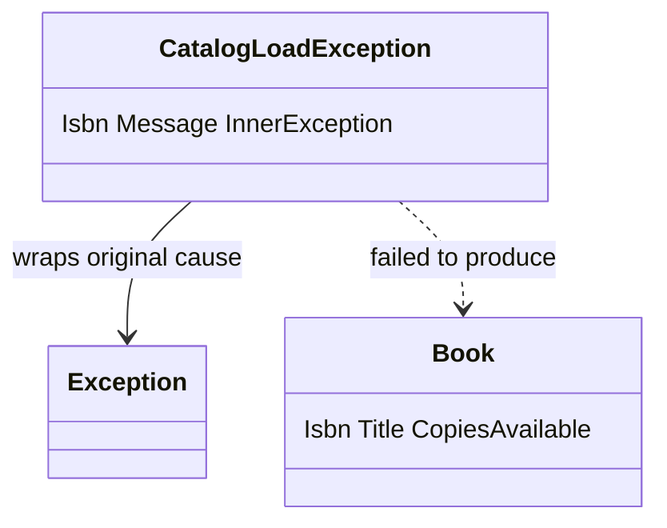
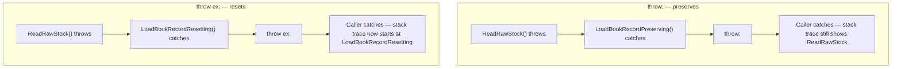

# Inner Exceptions and Exception Wrapping

## Introduction

Before reading this lesson, you should already be comfortable with **[Exception Filters (when clause)](../05-exception-handling/05-05-exception-filters-when-clause.md)** — narrowing which exceptions a `catch` block actually handles. This lesson builds on that foundation to introduce **inner exceptions and exception wrapping**: what to do once you've caught an exception and decided the caller needs to hear about the failure in different, more meaningful terms, without losing the original evidence of what actually went wrong underneath.

By the end of this lesson, you will be able to:

- Explain what the `InnerException` property is and why every `Exception` type exposes it
- Wrap a low-level exception inside a higher-level, domain-specific exception without discarding the original
- Read a wrapped exception chain back out at the catch site, including the original exception's type and message
- Explain, precisely, the difference between `throw;` and `throw ex;` inside a `catch` block
- Identify why `throw ex;` is a classic mistake that quietly destroys diagnostic information
- Continue a resilient batch-processing loop that wraps and reports failures without aborting the whole operation

## Inner Exceptions and Exception Wrapping — A Layman's Perspective

Picture a patient who visits a family doctor with a nagging pain. The doctor examines the patient, runs a few basic tests, and forms an initial impression — but the case turns out to be complicated enough that it needs a specialist. So the family doctor writes a referral letter. That letter isn't a blank slate that ignores everything already discovered. It restates the problem in the specialist's language — "suspected issue with the left knee, limited range of motion, pain on exertion" — while stapling the original test results, the doctor's raw notes, and the patient's exact original complaint to the back of the letter. Nothing from the first visit is thrown away; it's carried forward, wrapped inside a new summary aimed at whoever reads it next.

Now suppose the specialist, after their own examination, needs to refer the patient onward again — this time to a surgeon. A conscientious specialist does exactly the same thing: writes a new letter in surgical language, and staples the family doctor's letter — test results and all — underneath it. By the time the surgeon opens the folder, three layers are visible: the specialist's summary on top, the family doctor's referral beneath that, and the very first raw test results at the bottom. Anyone in that chain can flip all the way back down to page one and see exactly how the case started, no matter how many times it was reframed and handed onward.

Now imagine a sloppier version of the same story. A rushed office, instead of stapling the old paperwork to a new referral, throws it away every time and writes a fresh letter as though the patient had just walked in for the first time — no history, no original complaint, nothing about the earlier tests. To anyone reading that folder later, the case appears to have started at whichever office happened to write the most recent letter. The actual origin — the very first symptom described in the very first waiting room — is gone forever, and nobody downstream can reconstruct it.

That difference is exactly what's at stake in the two habits this lesson covers. A well-wrapped, higher-level explanation of a problem should always carry the original, lower-level explanation along with it — never replace it. And when a piece of paperwork simply needs to be passed further up the chain unchanged, it should travel exactly as it arrived, stamped with its full history intact, rather than being quietly rewritten as if it had just now come into being at the point where someone happened to be holding it.

In code, the referral letter is a new exception, the stapled original notes are its `InnerException`, and passing the paperwork onward unchanged versus silently rewriting it corresponds to `throw;` versus `throw ex;`.

## Inner Exceptions and Exception Wrapping — A Programming Language Perspective

Every type derived from `System.Exception` exposes a read-only `InnerException` property, populated through a constructor overload — `Exception(string message, Exception? innerException)` — that most built-in and custom exception types expose. When a lower-level operation fails, catching it and throwing a new, higher-level exception with the original passed as `innerException` produces a *wrapped* exception: the new exception describes the failure in terms meaningful to its caller, while `InnerException` retains the original exception object — its type, its message, and its stack trace — completely intact. Custom exception classes typically add a constructor that forwards to `base(message, innerException)`, exactly as `Exception` itself does.

Separately, C# offers two ways to rethrow inside a `catch` block: the no-operand `throw;` statement, which rethrows the currently-caught exception while preserving its existing stack trace; and `throw ex;`, which throws the same exception object but resets its stack trace to begin at the `throw ex;` statement itself, discarding everything below that point. Both compile without error and both technically "work" — the difference only becomes visible when something later inspects the stack trace to diagnose where the failure actually originated.

## How to Wrap Exceptions Using InnerException in C#

Wrapping is just a `try`/`catch` followed by `throw new` — except the exception you throw takes the original as a second constructor argument instead of letting it disappear. The pattern applies whether the original exception is a built-in type like `FormatException` or a custom type from lower in your own code. The example below wraps a parsing failure inside a higher-level `InvalidOperationException`, then reads `InnerException` back out at the catch site above it to prove nothing was lost in translation.


*Figure 1: Wrapping catches the original exception and hands it to the new exception's constructor instead of discarding it.*

```csharp
// Program.cs — .NET 10 / C# 14

static int ParseQuantity(string rawValue)
{
    if (!int.TryParse(rawValue, out int quantity))
    {
        throw new FormatException($"'{rawValue}' is not a valid integer quantity.");
    }

    return quantity;
}

try
{
    try
    {
        int quantity = ParseQuantity("twelve");
        Console.WriteLine($"Quantity: {quantity}");
    }
    catch (FormatException ex)
    {
        throw new InvalidOperationException("Could not load the requested quantity from configuration.", ex);
    }
}
catch (InvalidOperationException ex)
{
    Console.WriteLine($"Caught: {ex.Message}");
    Console.WriteLine($"Inner exception type: {ex.InnerException?.GetType().Name}");
    Console.WriteLine($"Inner exception message: {ex.InnerException?.Message}");
}
```

**Console Output:**

```text
Caught: Could not load the requested quantity from configuration.
Inner exception type: FormatException
Inner exception message: 'twelve' is not a valid integer quantity.
```

The outer `catch` never sees `"twelve"` directly — it only sees the wrapped `InvalidOperationException` and its configuration-flavored message. But because the original `FormatException` was passed in as `innerException`, nothing about the original failure was lost: its exact type and message are still one property access away, through `ex.InnerException`.

## Real-Time Example: Wrapping Exceptions in a Library Catalog Loader

We continue building on the Library/Inventory Management case study, loading raw catalog records into `Book` objects. Some records are malformed — a non-numeric copies count, a negative copies count — and rather than letting the whole catalog load crash on the first bad row, each failure is wrapped in a custom `CatalogLoadException` that records which ISBN failed and why, while still preserving the original low-level exception underneath.


*Figure 2: `CatalogLoadException` wraps whatever low-level exception broke a given book record, tagged with that record's ISBN.*

```csharp
// Program.cs — .NET 10 / C# 14 — Real-Time Example

List<string> rawCatalogLines =
[
    "978-0-13-468599-1|Clean Code|5",
    "978-0-596-00712-6|Refactoring|-3",
    "978-1-59327-584-6|Eloquent JavaScript|2",
    "978-0-13-235088-4|Effective Java|abc",
];

List<Book> loadedBooks = [];
int failedCount = 0;

foreach (string line in rawCatalogLines)
{
    try
    {
        Book book = LoadBookRecord(line);
        loadedBooks.Add(book);
        Console.WriteLine($"Loaded: {book.Title} ({book.CopiesAvailable} copies)");
    }
    catch (CatalogLoadException ex)
    {
        failedCount++;
        Console.WriteLine($"Failed to load ISBN {ex.Isbn}: {ex.Message}");
        Console.WriteLine($"  Caused by: {ex.InnerException?.GetType().Name} — {ex.InnerException?.Message}");
    }
}

Console.WriteLine();
Console.WriteLine($"Catalog load complete: {loadedBooks.Count} succeeded, {failedCount} failed.");

static Book LoadBookRecord(string rawLine)
{
    string[] parts = rawLine.Split('|');
    string isbn = parts[0];
    string title = parts[1];

    try
    {
        int copies = ParseCopies(parts[2]);
        return new Book(isbn, title, copies);
    }
    catch (Exception ex) when (ex is FormatException or ArgumentOutOfRangeException)
    {
        throw new CatalogLoadException(
            isbn,
            $"Book record for '{title}' could not be loaded into the catalog.",
            ex);
    }
}

static int ParseCopies(string rawCopies)
{
    if (!int.TryParse(rawCopies, out int copies))
    {
        throw new FormatException($"'{rawCopies}' is not a valid copies count.");
    }

    if (copies < 0)
    {
        throw new ArgumentOutOfRangeException(nameof(rawCopies), $"Copies available ({copies}) cannot be negative.");
    }

    return copies;
}

record Book(string Isbn, string Title, int CopiesAvailable);

class CatalogLoadException : Exception
{
    public string Isbn { get; }

    public CatalogLoadException(string isbn, string message, Exception innerException)
        : base(message, innerException)
    {
        Isbn = isbn;
    }
}
```

**Console Output:**

```text
Loaded: Clean Code (5 copies)
Failed to load ISBN 978-0-596-00712-6: Book record for 'Refactoring' could not be loaded into the catalog.
  Caused by: ArgumentOutOfRangeException — Copies available (-3) cannot be negative. (Parameter 'rawCopies')
Loaded: Eloquent JavaScript (2 copies)
Failed to load ISBN 978-0-13-235088-4: Book record for 'Effective Java' could not be loaded into the catalog.
  Caused by: FormatException — 'abc' is not a valid copies count.

Catalog load complete: 2 succeeded, 2 failed.
```

Notice the exception filter from the previous lesson doing real work here: `catch (Exception ex) when (ex is FormatException or ArgumentOutOfRangeException)` only wraps the two low-level failure types this loader knows how to explain, letting anything genuinely unexpected propagate unwrapped. And because `CatalogLoadException` carries both an `Isbn` and an `InnerException`, the loop above can report a precise, actionable failure per record — which ISBN, why, and what the original underlying problem was — while still finishing the batch instead of aborting on the first bad row.

## throw; vs throw ex; — Preserving vs Resetting the Stack Trace

The single most common mistake when rethrowing inside a `catch` block is typing `throw ex;` instead of `throw;`. Both statements compile. Both rethrow the same exception object down to the caller. The difference only shows up when someone actually needs the stack trace to find out where the problem started — and by then, with `throw ex;`, that information is already gone.

`throw;` rethrows the exception exactly as it was caught, stack trace and all, so every frame between the original failure and wherever it's eventually handled remains visible. `throw ex;` throws the same object, but .NET treats it as a brand-new throw *from that statement*, overwriting the stack trace so it looks as though the exception originated at the `throw ex;` line — erasing every frame below it, including the method where the failure actually happened. Static analysis rules like CA2200 exist specifically to flag `throw ex;` for this reason.


*Figure 3: `throw;` keeps the full trail back to the original failure; `throw ex;` truncates it at the rethrow point.*

```csharp
// Program.cs — .NET 10 / C# 14 — throw; vs throw ex;

internal static class Program
{
    private static void Main()
    {
        Console.WriteLine("--- Using throw; (preserves original stack trace) ---");
        try
        {
            LoadBookRecordPreserving();
        }
        catch (InvalidOperationException ex)
        {
            bool tracePreserved = ex.StackTrace?.Contains("ReadRawStock") ?? false;
            Console.WriteLine($"Stack trace still mentions ReadRawStock: {tracePreserved}");
        }

        Console.WriteLine();
        Console.WriteLine("--- Using throw ex; (resets the stack trace) ---");
        try
        {
            LoadBookRecordResetting();
        }
        catch (InvalidOperationException ex)
        {
            bool tracePreserved = ex.StackTrace?.Contains("ReadRawStock") ?? false;
            Console.WriteLine($"Stack trace still mentions ReadRawStock: {tracePreserved}");
        }
    }

    private static void ReadRawStock()
    {
        throw new InvalidOperationException("Raw stock file is corrupted.");
    }

    private static void LoadBookRecordPreserving()
    {
        try
        {
            ReadRawStock();
        }
        catch (InvalidOperationException)
        {
            throw; // preserves the original stack trace, including ReadRawStock
        }
    }

    private static void LoadBookRecordResetting()
    {
        try
        {
            ReadRawStock();
        }
        catch (InvalidOperationException ex)
        {
            throw ex; // resets the stack trace to start here
        }
    }
}
```

**Console Output:**

```text
--- Using throw; (preserves original stack trace) ---
Stack trace still mentions ReadRawStock: True

--- Using throw ex; (resets the stack trace) ---
Stack trace still mentions ReadRawStock: False
```

| Aspect | `throw;` | `throw ex;` |
|---|---|---|
| Exception object | Same instance rethrown | Same instance rethrown |
| Stack trace | Preserved — includes every frame down to the original throw | Reset — starts at the `throw ex;` statement |
| Where the failure appears to originate | The true original location | The rethrow location (misleading) |
| Static analysis | No warning | Flagged by analyzers such as CA2200 |
| When to use | Almost always, when simply propagating a caught exception | Essentially never intentionally |

## Types of Exception Wrapping Patterns in C#

Several related techniques build on the same `InnerException` mechanism this lesson introduced:

1. **Wrapping with a custom exception type** — attaching a domain-specific exception, such as `CatalogLoadException`, around a lower-level one via the `innerException` constructor parameter.
2. **Wrapping with a built-in exception type** — reusing `InvalidOperationException` or a similar general-purpose type as the wrapper when a dedicated custom class isn't warranted.
3. **`AggregateException`** — .NET's built-in wrapper for *multiple* inner exceptions at once, most often seen when several awaited `Task` instances fail together.
4. **Preserving vs resetting the stack trace** — the `throw;` vs `throw ex;` contrast covered above, and the single most common mistake made when rethrowing.
5. **[Exception Filters (when clause)](../05-exception-handling/05-05-exception-filters-when-clause.md)** — often combined with wrapping, as in this lesson's `when (ex is FormatException or ArgumentOutOfRangeException)` filter.
6. **[Global Exception Handling](../05-exception-handling/05-07-global-exception-handling.md)** — what happens when a wrapped exception is never caught by anything at all.

## What You've Learned & What's Next

A well-wrapped exception never throws away the original failure — it carries it forward in `InnerException`, exactly like a referral letter carrying the original test results underneath a new summary. And rethrowing with `throw;` keeps that entire trail intact, while `throw ex;` quietly severs it at the point of rethrow — a difference invisible until someone actually needs the stack trace to find where things really went wrong.

Continue your learning journey with **[Global Exception Handling](../05-exception-handling/05-07-global-exception-handling.md)**, where we cover the top-level safety nets — `AppDomain.UnhandledException`, `TaskScheduler.UnobservedTaskException`, and ASP.NET Core's exception-handling middleware — that catch whatever a local `try`/`catch` never got the chance to.

---
*Applies to: .NET 10 / C# 14. Last reviewed 2026-08-16.*
