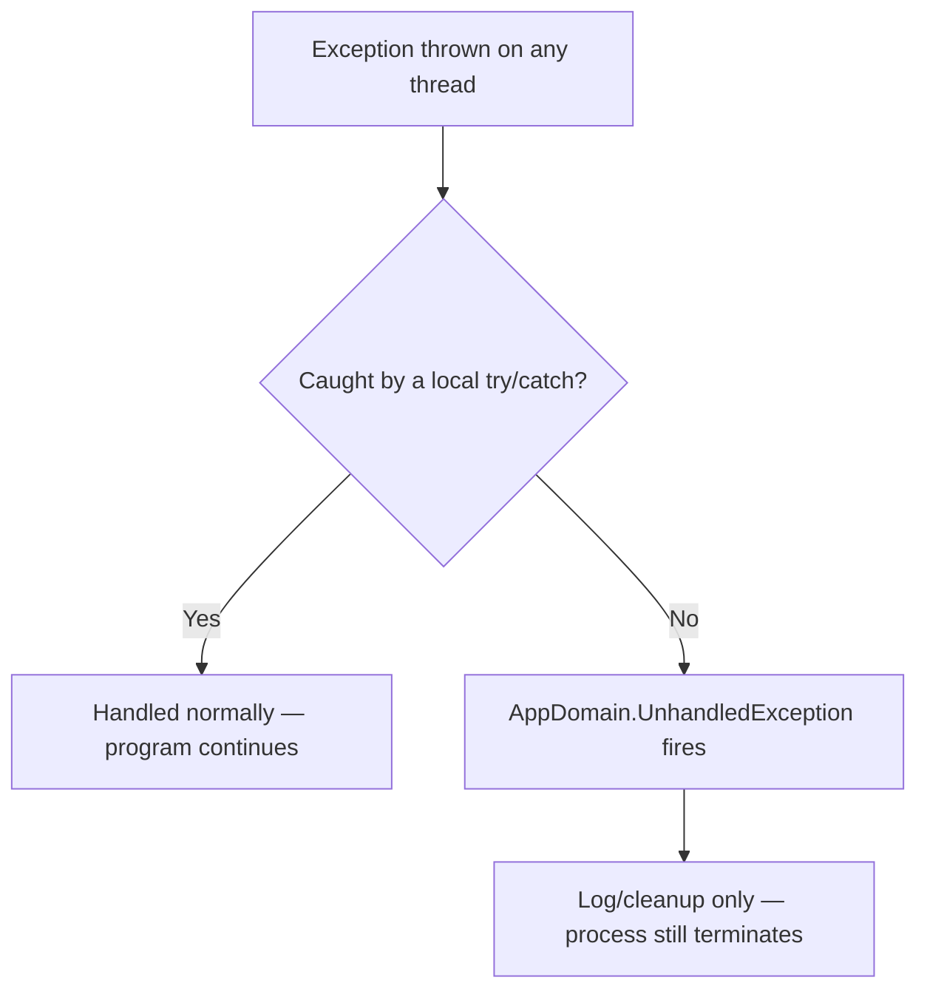
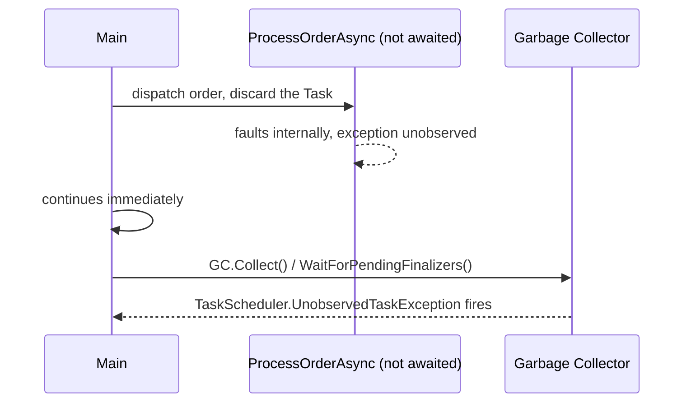
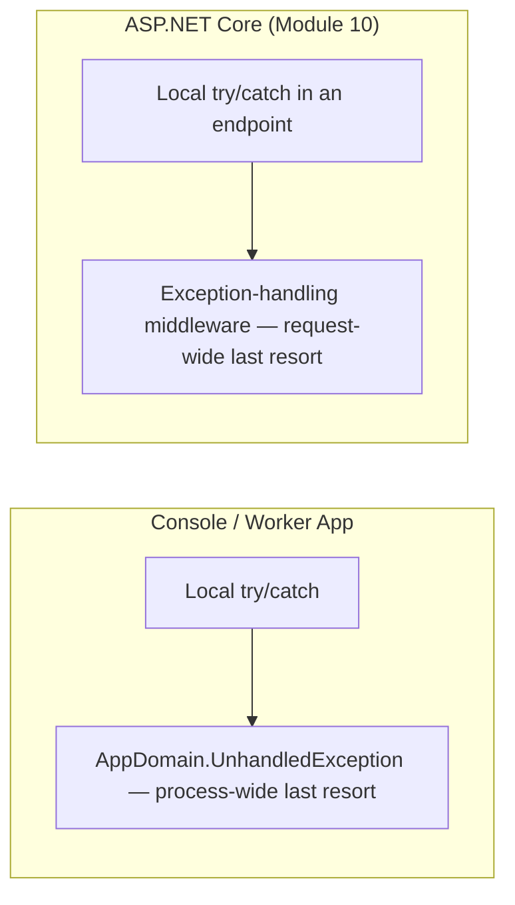

# Global Exception Handling

## Introduction

Before reading this lesson, you should already be comfortable with **[Inner Exceptions and Exception Wrapping](../05-exception-handling/05-06-inner-exceptions-and-wrapping.md)** — catching a failure locally and re-describing it without losing the original cause. This lesson steps back and asks a different question: what happens when *nothing* local catches the exception at all? Every application needs a last line of defense for exactly that case, and this lesson introduces the two most important ones in plain .NET, plus their web-application equivalent.

By the end of this lesson, you will be able to:

- Explain why global exception handlers exist as a last resort, not a substitute for local `try`/`catch`
- Subscribe to `AppDomain.CurrentDomain.UnhandledException` to observe and log a crash before the process exits
- Explain why fire-and-forget `Task`s can silently swallow exceptions, and how `TaskScheduler.UnobservedTaskException` surfaces them
- Distinguish a global handler's role (logging, cleanup) from a local handler's role (recovery, continuation)
- Describe, at a conceptual level, how ASP.NET Core's exception-handling middleware plays the same role for web requests
- Apply a global handler to a background order-processing worker in an E-Commerce Order Processing system

## Global Exception Handling — A Layman's Perspective

Most problems in an office get solved right where they happen. A printer jams, and the person standing next to it clears the jam and gets back to work — nobody needs to alert the whole building. That's the everyday case: a problem is caught, handled, and life continues normally.

But a well-run building also keeps a second, very different system running in the background: a network of smoke detectors wired straight to a central control panel in the security office. Those detectors have no idea what specifically went wrong — a candle left burning, a wiring fault, a kitchen fire — they only know that something has crossed a threshold serious enough that the ordinary, local response clearly isn't happening. When one trips, the control panel doesn't try to figure out how to keep the workday going. It records exactly which detector triggered, sounds the alarm, and starts the evacuation, because by the time a smoke detector fires, the assumption is that the building can no longer be trusted to keep operating safely. The alarm's whole job is to make sure the emergency gets logged and someone finds out about it — not to save the meeting that was happening in that room.

There's a second, quieter kind of failure a good building also has to plan for: not a fire, but a lost delivery. A courier is sent out with a package, and nobody is specifically waiting by the door to confirm it arrived — the sender assumed it would get there and moved on to other work. If that package genuinely goes missing, nobody notices in the moment; there's no urgent alarm, because nobody was watching closely enough to be alarmed. The failure would go completely unnoticed forever, except that the warehouse eventually does an inventory sweep — and during that sweep, any package that was dispatched, never confirmed delivered, and never followed up on gets flagged and reported, often much later, and often as a surprise to whoever sent it in the first place.

Both of these are safety nets, not fixes. The fire alarm doesn't unjam the printer, and the inventory sweep doesn't retroactively deliver the lost package — by the time either one fires, the moment to quietly resolve the problem the normal way has already passed. What both systems buy you is something almost as valuable: a guarantee that the failure gets *recorded*, even when nobody was standing close enough to catch it as it happened.

That's exactly the role these two mechanisms play in a running .NET application: one is the process-wide fire alarm for anything that slips past every local `try`/`catch`, and the other is the inventory sweep that eventually flags work that was dispatched and forgotten.

## Global Exception Handling — A Programming Language Perspective

`AppDomain.CurrentDomain.UnhandledException` is an event the .NET runtime raises on any thread when an exception propagates all the way to the top of that thread's call stack without being caught anywhere. Its handler receives the exception (as an `object`, cast back to `Exception`) and an `IsTerminating` flag — almost always `true`, because for most unhandled exceptions the CLR terminates the process immediately afterward. The handler cannot cancel that termination; its only real purpose is to log or flush state in the narrow window before the process ends.

`TaskScheduler.UnobservedTaskException` addresses a different gap: a `Task` that faults but whose exception nobody ever inspects — via `await`, `.Result`, `.Exception`, or a continuation checking `IsFaulted` — because the task was launched "fire-and-forget" and never awaited. Rather than vanishing silently, that exception surfaces once the `Task` object is garbage collected, wrapped in an `AggregateException`. Calling `e.SetObserved()` inside the handler acknowledges it. Unlike older .NET Framework defaults, unobserved task exceptions no longer crash the process by default in modern .NET — but the event still exists specifically so they don't disappear without a trace.

## How to Subscribe to Global Exception Handlers in C#

A global handler is not something you call — it's something you subscribe to once, early in the application's lifetime, and then hope you rarely see fire. `AppDomain.CurrentDomain.UnhandledException` is the broadest of these nets: it fires for an exception unhandled on *any* thread, main or background, and by the time it fires the process is already on its way out. The example below deliberately throws on a background thread — outside any `try`/`catch` — specifically to demonstrate that the handler runs, logs what it can, and the process still terminates afterward. That last part is the entire point: a global handler exists for observability, not recovery.


*Figure 1: A global handler only ever sees exceptions that escaped every local `try`/`catch` — and it cannot prevent what happens next.*

```csharp
// Program.cs — .NET 10 / C# 14

AppDomain.CurrentDomain.UnhandledException += (sender, e) =>
{
    var exception = (Exception)e.ExceptionObject;
    Console.WriteLine($"[Global Handler] Unhandled exception: {exception.GetType().Name} — {exception.Message}");
    Console.WriteLine($"[Global Handler] Is terminating: {e.IsTerminating}");
};

Console.WriteLine("Background worker starting...");

Thread worker = new(() =>
{
    Console.WriteLine("Worker thread running...");
    throw new InvalidOperationException("Order queue connection lost.");
});

worker.Start();
worker.Join();

Console.WriteLine("This line never runs — the process has already terminated.");
```

**Console Output:**

```text
Background worker starting...
Worker thread running...
[Global Handler] Unhandled exception: InvalidOperationException — Order queue connection lost.
[Global Handler] Is terminating: True
```

The final `Console.WriteLine` in the source never executes — the process exits as soon as the handler returns. That's the defining trait of `AppDomain.UnhandledException`: it is a notification, not an interception point. It cannot swallow the exception, resume the worker thread, or keep the application alive; all it can do is make sure the failure was observed and recorded on the way out.

## Real-Time Example: A Fire-and-Forget Order Processor in E-Commerce Order Processing

We extend the E-Commerce Order Processing case study with a background dispatch loop that processes a batch of orders without awaiting each one individually — a common, risky pattern sometimes called "fire-and-forget." When one order's processing faults and nobody ever checks on it, the failure would normally vanish. Subscribing to `TaskScheduler.UnobservedTaskException` ensures it surfaces instead.


*Figure 2: Nobody awaits the faulted order's `Task`, so its exception only surfaces once the runtime finalizes it.*

```csharp
// Program.cs — .NET 10 / C# 14 — Real-Time Example

TaskScheduler.UnobservedTaskException += (sender, e) =>
{
    Console.WriteLine($"[UnobservedTaskException] {e.Exception.InnerException?.GetType().Name}: {e.Exception.InnerException?.Message}");
    e.SetObserved();
};

List<Order> pendingOrders =
[
    new Order("ORD-9001", 149.99m),
    new Order("ORD-9002", -25.00m), // invalid — negative total
    new Order("ORD-9003", 79.50m),
];

Console.WriteLine("Dispatching orders for background processing...");

foreach (Order order in pendingOrders)
{
    // Fire-and-forget: intentionally not awaited, to demonstrate why this is risky.
    _ = ProcessOrderAsync(order);
}

Console.WriteLine("Dispatch loop complete. Forcing cleanup to reveal any unobserved failures...");

// GC.Collect() is never something you'd call in production code; it's used here only
// to make the timing of an otherwise unpredictable finalizer deterministic for this demo.
GC.Collect();
GC.WaitForPendingFinalizers();

Console.WriteLine("Done.");

static Task ProcessOrderAsync(Order order)
{
    if (order.Total < 0)
    {
        return Task.FromException(
            new InvalidOperationException($"Order {order.OrderId} has an invalid negative total."));
    }

    Console.WriteLine($"Processed {order.OrderId}: {order.Total:C}");
    return Task.CompletedTask;
}

record Order(string OrderId, decimal Total);
```

**Console Output:**

```text
Dispatching orders for background processing...
Processed ORD-9001: $149.99
Processed ORD-9003: $79.50
Dispatch loop complete. Forcing cleanup to reveal any unobserved failures...
[UnobservedTaskException] InvalidOperationException: Order ORD-9002 has an invalid negative total.
Done.
```

`ORD-9002`'s failure produces no output at all when it happens — the faulted `Task` is simply discarded by `_ =`, and the dispatch loop marches on to `ORD-9003` without missing a beat. Only once the runtime cleans up that abandoned `Task` object does `TaskScheduler.UnobservedTaskException` fire and reveal what actually went wrong. In a real system, this is exactly the class of bug that produces a "missing order" support ticket days later with no error logged anywhere near the moment it actually failed — which is precisely why fire-and-forget dispatch, if used at all, should always be paired with this handler.

## Local try/catch vs Global Exception Handlers

A local `try`/`catch` is a targeted decision: you know, at that specific call site, which failures are plausible, and you write code to recover from them — retry a query, substitute a default, ask the user to try again — and the program continues exactly where it left off. A global handler has none of that context. It doesn't know which operation failed or why, only that *something*, somewhere, was never caught. It cannot resume the code that failed; all it can do is observe, log, and — for `AppDomain.UnhandledException` — watch the process end anyway.

This is also where ASP.NET Core enters the picture, ahead of Module 10. A web application has the same problem at a different layer: an unhandled exception thrown while processing one HTTP request shouldn't crash the entire server process and take down every other in-flight request with it. ASP.NET Core's exception-handling middleware (`UseExceptionHandler`, and the newer `IExceptionHandler` interface) plays exactly the "global handler" role described in this lesson, scoped to a single request instead of the whole process: it catches whatever no controller action or minimal API handler caught, logs it, and turns it into a clean error response — without local `try`/`catch` blocks needing to exist in every single endpoint.


*Figure 3: The same "local vs global" shape repeats at the web layer — only the boundary changes, from the whole process to a single request.*

| Aspect | Local `try`/`catch` | Global exception handler |
|---|---|---|
| Scope | One specific operation | Entire process (or, in ASP.NET Core, one request) |
| Can recover and continue normally | Yes | No — logging/cleanup only |
| Typical use | Expected, recoverable failures | Last-resort diagnostics before a crash or a clean error response |
| Console/worker example | `catch (InvalidOperationException ex)` around one order | `AppDomain.UnhandledException`, `TaskScheduler.UnobservedTaskException` |
| Web equivalent (Module 10) | `try`/`catch` inside a minimal API handler | `UseExceptionHandler` / `IExceptionHandler` middleware |

## Types of Global Exception Handling Mechanisms in .NET

Several mechanisms cover this "top-level safety net" role, depending on the kind of application:

1. **`AppDomain.UnhandledException`** — the process-wide, last-resort notification for any exception unhandled on any thread; it cannot prevent termination.
2. **`TaskScheduler.UnobservedTaskException`** — fires when a faulted `Task`'s exception was never observed before finalization; call `SetObserved()` to acknowledge it.
3. **ASP.NET Core exception-handling middleware (`UseExceptionHandler`, `IExceptionHandler`)** — the request-scoped equivalent, covered in depth in Module 10.
4. **UI-framework global handlers (`Application.ThreadException` in WinForms, `DispatcherUnhandledException` in WPF)** — the same concept, scoped to a UI thread instead of a whole process.
5. **[Inner Exceptions and Exception Wrapping](../05-exception-handling/05-06-inner-exceptions-and-wrapping.md)** — global handlers most often just log the fully wrapped exception chain this lesson's prerequisite builds.
6. **[Exceptions vs the Result Pattern](../05-exception-handling/05-08-exceptions-vs-result-pattern.md)** — a reason to keep expected failures out of this safety net entirely.

## What You've Learned & What's Next

`AppDomain.UnhandledException` and `TaskScheduler.UnobservedTaskException` are process-wide safety nets, not substitutes for local `try`/`catch` — like a fire alarm, they exist to guarantee a failure gets recorded once every ordinary, local response has already failed to happen, not to keep the workday going. The same shape reappears in ASP.NET Core's exception-handling middleware, scoped to a single request instead of the whole process.

Continue your learning journey with **[Exceptions vs the Result Pattern](../05-exception-handling/05-08-exceptions-vs-result-pattern.md)**, where we cover a question this lesson raises but doesn't answer: if global handlers are only for the truly unexpected, what should you use instead for failures — like "insufficient funds" — that are actually a normal, expected part of your domain?

---
*Applies to: .NET 10 / C# 14. Last reviewed 2026-08-16.*
