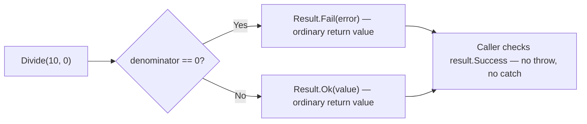
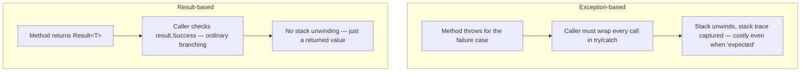

# Exceptions vs the Result Pattern

## Introduction

Before reading this lesson, you should already be comfortable with **[Global Exception Handling](../05-exception-handling/05-07-global-exception-handling.md)** — the idea that exceptions ultimately funnel toward a last-resort, process-wide safety net when nothing local catches them. That raises a question this lesson answers directly: if exceptions are meant to be relatively rare, escalating events, should a completely ordinary, everyday outcome — like a customer trying to withdraw more money than they have — really be modeled as one?

By the end of this lesson, you will be able to:

- Distinguish a truly exceptional, unexpected condition from an expected, everyday failure path
- Explain why routing expected failures through exceptions hurts both performance and readability
- Define and use a simple `Result<T>` record type as an alternative to throwing
- Refactor an exception-throwing method into one that returns a `Result<T>`
- Decide, for a given failure, whether an exception or a `Result<T>` is the better fit
- Apply the Result pattern to a Banking/ATM withdrawal flow, alongside a case that still genuinely warrants an exception

## Exceptions vs the Result Pattern — A Layman's Perspective

Picture a bank teller window. A customer walks up and asks to withdraw $500. There are exactly two completely ordinary answers to that request: "here you go" or "I'm sorry, you don't have enough in your account for that." Neither answer is remarkable. The teller doesn't gasp, doesn't call a manager over, doesn't fill out an incident report. "Insufficient funds" is simply one of the two everyday responses to an everyday question, and the customer's everyday response to hearing it is to ask for a smaller amount, or come back another day. Nothing about the situation was unexpected — it's baked into what a withdrawal request even is.

Now picture something genuinely different: halfway through the transaction, the wall behind the teller's counter, which happens to back onto the vault, visibly cracks and starts to give way. That is not one of the two ordinary answers to "can I withdraw $500?" — it's an entirely different category of event, one nobody designed the withdrawal process around, and one that demands the building's actual alarm system: security called, the branch evacuated, an incident logged, the regional office notified. Nobody would seriously suggest handling a structural failure with the same shrug used for "insufficient funds," and just as few people would suggest evacuating the entire branch every single time a customer tries to overdraw their account.

That second idea sounds absurd precisely because it is — and yet it's exactly what happens when a piece of software decides that an entirely ordinary "no, you don't have enough" answer deserves the same emergency-alarm treatment as a genuinely unexpected event. If every declined withdrawal in a banking system triggers the equivalent of the vault-alarm response — expensive to raise, expensive to respond to, and demanding everyone downstream drop what they're doing to handle it — the real emergencies get buried under a flood of routine, everyday "no"s that never should have been treated as emergencies in the first place. A good design keeps the two clearly separate: the teller has a completely ordinary way of saying "insufficient funds" that requires no alarm at all, and a completely separate, much louder mechanism reserved for the day the wall actually cracks.

That separation — an ordinary answer for an ordinary "no," and a loud, rare alarm for something the process was never designed to expect — is exactly the choice this lesson asks you to make deliberately in code, instead of reaching for the same mechanism for both.

## Exceptions vs the Result Pattern — A Programming Language Perspective

Throwing and catching a `System.Exception` is relatively expensive: the runtime captures a stack trace, unwinds the call stack looking for a matching `catch`, and — per long-standing .NET framework design guidance — exceptions are meant to represent conditions the caller "usually can't anticipate or reasonably guard against," not routine branches of normal business logic. Using them for an everyday outcome like "insufficient funds" means paying that cost, and forcing every caller to wrap ordinary business logic in `try`/`catch`, for something that isn't actually exceptional at all.

The alternative growing more common across modern .NET code is a `Result<T>`-style type: typically a small `record`, such as `Result<T>(bool Success, T? Value, string? Error)`, returned from a method instead of thrown. The caller inspects `Success` and branches accordingly — no stack unwinding, no `catch` block, just an ordinary conditional on an ordinary return value. C# has no built-in discriminated union as of C# 14, so `Result<T>` is typically hand-rolled exactly like the type in this lesson, or adopted from a community library; either way, the failure becomes part of the method's declared return type rather than an invisible, out-of-band control-flow jump.

## How to Define and Use a Result&lt;T&gt; Type in C#

A `Result<T>` needs to answer three questions for its caller: did it succeed, what's the value if it did, and what went wrong if it didn't. A record with two static factory methods — `Ok` and `Fail` — captures all three without any inheritance hierarchy or exception type at all.


*Figure 1: A `Result<T>`-returning method never throws for its expected failure case — the caller branches on an ordinary boolean instead.*

```csharp
// Program.cs — .NET 10 / C# 14

Result<int> first = Divide(10, 2);
Result<int> second = Divide(10, 0);

PrintResult(first);
PrintResult(second);

static Result<int> Divide(int numerator, int denominator)
{
    if (denominator == 0)
    {
        return Result<int>.Fail("Cannot divide by zero.");
    }

    return Result<int>.Ok(numerator / denominator);
}

static void PrintResult(Result<int> result)
{
    if (result.Success)
    {
        Console.WriteLine($"Success: {result.Value}");
    }
    else
    {
        Console.WriteLine($"Failure: {result.Error}");
    }
}

record Result<T>(bool Success, T? Value, string? Error)
{
    public static Result<T> Ok(T value) => new(true, value, null);
    public static Result<T> Fail(string error) => new(false, default, error);
}
```

**Console Output:**

```text
Success: 5
Failure: Cannot divide by zero.
```

Nothing in this program ever throws. `Divide(10, 0)` runs to completion just like `Divide(10, 2)` does — the only difference is which factory method built the `Result<int>` it returned. `PrintResult` doesn't need a `try`/`catch` at all; it just reads `Success` the same way it would read any other property.

## Real-Time Example: Withdrawals in a Banking/ATM System

We build a `BankAccount` for the Banking/ATM case study whose `Withdraw` method returns a `Result<decimal>` instead of throwing for the everyday cases — a non-positive amount, or a request larger than the balance — while a separate method, `ApplyLedgerAdjustment`, still throws, because the condition it guards against (a ledger update that would drive the balance mathematically negative through a path that should be impossible) is not a normal customer scenario at all — it's a sign of a bug.

```csharp
// Program.cs — .NET 10 / C# 14 — Real-Time Example

BankAccount account = new("ACC-3301", 300.00m);

List<decimal> withdrawalRequests = [50.00m, 100.00m, 200.00m, -10.00m];

Console.WriteLine($"Starting balance: {account.Balance:C}");
Console.WriteLine();

foreach (decimal requested in withdrawalRequests)
{
    Result<decimal> result = account.Withdraw(requested);

    if (result.Success)
    {
        Console.WriteLine($"Withdrew {requested:C} — new balance: {result.Value:C}");
    }
    else
    {
        Console.WriteLine($"Withdrawal declined — {result.Error}");
    }
}

Console.WriteLine();
Console.WriteLine("Now simulating a genuinely exceptional condition: a corrupted ledger read.");

try
{
    account.ApplyLedgerAdjustment(-1.00m);
}
catch (InvalidOperationException ex)
{
    Console.WriteLine($"Unexpected failure (exception, not Result): {ex.Message}");
}

class BankAccount(string accountNumber, decimal balance)
{
    public string AccountNumber { get; } = accountNumber;
    public decimal Balance { get; private set; } = balance;

    public Result<decimal> Withdraw(decimal amount)
    {
        if (amount <= 0)
        {
            return Result<decimal>.Fail("Withdrawal amount must be positive.");
        }

        if (amount > Balance)
        {
            return Result<decimal>.Fail($"Insufficient funds: balance is {Balance:C}, requested {amount:C}.");
        }

        Balance -= amount;
        return Result<decimal>.Ok(Balance);
    }

    // Represents an internal invariant that should be mathematically impossible to
    // violate through the public API. If it happens, it's a bug, not a business outcome —
    // exactly the kind of condition that still belongs behind an exception.
    public void ApplyLedgerAdjustment(decimal newBalance)
    {
        if (newBalance < 0)
        {
            throw new InvalidOperationException(
                $"Ledger adjustment produced an impossible negative balance ({newBalance}) for account {AccountNumber}.");
        }

        Balance = newBalance;
    }
}

record Result<T>(bool Success, T? Value, string? Error)
{
    public static Result<T> Ok(T value) => new(true, value, null);
    public static Result<T> Fail(string error) => new(false, default, error);
}
```

**Console Output:**

```text
Starting balance: $300.00

Withdrew $50.00 — new balance: $250.00
Withdrew $100.00 — new balance: $150.00
Withdrawal declined — Insufficient funds: balance is $150.00, requested $200.00.
Withdrawal declined — Withdrawal amount must be positive.

Now simulating a genuinely exceptional condition: a corrupted ledger read.
Unexpected failure (exception, not Result): Ledger adjustment produced an impossible negative balance (-1.00) for account ACC-3301.
```

Two of the four withdrawal requests fail, and neither failure throws anything at all — the loop keeps processing every request in the batch without a single `try`/`catch`. Only the truly abnormal scenario at the bottom — one that should never happen through the account's normal public API — reaches for an exception, and it's wrapped in exactly the `try`/`catch` a real, unexpected failure deserves. That's the whole point: the ATM's everyday "declined" screen and its rare "please contact support, something has gone wrong" screen are deliberately built on two different mechanisms.

## Exceptions vs Result&lt;T&gt; — Choosing the Right Tool

The two mechanisms aren't competing implementations of the same idea — they're suited to different categories of failure. Exceptions carry real runtime cost (stack trace capture, stack unwinding to find a handler) and, more importantly, they're easy for a caller to silently ignore: nothing at the call site forces you to notice that a method can fail, and the program still compiles perfectly even if nobody ever catches it. A `Result<T>` return type puts the possibility of failure directly into the method's signature — a caller has to explicitly reach into `.Success`, `.Value`, or `.Error` to get anything useful out of it, which makes the failure path visible rather than invisible.

That doesn't make exceptions obsolete. A condition the caller genuinely can't anticipate or safely guard against — a corrupted ledger, a database connection that vanishes mid-transaction, a violated internal invariant — is exactly what exceptions were designed for, and forcing every layer of code to manually thread a `Result<T>` through for conditions like that adds ceremony without adding safety. The judgment call this lesson asks you to make, every time you design a method's failure behavior, is simply: is this outcome a normal, expected part of the domain, or a sign that something has actually gone wrong?


*Figure 2: Both mechanisms report failure — only one of them requires unwinding the call stack to do it.*

| Aspect | Exceptions | `Result<T>` pattern |
|---|---|---|
| Intended for | Truly exceptional, unexpected conditions (bugs, environment failures) | Expected, everyday failure paths that are part of normal business logic |
| Performance | Relatively expensive — stack unwinding plus stack trace capture | Cheap — an ordinary return value |
| Call-site enforcement | A caller can ignore it entirely; it still compiles, and fails only at runtime | A caller must inspect `Success`/`Value`/`Error` to reach the value at all |
| Readability at scale | Control flow can jump across many stack frames invisibly | The failure path is visible in the method's own return type |
| Modern .NET guidance | Reserve for conditions the caller usually can't or shouldn't anticipate | Increasingly favored for domain-expected failures — insufficient funds, validation, not-found |

## Types of Result-Style Error Handling in .NET

Several closely related patterns build on the same idea this lesson's `Result<T>` demonstrates:

1. **Hand-rolled `Result<T>` record** — the pattern built in this lesson: a simple `record` carrying `Success`, `Value`, and `Error`.
2. **`TryParse`-style methods (`int.TryParse`, `Guid.TryParse`)** — .NET's own long-standing precedent for "expected failure, no exception," via an `out` parameter and a `bool` return.
3. **Community Result libraries (FluentResults, LanguageExt, OneOf)** — richer, production-grade implementations of the same idea, often with combinators like `Map` and `Bind` for chaining.
4. **Nullable reference types (`T?`) as a minimal Result** — sometimes "no value" is signal enough on its own, without a full `Error` message attached.
5. **[Global Exception Handling](../05-exception-handling/05-07-global-exception-handling.md)** — the safety net this lesson's genuinely exceptional side still relies on when nothing local catches it.
6. **[Retry Patterns with Polly](../05-exception-handling/05-09-retry-patterns-with-polly.md)** — the next lesson, about a category of failure — transient network and I/O errors — that usually still belongs on the exception side of this contrast.

## What You've Learned & What's Next

Not every failure deserves an exception. An everyday, expected outcome like "insufficient funds" is better modeled as an ordinary `Result<T>` return value — cheap, visible in the method signature, and requiring no `try`/`catch` at all — while exceptions stay reserved for conditions a caller genuinely couldn't have anticipated, like a corrupted internal ledger. Making that distinction deliberately, for every method you design, is what keeps rare alarms rare.

Continue your learning journey with **[Retry Patterns with Polly](../05-exception-handling/05-09-retry-patterns-with-polly.md)**, where we look at a category of failure — a flaky network call or a timed-out database connection — that usually *does* belong on the exception side of this lesson's line, and how to retry it intelligently instead of just once.

---
*Applies to: .NET 10 / C# 14. Last reviewed 2026-08-16.*
