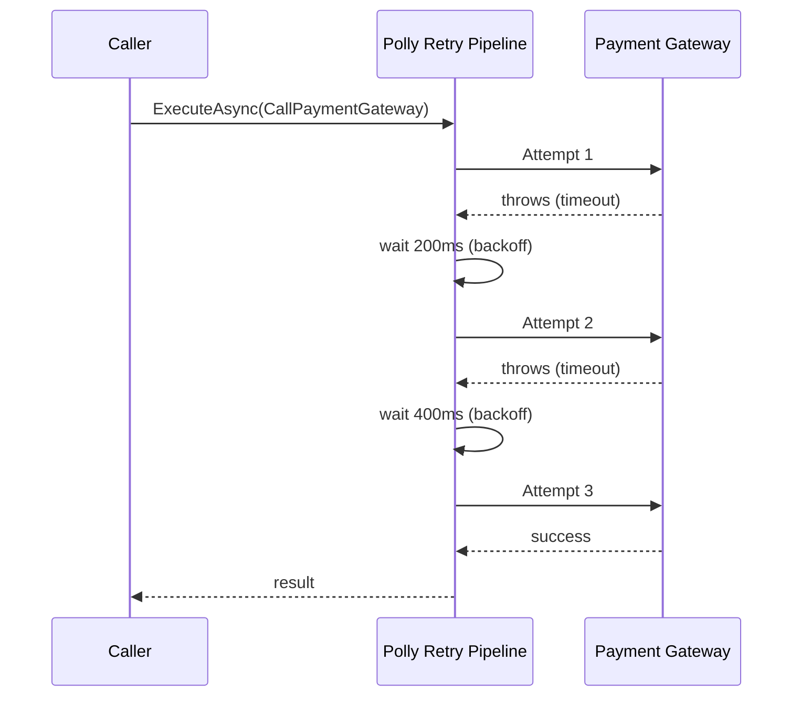
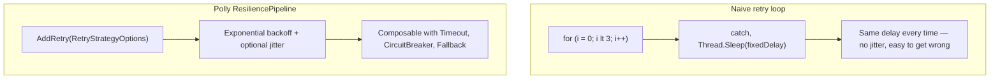

# Retry Patterns with Polly

## Introduction

Before reading this lesson, you should already be comfortable with **[Exceptions vs the Result Pattern](../05-exception-handling/05-08-exceptions-vs-result-pattern.md)** — the idea that some failures are ordinary and expected, while others are genuinely unexpected. This lesson looks closely at one specific category that sits in between: a *transient* failure, one that's genuinely unexpected in the moment but likely to resolve itself if you simply try again — and why trying again carelessly can make things worse, not better.

By the end of this lesson, you will be able to:

- Define a transient failure and explain why it differs from a permanent one
- Explain why a naive retry-in-a-loop, with no backoff, risks making an overloaded dependency worse
- Configure a Polly `ResiliencePipeline` with a retry strategy and exponential backoff
- Read and use Polly's `OnRetry` callback to observe each retry attempt
- Explain jitter and the "thundering herd" problem it helps prevent
- Apply a retry pipeline to a flaky shipping-label call in an E-Commerce Order Processing system

## Retry Patterns — A Layman's Perspective

Picture trying to get through to a popular restaurant's reservation line on a busy Friday night. You dial, and you get a busy signal. The instinctive reaction for a lot of people is to hang up and immediately redial, as fast as their phone allows, over and over — surely if you just try hard enough and fast enough, you'll eventually squeeze through. But imagine everyone else who got a busy signal at that exact same moment is doing the exact same thing: hanging up, redialing instantly, at the same instant, again and again. All of those instantly-retried calls arrive back at the restaurant's switchboard at almost the same moment they did the first time — which means everyone collides again, gets busy again, and immediately redials again, in perfect lockstep, forever. Retrying instantly and constantly doesn't get anyone through faster; it just guarantees the same crowd of frustrated callers keeps hitting the same overloaded switchboard at the same moments, potentially making the jam worse than if half of them had simply waited.

A smarter caller does something different. After the first busy signal, they wait a short while before trying again — not instantly. If they get busy again, they don't try after the exact same short wait; they wait a bit longer than last time. And they don't wait the exact same length as everyone else who's also retrying, either — a slightly random amount of extra patience, different for each caller, means the whole crowd of retriers naturally spreads their attempts out across time instead of all landing on the switchboard at once, over and over. That growing, slightly randomized patience is what actually gets a caller through eventually, without their own behavior becoming part of the problem jamming the line for everyone else, including themselves.

There's one more thing a smart caller knows: not every busy signal is worth retrying at all. If the restaurant's number has simply been disconnected — wrong number, out of business — no amount of patient, well-spaced redialing will ever get anyone through, and a caller who keeps politely waiting and retrying a disconnected number forever is just as unproductive as the person mashing redial nonstop. Knowing when a failure is temporary and worth waiting out, versus permanent and not worth retrying at all, matters just as much as how you space out the retries you do make.

That's the entire idea behind handling a temporary, likely-to-resolve-itself failure well: wait a little, then a little longer, with a bit of randomness thrown in so you're not colliding with everyone else trying at the same moment — and know the difference between a busy line worth waiting out and a dead line that retrying will never fix.

## Retry Patterns — A Programming Language Perspective

A transient fault is a failure expected to resolve on its own within a short window — a momentary network blip, a database connection pool briefly exhausted, a downstream service returning a timeout under temporary load — as opposed to a permanent failure, like an invalid request or a missing resource, which retrying will never fix no matter how many attempts or how long the wait. A naive retry loop — a bare `for` loop calling the same operation a fixed number of times with the same fixed delay, or no delay at all — ignores this distinction entirely, and worse, when many callers retry on the same fixed schedule, their attempts collide over and over, a pattern known as the "thundering herd" problem.

Polly is the standard .NET resilience library that addresses this properly. Its `ResiliencePipeline` (in Polly v8's builder-based API) composes named strategies — `AddRetry`, `AddTimeout`, `AddCircuitBreaker`, and others — declaratively. A retry strategy's `BackoffType` can be set to `DelayBackoffType.Exponential`, doubling the delay after each attempt, and `UseJitter` adds randomness so many callers' retries don't land in lockstep. Polly integrates directly with `HttpClientFactory` via `AddResilienceHandler`, applying the same pipeline to every outgoing HTTP call — a pattern covered fully once `HttpClient` itself is introduced in Module 10.

## How to Configure a Retry Pipeline with Polly

Polly's retry strategy is configured once, as a `ResiliencePipeline`, and then reused for every call to the operation it protects. `ShouldHandle` decides which exceptions are worth retrying at all; `MaxRetryAttempts` caps how many extra attempts are made; `Delay` and `BackoffType` control how long each subsequent attempt waits — exponential backoff doubles the wait after each failure, rather than retrying on a fixed schedule. The example below simulates a payment gateway that fails its first two calls and only succeeds on the third, so you can see the pipeline's `OnRetry` callback fire with an increasing delay each time, right up until the operation finally succeeds.


*Figure 1: Each failed attempt waits longer than the last before the pipeline tries again — twice the delay, not the same delay.*

```csharp
// Program.cs — .NET 10 / C# 14 — requires the Polly NuGet package (dotnet add package Polly)

using Polly;
using Polly.Retry;

int attemptCounter = 0;

ResiliencePipeline<string> pipeline = new ResiliencePipelineBuilder<string>()
    .AddRetry(new RetryStrategyOptions<string>
    {
        ShouldHandle = new PredicateBuilder<string>().Handle<InvalidOperationException>(),
        MaxRetryAttempts = 3,
        Delay = TimeSpan.FromMilliseconds(200),
        BackoffType = DelayBackoffType.Exponential,
        UseJitter = false,
        OnRetry = args =>
        {
            Console.WriteLine($"Attempt {args.AttemptNumber + 1} failed: {args.Outcome.Exception?.Message} Retrying after {args.RetryDelay.TotalMilliseconds:F0}ms...");
            return ValueTask.CompletedTask;
        }
    })
    .Build();

string result = await pipeline.ExecuteAsync(async _ => await CallFlakyPaymentGatewayAsync());

Console.WriteLine($"Final result: {result}");

async Task<string> CallFlakyPaymentGatewayAsync()
{
    attemptCounter++;
    await Task.Delay(10);

    if (attemptCounter < 3)
    {
        throw new InvalidOperationException($"Payment gateway timed out (attempt {attemptCounter}).");
    }

    return $"Payment approved on attempt {attemptCounter}.";
}
```

**Console Output:**

```text
Attempt 1 failed: Payment gateway timed out (attempt 1). Retrying after 200ms...
Attempt 2 failed: Payment gateway timed out (attempt 2). Retrying after 400ms...
Final result: Payment approved on attempt 3.
```

The pipeline never gives up after the first failure, and it never retries instantly either — the second wait (400ms) is double the first (200ms), exactly what `DelayBackoffType.Exponential` produces. By the third attempt, the gateway happens to succeed, and `ExecuteAsync` returns the result exactly as if it had succeeded on the first try — the caller's own code never had to write a single retry loop.

## Real-Time Example: Retrying a Flaky Shipping-Label Call in E-Commerce Order Processing

We extend the E-Commerce Order Processing case study with a call to a shipping-label API that behaves like a real transient dependency: sometimes flaky, sometimes fine. One order's label request fails twice before succeeding, well within the retry budget. A second order's request fails on every attempt, exceeding `MaxRetryAttempts`, so the pipeline eventually gives up and the original exception still needs to be handled at the call site — Polly retries transient failures, but it doesn't make a genuinely persistent failure disappear.

```csharp
// Program.cs — .NET 10 / C# 14 — Real-Time Example — requires the Polly NuGet package

using Polly;
using Polly.Retry;

ResiliencePipeline<string> retryPipeline = new ResiliencePipelineBuilder<string>()
    .AddRetry(new RetryStrategyOptions<string>
    {
        ShouldHandle = new PredicateBuilder<string>().Handle<InvalidOperationException>(),
        MaxRetryAttempts = 3,
        Delay = TimeSpan.FromMilliseconds(200),
        BackoffType = DelayBackoffType.Exponential,
        UseJitter = false,
        OnRetry = args =>
        {
            Console.WriteLine($"  Retry {args.AttemptNumber + 1} after {args.RetryDelay.TotalMilliseconds:F0}ms — {args.Outcome.Exception?.Message}");
            return ValueTask.CompletedTask;
        }
    })
    .Build();

List<Order> orders =
[
    new Order("ORD-8801", FailuresBeforeSuccess: 2),
    new Order("ORD-8802", FailuresBeforeSuccess: 10), // never recovers within the retry budget
];

foreach (Order order in orders)
{
    Console.WriteLine($"Requesting shipping label for {order.OrderId}...");
    int attempt = 0;

    try
    {
        string label = await retryPipeline.ExecuteAsync(async _ =>
        {
            attempt++;
            await Task.Delay(10);

            if (attempt <= order.FailuresBeforeSuccess)
            {
                throw new InvalidOperationException($"Shipping API timed out for {order.OrderId} (attempt {attempt}).");
            }

            return $"LABEL-{order.OrderId}-{attempt}";
        });

        Console.WriteLine($"  Success: {label}");
    }
    catch (InvalidOperationException ex)
    {
        Console.WriteLine($"  Gave up after exhausting retries: {ex.Message}");
    }

    Console.WriteLine();
}

record Order(string OrderId, int FailuresBeforeSuccess);
```

**Console Output:**

```text
Requesting shipping label for ORD-8801...
  Retry 1 after 200ms — Shipping API timed out for ORD-8801 (attempt 1).
  Retry 2 after 400ms — Shipping API timed out for ORD-8801 (attempt 2).
  Success: LABEL-ORD-8801-3

Requesting shipping label for ORD-8802...
  Retry 1 after 200ms — Shipping API timed out for ORD-8802 (attempt 1).
  Retry 2 after 400ms — Shipping API timed out for ORD-8802 (attempt 2).
  Retry 3 after 800ms — Shipping API timed out for ORD-8802 (attempt 3).
  Gave up after exhausting retries: Shipping API timed out for ORD-8802 (attempt 4).

```

`ORD-8801` needed two retries and recovered — the exact scenario retry logic exists for. `ORD-8802` did not recover, and after its third retry (the fourth attempt overall) still failed, `ExecuteAsync` rethrew that final exception rather than retrying a fourth time, because `MaxRetryAttempts` had been reached. The surrounding `try`/`catch` still matters: Polly absorbs the *transient* part of the problem, but a caller must still decide what to do — fail the order, queue it for manual review, alert an operator — once retries are truly exhausted.

## Naive Retry Loop vs Polly's Backoff Strategy

A hand-rolled retry loop is easy to write and easy to get subtly wrong: a fixed `for (int i = 0; i < 3; i++)` with a fixed `Thread.Sleep(1000)` between attempts retries every failure the same way, with no distinction between a fleeting timeout and a service that's genuinely down, and no variation in timing that would spread many simultaneous callers' retries apart. Polly's retry strategy separates the *what to retry* (`ShouldHandle`), the *how many times* (`MaxRetryAttempts`), and the *how long to wait* (`Delay`, `BackoffType`, `UseJitter`) into independently configurable pieces — and, because it's a composable pipeline, the same retry strategy can sit alongside a timeout or circuit breaker strategy without any additional hand-written glue code.


*Figure 2: Both retry the operation — only one of them is built to avoid making the underlying problem worse.*

| Aspect | Naive retry loop | Polly retry pipeline |
|---|---|---|
| Delay strategy | Usually fixed, hardcoded | Exponential backoff, optional jitter, fully configurable |
| Composability | Ad hoc — combining with circuit breakers or timeouts means more hand-written code | Strategies compose declaratively: `AddRetry`, `AddTimeout`, `AddCircuitBreaker` |
| Thundering herd risk | High — many callers retry in lockstep | Reduced via jitter, spreading retries apart |
| Observability | Whatever you remember to log yourself | Built-in `OnRetry` callback for structured logging |
| HTTP integration | Manual | Plugs directly into `HttpClientFactory` via `AddResilienceHandler` (Module 10) |

## Types of Resilience Strategies in Polly

Retry is one of several composable strategies Polly's `ResiliencePipeline` supports:

1. **Retry (`AddRetry`)** — the strategy this lesson covers: reattempt a failed operation with a configurable delay and backoff.
2. **Circuit Breaker (`AddCircuitBreaker`)** — stops calling a consistently failing dependency for a cooldown period, instead of retrying it forever.
3. **Timeout (`AddTimeout`)** — bounds how long a single attempt is allowed to run before it's treated as a failure in its own right.
4. **Fallback (`AddFallback`)** — supplies a default value or degraded response once every retry attempt has been exhausted.
5. **[Global Exception Handling](../05-exception-handling/05-07-global-exception-handling.md)** — the safety net still needed for a failure that exhausts every retry, exactly as `ORD-8802` demonstrated above.
6. **[Logging Exceptions — Best Practices](../05-exception-handling/05-10-logging-exceptions-best-practices.md)** — the module capstone, next lesson, on recording precisely what a retried — or finally-failed — operation actually did.

## What You've Learned & What's Next

A transient failure deserves a retry, but a careless one — instant, fixed-interval, uncoordinated across callers — can turn a brief blip into a pile-up. Polly's `ResiliencePipeline` handles this properly with exponential backoff, optional jitter, and a configurable retry budget, while still leaving genuinely exhausted failures — like `ORD-8802`'s — for the caller to handle deliberately, exactly as this module's earlier lessons taught.

Continue your learning journey with **[Logging Exceptions — Best Practices](../05-exception-handling/05-10-logging-exceptions-best-practices.md)**, the capstone of this module, where we cover how to record every one of these failures — retried, wrapped, or truly exceptional — properly, with structured logging that preserves the full exception without leaking anything it shouldn't.

---
*Applies to: .NET 10 / C# 14. Last reviewed 2026-08-16.*
