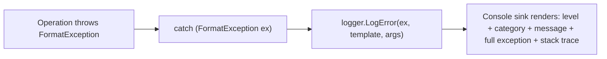
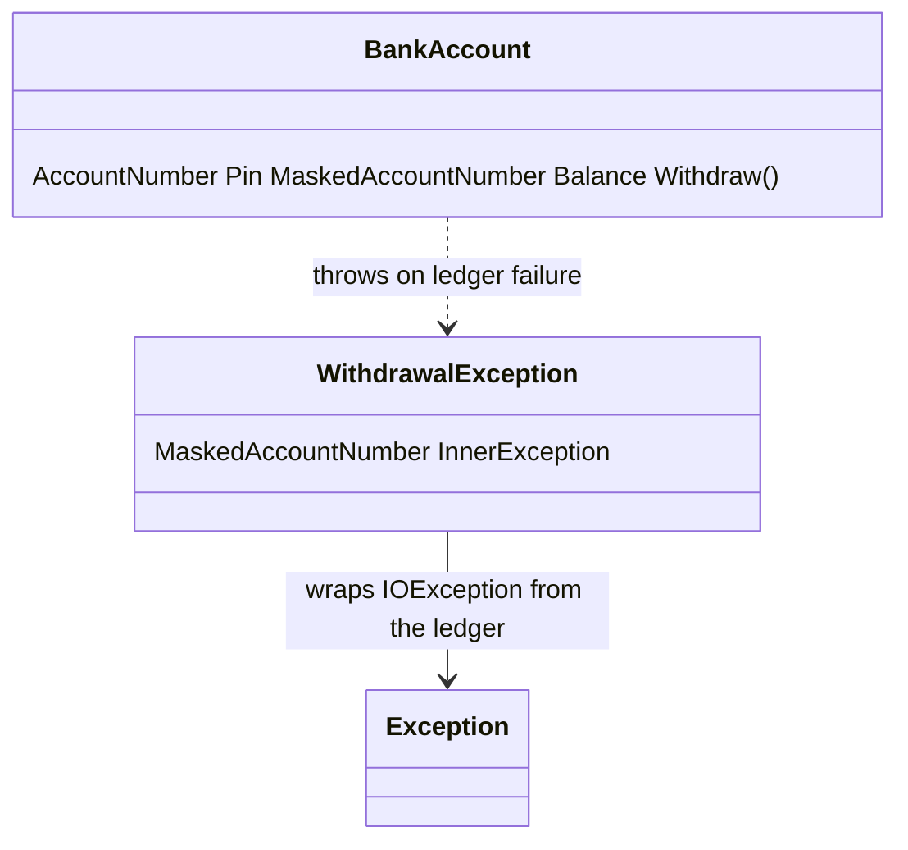
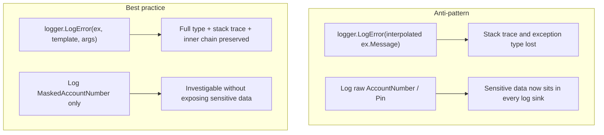

# Logging Exceptions — Best Practices

## Introduction

Before reading this lesson, you should already be comfortable with **[Retry Patterns with Polly](../05-exception-handling/05-09-retry-patterns-with-polly.md)** and, really, with the entire arc of Module 05 — throwing and catching, filtering which exceptions you handle, wrapping a low-level failure inside a domain-specific one without losing it, the process-wide safety nets that catch what local code never did, choosing between an exception and a `Result<T>`, and retrying transient failures intelligently. This lesson is the module's capstone, and it asks the question every one of those lessons has been quietly building toward: once a failure has been thrown, caught, wrapped, or exhausted, how do you actually *record* it — properly, safely, and in a way that's still useful to whoever reads it next?

By the end of this lesson, you will be able to:

- Explain what `ILogger<T>` is and how structured logging differs from writing text to the console
- Log the full exception object — not just `ex.Message` — to preserve its type, stack trace, and inner exception chain
- Use message templates with named placeholders instead of string interpolation
- Identify what should never appear in a log statement, and why
- Explain, at a conceptual level, how this same `ILogger<T>` powers ASP.NET Core's built-in logging in Module 10
- Combine a custom exception, inner exception wrapping, and structured logging into one realistic Banking/ATM withdrawal flow

## Logging Exceptions — A Layman's Perspective

Imagine a security guard at a large office building who witnesses an incident — a break-in attempt, say — and has to file a report afterward. A bad guard, in a hurry, scribbles one line: "something happened near the east entrance around midnight, dealt with it." That line technically satisfies the requirement that a report was filed, but it's almost useless to anyone who reads it later trying to understand what actually happened, who was involved, and how to prevent it next time. A good guard does something very different: they attach the actual security camera footage, the exact timestamp, which door sensor tripped, and the full sequence of events from start to finish — not a paraphrase of what they remember, but the complete, original record.

That distinction matters just as much on the other side of the same report. The same good guard would never write a tenant's home address, their alarm code, or the building's master key combination into an incident report that's going to sit in a shared filing cabinet where dozens of people might eventually read it. None of that information helps investigate what happened — it just creates a brand-new risk, sitting quietly in a drawer, waiting for the wrong person to open it. A well-written report captures everything relevant to understanding the incident, and deliberately omits everything that isn't relevant but would be dangerous if it leaked.

Software has exactly the same two responsibilities every single time something goes wrong. When a failure happens, the record of what happened needs to be the real, complete original — not a guard's hurried one-liner — because whoever reads that record afterward, possibly days or weeks later and nowhere near the machine it happened on, is trying to reconstruct exactly what went wrong from nothing but what got written down at the time. But assembling that complete record also has to be done carefully, leaving out exactly the kind of information that would turn a genuinely helpful incident report into a liability the moment the wrong person reads it.

In code, the full security footage is the exception object itself — logged whole, not paraphrased into a single message string — and the home address that never belongs in the report is the sensitive data a well-written log statement is careful to leave out.

## Logging Exceptions — A Programming Language Perspective

`Microsoft.Extensions.Logging` — the logging abstraction ASP.NET Core builds on directly, covered fully in Module 10 — centers on `ILogger<T>`, where `T` identifies the logging category, typically the class doing the logging. Its methods, such as `LogInformation` and `LogError`, take a *message template* with named placeholders (`{PlaceholderName}`) rather than an interpolated string — a structured logging convention that keeps each argument available as its own field to whatever sink eventually stores the log, instead of collapsing everything into one opaque line of text.

Critically, `LogError` and every other level has an overload accepting an `Exception` as its first parameter: `logger.LogError(ex, "template", args)`. Passing the exception this way — rather than interpolating `ex.Message` into the template — preserves its full type, its complete stack trace, and its entire `InnerException` chain in whatever the sink ultimately renders, exactly the information a wrapped exception from earlier in this module carries. Logging only `ex.Message` discards all of that the moment the log line is written — the single mistake this lesson's capstone example is built to avoid.

## How to Log Exceptions with ILogger&lt;T&gt;

Every `ILogger<T>` call follows the same shape: a log level, a message template with named placeholders, and the values that fill them in — plus, when something failed, the exception object itself as the very first argument. The example below shows the difference directly: a commented-out line interpolates only `ex.Message` into the template, exactly what this lesson warns against, while the executed line passes `ex` directly to `LogError`, letting the console logger render its full type, message, and stack trace beneath the templated summary line.


*Figure 1: The exception object flows into the logger alongside the template — the sink renders the complete picture, not just the message.*

```csharp
// Program.cs — .NET 10 / C# 14 — requires the Microsoft.Extensions.Logging.Console NuGet package

using Microsoft.Extensions.Logging;

using ILoggerFactory loggerFactory = LoggerFactory.Create(builder => builder.AddConsole());
ILogger<Program> logger = loggerFactory.CreateLogger<Program>();

try
{
    ParseReorderThreshold("twelve");
}
catch (FormatException ex)
{
    // DON'T: logger.LogError($"Failed to parse reorder threshold: {ex.Message}");
    // That interpolates only the message — the exception's type and full stack trace are gone.

    // DO: pass the exception object itself as the first argument.
    logger.LogError(ex, "Failed to parse reorder threshold {RawValue}", "twelve");
}

static int ParseReorderThreshold(string rawValue)
{
    if (!int.TryParse(rawValue, out int threshold))
    {
        throw new FormatException($"'{rawValue}' is not a valid reorder threshold.");
    }

    return threshold;
}
```

**Console Output:**

```text
fail: Program[0]
      Failed to parse reorder threshold twelve
      System.FormatException: 'twelve' is not a valid reorder threshold.
         at Program.<<Main>$>g__ParseReorderThreshold|0_1(String rawValue) in ...\Program.cs:line 25
         at Program.<Main>$(String[] args) in ...\Program.cs:line 10
```

*(The `in ...\Program.cs:line NN` portions reflect wherever you save this file locally and will differ on your machine — the log level, category, message, exception type, and exception message will match exactly.)*

Notice what the console sink shows that a plain `Console.WriteLine($"{ex.Message}")` never could: the exact exception type (`System.FormatException`), and a full stack trace down to the method and line where it was thrown. None of that came from the template string — it came entirely from passing `ex` itself into `LogError`.

## Real-Time Example: Logging a Wrapped Exception in a Banking/ATM Withdrawal Flow

We bring together three concepts from across this module in one Banking/ATM scenario: `BankAccount.Withdraw` wraps a low-level ledger failure inside a custom `WithdrawalException` (as in [Inner Exceptions and Exception Wrapping](../05-exception-handling/05-06-inner-exceptions-and-wrapping.md)), and the caller logs that wrapped exception with `ILogger<T>` — logging the full exception object, and only ever a *masked* account number, never the account's PIN or full number.


*Figure 2: `Withdraw` never exposes `AccountNumber` or `Pin` outward — only `MaskedAccountNumber` ever reaches a log statement.*

```csharp
// Program.cs — .NET 10 / C# 14 — Real-Time Example — requires Microsoft.Extensions.Logging.Console

using System.Globalization;
using Microsoft.Extensions.Logging;

CultureInfo usCulture = CultureInfo.GetCultureInfo("en-US");

using ILoggerFactory loggerFactory = LoggerFactory.Create(builder => builder.AddConsole());
ILogger<Program> logger = loggerFactory.CreateLogger<Program>();

BankAccount account = new("1234567890123301", "7331", 300.00m);

(decimal Amount, bool SimulateLedgerFailure)[] withdrawalRequests =
[
    (50.00m, false),
    (75.00m, true),
];

foreach (var request in withdrawalRequests)
{
    string amountDisplay = request.Amount.ToString("C", usCulture);

    try
    {
        decimal newBalance = account.Withdraw(request.Amount, request.SimulateLedgerFailure);
        string balanceDisplay = newBalance.ToString("C", usCulture);

        // Safe to log: a masked account number and the resulting balance.
        logger.LogInformation(
            "Withdrawal of {AmountDisplay} succeeded for account {MaskedAccount}. New balance: {BalanceDisplay}",
            amountDisplay, account.MaskedAccountNumber, balanceDisplay);
    }
    catch (WithdrawalException ex)
    {
        // DON'T do this — it would leak the PIN and the full account number:
        // logger.LogError($"Withdrawal failed for account {account.AccountNumber}, PIN {account.Pin}: {ex.Message}");

        // DO this instead: pass the exception object itself (preserves the full
        // wrapped chain and stack trace), and only ever log the masked account number.
        logger.LogError(
            ex,
            "Withdrawal of {AmountDisplay} failed for account {MaskedAccount}.",
            amountDisplay, account.MaskedAccountNumber);
    }
}

class BankAccount(string accountNumber, string pin, decimal balance)
{
    public string AccountNumber { get; } = accountNumber;
    public string Pin { get; } = pin;
    public string MaskedAccountNumber => $"****{AccountNumber[^4..]}";
    public decimal Balance { get; private set; } = balance;

    public decimal Withdraw(decimal amount, bool simulateLedgerFailure)
    {
        if (amount <= 0 || amount > Balance)
        {
            throw new ArgumentOutOfRangeException(nameof(amount), "Withdrawal amount is invalid for this account.");
        }

        try
        {
            WriteToLedger(amount, simulateLedgerFailure);
        }
        catch (IOException ex)
        {
            throw new WithdrawalException(
                MaskedAccountNumber,
                "Withdrawal could not be completed due to a ledger write failure.",
                ex);
        }

        Balance -= amount;
        return Balance;
    }

    private static void WriteToLedger(decimal amount, bool simulateFailure)
    {
        if (simulateFailure)
        {
            throw new IOException("Ledger disk volume '/data/ledger' is unavailable.");
        }
    }
}

class WithdrawalException(string maskedAccountNumber, string message, Exception innerException)
    : Exception(message, innerException)
{
    public string MaskedAccountNumber { get; } = maskedAccountNumber;
}
```

**Console Output:**

```text
info: Program[0]
      Withdrawal of $50.00 succeeded for account ****3301. New balance: $250.00
fail: Program[0]
      Withdrawal of $75.00 failed for account ****3301.
      WithdrawalException: Withdrawal could not be completed due to a ledger write failure.
       ---> System.IO.IOException: Ledger disk volume '/data/ledger' is unavailable.
         at BankAccount.WriteToLedger(Decimal amount, Boolean simulateFailure) in ...\Program.cs:line 81
         at BankAccount.Withdraw(Decimal amount, Boolean simulateLedgerFailure) in ...\Program.cs:line 63
         --- End of inner exception stack trace ---
         at BankAccount.Withdraw(Decimal amount, Boolean simulateLedgerFailure) in ...\Program.cs:line 67
         at Program.<Main>$(String[] args) in ...\Program.cs:line 25
```

*(As above, the `in ...\Program.cs:line NN` portions vary by machine and build; the log levels, message text, masked account number, exception types, and the `--->` inner-exception chain will match exactly.)*

Two things are worth reading closely here. First, `AccountNumber` (`"1234567890123301"`) and `Pin` (`"7331"`) never appear anywhere in the output — only `MaskedAccountNumber` (`****3301`) does, because that's the only identifier the logging calls were ever given. Second, the failed withdrawal's log entry shows the *entire* wrapped exception chain: `WithdrawalException` on top, with `System.IO.IOException` — the original, low-level ledger failure — printed right beneath it via `--->`, exactly the inner exception this module's earlier lesson taught you never to discard. A support engineer reading this log days later can see precisely what failed and why, without a single sensitive detail sitting alongside it.

## What to Log vs What Never to Log

Everything this lesson has shown comes down to two separate decisions made at every single log statement: *how much* of the failure to capture, and *which values* are even safe to include in the first place. Getting the first one wrong leaves you debugging blind — a message with no stack trace and no exception type is barely more useful than the security guard's one-line scribble. Getting the second one wrong is worse: it turns a diagnostic tool into a data leak, because a log file is often read by more people, stored for longer, and protected less carefully than the production database it's describing.


*Figure 3: The same log statement can either preserve everything useful and nothing dangerous, or the exact opposite — the difference is entirely in what you pass to it.*

| Aspect | Safe / recommended to log | Never log |
|---|---|---|
| Exception detail | The full exception object, via `LogError(ex, ...)` | Only `ex.Message` interpolated into the template — the stack trace is lost |
| Account/customer identifiers | A masked or truncated identifier (`****3301`) | Full account numbers, card numbers, national ID numbers |
| Credentials | Nothing — no credential belongs in a log, ever | PINs, passwords, API keys, connection strings, access tokens |
| Correlation | A request, trace, or correlation ID for cross-referencing | Session cookies or auth headers that could be used to impersonate a user |
| Message format | A structured template with named placeholders | Free-form interpolated text that hides which value is which |

## Types of Logging Practices in .NET

Several related practices and mechanisms round out structured logging beyond what this lesson demonstrated directly:

1. **Log levels (`LogTrace` through `LogCritical`)** — choosing the right severity so `LogError` stays reserved for actual failures, not routine events.
2. **Structured message templates** — named placeholders like `{MaskedAccount}`, instead of string interpolation, so each value stays queryable rather than flattened into text.
3. **Logging providers (Console, Debug, EventLog, and external sinks like Application Insights or Serilog)** — the same `ILogger<T>` calls, routed to wherever a provider is configured to send them.
4. **ASP.NET Core's built-in logging integration** — `ILogger<T>` obtained through dependency injection in every controller and piece of middleware, covered fully in Module 10.
5. **[Retry Patterns with Polly](../05-exception-handling/05-09-retry-patterns-with-polly.md)** — a retried operation's `OnRetry` callback is itself a natural place to apply everything this lesson covers.
6. **[Delegates in C#](../06-delegates-events/06-01-delegates-in-csharp.md)** — the first lesson of Module 06, where the callback shape used throughout this module — `OnRetry`, event handlers, `ILogger`'s own scope callbacks — finally gets its own proper foundation.

## What You've Learned & What's Next

A good exception log, like a good incident report, records the complete original event — the exception's type, its message, and its full stack trace, passed to `LogError` as the exception object itself rather than paraphrased into `ex.Message` — while deliberately leaving out anything, like a PIN or a full account number, that has no business sitting in a log file. That closes out Module 05: every technique this module covered, from throwing and filtering through wrapping, global safety nets, the Result pattern, and retrying, ends here, in a properly logged record of exactly what happened.

Continue your learning journey with **[Delegates in C#](../06-delegates-events/06-01-delegates-in-csharp.md)**, the first lesson of Module 06, where you'll learn the callback mechanism underneath features you've already used in this module without a formal introduction — Polly's `OnRetry`, and the event handlers this module's global exception handlers were built on.

---
*Applies to: .NET 10 / C# 14. Last reviewed 2026-08-16.*
