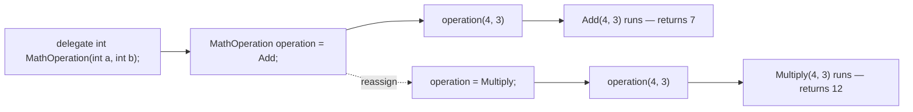
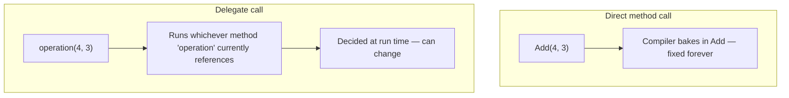

# Delegates in C#

## Introduction

Before reading this lesson, you should already be comfortable with **[Logging Exceptions — Best Practices](../05-exception-handling/05-10-logging-exceptions-best-practices.md)**, and really with the broader habit Module 05 built up of writing methods that do one job well. This lesson starts a new module, and a genuinely new idea: instead of a method being something you simply *call*, what if a method were something you could hold in a variable, hand to another piece of code, and let that other code decide when to call it? That capability — treating a method as data — is what a delegate is, and it's the foundation everything else in this module builds on: multicasting, `Func`/`Action`/`Predicate`, events, and lambda expressions all turn out to be delegates wearing different clothes.

By the end of this lesson, you will be able to:

- Explain what a delegate is: a type-safe reference to a method with a specific, matching signature
- Declare a custom delegate type using the `delegate` keyword
- Assign a method to a delegate variable and invoke it indirectly through that variable
- Reassign the same delegate variable to a different method and see the behavior change without touching the calling code
- Explain why this enables *passing behavior as data* — as a parameter, a field, or a return value
- Recognize that a delegate type is a real reference type in the CLR, not just special syntax

## Delegates — A Layman's Perspective

Picture a property manager who oversees a dozen rental units. When a tenant reports a broken heater, the manager doesn't personally know how to repair a furnace, and doesn't need to. Instead, they keep a small referral card taped inside a filing cabinet drawer. The card says, in effect: "For heating problems, call this number." It doesn't matter *who* the number belongs to — what matters is that whoever answers handles heating calls the same way: they show up, they diagnose the furnace, they send an invoice in the expected format. When a heater breaks, the manager's entire job is to open the drawer, read whatever number is currently written on the card, and dial it. They never need to know the technician's name, their van's license plate, or which trade school they attended — only that calling this number gets a heating problem handled.

Here's the part that matters most: that card can be swapped out at any time, and nothing else about the process changes. Suppose the regular heating technician retires. The manager crosses out the old number, writes in a new technician's number, and tapes the card back in the drawer. Tomorrow, when the next heating complaint comes in, the manager reaches for the exact same drawer, reads the exact same card, and dials whatever number is written there *today* — which now happens to route to a completely different person. The manager's own routine — "check the card, dial the number, describe the problem" — never had to be rewritten. Only the card changed.

Notice also what could never be written on that card. A heating referral card would never list a plumber's number, because a plumber, however skilled, doesn't fix furnaces — the number on the card has to belong to someone who does the *kind* of job the card is labeled for. A general contractor keeps a whole binder of these cards — one for heating, one for plumbing, one for electrical — and each card only ever holds numbers for people who can do that specific category of work. You'd never mix them up, because "the kind of job this card is for" and "the kind of job the person on the other end of the line actually does" have to match exactly.

And here's the last piece: the manager could hand this card — not a copy of the technician's skills, just the card itself — to a brand-new front-desk assistant who has never met a single tradesperson in the building's network. That assistant can still get a heater fixed, using nothing but the card, because the card carries everything needed to make the right call. Handing someone a card is fundamentally different from handing them a person; a card is small, portable data, while a person is the actual capability being described.

The bridge back to programming: a delegate is that referral card. It doesn't do the work itself — it's a reference to whichever method currently matches the job description ("takes these inputs, returns this kind of result"). You can swap which method it points to without rewriting the code that uses it, you can only ever assign it a method whose "shape" matches what the card demands, and you can hand that card — the delegate — to other code as plain data, letting that code trigger the right behavior without ever needing to know which specific method is behind it.

## Delegates — A Programming Language Perspective

A delegate is a type-safe reference type — every delegate type in C# ultimately derives from `System.MulticastDelegate`, itself derived from `System.Delegate` — that encapsulates a reference to a method whose signature (parameter types and return type) matches the delegate's own declared signature exactly. You declare a new delegate type with the `delegate` keyword: `delegate int MathOperation(int a, int b);` declares a type named `MathOperation`, and any method taking two `int` parameters and returning `int` — static or instance, named or, as later lessons will show, a lambda — can be assigned to a variable of that type. Instantiating a delegate (`MathOperation op = Add;`) binds it to one specific method; invoking it (`op(4, 3)`) calls that method indirectly, through the delegate, rather than by name. Because the delegate variable itself is an ordinary reference-type value, it can be stored, reassigned, passed as a method parameter, or returned from a method — which is precisely what "passing behavior as data" means in C#.

## How to Declare, Assign, and Invoke a Delegate in C#

Declaring a delegate type looks like a method signature with no body, prefixed by the `delegate` keyword. Once declared, any method matching that signature can be assigned to a variable of the delegate type, and calling the variable — using ordinary method-call syntax — invokes whichever method it currently holds.


*Figure 1: The same delegate variable, called the same way, runs a different method once reassigned.*

```csharp
// Program.cs — .NET 10 / C# 14

MathOperation operation = Add;
Console.WriteLine($"Add: {operation(4, 3)}");

operation = Multiply;
Console.WriteLine($"Multiply: {operation(4, 3)}");

static int Add(int a, int b) => a + b;
static int Multiply(int a, int b) => a * b;

delegate int MathOperation(int a, int b);
```

**Console Output:**

```text
Add: 7
Multiply: 12
```

Nothing about the call `operation(4, 3)` changed between the two lines — the exact same syntax ran twice. What changed was which method `operation` referenced: first `Add`, producing `7`, then `Multiply`, producing `12`. The delegate type `MathOperation` only accepts methods matching `int (int, int)` — trying to assign a method with a different signature, such as one taking a `string`, would fail to compile, because the "job description" the delegate declares has to match the method taking the job.

## Real-Time Example: Delegates in E-Commerce Order Processing

We start the E-Commerce Order Processing case study that recurs across this curriculum. A checkout system needs to compute shipping cost differently depending on which shipping method a customer chose — standard, express, or international — and rather than a long `if`/`else if` chain repeated everywhere shipping cost matters, a `ShippingCostCalculator` delegate lets the checkout pick the right calculation *method* once, as data, and apply it uniformly.

```csharp
// Program.cs — .NET 10 / C# 14 — Real-Time Example
using System.Globalization;

CultureInfo usCulture = CultureInfo.GetCultureInfo("en-US");

List<Order> orders =
[
    new("ORD-9101", "Priya Nair", 145.00m, "Standard"),
    new("ORD-9102", "Wei Chen", 42.50m, "Express"),
    new("ORD-9103", "Lucas Silva", 210.00m, "International"),
    new("ORD-9104", "Amara Obi", 68.00m, "Standard"),
];

foreach (Order order in orders)
{
    ShippingCostCalculator calculator = order.ShippingMethod switch
    {
        "Standard" => CalculateStandardShipping,
        "Express" => CalculateExpressShipping,
        "International" => CalculateInternationalShipping,
        _ => throw new NotSupportedException($"Unknown shipping method '{order.ShippingMethod}'.")
    };

    decimal shippingCost = calculator(order.Total);
    decimal grandTotal = order.Total + shippingCost;
    string shippingDisplay = shippingCost.ToString("C", usCulture);
    string totalDisplay = grandTotal.ToString("C", usCulture);

    Console.WriteLine($"{order.OrderId} ({order.ShippingMethod}): shipping = {shippingDisplay}, total = {totalDisplay}");
}

static decimal CalculateStandardShipping(decimal orderTotal) => orderTotal >= 100m ? 0m : 5.99m;
static decimal CalculateExpressShipping(decimal orderTotal) => 14.99m;
static decimal CalculateInternationalShipping(decimal orderTotal) => Math.Round(orderTotal * 0.08m, 2);

delegate decimal ShippingCostCalculator(decimal orderTotal);

record Order(string OrderId, string CustomerName, decimal Total, string ShippingMethod);
```

**Console Output:**

```text
ORD-9101 (Standard): shipping = $0.00, total = $145.00
ORD-9102 (Express): shipping = $14.99, total = $57.49
ORD-9103 (International): shipping = $16.80, total = $226.80
ORD-9104 (Standard): shipping = $5.99, total = $73.99
```

The `switch` expression selects a *method group* — `CalculateStandardShipping`, `CalculateExpressShipping`, or `CalculateInternationalShipping` — and assigns it to `calculator`, a `ShippingCostCalculator` delegate. The loop body itself never asks "which shipping method is this?" a second time; it just calls `calculator(order.Total)`, and whichever method matched the order's `ShippingMethod` runs. `ORD-9101` qualifies for free standard shipping because its total already clears $100, while `ORD-9104`, also standard but under $100, is charged $5.99 — the same delegate variable, holding the same method, simply produces a different result for different input. Adding a fourth shipping method later means writing one more calculation method and one more `switch` arm — the calling code that invokes `calculator` never has to change.

## Delegate Instance vs Direct Method Call

It's worth being precise about what a delegate buys you over simply calling `Add(4, 3)` directly, since the two look similar in a small example. A direct call is resolved at compile time — the compiler bakes in exactly which method runs, permanently. A delegate call is resolved through whatever the delegate variable currently references, which can be decided at run time — based on a `switch`, a configuration value, or user input — and can change over the lifetime of the program. The trade-off is a small amount of indirection in exchange for genuine flexibility: code that accepts a delegate parameter doesn't need to know, or care, which concrete method it will eventually run.


*Figure 2: A direct call is permanently wired to one method; a delegate call is resolved through whatever the variable currently holds.*

| Aspect | Direct method call | Delegate call |
|---|---|---|
| Which method runs | Fixed at compile time | Whatever the delegate variable currently references |
| Can change at run time | No | Yes — reassign the variable |
| Can be passed as a parameter | No — only the call's *result* can be passed | Yes — the method reference itself can be passed |
| Signature checking | Compiler checks the specific method's signature | Compiler checks against the delegate type's declared signature |
| Typical use | Ordinary, fixed program logic | Plug-in behavior: callbacks, strategies, event handlers |

## Types of Delegate-Related Constructs in C#

A plain custom `delegate` declaration, as shown in this lesson, is only the starting point. Several closely related constructs build directly on it:

1. **[Multicast Delegates](../06-delegates-events/06-02-multicast-delegates.md)** — combining more than one method into a single delegate's invocation list with `+=`.
2. **[Func, Action, and Predicate](../06-delegates-events/06-03-func-action-predicate.md)** — the built-in generic delegate types that mean you rarely need to declare a custom one like `MathOperation` at all.
3. **[Events in C#](../06-delegates-events/06-04-events-in-csharp.md)** — a restricted delegate that only its declaring class can invoke or reassign.
4. **Lambda expressions** — a compact, inline way to write the method a delegate references, without a separate named method.
5. **Anonymous methods (`delegate(...) { ... }`)** — lambda expressions' older predecessor, still valid C# but rarely written in new code today.

## What You've Learned & What's Next

A delegate is a type-safe reference to a method — declared with the `delegate` keyword, assigned a matching method, and invoked indirectly through the delegate variable rather than by calling the method by name. That indirection is what lets behavior itself travel through a program as data: stored in a variable, swapped at run time, or handed to other code entirely, exactly like the property manager's referral card.

Continue your learning journey with **[Multicast Delegates](../06-delegates-events/06-02-multicast-delegates.md)**, where a single delegate variable learns to hold — and invoke — more than one method at once.

---
*Applies to: .NET 10 / C# 14. Last reviewed 2026-08-16.*
