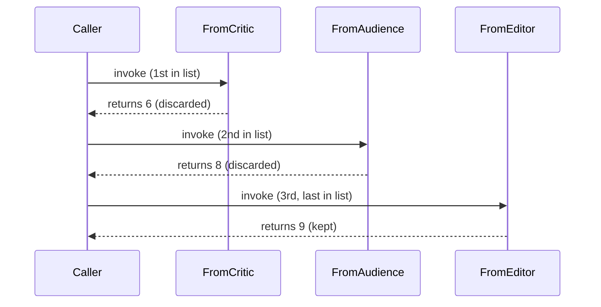
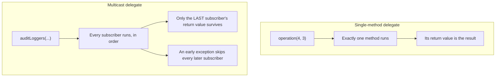

# Multicast Delegates

## Introduction

Before reading this lesson, you should already be comfortable with **[Delegates in C#](../06-delegates-events/06-01-delegates-in-csharp.md)** — declaring a delegate type, assigning it a single method, and invoking it. That previous lesson quietly simplified something: every delegate variable held exactly one method at a time. This lesson removes that simplification. A single delegate variable in C# can actually reference *several* methods at once, all queued up in one invocation list, and calling the delegate runs every single one of them in order. That capability — a multicast delegate — is what powers events later in this module, and it comes with two behaviors sharp enough to catch out anyone who hasn't seen them before.

By the end of this lesson, you will be able to:

- Combine multiple methods into a single delegate's invocation list using `+=`, and remove one using `-=`
- Explain that invocation happens in the exact order methods were added
- Identify the multicast return-value gotcha: only the *last* subscriber's return value ever reaches the caller
- Explain what happens if one subscriber throws partway through a multicast invocation
- Decide when a multicast delegate is the right tool versus a single-method delegate

## Multicast Delegates — A Layman's Perspective

Imagine a fire alarm panel in an office building. A single alarm trigger — someone pulling the lever — doesn't ring just one bell somewhere. It sets off a whole sequence of things, one after another, wired to that same trigger: first the bells ring throughout the building, then the elevators are recalled to the ground floor and disabled, then a signal is sent to the fire department's dispatch system, then the emergency lighting kicks on. One pull of one lever, several things happening in a fixed, predictable order — because someone, when the building was wired, decided the order that made sense: you want the bells ringing before you want the elevators locked down, not after.

Now suppose the fire department's dispatch signal — the third thing in that sequence — fails to send, because the phone line to the dispatch center happens to be down at that exact moment. What happens to the emergency lighting, the fourth item in the sequence, that was supposed to trigger right after? In a poorly designed system, wired naively in one unbroken chain, the answer is troubling: the whole sequence just stops. The bells rang, the elevators locked down, but because the third link in the chain failed, the emergency lighting — a step that had absolutely nothing to do with the phone line being down — never got a chance to run at all. The failure of one unrelated step silently swallowed every step that was supposed to happen after it.

There's a second subtlety worth noticing. Suppose, instead of switches, three different sensors each report back a reading after the alarm sequence runs — a smoke density sensor, a heat sensor, and a water-pressure sensor for the sprinklers — and the panel's central display only has room to show *one* final number. If all three readings feed into that single display one after another, whichever sensor happens to report last is the only number anyone standing at the panel actually sees. The first two readings weren't lost from the system entirely — each sensor did its job — but only the very last one to report ever reaches the one place a person is actually looking.

That's the whole shape of a multicast delegate. One trigger can be wired to several actions, each one added in a specific order, and all of them run, in that order, from a single call. But two things follow directly from that design: if an action fails partway through, the ones still waiting in line after it may never get their turn — and if those actions each hand back a result, only the very last result in the chain is what the original caller ever actually receives.

## Multicast Delegates — A Programming Language Perspective

Every C# delegate type is, by default, a *multicast* delegate — it derives from `System.MulticastDelegate`, which maintains an internal invocation list rather than a single method reference. The `+=` operator (compiling to `Delegate.Combine`) appends a method to that list; `-=` (compiling to `Delegate.Remove`) removes the first matching entry from it. Invoking a multicast delegate calls every method in the invocation list, strictly in the order they were added, on the same thread, synchronously, one after another. If the delegate's return type is non-`void`, the caller receives only the value returned by the *last* method in the invocation list — every earlier return value is computed but discarded. If any method in the list throws an exception, that exception propagates out of the delegate invocation immediately, and any methods still later in the invocation list never execute at all.

## How to Combine Delegates with += and -=

Building a multicast delegate starts exactly like a single-method one — declare the delegate type, assign it a method — but instead of reassigning with `=`, you append with `+=`. The example below combines three methods that each print a score and return an `int`, then invokes the combined delegate once.


*Figure 1: All three methods run in subscription order; only the last one's return value reaches the caller.*

```csharp
// Program.cs — .NET 10 / C# 14

Rating rating = FromCritic;
rating += FromAudience;
rating += FromEditor;

int finalScore = rating();
Console.WriteLine($"Final score returned to caller: {finalScore}");

static int FromCritic()
{
    Console.WriteLine("Critic score: 6");
    return 6;
}

static int FromAudience()
{
    Console.WriteLine("Audience score: 8");
    return 8;
}

static int FromEditor()
{
    Console.WriteLine("Editor score: 9");
    return 9;
}

delegate int Rating();
```

**Console Output:**

```text
Critic score: 6
Audience score: 8
Editor score: 9
Final score returned to caller: 9
```

Every one of the three subscribed methods ran — you can see all three `Console.WriteLine` calls fire, in the exact order they were added with `+=`. But `finalScore` is `9`, `FromEditor`'s return value alone, even though `FromCritic` returned `6` and `FromAudience` returned `8` moments earlier. Those two return values were computed and then silently thrown away, because a multicast delegate only ever hands the caller whatever the *last* invoked method returned. This is why multicast delegates with non-`void` return types are unusual in real code — the pattern only makes complete sense when the return type is `void`, or when you genuinely don't care about anything but the final subscriber's answer.

## Real-Time Example: Multicast Audit Logging in a Banking/ATM Withdrawal

We extend the Banking/ATM case study with a `TransactionAuditLogger` multicast delegate — a `void`-returning delegate, exactly the shape the previous section recommended, combining three audit steps that should all run for every withdrawal: a console log, a call to a (simulated) compliance system, and a file log. This example demonstrates the second gotcha: what happens when one subscriber throws.

```csharp
// Program.cs — .NET 10 / C# 14 — Real-Time Example
using System.Globalization;

CultureInfo usCulture = CultureInfo.GetCultureInfo("en-US");

TransactionAuditLogger auditLoggers = LogToConsole;
auditLoggers += LogToComplianceSystem;
auditLoggers += LogToFile;

string maskedAccount = "****3301";
decimal amount = 75.00m;
string amountDisplay = amount.ToString("C", usCulture);

Console.WriteLine("Processing withdrawal audit trail:");

try
{
    auditLoggers(maskedAccount, amountDisplay);
}
catch (InvalidOperationException ex)
{
    Console.WriteLine($"Audit chain stopped early: {ex.Message}");
}

static void LogToConsole(string maskedAccount, string amountDisplay)
{
    Console.WriteLine($"  [Console] Withdrawal of {amountDisplay} from {maskedAccount}");
}

static void LogToComplianceSystem(string maskedAccount, string amountDisplay)
{
    Console.WriteLine($"  [Compliance] Forwarding {amountDisplay} withdrawal from {maskedAccount}...");
    throw new InvalidOperationException("Compliance audit service is unreachable.");
}

static void LogToFile(string maskedAccount, string amountDisplay)
{
    Console.WriteLine($"  [File] Withdrawal of {amountDisplay} from {maskedAccount}");
}

delegate void TransactionAuditLogger(string maskedAccount, string amountDisplay);
```

**Console Output:**

```text
Processing withdrawal audit trail:
  [Console] Withdrawal of $75.00 from ****3301
  [Compliance] Forwarding $75.00 withdrawal from ****3301...
Audit chain stopped early: Compliance audit service is unreachable.
```

Notice what's missing: the `[File]` log line never prints. `LogToFile` was the third subscriber added with `+=`, but because `LogToComplianceSystem` — the second subscriber — threw an `InvalidOperationException`, that exception propagated straight out of `auditLoggers(...)` and `LogToFile` never got a chance to run. In a real banking system, that's a genuine incident: the compliance system being briefly unreachable would silently prevent the withdrawal from ever being written to the local audit file, purely because of the order the two loggers happened to be combined in. Production code that truly needs every subscriber to run regardless of earlier failures typically calls `GetInvocationList()` and invokes each delegate individually inside its own `try`/`catch`, rather than relying on a single combined call — a pattern worth knowing exists, even though this lesson's example deliberately shows the naive, easy-to-write version to make the gotcha visible.

## Single-Method Delegate vs Multicast Delegate

Both are the exact same C# type — there's no separate "multicast delegate" keyword — but they behave differently the moment more than one method is combined. A single-method delegate's return value is simply *the* return value; a multicast delegate's return value is only ever the last subscriber's. A single-method delegate either runs or doesn't; a multicast delegate can partially run, some subscribers firing before an exception cuts the rest off.


*Figure 2: A single-method delegate has one clear outcome; a multicast delegate's outcome depends on how many subscribers ran before either the list ended or an exception cut it short.*

| Aspect | Single-method delegate | Multicast delegate |
|---|---|---|
| Invocation list size | One method | Two or more methods |
| Adding/removing | Reassign with `=` | `+=` to add, `-=` to remove |
| Non-`void` return value | The method's own return value | Only the last subscriber's return value; earlier ones are discarded |
| Behavior on exception | The one method either completes or throws | Later subscribers never run once an earlier one throws |
| Best suited to | Computing and returning one specific answer | Fan-out `void` actions like logging, notifications, or event handling |

## Types of Multicast-Related Behavior in C#

Multicast delegates aren't an isolated feature — they're the mechanism underneath several constructs covered later in this module and beyond:

1. **`+=` / `-=` combination** — the operators this lesson covered, backed by `Delegate.Combine` and `Delegate.Remove`.
2. **`GetInvocationList()`** — returns the individual delegates in the list, letting you invoke each one separately (and catch its exceptions independently), the safer alternative hinted at above.
3. **[Events in C#](../06-delegates-events/06-04-events-in-csharp.md)** — an `event` is a multicast delegate with `+=`/`-=` exposed publicly but direct invocation and reassignment restricted to the declaring class.
4. **[Retry Patterns with Polly](../05-exception-handling/05-09-retry-patterns-with-polly.md)** — an `OnRetry` callback is typically a single-method delegate, deliberately avoiding the multicast return-value gotcha this lesson described.
5. **[Func, Action, and Predicate](../06-delegates-events/06-03-func-action-predicate.md)** — the built-in generic delegate types, which are just as multicast-capable as any custom `delegate` declaration.

## What You've Learned & What's Next

Every C# delegate can hold more than one method at once, combined with `+=` and invoked in that exact order — but that convenience comes with two sharp edges: only the last subscriber's return value ever reaches the caller, and one subscriber throwing an exception silently prevents every subscriber still waiting after it from running at all. Multicast delegates are safest, and most common in real code, when their return type is `void`.

Continue your learning journey with **[Func, Action, and Predicate](../06-delegates-events/06-03-func-action-predicate.md)**, where you'll meet the built-in generic delegate types that mean you'll rarely write a custom `delegate` declaration like `Rating` or `TransactionAuditLogger` again.

---
*Applies to: .NET 10 / C# 14. Last reviewed 2026-08-16.*
