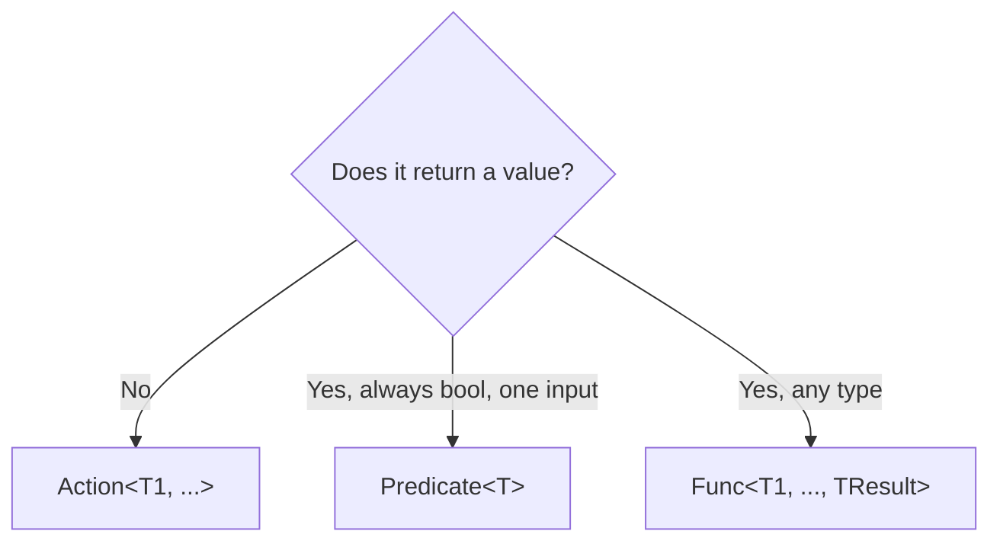
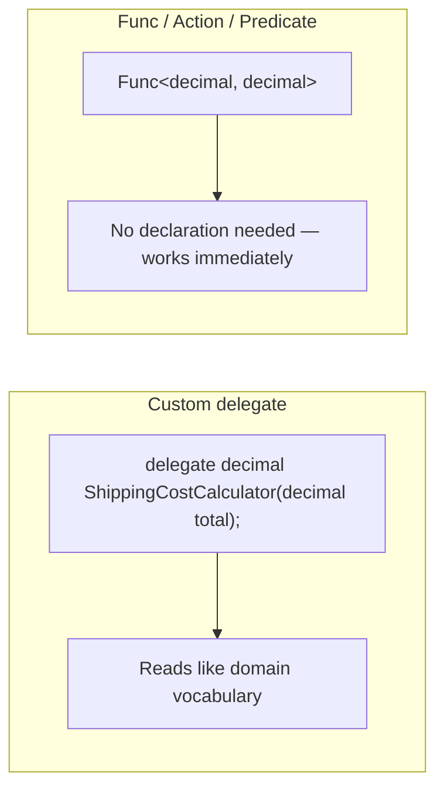

# Func, Action, and Predicate

## Introduction

Before reading this lesson, you should already be comfortable with **[Multicast Delegates](../06-delegates-events/06-02-multicast-delegates.md)** and, before that, declaring a custom delegate type with the `delegate` keyword. Both previous lessons had you write `delegate int MathOperation(int a, int b);` or `delegate void TransactionAuditLogger(...)` by hand before you could use them. This lesson shows you that, in almost every real codebase, you never actually have to. .NET ships a small family of ready-made generic delegate types — `Func<...>`, `Action<...>`, and `Predicate<T>` — that already cover the overwhelming majority of shapes a delegate needs to take, and you've almost certainly already used them without a formal introduction, back in Module 04's `Where` and `Select`.

By the end of this lesson, you will be able to:

- Use `Func<T1, ..., TResult>` for a delegate that takes zero or more parameters and returns a value
- Use `Action<T1, ...>` for a delegate that takes zero or more parameters and returns nothing
- Use `Predicate<T>` for a delegate that takes one value and returns `bool`
- Explain why declaring a custom delegate type like `MathOperation` is rarely necessary anymore
- Recognize that LINQ methods like `Where` and `Select` are simply methods that accept a `Func` as a parameter

## Func, Action, and Predicate — A Layman's Perspective

Think back to the property manager's referral cards from two lessons ago — one card per category of tradesperson, each with its own hand-written label. Now imagine a large facilities company that manages hundreds of buildings, and realizes something: almost every single referral card anyone ever needs falls into one of about three shapes. Some cards are for "come here, do the job, and tell me a number when you're done" — a plumber quoting a repair cost, an inspector reporting a score. Some cards are for "come here, do the job, and I don't need you to tell me anything back" — a cleaning crew, a landscaper. And a smaller set of cards are for a very specific yes/no question — "is this unit currently vacant?" — where the answer is always exactly one word: yes or no.

Rather than have every property manager in every building hand-design and hand-label a brand-new card from scratch for every single situation, the facilities company prints three standard, pre-made card templates and hands them out everywhere: a "reports back a number" template, a "just does the job" template, and a "yes or no" template. A manager filling out a new card doesn't invent a new shape — they grab whichever pre-printed template already matches what they need, fill in the blanks (which specific job, which specific technician), and they're done in seconds. Only in the rare case where a job genuinely doesn't fit any of the three standard templates — perhaps it needs to report back two different numbers in a very specific combination nobody anticipated — does anyone ever bother designing a custom card from scratch.

That's exactly the relationship between a custom `delegate` declaration and .NET's built-in `Func`, `Action`, and `Predicate` types. `Func<T1, ..., TResult>` is the "does something, reports back a value" template. `Action<T1, ...>` is the "does something, reports back nothing" template. `Predicate<T>` is the specialized "answers one yes/no question about one value" template. Nearly every delegate shape a real program ever needs — computing a shipping cost, filtering a list, logging a message — turns out to already fit one of these three pre-printed templates, which is exactly why you'll see custom `delegate` declarations like the ones in the previous two lessons far less often in production C# than you might expect from having just learned them.

## Func, Action, and Predicate — A Programming Language Perspective

`Func<T1, ..., TResult>`, `Action<T1, ...>`, and `Predicate<T>` are generic delegate types defined in `System`, functionally no different from a custom `delegate` declaration — they still derive from `MulticastDelegate`, still support `+=`/`-=`, and still carry every behavior covered in the previous lesson. `Func<T1, ..., T16, TResult>` is overloaded from zero to sixteen input type parameters, with the final type parameter always naming the return type — `Func<int, int, int>` takes two `int` parameters and returns `int`. `Action<T1, ..., T16>` mirrors this for `void`-returning delegates, with an overload, `Action` (no type parameters), for a parameterless action. `Predicate<T>` is narrower and older, equivalent to `Func<T, bool>`, retained mainly because several `List<T>` methods (`Find`, `RemoveAll`, `Exists`) were written against it before `Func` existed. Because these types are generic and already declared by the framework, a lambda expression assigned to a `Func`, `Action`, or `Predicate` variable needs no separate `delegate` declaration anywhere in your code.

## How to Use Func, Action, and Predicate in C#

Each of the three types is chosen by shape: does the operation return a value, and if so, is that value always specifically `bool`? A `Func` covers any return type, an `Action` covers no return value at all, and `Predicate<T>` is the narrow, `bool`-specific case that reads slightly more intention-revealing than `Func<T, bool>` when you're filtering.


*Figure 1: Choosing between the three built-in delegate types is a matter of return shape.*

```csharp
// Program.cs — .NET 10 / C# 14

Func<int, int, int> add = (a, b) => a + b;
Action<string> announce = message => Console.WriteLine($"Announcement: {message}");
Predicate<int> isEven = n => n % 2 == 0;

Console.WriteLine($"Func: 4 + 3 = {add(4, 3)}");
announce("Delegates are now built in.");
Console.WriteLine($"Predicate: is 6 even? {isEven(6)}");
Console.WriteLine($"Predicate: is 7 even? {isEven(7)}");
```

**Console Output:**

```text
Func: 4 + 3 = 7
Announcement: Delegates are now built in.
Predicate: is 6 even? True
Predicate: is 7 even? False
```

None of `add`, `announce`, or `isEven` needed a `delegate` declaration anywhere in this file — `Func<int, int, int>`, `Action<string>`, and `Predicate<int>` are already defined by .NET. Compare this to Lesson 1's `MathOperation`, which required its own line of `delegate` syntax before it could be used at all; `Func<int, int, int>` does the identical job — two `int` parameters in, one `int` out — with zero declarations of your own.

## Real-Time Example: Func, Action, and Predicate in E-Commerce Order Processing

We return to the E-Commerce Order Processing `Order` record introduced in Module 04's `Where` lesson (`OrderId`, `CustomerName`, `Total`, `Status`) to show these three delegate types doing real work: a `Func<Order, bool>` decides which orders need expedited review, an `Action<Order>` prints each one, and a second `Func<Order, decimal>` projects out just the total for a sum — and, crucially, all three are handed directly to LINQ methods you already know.

```csharp
// Program.cs — .NET 10 / C# 14 — Real-Time Example
using System.Globalization;
using System.Linq;

CultureInfo usCulture = CultureInfo.GetCultureInfo("en-US");

List<Order> orders =
[
    new("ORD-9001", "Priya Nair",   145.00m, "Placed"),
    new("ORD-9002", "Wei Chen",      42.50m, "Shipped"),
    new("ORD-9003", "Lucas Silva",  210.00m, "Placed"),
    new("ORD-9004", "Amara Obi",     89.99m, "Cancelled"),
    new("ORD-9005", "Priya Nair",   310.00m, "Placed"),
];

Func<Order, bool> needsExpediting = order => order.Status == "Placed" && order.Total > 100m;
Action<Order> printOrder = order => Console.WriteLine($"  {order.OrderId} — {order.CustomerName}: {order.Total.ToString("C", usCulture)}");
Func<Order, decimal> projectTotal = order => order.Total;

Console.WriteLine("Orders needing expedited review:");
foreach (Order order in orders.Where(needsExpediting))
{
    printOrder(order);
}

decimal combinedTotal = orders.Where(needsExpediting).Select(projectTotal).Sum();
Console.WriteLine($"Combined total of expedited orders: {combinedTotal.ToString("C", usCulture)}");

record Order(string OrderId, string CustomerName, decimal Total, string Status);
```

**Console Output:**

```text
Orders needing expedited review:
  ORD-9001 — Priya Nair: $145.00
  ORD-9003 — Lucas Silva: $210.00
  ORD-9005 — Priya Nair: $310.00
Combined total of expedited orders: $665.00
```

Nothing here is new LINQ syntax — this is exactly `Where` and `Select` from Module 04 — but the delegate types are now explicit rather than hidden inline as lambda literals. `orders.Where(needsExpediting)` accepts `needsExpediting` because `Enumerable.Where<TSource>`'s parameter is declared as `Func<TSource, bool>`; `orders.Select(projectTotal)` accepts `projectTotal` because `Select`'s parameter is `Func<TSource, TResult>`. Every time you've written `orders.Where(o => o.Total > 100m)` inline, you were constructing a `Func<Order, bool>` on the spot — this example simply names that same delegate value first and reuses it twice, on two different LINQ calls, proving it's an ordinary variable like any other.

## Custom Delegate vs Func/Action/Predicate

A hand-declared `delegate` type and the built-in generics behave identically at runtime — both derive from `MulticastDelegate`, both support multicasting, both are invoked the same way. The difference is entirely about naming and necessity: a custom delegate type gives you a distinct, self-documenting type name in your domain vocabulary (`ShippingCostCalculator` reads better in a signature than `Func<decimal, decimal>`), at the cost of one extra declaration; `Func`/`Action`/`Predicate` need no declaration at all, at the cost of a more generic-looking signature.


*Figure 2: Both compile to the same kind of delegate type underneath — the choice is about readability, not capability.*

| Aspect | Custom `delegate` type | `Func` / `Action` / `Predicate` |
|---|---|---|
| Declaration required | Yes — one line per shape | No — already defined by .NET |
| Signature readability | Domain-specific name (`ShippingCostCalculator`) | Generic name (`Func<decimal, decimal>`) |
| Multicast support | Yes | Yes — identical behavior |
| When it's the better choice | A signature that appears repeatedly and benefits from a domain name | Nearly everything else — the default choice today |
| Where you'll see it in this curriculum | Public library APIs (`EventHandler`, delegate-based callback parameters) | Almost all lambda-based code, including all of LINQ |

## Types of Built-In Delegate Shapes in C#

`Func`, `Action`, and `Predicate` aren't the only related built-in shapes worth knowing:

1. **`Func<T1, ..., T16, TResult>`** — up to sixteen input parameters plus a return value, covering nearly every non-`void` delegate shape.
2. **`Action` and `Action<T1, ..., T16>`** — the `void`-returning counterpart, from zero to sixteen parameters.
3. **`Predicate<T>`** — the `bool`-specific single-parameter case, equivalent to `Func<T, bool>`, still used by some older `List<T>` methods.
4. **`Comparison<T>`** — a lesser-known built-in delegate, `int (T x, T y)`, used by `List<T>.Sort`.
5. **[Events in C#](../06-delegates-events/06-04-events-in-csharp.md)** — where `EventHandler` and `EventHandler<TEventArgs>`, two more built-in delegate types, take over from `Func`/`Action` for the publisher/subscriber pattern.

## What You've Learned & What's Next

`Func<T1, ..., TResult>`, `Action<T1, ...>`, and `Predicate<T>` are ordinary multicast delegate types, already declared by .NET, that cover the overwhelming majority of shapes a real delegate needs — which is why declaring a custom `delegate` type, while still valid and occasionally the clearer choice, is something you'll reach for far less often once these three are in your toolkit. Every `Where` and `Select` call from Module 04 was already using `Func` behind the scenes; this lesson just made that explicit.

Continue your learning journey with **[Events in C#](../06-delegates-events/06-04-events-in-csharp.md)**, where a multicast delegate gets wrapped in the `event` keyword, restricting who can invoke or reassign it — the mechanism behind the publisher/subscriber pattern.

---
*Applies to: .NET 10 / C# 14. Last reviewed 2026-08-16.*
