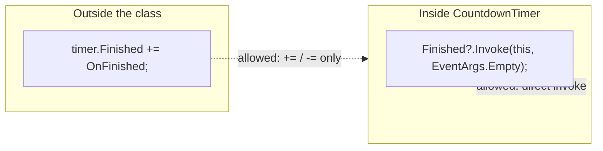
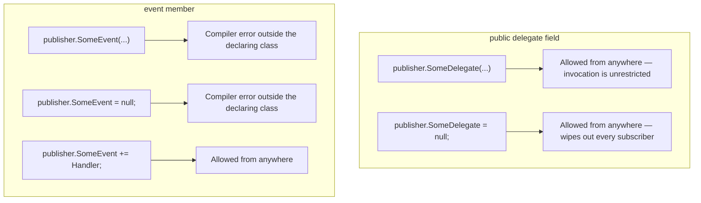

# Events in C#

## Introduction

Before reading this lesson, you should already be comfortable with **[Func, Action, and Predicate](../06-delegates-events/06-03-func-action-predicate.md)** and, further back, with multicast delegates combining several methods behind `+=`. Every delegate you've used so far has had one weakness for a certain kind of design: anyone holding the delegate variable could not only subscribe to it, but also invoke it directly, or wipe out every other subscriber by reassigning it with `=` instead of `+=`. This lesson introduces the `event` keyword, which takes an ordinary multicast delegate and locks most of that power away from everyone except the class that declared it — the exact restriction a publisher/subscriber design needs.

By the end of this lesson, you will be able to:

- Declare a class member with the `event` keyword, backed by a delegate type such as `EventHandler`
- Explain what an `event` restricts that a plain public delegate field does not
- Subscribe to and unsubscribe from an event with `+=` and `-=` from outside the declaring class
- Raise an event from inside the declaring class using the null-conditional `?.Invoke(...)` pattern
- Use the standard `EventHandler` delegate signature, `(object? sender, EventArgs e)`
- Explain the publisher/subscriber relationship an event is designed to express

## Events — A Layman's Perspective

Recall the fire alarm panel from the multicast delegates lesson — one lever, several wired actions running in sequence. Now consider who is actually allowed to touch that panel. Any employee in the building is welcome to register their department's phone number with building security, so that when the alarm sounds, security calls them too — that's a subscription anyone can add. But no employee, however enthusiastic, is allowed to walk up to the panel and pull the lever themselves just to test it, and certainly none of them is allowed to rip out every other department's wiring and replace it with only their own number. Pulling the lever is reserved entirely for the fire safety system itself, the one authority actually watching for smoke; everyone else's relationship to that panel is strictly "add my number to the list" or "remove my number from the list," nothing more.

This distinction exists for an obvious reason: if any employee could trigger the alarm on a whim, or silently disconnect every other department's line, the whole system would be worthless as a safety mechanism. The panel's value comes precisely from the fact that triggering it is centralized and trustworthy — only the actual smoke detector wiring can pull that lever — while *subscribing* to it stays open to anyone who has a legitimate reason to be notified. A payroll clerk doesn't need permission from IT to add their own desk phone to the alarm's call list, and IT doesn't need to know payroll exists to keep the alarm working correctly for everyone else already subscribed.

Software built around a raw, unrestricted "referral card" — a plain public delegate field — has exactly the vulnerability the fire panel design avoids. Any code holding that field could invoke it whenever it pleased, faking an alert that never really happened, or overwrite it with `=`, silently discarding every other subscriber's registration in one line. An `event` is the fire panel's actual physical design translated into code: the ability to *subscribe* (`+=`) or *unsubscribe* (`-=`) stays open to any outside code that has a legitimate reason to listen, while the ability to *pull the lever* — invoke the event directly, or reassign it wholesale — stays locked inside the one class responsible for deciding when the real thing has actually happened.

## Events — A Programming Language Perspective

An `event` is a class member, declared with the `event` keyword ahead of a delegate type, that the compiler treats as a restricted view onto an underlying multicast delegate field. From outside the declaring class, only `+=` and `-=` are permitted on an event member — direct invocation (`myPublisher.SomeEvent(...)`) and direct reassignment (`myPublisher.SomeEvent = null`) are compiler errors from any code outside the class. From inside the declaring class, the event behaves like an ordinary delegate field: it can be invoked directly, most safely with the null-conditional pattern `SomeEvent?.Invoke(sender, args)`, which avoids a `NullReferenceException` when no subscriber has attached yet. By strong convention, an event's delegate type follows the shape `void (object? sender, TEventArgs e)` — matching .NET's built-in `EventHandler` delegate for the parameterless case, and `EventHandler<TEventArgs>` when custom event data is needed, covered in the next lesson.

## How to Declare and Raise an Event in C#

Declaring an event looks almost identical to declaring a public delegate-typed field — the only syntactic difference is the `event` keyword itself — but that one keyword is what enforces everything described above. The example below has a `CountdownTimer` raise a `Finished` event, using .NET's built-in `EventHandler` delegate, once its internal count reaches zero.


*Figure 1: Outside code may only subscribe or unsubscribe; only `CountdownTimer` itself may actually raise `Finished`.*

```csharp
// Program.cs — .NET 10 / C# 14

var timer = new CountdownTimer(3);
timer.Finished += OnFinished;

timer.Tick();
timer.Tick();
timer.Tick();

static void OnFinished(object? sender, EventArgs e)
{
    Console.WriteLine("Countdown finished!");
}

class CountdownTimer(int startValue)
{
    private int _remaining = startValue;

    public event EventHandler? Finished;

    public void Tick()
    {
        _remaining--;
        Console.WriteLine($"Tick — {_remaining} remaining");

        if (_remaining <= 0)
        {
            Finished?.Invoke(this, EventArgs.Empty);
        }
    }
}
```

**Console Output:**

```text
Tick — 2 remaining
Tick — 1 remaining
Tick — 0 remaining
Countdown finished!
```

`OnFinished` subscribes to `Finished` with `+=` from outside `CountdownTimer` — the only operation the calling code is allowed to perform on it. `CountdownTimer` itself decides exactly when `Finished` actually fires: only once, on the third `Tick()`, when `_remaining` reaches `0`. The `?.` in `Finished?.Invoke(...)` matters in practice — if nothing had ever subscribed, `Finished` would be `null`, and invoking a `null` delegate directly throws; the null-conditional operator short-circuits instead, safely doing nothing when there are no subscribers.

## Real-Time Example: A Low-Balance Alert in Banking/ATM

We extend the Banking/ATM case study with a `BankAccount` that raises a `LowBalanceAlert` event — using the plain `EventHandler` delegate, since no custom data beyond "which account" needs to travel with it yet — whenever a withdrawal drops the balance below a configured threshold. Two independent subscribers, an SMS notifier and a branch-manager flag, both attach to the same event without knowing about each other.

```csharp
// Program.cs — .NET 10 / C# 14 — Real-Time Example
using System.Globalization;

CultureInfo usCulture = CultureInfo.GetCultureInfo("en-US");

var account = new BankAccount("****3301", 300.00m, lowBalanceThreshold: 100.00m);
account.LowBalanceAlert += NotifyCustomerBySms;
account.LowBalanceAlert += NotifyBranchManager;

decimal[] withdrawals = [50.00m, 175.00m];

foreach (decimal amount in withdrawals)
{
    string amountDisplay = amount.ToString("C", usCulture);
    account.Withdraw(amount);
    Console.WriteLine($"Withdrew {amountDisplay}. New balance: {account.Balance.ToString("C", usCulture)}");
}

void NotifyCustomerBySms(object? sender, EventArgs e)
{
    var source = (BankAccount)sender!;
    Console.WriteLine($"  [SMS] Alert: account {source.MaskedAccountNumber} balance is low ({source.Balance.ToString("C", usCulture)}).");
}

void NotifyBranchManager(object? sender, EventArgs e)
{
    var source = (BankAccount)sender!;
    Console.WriteLine($"  [Branch] Flagging account {source.MaskedAccountNumber} for manager review.");
}

class BankAccount(string maskedAccountNumber, decimal balance, decimal lowBalanceThreshold)
{
    public string MaskedAccountNumber { get; } = maskedAccountNumber;
    public decimal Balance { get; private set; } = balance;
    public decimal LowBalanceThreshold { get; } = lowBalanceThreshold;

    public event EventHandler? LowBalanceAlert;

    public void Withdraw(decimal amount)
    {
        if (amount <= 0 || amount > Balance)
        {
            throw new ArgumentOutOfRangeException(nameof(amount), "Withdrawal amount is invalid for this account.");
        }

        Balance -= amount;

        if (Balance < LowBalanceThreshold)
        {
            LowBalanceAlert?.Invoke(this, EventArgs.Empty);
        }
    }
}
```

**Console Output:**

```text
Withdrew $50.00. New balance: $250.00
  [SMS] Alert: account ****3301 balance is low ($75.00).
  [Branch] Flagging account ****3301 for manager review.
Withdrew $175.00. New balance: $75.00
```

The first withdrawal leaves the balance at $250.00, still above the $100.00 threshold, so `LowBalanceAlert` never fires and neither subscriber runs. The second withdrawal drops the balance to $75.00, below the threshold, and both subscribers — SMS and branch manager — fire in the order they were attached, exactly as multicast invocation always runs. Notice the two alert lines print *before* `"Withdrew $175.00..."`, even though that `Console.WriteLine` appears first in the surrounding loop — because `LowBalanceAlert?.Invoke(...)` runs synchronously *inside* `Withdraw`, completing before `Withdraw` ever returns control back to the loop. Neither `NotifyCustomerBySms` nor `NotifyBranchManager` needed to know the other existed, and `BankAccount` never had to hard-code a list of who to notify — that's the publisher/subscriber pattern working exactly as intended.

## Public Delegate Field vs Event

A `public` field of a delegate type and an `event` member look almost identical at the declaration site, differing by one keyword — but they grant outside code very different levels of trust. A public delegate field is fully mutable from anywhere: any code can invoke it, clear it, or replace it entirely with `=`. An event permits only `+=` and `-=` from outside the declaring class, and reserves invocation and wholesale reassignment for the declaring class alone.


*Figure 2: An `event` narrows a public delegate field down to exactly the two operations a subscriber legitimately needs.*

| Aspect | Public delegate field | `event` member |
|---|---|---|
| Subscribing (`+=`) from outside | Allowed | Allowed |
| Unsubscribing (`-=`) from outside | Allowed | Allowed |
| Invoking from outside | Allowed — a design risk | Compiler error |
| Reassigning with `=` from outside | Allowed — silently drops every subscriber | Compiler error |
| Typical use | Rare — usually a design mistake | The standard mechanism for publisher/subscriber notifications |

## Types of Event-Related Constructs in C#

The plain `EventHandler`-based event shown in this lesson is the simplest case; several related forms round out the picture:

1. **`EventHandler`** — the built-in, parameterless-data delegate used in this lesson's examples, `void (object? sender, EventArgs e)`.
2. **[Custom EventArgs](../06-delegates-events/06-05-custom-eventargs.md)** — `EventHandler<TEventArgs>`, carrying custom data alongside the notification, covered next.
3. **Static events** — declared with `static event`, associated with the type itself rather than any one instance.
4. **Custom `add`/`remove` accessors** — an event can define its own subscribe/unsubscribe logic explicitly, instead of relying on the compiler-generated default.
5. **[Multicast Delegates](../06-delegates-events/06-02-multicast-delegates.md)** — the mechanism every event is built directly on top of.

## What You've Learned & What's Next

An `event` is a multicast delegate with its invocation and reassignment locked inside the declaring class, leaving outside code only `+=` and `-=` — exactly the restriction a trustworthy publisher/subscriber design needs, and exactly what a raw public delegate field fails to provide. `BankAccount`'s `LowBalanceAlert` never told its subscribers how to behave; it simply gave any interested code a safe, narrow way to be notified.

Continue your learning journey with **[Custom EventArgs](../06-delegates-events/06-05-custom-eventargs.md)**, where events learn to carry more than just "something happened" — a custom `EventArgs` subclass that ships real data alongside the notification.

---
*Applies to: .NET 10 / C# 14. Last reviewed 2026-08-16.*
