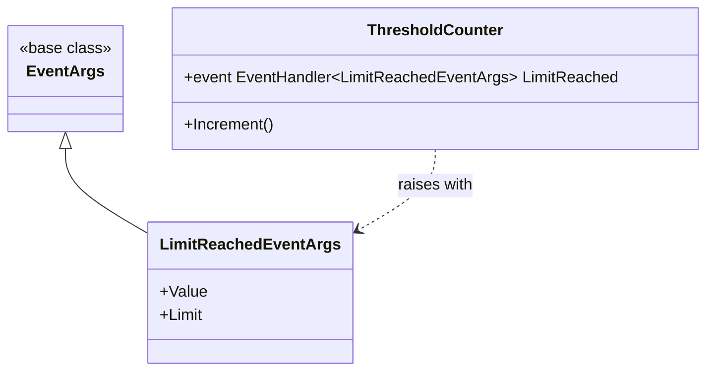
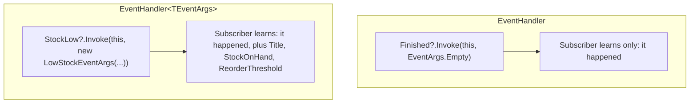

# Custom EventArgs

## Introduction

Before reading this lesson, you should already be comfortable with **[Events in C#](../06-delegates-events/06-04-events-in-csharp.md)** — declaring an `event` member, subscribing with `+=`, and raising it safely with `?.Invoke(...)`. Every event in that lesson used the plain `EventHandler` delegate, which tells a subscriber only that *something* happened — it carries no details about *what*. `BankAccount`'s `LowBalanceAlert` could tell a subscriber to check the account, but the subscriber had to go read `Balance` itself to find out anything more. This lesson removes that limitation: a custom class deriving from `EventArgs` lets an event ship real, specific data alongside the notification.

By the end of this lesson, you will be able to:

- Derive a custom class from `System.EventArgs` to carry event-specific data
- Declare an event using `EventHandler<TEventArgs>` instead of the plain `EventHandler`
- Follow the standard handler signature convention, `(object? sender, TEventArgs e)`
- Raise an event, passing a populated instance of your custom `EventArgs` subclass
- Read subscriber-side data directly off the event args, without querying the sender separately
- Build a Library/Inventory `Book` that raises a `LowStockEventArgs` event when its stock runs low

## Custom EventArgs — A Layman's Perspective

Go back once more to the fire alarm panel, and add one more realistic detail. A basic alarm system only tells you *that* something happened — the bell rings, and that's the entire message. Everyone who hears it has to physically go find out what's actually going on: which floor, how serious, is it a real fire or a burst pipe accidentally tripping a sensor. A more sophisticated modern system does something noticeably better: alongside the alarm, it sends a small, structured slip to every subscriber's phone — "Third floor, west wing, smoke detected, confidence level high" — so that everyone who's subscribed to alerts already knows exactly what's happening before they've taken a single step toward the stairwell.

That slip isn't a free-for-all scrap of paper with an unpredictable shape, either. Every genuine fire alert this building's system ever produces uses the exact same slip format: location, alert type, confidence level, timestamp — always those four fields, in that order, so that every subscriber's phone app, regardless of who built it, knows precisely where to look for each piece of information. A "water leak detected" alert uses a *different* slip format — perhaps location, and estimated flow rate instead of confidence level — because a water leak and a fire genuinely aren't the same kind of event and don't carry the same kind of data. But within any one *category* of alert, the slip's shape never changes from one alert to the next.

Notice, too, that the slip always identifies which specific alarm panel sent it, separately from the details of the event itself — a building with alarm panels on five different floors needs subscribers to know both "what happened" (the slip's contents) and "which panel is reporting it" (a distinct piece of information, since the third-floor panel and the first-floor panel are two entirely different sources triggering what might otherwise look like an identical alert).

The bridge back to programming: a plain event tells subscribers only that something happened, the way a basic alarm bell does. A custom `EventArgs` subclass is the structured slip — a fixed, predictable shape of fields specific to one category of event — carried alongside the notification, so subscribers get the details they need without a separate round trip back to the source. And the "which panel sent this" information maps directly onto the event handler's own `sender` parameter, kept deliberately separate from the event-specific data riding in the `EventArgs` object itself.

## Custom EventArgs — A Programming Language Perspective

`System.EventArgs` is the base class every event's data payload conventionally derives from; the parameterless base class itself carries no data at all and is used directly (via `EventArgs.Empty`) for events with nothing to report beyond "this happened," exactly as in the previous lesson. To carry real data, you declare a class — by convention named `{Something}EventArgs` — that derives from `EventArgs` and exposes whatever fields the event needs, typically as `init`-only or get-only properties set through its constructor. The event member itself is then declared as `EventHandler<TEventArgs>` rather than the plain `EventHandler`, where `TEventArgs` is your custom class. `EventHandler<TEventArgs>` is itself a generic delegate built into .NET, with the signature `void (object? sender, TEventArgs e)` — `sender` identifies which object raised the event (conventionally passed as `this`), while `e` carries the event-specific payload, keeping "who" and "what" cleanly separated exactly as the alarm panel analogy described.

## How to Define and Raise a Custom EventArgs Event in C#

Defining a custom event follows three steps: derive a class from `EventArgs` to hold the data, declare the event member using `EventHandler<TYourEventArgs>`, and raise it by constructing an instance of that class and passing it to `?.Invoke(this, ...)`. The example below has a `ThresholdCounter` raise a `LimitReached` event, reporting both the value that triggered it and the limit itself.


*Figure 1: `LimitReachedEventArgs` derives from `EventArgs` to carry the specific data `ThresholdCounter`'s event needs to report.*

```csharp
// Program.cs — .NET 10 / C# 14

var counter = new ThresholdCounter(limit: 3);
counter.LimitReached += OnLimitReached;

counter.Increment();
counter.Increment();
counter.Increment();

static void OnLimitReached(object? sender, LimitReachedEventArgs e)
{
    Console.WriteLine($"Limit reached! Value hit {e.Value} (limit was {e.Limit}).");
}

class ThresholdCounter(int limit)
{
    private int _value;

    public event EventHandler<LimitReachedEventArgs>? LimitReached;

    public void Increment()
    {
        _value++;
        Console.WriteLine($"Incremented to {_value}");

        if (_value >= limit)
        {
            LimitReached?.Invoke(this, new LimitReachedEventArgs(_value, limit));
        }
    }
}

class LimitReachedEventArgs(int value, int limit) : EventArgs
{
    public int Value { get; } = value;
    public int Limit { get; } = limit;
}
```

**Console Output:**

```text
Incremented to 1
Incremented to 2
Incremented to 3
Limit reached! Value hit 3 (limit was 3).
```

`OnLimitReached` never had to call back into `counter` to find out what happened — `e.Value` and `e.Limit` arrived directly on the event args object passed into the handler. Compare this to the previous lesson's `LowBalanceAlert`, where the handler had to reach into `source.Balance` itself after casting `sender`; here, the data the handler actually needs travels with the event, which is the entire point of defining a custom `EventArgs` subclass instead of relying on the sender alone.

## Real-Time Example: A Low-Stock Alert in Library/Inventory Management

We start a new thread of the Library/Inventory Management case study: a `Book` that tracks its own `StockOnHand` and raises a `LowStockEventArgs` event — carrying the book's title, remaining stock, and reorder threshold — the moment a checkout drops its stock to or below that threshold. Two independent subscribers react: one notifies the purchasing team, the other drafts a reorder request.

```csharp
// Program.cs — .NET 10 / C# 14 — Real-Time Example

var book = new Book("Clean Code", "978-0132350884", stockOnHand: 5, reorderThreshold: 3);
book.StockLow += NotifyPurchasingTeam;
book.StockLow += CreateReorderRequest;

int[] checkoutBatches = [1, 1];

foreach (int quantity in checkoutBatches)
{
    book.CheckOut(quantity);
    Console.WriteLine($"Checked out {quantity} cop{(quantity == 1 ? "y" : "ies")} of {book.Title}. Stock on hand: {book.StockOnHand}");
}

void NotifyPurchasingTeam(object? sender, LowStockEventArgs e)
{
    Console.WriteLine($"  [Purchasing] '{e.Title}' is low: {e.StockOnHand} left (reorder threshold: {e.ReorderThreshold}).");
}

void CreateReorderRequest(object? sender, LowStockEventArgs e)
{
    int reorderQuantity = e.ReorderThreshold * 4;
    Console.WriteLine($"  [Reorder] Draft purchase order created for {reorderQuantity} more cop{(reorderQuantity == 1 ? "y" : "ies")} of '{e.Title}'.");
}

class Book(string title, string isbn, int stockOnHand, int reorderThreshold)
{
    public string Title { get; } = title;
    public string Isbn { get; } = isbn;
    public int StockOnHand { get; private set; } = stockOnHand;
    public int ReorderThreshold { get; } = reorderThreshold;

    public event EventHandler<LowStockEventArgs>? StockLow;

    public void CheckOut(int quantity)
    {
        if (quantity <= 0 || quantity > StockOnHand)
        {
            throw new InvalidOperationException($"Cannot check out {quantity} cop{(quantity == 1 ? "y" : "ies")} of '{Title}'.");
        }

        StockOnHand -= quantity;

        if (StockOnHand <= ReorderThreshold)
        {
            StockLow?.Invoke(this, new LowStockEventArgs(Title, StockOnHand, ReorderThreshold));
        }
    }
}

class LowStockEventArgs(string title, int stockOnHand, int reorderThreshold) : EventArgs
{
    public string Title { get; } = title;
    public int StockOnHand { get; } = stockOnHand;
    public int ReorderThreshold { get; } = reorderThreshold;
}
```

**Console Output:**

```text
Checked out 1 copy of Clean Code. Stock on hand: 4
  [Purchasing] 'Clean Code' is low: 3 left (reorder threshold: 3).
  [Reorder] Draft purchase order created for 12 more copies of 'Clean Code'.
Checked out 1 copy of Clean Code. Stock on hand: 3
```

`Clean Code` starts at 5 copies with a reorder threshold of 3. The first checkout drops stock to 4 — still above the threshold, so `StockLow` stays silent. The second checkout drops it to 3, exactly at the threshold, and `StockLow` fires: both `NotifyPurchasingTeam` and `CreateReorderRequest` run, in subscription order, each reading `e.Title`, `e.StockOnHand`, and `e.ReorderThreshold` straight off the event args rather than reaching back into `book`. As in the previous lesson, both alert lines print *before* the second `"Checked out..."` line, because `StockLow?.Invoke(...)` runs synchronously inside `CheckOut`, completing before control returns to the loop. Notice, too, that `CreateReorderRequest` computes its reorder quantity (`e.ReorderThreshold * 4`) entirely from data carried on `e` — it never needed a reference to `book` at all, which is exactly the decoupling a well-designed `EventArgs` payload is meant to provide.

## Plain EventHandler vs EventHandler&lt;TEventArgs&gt;

The plain `EventHandler` from the previous lesson and the generic `EventHandler<TEventArgs>` here solve the same structural problem — notifying subscribers safely — but differ in exactly one respect: whether the notification carries a data payload beyond `EventArgs.Empty`. Reach for plain `EventHandler` when an event's occurrence is the only information a subscriber needs (`Finished`, `Completed`); reach for `EventHandler<TEventArgs>` the moment even one piece of specific data — a value, a reason, an affected item — would save a subscriber from having to query the sender to find out more.


*Figure 2: The generic form carries a structured payload; the plain form only signals that the event occurred.*

| Aspect | `EventHandler` | `EventHandler<TEventArgs>` |
|---|---|---|
| Data carried | None — `EventArgs.Empty` | Whatever properties `TEventArgs` exposes |
| Handler signature | `(object? sender, EventArgs e)` | `(object? sender, TEventArgs e)` |
| Subscriber needs details? | Must query the sender directly | Reads them straight off `e` |
| Extra type required | No | Yes — a class deriving from `EventArgs` |
| Best suited to | Simple "it happened" notifications (`Finished`, `Completed`) | Any event where specific data belongs with the notification |

## Types of EventArgs-Related Patterns in C#

Deriving from `EventArgs` is the standard approach, but a few related patterns and variations are worth knowing:

1. **`EventArgs.Empty`** — the shared, reusable empty instance used whenever a plain `EventHandler` needs a non-null `EventArgs` argument.
2. **Records as `EventArgs`** — a modern alternative to a hand-written class, giving a custom `EventArgs` type value equality and a concise declaration.
3. **Cancellable event args** — a custom `EventArgs` subclass exposing a mutable `bool Cancel` property, letting a subscriber veto an in-progress operation (the pattern behind WinForms' `FormClosingEventArgs`).
4. **Generic constraints on `TEventArgs`** — some APIs constrain `EventHandler<TEventArgs>` usage to `where TEventArgs : EventArgs`, though the built-in delegate itself does not enforce this.
5. **[Lambda Expressions](../06-delegates-events/06-06-lambda-expressions.md)** — the next lesson, where inline handlers replace named methods like `NotifyPurchasingTeam` for short, one-off subscriptions.

## What You've Learned & What's Next

A class deriving from `EventArgs`, paired with an event declared as `EventHandler<TEventArgs>`, lets a notification carry real data — `LowStockEventArgs`'s `Title`, `StockOnHand`, and `ReorderThreshold` reached every subscriber directly, without any of them needing to query `book` a second time. That's the difference between an alarm that merely rings and one that tells you exactly what's wrong the moment it does.

Continue your learning journey with **[Lambda Expressions](../06-delegates-events/06-06-lambda-expressions.md)**, where the named handler methods used throughout this module — `OnFinished`, `NotifyPurchasingTeam`, `CreateReorderRequest` — get a shorter, inline alternative for cases where a separate named method isn't worth writing.

---
*Applies to: .NET 10 / C# 14. Last reviewed 2026-08-16.*
