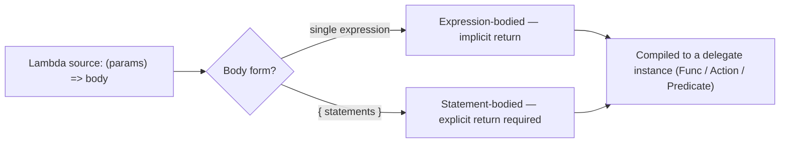
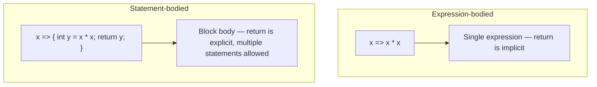

# Lambda Expressions

## Introduction

Before reading this lesson, you should already be comfortable with **[Custom EventArgs](../06-delegates-events/06-05-custom-eventargs.md)** — and, more broadly, with the whole idea this module has built up so far: a delegate is a type-safe reference to a method, `Func`, `Action`, and `Predicate` are the built-in delegate types you reach for most often, and an event is a restricted delegate designed for publish-subscribe. Every example up to this point has supplied those delegates with a named method written somewhere else in the file. This lesson introduces a faster, more direct way to write that method inline, at the exact spot it's needed: the **lambda expression**.

By the end of this lesson, you will be able to:

- Read and write the `=>` (lambda operator) syntax for both single parameters and parameter lists
- Distinguish an expression-bodied lambda from a statement-bodied lambda, and know when each is required
- Assign a lambda directly to a `Func<T,TResult>`, `Action<T>`, or `Predicate<T>` variable
- Explain why lambdas are now the default way LINQ methods like `Where` and `Select` receive their logic
- Recognize that a lambda's parameter types are usually inferred from the delegate it's being assigned to

## Lambda Expressions — A Layman's Perspective

Picture a restaurant kitchen with a small, permanent staff of specialist chefs, each trained for one specific job — a pastry chef, a grill chef, a sauce chef. Training one of these chefs takes real investment: they go through a formal process, get a name tag, a station, and a fixed role on the roster, and once trained they stick around indefinitely, ready to be called on by name whenever their specialty is needed. That's exactly like the named methods you've been writing all along — declared once, given a name, and referenced by that name whenever a delegate needs to point at them.

Now picture something different: a one-off, oddly specific request that will only ever be needed exactly once, right now, in the middle of a single order. A customer wants their steak "cut into exactly six even strips, plated in a fan shape, no seasoning on the third strip only." It would be absurd to hire, train, and permanently staff a dedicated "six-strip fan-plating chef" for this single instruction. Instead, the head chef just grabs the nearest capable hand, says the instruction out loud on the spot — right there, in the moment, with no name tag and no formal onboarding — and it gets done and forgotten. Nobody writes that instruction down as a standing recipe; it existed just long enough to be carried out.

That second scenario is precisely what a lambda expression is for. Whenever you need a small piece of logic that a delegate, a LINQ method, or an event handler is asking for — "given this item, tell me true or false," "given this item, transform it into that" — and that logic genuinely only matters right at the call site, writing an entire named method for it is the equivalent of hiring a permanent specialist chef for a single strip of steak. A lambda lets you hand over the instruction inline, in the exact shape the moment calls for, without ever giving it a name or a separate declaration elsewhere in the file.

This doesn't mean named methods stop mattering — the specialist chefs are still exactly right when the same instruction gets reused constantly across many orders, or when the logic is complicated enough that giving it a name actually helps whoever reads the recipe later. Lambdas earn their keep specifically in the in-between cases: logic short enough, and local enough, that writing it out as a full method would just be ceremony standing between you and the one line that actually matters.

In code, that spot-instruction handed to the nearest capable hand is the lambda expression — an unnamed function, written exactly where it's needed, and handed straight to whatever delegate parameter is waiting for it.

## Lambda Expressions — A Programming Language Perspective

A lambda expression has the form `(parameters) => body`, where `=>` is read as "goes to." The compiler converts a lambda into an instance of whatever delegate type the context expects — `Func<T,TResult>`, `Action<T>`, `Predicate<T>`, or a custom delegate type — inferring the parameter types from that target delegate rather than requiring them to be spelled out. A single parameter can drop its parentheses (`x => x * 2`); zero or multiple parameters require them (`() => ...`, `(x, y) => x + y`).

The *body* comes in two forms. An **expression-bodied** lambda is a single expression whose value is implicitly returned: `x => x * x`. A **statement-bodied** lambda wraps one or more statements in braces and, for anything non-`void`, needs an explicit `return`: `x => { int squared = x * x; return squared; }`. Both forms compile to equivalent delegate instances — the choice is purely about how much logic the lambda needs to express.

## How to Write Lambda Expressions in C#

Every lambda you'll write follows the same shape decision: does the logic fit in one expression, or does it need intermediate steps? A single calculation, comparison, or projection almost always reads better as an expression-bodied lambda. Anything that needs a local variable, a conditional with multiple branches, or more than one statement needs the statement-bodied form with an explicit `return`. The example below assigns lambdas of both forms directly to `Func`, `Action`, and `Predicate` variables — the three delegate types this module introduced in earlier lessons — and then calls each one just like any other delegate instance.


*Figure 1: Either lambda form compiles to the same kind of delegate instance — the body form only affects how the logic is written.*

```csharp
// Program.cs — .NET 10 / C# 14
Func<int, int> square = x => x * x; // expression-bodied

Action<string> greet = name => Console.WriteLine($"Hello, {name}!"); // expression-bodied

Predicate<int> isEven = n => // statement-bodied — needs an explicit return
{
    bool result = n % 2 == 0;
    return result;
};

Console.WriteLine(square(6));
greet("Priya");
Console.WriteLine(isEven(7));

List<int> numbers = [4, 7, 10, 13, 16];
List<int> evens = numbers.FindAll(isEven);
Console.WriteLine(string.Join(", ", evens));
```

**Console Output:**

```text
36
Hello, Priya!
False
4, 10, 16
```

`square` and `greet` are both expression-bodied — each is a single expression whose result (or side effect, for `greet`) *is* the lambda's entire job. `isEven` needed a local variable to hold an intermediate result, so it switched to the statement-bodied form with braces and an explicit `return`. Note that `isEven`, once assigned, behaves exactly like any other `Predicate<int>` — `List<T>.FindAll` doesn't know or care that its logic was written inline rather than as a named method.

## Real-Time Example: Lambda Expressions in E-Commerce Order Processing

We extend the E-Commerce Order Processing domain's `Product` record — `Sku`, `Name`, `Category`, `Price`, `StockOnHand`, and `ReorderThreshold` — introduced when the LINQ module queried the order catalog. Here, a small inventory service builds a low-stock report using nothing but lambdas: one to decide *which* products qualify, and one to decide *how* to format each one for the report. Both are assigned to `Func` variables first, then handed straight to `Where` and `Select` — the same LINQ methods from Module 04, now finally shown accepting the lambda syntax they were always designed for.

```csharp
// Program.cs — .NET 10 / C# 14 — Real-Time Example
List<Product> catalog =
[
    new("SKU-1001", "Wireless Mouse", "Accessories", 24.99m, 8, 15),
    new("SKU-1002", "Mechanical Keyboard", "Accessories", 79.99m, 42, 10),
    new("SKU-1003", "USB-C Hub", "Accessories", 34.50m, 3, 12),
    new("SKU-1004", "27-inch Monitor", "Displays", 249.00m, 6, 5),
];

Func<Product, bool> isLowStock = p => p.StockOnHand < p.ReorderThreshold;
Func<Product, string> formatAlert = p =>
    $"{p.Sku} ({p.Name}): {p.StockOnHand} on hand, reorder at {p.ReorderThreshold}";

IEnumerable<string> alerts = catalog
    .Where(isLowStock)
    .OrderBy(p => p.StockOnHand)
    .Select(formatAlert);

foreach (string alert in alerts)
{
    Console.WriteLine(alert);
}

record Product(string Sku, string Name, string Category, decimal Price, int StockOnHand, int ReorderThreshold);
```

**Console Output:**

```text
SKU-1003 (USB-C Hub): 3 on hand, reorder at 12
SKU-1001 (Wireless Mouse): 8 on hand, reorder at 15
```

Only two of the four products qualify — the USB-C Hub (3 on hand, threshold 12) and the Wireless Mouse (8 on hand, threshold 15) — while the Mechanical Keyboard and the 27-inch Monitor both have more stock than their reorder threshold, so `isLowStock` filters them out. Notice that `isLowStock` and `formatAlert` were declared once as named `Func` variables and then reused across both a `Where` and a `Select`, while the sort key passed to `OrderBy` (`p => p.StockOnHand`) was short enough to stay inline — exactly the judgment call this lesson is about.

## Expression-Bodied Lambdas vs Statement-Bodied Lambdas

Both forms produce the same kind of delegate instance underneath, so the choice between them is entirely about readability and capability, not correctness. An expression-bodied lambda is a promise that the entire job fits in one value-producing expression — no intermediate variables, no branching logic, just a direct transformation or a direct comparison. The moment that promise breaks — the moment you need to compute something first, validate an input, or log a step before returning — the statement-bodied form isn't just a style preference anymore, it's a requirement, because an expression body has nowhere to put a second statement.


*Figure 2: Both compile to the same delegate type — the block form simply has room for more than one step.*

| Aspect | Expression-bodied | Statement-bodied |
|---|---|---|
| Syntax | `x => x * x` | `x => { ...; return x * x; }` |
| Return | Implicit — the expression's value | Explicit `return` required for a non-`void` result |
| Multiple statements | Not allowed | Allowed |
| Typical use | Short LINQ projections and filters (`Select`, `Where`) | Validation, multi-step calculations, logging before returning |

## Types of Lambda Usage in C#

Lambda syntax itself is simple, but where and how it's used varies across the rest of the language — several of those variations are covered in their own dedicated lessons:

1. **[Closures in C#](../06-delegates-events/06-07-closures-in-csharp.md)** — what happens when a lambda reaches outside itself and captures a variable from its enclosing scope.
2. **[Anonymous Methods vs Lambdas](../06-delegates-events/06-08-anonymous-methods-vs-lambdas.md)** — the older `delegate(...) { ... }` syntax lambdas superseded.
3. **[Filtering with `Where`](../04-linq/04-04-filtering-with-where.md)** — the LINQ method this lesson's real-time example leaned on most directly.
4. **[Delegates in C#](../06-delegates-events/06-01-delegates-in-csharp.md)** — the foundational type every lambda ultimately becomes an instance of.
5. **[Introduction to Concurrency and Multithreading](../07-concurrency-parallel-async/07-01-introduction-to-concurrency.md)** — where `async` lambdas (`async x => await ...`) first appear, once `await` has been introduced.

## What You've Learned & What's Next

A lambda expression is simply an unnamed method written inline, in whichever of two forms — expression-bodied or statement-bodied — fits the amount of logic it needs to carry, and it's the mechanism that has been quietly supplying `Func`, `Action`, and `Predicate` delegates throughout LINQ since Module 04. Everywhere you've called `.Where(x => ...)` or `.Select(x => ...)`, you've already been writing lambdas.

Continue your learning journey with **[Closures in C#](../06-delegates-events/06-07-closures-in-csharp.md)**, where we look at what happens when a lambda doesn't just use its own parameters, but reaches outside itself and captures a variable from the method that created it — and the classic loop-variable bug that catches almost every C# developer at least once.

---
*Applies to: .NET 10 / C# 14. Last reviewed 2026-08-16.*
