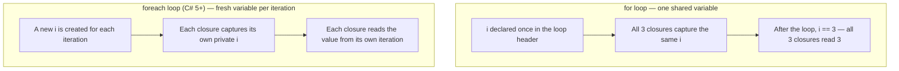
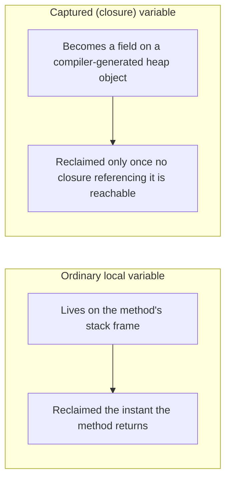

# Closures in C#

## Introduction

Before reading this lesson, you should already be comfortable with **[Lambda Expressions](../06-delegates-events/06-06-lambda-expressions.md)** — writing `(parameters) => body` and assigning the result to a `Func`, `Action`, or `Predicate`. Every lambda in that lesson only ever used its own parameters. This lesson asks what happens when a lambda reaches *outside* itself and uses a variable that belongs to the method around it — a **closure** — and why that single habit is responsible for one of the most common bugs new C# developers write.

By the end of this lesson, you will be able to:

- Explain what a closure is and which variables a lambda or local function captures
- Predict that a captured variable is captured by reference, not by value
- Reproduce the classic "loop variable capture" bug using a `for` loop
- Explain why a `foreach` loop in C# 5 and later does not have this bug
- Describe how a captured variable's lifetime is extended onto the heap by the compiler
- Fix a `for`-loop capture bug by introducing a fresh local copy per iteration

## Closures in C# — A Layman's Perspective

Imagine a manager who needs to send five different messengers out to make a phone call later in the day, each one dialing a number written on a single shared whiteboard at the front of the office. At 9 a.m., the manager writes "555-0100" on the whiteboard and tells the first messenger, "call this number at 3 p.m." At 10 a.m., the manager erases the board and writes "555-0200," telling the second messenger the exact same thing. This continues through the day — a new number on the board, a new messenger given the same instruction — until, at 3 p.m., all five messengers walk over to the whiteboard at once and dial whatever number happens to be written there right now. Because they were all pointed at the *same board*, not handed their own private slip of paper, all five of them end up dialing the very last number that was ever written — "555-0500" — even though four of them were told to call a completely different one earlier in the day.

That's not a hypothetical flaw in a badly run office — it's exactly what happens the moment a piece of code captures a shared variable instead of a private copy of it. The messenger isn't lying or malfunctioning; they're doing precisely what they were told, which was "go look at the board when it's time." The problem was never in the instruction — it was in *what* the instruction pointed at. If the manager had instead handed each messenger their own printed card with the number already written down at the moment of handoff, each messenger would faithfully dial their own distinct number at 3 p.m., completely unaffected by whatever the whiteboard says by then.

There's a second, quieter consequence of this story worth noticing. As long as even one messenger is still holding onto that shared whiteboard reference — still planning to check it later — the office can't take the whiteboard down and repurpose the space, even long after the person who originally wrote the numbers on it has gone home. The whiteboard has to stay up, occupying room, for as long as anyone out there might still come looking at it.

In code, the shared whiteboard is a variable declared in an outer method, and the messengers dialing whatever's currently written on it are lambdas that captured that variable rather than a private copy — this is a closure, and it behaves by reference, exactly like the whiteboard. And the reason the office can't take the whiteboard down early is exactly why a captured variable's lifetime can outlive the method that originally declared it — as long as any lambda still holds a reference to it, something has to keep it around.

## Closures in C# — A Programming Language Perspective

A **closure** is a lambda expression or local function together with the outer-scope variables it references — its *captured variables*. Unlike a lambda's own parameters, a captured variable isn't copied into the lambda at the moment it's created; the lambda holds a reference to the *same storage location* as the enclosing method, meaning any change to that variable — from either side — is visible to both. This is why capture is described as "by reference," even for value types like `int`.

To make this work, the compiler generates a hidden class (informally called a *display class*) that holds each captured variable as a field, and allocates an instance of it on the heap. The lambda becomes a method on that generated instance, and every closure sharing the same enclosing scope shares the same generated instance — which is exactly why they all see the same, most-recently-written value, just like the messengers reading the same whiteboard.

## How Closures Capture Variables in C#

The clearest way to see closure-by-reference behavior is the classic loop-variable bug: a `for` loop declares its counter once, in the loop header, and every iteration of that loop shares that one variable. A lambda created inside the loop body that captures the counter is capturing the *shared whiteboard*, not a private card — so by the time any of those lambdas actually runs, they all read whatever value the counter holds *after the loop has finished*. A `foreach` loop, since C# 5, avoids this specific trap: the compiler gives each iteration its own fresh iteration variable, so a lambda capturing it captures a private copy that iteration alone ever wrote to.


*Figure 1: A `for` loop's counter is one shared variable across every iteration; a `foreach` loop's iteration variable is a fresh one each time.*

```csharp
// Program.cs — .NET 10 / C# 14
List<Action> tasksBuggy = [];
for (int i = 0; i < 3; i++)
{
    tasksBuggy.Add(() => Console.WriteLine($"Buggy: {i}"));
}

List<Action> tasksFixed = [];
for (int i = 0; i < 3; i++)
{
    int captured = i; // a fresh local copy, created new each iteration
    tasksFixed.Add(() => Console.WriteLine($"Fixed: {captured}"));
}

List<Action> tasksForeach = [];
foreach (int i in new[] { 0, 1, 2 })
{
    tasksForeach.Add(() => Console.WriteLine($"Foreach: {i}"));
}

Console.WriteLine("-- Buggy for loop --");
foreach (Action task in tasksBuggy) task();

Console.WriteLine("-- Fixed for loop --");
foreach (Action task in tasksFixed) task();

Console.WriteLine("-- foreach loop (fresh variable each iteration since C# 5) --");
foreach (Action task in tasksForeach) task();
```

**Console Output:**

```text
-- Buggy for loop --
Buggy: 3
Buggy: 3
Buggy: 3
-- Fixed for loop --
Fixed: 0
Fixed: 1
Fixed: 2
-- foreach loop (fresh variable each iteration since C# 5) --
Foreach: 0
Foreach: 1
Foreach: 2
```

All three "Buggy" lines print `3` — not `0`, `1`, `2` — because every closure captured the same `i`, and by the time any of them actually ran, the loop had already finished with `i` equal to `3`. The "Fixed" version introduces `captured`, a brand-new local variable declared *inside* the loop body, so each iteration gets its own private copy for the closure to capture — this is the standard fix for `for` loops. The `foreach` loop needed no such fix, because C# 5 changed its iteration variable to be freshly created on every pass automatically.

## Real-Time Example: Closures in a Library Overdue-Notice Scheduler

We extend the Library/Inventory Management domain with a small overdue-notice scheduler. Given a list of active loans, it builds one reminder callback per overdue loan and defers actually sending them — a common real pattern, where a batch job builds a list of pending actions first and only executes them afterward. Because the loop uses `foreach` and `daysOverdue` is declared fresh inside the loop body on every pass, each callback correctly captures its own loan's details rather than whatever loan was processed last.

```csharp
// Program.cs — .NET 10 / C# 14 — Real-Time Example
List<Loan> activeLoans =
[
    new("Amara Chen", "Clean Code", new DateTime(2026, 8, 10)),
    new("Diego Ruiz", "The Pragmatic Programmer", new DateTime(2026, 8, 12)),
    new("Priya Nair", "Design Patterns", new DateTime(2026, 8, 14)),
];

DateTime today = new(2026, 8, 16);
List<Action> overdueNotices = [];

foreach (Loan loan in activeLoans)
{
    int daysOverdue = (today - loan.DueDate).Days;
    if (daysOverdue > 0)
    {
        // Each closure captures its own 'loan' and 'daysOverdue' — 'loan' is a
        // fresh foreach variable per iteration, and 'daysOverdue' is a fresh
        // local declared inside the loop body, so nothing here is shared.
        overdueNotices.Add(() =>
            Console.WriteLine($"Notice: {loan.MemberName}, \"{loan.BookTitle}\" is {daysOverdue} day(s) overdue."));
    }
}

Console.WriteLine($"Generated {overdueNotices.Count} overdue notice(s).");
foreach (Action sendNotice in overdueNotices)
{
    sendNotice();
}

record Loan(string MemberName, string BookTitle, DateTime DueDate);
```

**Console Output:**

```text
Generated 3 overdue notice(s).
Notice: Amara Chen, "Clean Code" is 6 day(s) overdue.
Notice: Diego Ruiz, "The Pragmatic Programmer" is 4 day(s) overdue.
Notice: Priya Nair, "Design Patterns" is 2 day(s) overdue.
```

Each notice reports the correct member, book, and day count for *its own* loan — Amara's notice never drifts to Priya's book title, even though all three closures were built inside the same loop. That correctness comes from two things working together: `loan` is the `foreach` iteration variable (fresh per C# 5+ semantics), and `daysOverdue` is a local variable declared inside the loop body, which is always fresh regardless of loop kind. If this scheduler were rewritten as a `for` loop indexing into `activeLoans` and captured the index variable directly inside the closure instead of a body-local copy, all three notices would report the *last* loan's details — the exact bug demonstrated in the previous section.

## Captured Variable Lifetime vs Ordinary Local Variable Lifetime

An ordinary local variable lives on the method's stack frame and disappears the instant that method returns — nothing outside the method can reach it, so the runtime reclaims its storage immediately and predictably. A captured variable breaks that assumption entirely: because a lambda might outlive the method that created it — stored in a list, attached to an event, or handed off to another part of the program — the compiler can't safely put that variable on the stack at all. Instead, it becomes a field on a heap-allocated object, and that object stays reachable for as long as *any* lambda that captured it is still reachable, even long after the original method has returned.

This is the direct memory consequence of the whiteboard staying up: a captured variable's lifetime is no longer tied to the method it was declared in, but to the last surviving reference to a closure over it. A method that captures a large object into a long-lived callback — and never lets that callback go — keeps that object alive for as long as the callback exists, which is precisely the kind of accidental lifetime extension the upcoming lesson on the weak event pattern exists to address.


*Figure 2: Capturing a variable moves it off the stack and onto the heap, tying its lifetime to whichever closures still reference it.*

| Aspect | Ordinary local variable | Captured (closure) variable |
|---|---|---|
| Storage | The method's stack frame | A field on a compiler-generated class instance, on the heap |
| Lifetime | Ends the instant the method returns | Extends until every closure referencing it becomes unreachable |
| Sharing | Not visible outside the method | Shared by reference among every closure over the same scope |
| GC impact | Reclaimed immediately, no extra tracking needed | Can delay collection of whatever it holds until the closures are gone |

## Types of Closure-Related Concepts in C#

Closures interact with several other constructs covered elsewhere in this curriculum:

1. **[Lambda Expressions](../06-delegates-events/06-06-lambda-expressions.md)** — the syntax that most commonly creates a closure in modern C#.
2. **[Local Functions](../02-oop/02-29-local-functions.md)** — a named alternative to a lambda that can capture its enclosing scope in exactly the same way.
3. **[Anonymous Methods vs Lambdas](../06-delegates-events/06-08-anonymous-methods-vs-lambdas.md)** — the older `delegate(...) { ... }` syntax, which can also form closures.
4. **[The Weak Event Pattern](../06-delegates-events/06-09-weak-event-pattern.md)** — where an unintentionally extended lifetime, exactly like a captured variable's, becomes a genuine memory-leak risk.
5. **[`for` and `foreach` Loops](../01-fundamentals/01-11-for-and-foreach-loops.md)** — the loop constructs whose variable-scoping rules are exactly what this lesson's central bug depends on.

## What You've Learned & What's Next

A closure is a lambda plus the outer variables it captures by reference, not by value — which is why a `for` loop's shared counter, captured directly, produces the same final value in every closure, while `foreach`'s per-iteration variable (since C# 5) and any fresh local declared inside a loop body do not. That same by-reference capture is also why a captured variable's lifetime can extend onto the heap, kept alive for as long as any closure referencing it survives.

Continue your learning journey with **[Anonymous Methods vs Lambdas](../06-delegates-events/06-08-anonymous-methods-vs-lambdas.md)**, where we look at the older `delegate(...) { ... }` syntax that lambdas replaced — functionally almost identical, but no longer the idiomatic choice for new code.

---
*Applies to: .NET 10 / C# 14. Last reviewed 2026-08-16.*
