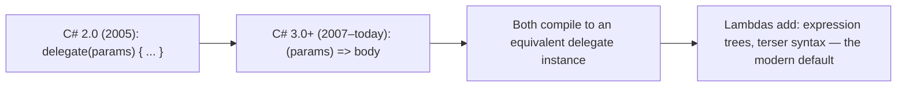
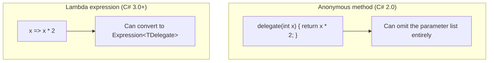

# Anonymous Methods vs Lambdas

## Introduction

Before reading this lesson, you should already be comfortable with **[Closures in C#](../06-delegates-events/06-07-closures-in-csharp.md)** — a lambda capturing a variable from its enclosing scope, and the by-reference behavior that comes with it. Everything in that lesson, and the lambda lesson before it, used syntax that has existed since C# 3.0. This lesson looks one step further back, at the syntax C# used *before* lambdas existed, and why you'll still occasionally meet it in an older codebase.

By the end of this lesson, you will be able to:

- Recognize the C# 2.0 anonymous method syntax: `delegate(parameters) { ... }`
- Rewrite an anonymous method as an equivalent modern lambda expression
- Identify the one capability anonymous methods have that lambdas don't
- Explain why lambdas became the idiomatic default starting with C# 3.0
- Choose lambdas for all new code, while still being able to read anonymous methods in legacy code

## Anonymous Methods vs Lambdas — A Layman's Perspective

Imagine an office that, for decades, required every internal request — "please order more paper," "please approve this expense" — to be submitted on a specific paper form: full letterhead, a boilerplate header restating the requester's name and department, a designated signature line, and a stamped date field, even for the smallest, most routine request. It worked. It got the job done. Every request that ever went through that form was understood clearly by everyone who received it, and nobody could say the system failed at its actual purpose.

Then the office adopted instant messaging. The exact same routine request — "please order more paper" — could now be typed and sent in about two seconds, with none of the letterhead, none of the boilerplate header, none of the ceremony. The recipient understands it exactly as well as they understood the paper form; nothing about the *request itself* changed. What changed is how much effort it took to make the request, and how much visual noise sits between the reader and the one sentence that actually matters.

Crucially, the paper form didn't stop working the day instant messaging arrived. Anyone who still has a drawer full of old paper forms, or who's used to filling one out, can keep doing exactly that, and the request still goes through just fine. But nobody starting fresh today would choose to fill out the full paper form for a routine one-line request — not because it's broken, but because a faster, equally clear alternative exists, and every new employee is simply taught the message-based way from day one. The old form only really gets encountered anymore when someone opens a filing cabinet from years ago and needs to understand a request that was written the old way.

That's the entire relationship between anonymous methods and lambda expressions in C#. The anonymous method's `delegate(parameters) { ... }` syntax was the paper form — fully capable, well understood, and still perfectly valid to compile today. The lambda's `=>` syntax was the instant message — shorter, equally capable for the vast majority of cases, and the thing every C# developer is taught to reach for now. You'll still open the drawer occasionally — an older codebase, a tutorial from a decade ago — and find the paper form in use. It isn't wrong. It's just not what anyone chooses to write fresh anymore.

## Anonymous Methods vs Lambdas — A Programming Language Perspective

An **anonymous method**, introduced in C# 2.0, is written with the `delegate` keyword: `SomeDelegateType d = delegate(int x) { return x * 2; };` — it creates an unnamed method body and assigns it directly to a delegate variable, avoiding the need to declare a separate, named method elsewhere. A **lambda expression**, introduced in C# 3.0, provides functionally equivalent behavior with the terser `(x) => x * 2` syntax, and both forms can capture outer-scope variables as closures in exactly the same way covered in the previous lesson.

The two forms are not perfectly interchangeable in every direction, however. An anonymous method may omit its parameter list entirely — `delegate { ... }` — to match *any* delegate signature while ignoring all of its arguments, something a lambda cannot do (a lambda must at minimum name or discard every parameter). Conversely, only a lambda can be converted to an `Expression<TDelegate>` — data representing the lambda's structure rather than compiled code — which is exactly what LINQ providers such as EF Core rely on to translate a query into SQL; an anonymous method has no equivalent expression-tree form at all.

## How Anonymous Methods Compare to Lambdas in C#

The clearest way to see the two forms' near-equivalence is to write the same logic both ways and run them side by side. The example below assigns a `Func<int,int,int>` and an `EventHandler` using an anonymous method first, then does exactly the same job with a lambda — including the one genuinely unique anonymous-method capability, omitting the parameter list to ignore every argument.


*Figure 1: Lambdas superseded anonymous methods two years after they were introduced, and remain functionally compatible with them.*

```csharp
// Program.cs — .NET 10 / C# 14
Func<int, int, int> addAnonymous = delegate (int a, int b)
{
    return a + b;
};

Func<int, int, int> addLambda = (a, b) => a + b;

EventHandler onClickAnonymous = delegate
{
    // Anonymous methods can omit the parameter list entirely to ignore all arguments.
    Console.WriteLine("Anonymous method: click handled, arguments ignored.");
};

EventHandler onClickLambda = (sender, e) =>
{
    Console.WriteLine("Lambda: click handled, arguments ignored.");
};

Console.WriteLine(addAnonymous(4, 5));
Console.WriteLine(addLambda(4, 5));
onClickAnonymous(null, EventArgs.Empty);
onClickLambda(null, EventArgs.Empty);
```

**Console Output:**

```text
9
9
Anonymous method: click handled, arguments ignored.
Lambda: click handled, arguments ignored.
```

`addAnonymous` and `addLambda` produce identical results from equivalent logic written two different ways. The two `EventHandler` variables show the one real syntactic difference: the anonymous method uses bare `delegate` with no parameter list at all, since it never needs `sender` or `e`, while the lambda must still name both parameters (`sender, e`) even though it also ignores them — a small but genuine gap lambdas never fully closed.

## Real-Time Example: Anonymous Methods vs Lambdas in an E-Commerce Shipping Notification

We extend the E-Commerce Order Processing domain with an `OrderProcessor` that raises an `OrderShipped` event once a shipment goes out. Imagine finding this class already in production, with one subscriber written years ago in the older anonymous-method style — exactly the kind of code a review might flag today — and adding a second subscriber the modern way. Both handlers do the same job; only the syntax differs.

```csharp
// Program.cs — .NET 10 / C# 14 — Real-Time Example
OrderProcessor processor = new();

// Legacy style — as it might appear in an older codebase, using an anonymous method.
processor.OrderShipped += delegate (object? sender, OrderShippedEventArgs e)
{
    Console.WriteLine($"[Legacy handler] Order {e.OrderId} shipped via {e.Carrier}.");
};

// Modern style — the same subscription, written as a lambda.
processor.OrderShipped += (sender, e) =>
{
    Console.WriteLine($"[Modern handler] Order {e.OrderId} shipped via {e.Carrier}.");
};

processor.Ship("ORD-5521", "FastTrack Courier");

class OrderProcessor
{
    public event EventHandler<OrderShippedEventArgs>? OrderShipped;

    public void Ship(string orderId, string carrier)
    {
        Console.WriteLine($"Processing shipment for order {orderId}...");
        OrderShipped?.Invoke(this, new OrderShippedEventArgs(orderId, carrier));
    }
}

class OrderShippedEventArgs(string orderId, string carrier) : EventArgs
{
    public string OrderId { get; } = orderId;
    public string Carrier { get; } = carrier;
}
```

**Console Output:**

```text
Processing shipment for order ORD-5521...
[Legacy handler] Order ORD-5521 shipped via FastTrack Courier.
[Modern handler] Order ORD-5521 shipped via FastTrack Courier.
```

Both handlers fire, in the order they were attached, and both report the exact same order and carrier — proof that the anonymous method and the lambda are behaviorally identical here. If this were a real pull request, the review comment would be simple: the legacy handler works correctly and doesn't need to be touched just because it's old, but any *new* subscriber added to this event from today onward should be written as a lambda, matching the second handler rather than the first.

## Legacy Anonymous Methods vs Current Lambda Expressions

Choosing between these two forms in new code isn't really a choice at all anymore — lambdas do everything anonymous methods do, in less syntax, and add capabilities (expression trees, natural type inference, terser single-parameter forms) that anonymous methods never gained. The only reason to write `delegate(...) { ... }` today is the one narrow case where you want to ignore every parameter of a multi-parameter delegate without naming any of them — and even then, most teams would rather see a lambda with explicitly discarded parameters (`(_, _) => ...`) for consistency with the rest of the codebase.


*Figure 2: Anonymous methods and lambdas overlap almost completely — each keeps exactly one capability the other lacks.*

| Aspect | Anonymous Method (`delegate`) | Lambda Expression (`=>`) |
|---|---|---|
| Introduced | C# 2.0 (2005) | C# 3.0 (2007) |
| Syntax | `delegate(int x) { return x * 2; }` | `x => x * 2` |
| Can omit the parameter list | Yes — `delegate { ... }` matches any signature | No — every parameter must be named or discarded |
| Can convert to `Expression<TDelegate>` | No | Yes — enables LINQ providers like EF Core to translate to SQL |
| Idiomatic in new code today | No — legacy syntax, still valid but not chosen fresh | Yes — the modern default |

## Types of Callable Syntax in C#

Anonymous methods and lambdas are two points on a longer timeline of ways C# lets you supply behavior as a value — several of the others are covered in their own lessons:

1. **[Lambda Expressions](../06-delegates-events/06-06-lambda-expressions.md)** — the modern syntax this lesson contrasts anonymous methods against.
2. **[Closures in C#](../06-delegates-events/06-07-closures-in-csharp.md)** — variable capture, which both anonymous methods and lambdas support identically.
3. **[`Func`, `Action`, and `Predicate`](../06-delegates-events/06-03-func-action-predicate.md)** — the built-in delegate types either syntax is most often assigned to.
4. **[Delegates in C#](../06-delegates-events/06-01-delegates-in-csharp.md)** — the foundational type both anonymous methods and lambdas ultimately produce an instance of.
5. **[Expression Trees](../13-reflection-sourcegen-lowlevel/13-06-expression-trees.md)** — the data-as-code representation only lambdas, not anonymous methods, can be converted into.
6. **[The Weak Event Pattern](../06-delegates-events/06-09-weak-event-pattern.md)** — where either kind of handler, once subscribed to a long-lived publisher, carries the same memory-lifetime risk.

## What You've Learned & What's Next

Anonymous methods and lambda expressions compile to functionally near-identical delegate instances — the anonymous method's `delegate(...) { ... }` predates the lambda's `=>` by two years, keeps one narrow capability (omitting the parameter list), and gave up the ability to become an expression tree in return. In new code, the choice is settled: reach for the lambda, and only expect to read an anonymous method when working in an older codebase.

Continue your learning journey with **[The Weak Event Pattern](../06-delegates-events/06-09-weak-event-pattern.md)**, where we look at what happens when a handler — anonymous method, lambda, or named method alike — stays subscribed to a long-lived publisher for far longer than anyone intended.

---
*Applies to: .NET 10 / C# 14. Last reviewed 2026-08-16.*
