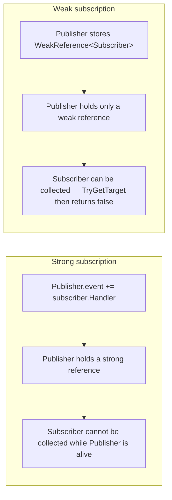
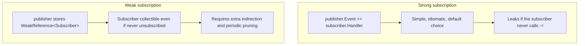

# The Weak Event Pattern

## Introduction

Before reading this lesson, you should already be comfortable with **[Anonymous Methods vs Lambdas](../06-delegates-events/06-08-anonymous-methods-vs-lambdas.md)** and, further back, with events themselves from earlier in this module — a publisher raising an event, and one or more subscribers attaching handlers with `+=`. Every one of those examples assumed the subscriber would eventually detach with `-=`, or that the whole program would end before it mattered. This lesson looks at what happens when neither of those things happens — when a subscriber is *meant* to be short-lived, but nobody ever calls `-=`, and the publisher sticks around indefinitely.

By the end of this lesson, you will be able to:

- Explain why a publisher's event field holds a strong reference to every subscriber attached to it
- Describe how forgetting to unsubscribe turns a normal event subscription into a memory leak
- Implement a simple `WeakReference<T>`-based subscription that lets a subscriber be collected anyway
- Explain, at a conceptual level, what .NET's `WeakEventManager` exists to solve
- Decide when the added complexity of a weak event pattern is worth it versus disciplined unsubscribing

## The Weak Event Pattern — A Layman's Perspective

Picture the organizer of a large annual community event — a fireworks show — who keeps a phone list of everyone who's ever asked to be called with reminders. Every year, new people join the list, giving their number to the organizer directly. The organizer's habit is simple and entirely reasonable on its own: once someone's on the list, they stay on it, because nobody ever explicitly says "please take me off." Years go by. People move away, change their number, or simply stop caring about fireworks — but unless they specifically call back and ask to be removed, their old number just sits there, taking up a line in a phone book that keeps getting thicker every single year, even though a growing fraction of the numbers in it will never be dialed again or, if dialed, would reach a stranger.

The organizer isn't doing anything wrong, exactly — they're doing precisely what they said they'd do, calling everyone still on the list every year. The actual problem is structural: the list only ever grows, because the only way off it requires an action nobody has any particular reason to remember to take. A landlord who forgets to remove a departed tenant's key from the building's master ring has the same problem — the key still opens a door that arguably shouldn't be theirs to open anymore, and nothing about the ring itself will ever prompt anyone to notice or fix that on its own.

Now imagine a different kind of list — one where each entry is written not in permanent ink, but on a small tag that quietly falls off the ring on its own the moment nobody else in the building still recognizes that name as a current resident. The organizer never has to remember to remove anyone manually; the list prunes the departed on its own, simply by virtue of no longer being usable once nobody else is actively vouching that the entry still matters. That takes a bit more cleverness to build than a straightforward permanent list, but it never grows unboundedly just because someone forgot a housekeeping step.

That's the entire distinction this lesson is about. A normal event subscription is the permanent-ink list: simple, reliable, and completely dependent on someone remembering to erase an entry when it's no longer needed. The weak event pattern is the self-pruning tag: a bit more machinery to build, but immune to the single most common cause of the list growing forever — someone simply forgetting to take themselves off it.

## The Weak Event Pattern — A Programming Language Perspective

When code does `publisher.SomeEvent += subscriber.HandlerMethod;`, the multicast delegate backing that event stores a reference to `subscriber` as the handler's *target*. That reference is a normal, strong .NET object reference — for as long as `publisher` is reachable, its event field is reachable, and therefore every subscriber attached to it is reachable too, regardless of whether anything else in the program still references that subscriber. This is a well-known source of memory leaks: a long-lived publisher (a static-like singleton, an application-wide hub, a cache) accumulates subscribers that were meant to be short-lived, and none of them can be collected until either they explicitly unsubscribe or the publisher itself dies.

The **weak event pattern** breaks that strong reference deliberately, typically by wrapping the subscription in a `WeakReference<T>` (or, in UI frameworks, using a built-in `WeakEventManager`) so the publisher holds only a reference the garbage collector is free to reclaim through. The subscriber can then be collected even while nominally still "subscribed," at the cost of extra indirection: every raise now has to check whether each weakly-held subscriber is still alive before invoking it.

## How to Implement a Weak Event Subscription in C#

A weak subscription replaces a direct delegate hookup with a small list of `WeakReference<T>` entries. Raising the event means walking that list, calling `TryGetTarget` on each entry, and invoking the handler only for the subscribers still alive — anything already collected is simply skipped. The example below creates a subscriber inside a local function so that nothing outside that function retains a strong reference to it, forces a collection, and shows that the publisher's weak-reference list can no longer find it.


*Figure 1: A strong subscription keeps the subscriber reachable through the publisher; a weak subscription does not.*

```csharp
// Program.cs — .NET 10 / C# 14
Publisher publisher = new();

CreateAndAttachWeakSubscriber(publisher);

GC.Collect();
GC.WaitForPendingFinalizers();

publisher.Raise();

static void CreateAndAttachWeakSubscriber(Publisher publisher)
{
    Subscriber subscriber = new("Temp-Subscriber");
    publisher.Attach(subscriber);
    // 'subscriber' goes out of scope when this method returns — nothing else
    // references it, since 'publisher' only stored a WeakReference to it.
}

class Publisher
{
    private readonly List<WeakReference<Subscriber>> _weakSubscribers = [];

    public void Attach(Subscriber subscriber) =>
        _weakSubscribers.Add(new WeakReference<Subscriber>(subscriber));

    public void Raise()
    {
        int alive = 0;
        foreach (WeakReference<Subscriber> weakRef in _weakSubscribers)
        {
            if (weakRef.TryGetTarget(out Subscriber? subscriber))
            {
                subscriber.Handle();
                alive++;
            }
        }

        Console.WriteLine($"Alive subscribers at raise time: {alive} of {_weakSubscribers.Count} registered.");
    }
}

class Subscriber(string name)
{
    public void Handle() => Console.WriteLine($"{name} handled the event.");
}
```

**Console Output:**

```text
Alive subscribers at raise time: 0 of 1 registered.
```

The subscriber created inside `CreateAndAttachWeakSubscriber` never escapes that method — `publisher` only ever held a `WeakReference<Subscriber>` to it, never the subscriber itself — so once the method returns and a collection runs, nothing keeps it alive. `TryGetTarget` correctly reports that it's gone, and `Raise` skips it entirely rather than throwing or crashing.

## Real-Time Example: A Weak Event Pattern in a Banking/ATM Notification Hub

We extend the Banking/ATM domain with a `NotificationHub` — a long-lived, app-wide service that raises balance alerts — and an `AtmSessionWidget`, representing a short-lived on-screen session that's meant to exist only for the duration of one customer's visit to the machine. The first hub subscribes widgets the ordinary way, with `+=`; the second uses a weak subscription list instead. Both hubs run the exact same three sessions, then force a collection before raising an alert, to show the difference directly.

```csharp
// Program.cs — .NET 10 / C# 14 — Real-Time Example
using System.Globalization;

Console.WriteLine("--- Strong event subscription (leak-prone) ---");
NotificationHub strongHub = new();
CreateAtmSessions(strongHub, useWeakReference: false, sessionCount: 3);
GC.Collect();
GC.WaitForPendingFinalizers();
strongHub.RaiseBalanceAlert("****9042", 12.50m);

Console.WriteLine();
Console.WriteLine("--- Weak event subscription (collectible) ---");
NotificationHub weakHub = new();
CreateAtmSessions(weakHub, useWeakReference: true, sessionCount: 3);
GC.Collect();
GC.WaitForPendingFinalizers();
weakHub.RaiseBalanceAlert("****9042", 12.50m);

static void CreateAtmSessions(NotificationHub hub, bool useWeakReference, int sessionCount)
{
    for (int i = 0; i < sessionCount; i++)
    {
        AtmSessionWidget widget = new($"Session-{i + 1}");
        if (useWeakReference)
        {
            hub.AttachWeak(widget);
        }
        else
        {
            hub.BalanceAlert += widget.OnBalanceAlert;
        }
    }
    // Every 'widget' created here goes out of scope once this method returns —
    // in the weak case nothing keeps it alive; in the strong case, the event does.
}

class NotificationHub
{
    public event EventHandler<BalanceAlertEventArgs>? BalanceAlert;

    private readonly List<WeakReference<AtmSessionWidget>> _weakSubscribers = [];

    public void AttachWeak(AtmSessionWidget widget) =>
        _weakSubscribers.Add(new WeakReference<AtmSessionWidget>(widget));

    public void RaiseBalanceAlert(string maskedAccountNumber, decimal newBalance)
    {
        BalanceAlertEventArgs args = new(maskedAccountNumber, newBalance);
        BalanceAlert?.Invoke(this, args);

        int alive = 0;
        foreach (WeakReference<AtmSessionWidget> weakRef in _weakSubscribers)
        {
            if (weakRef.TryGetTarget(out AtmSessionWidget? widget))
            {
                widget.OnBalanceAlert(this, args);
                alive++;
            }
        }

        if (_weakSubscribers.Count > 0)
        {
            Console.WriteLine($"Weak subscribers still reachable: {alive} of {_weakSubscribers.Count}.");
        }
    }
}

class AtmSessionWidget(string sessionName)
{
    public void OnBalanceAlert(object? sender, BalanceAlertEventArgs e) =>
        Console.WriteLine(
            $"{sessionName} received balance alert for {e.MaskedAccountNumber}: " +
            $"new balance is {e.NewBalance.ToString("C", CultureInfo.GetCultureInfo("en-US"))}.");
}

class BalanceAlertEventArgs(string maskedAccountNumber, decimal newBalance) : EventArgs
{
    public string MaskedAccountNumber { get; } = maskedAccountNumber;
    public decimal NewBalance { get; } = newBalance;
}
```

**Console Output:**

```text
--- Strong event subscription (leak-prone) ---
Session-1 received balance alert for ****9042: new balance is $12.50.
Session-2 received balance alert for ****9042: new balance is $12.50.
Session-3 received balance alert for ****9042: new balance is $12.50.

--- Weak event subscription (collectible) ---
Weak subscribers still reachable: 0 of 3.
```

In the strong-subscription hub, all three `AtmSessionWidget` instances still respond to the balance alert even though every local `widget` variable went out of scope the moment `CreateAtmSessions` returned — the event field inside `NotificationHub` was the only thing keeping them alive, and it did its job perfectly. In the weak-subscription hub, the exact same setup collects all three widgets before the alert is ever raised, so none of them print anything at all, and the hub correctly reports zero of three still reachable. In a real ATM network, the strong version is the leak: a long-running notification hub would accumulate one dead widget's worth of memory per customer visit, forever, unless every widget remembered to unsubscribe on session end — exactly the discipline this pattern lets you stop depending on.

## Strong Event Subscription vs Weak Event Subscription

Choosing between these two isn't about one being universally better — it's about which failure mode you'd rather guard against. A strong subscription is simpler to write and reason about, and is entirely safe as long as either the publisher is itself short-lived, or subscribers reliably unsubscribe (typically inside a `Dispose` method). A weak subscription trades that simplicity for resilience against exactly the mistake developers make most often: forgetting the `-=` call — at the cost of extra bookkeeping, since a list of `WeakReference<T>` entries needs its own dead-entry pruning over time, or its own storage grows unboundedly with defunct references even after the objects themselves are gone.


*Figure 2: A strong subscription is simpler and safe under discipline; a weak subscription is more resilient but structurally more complex.*

| Aspect | Strong subscription (`event +=`) | Weak subscription (`WeakReference<T>` / `WeakEventManager`) |
|---|---|---|
| Reference kept | Strong — the subscriber cannot be collected while subscribed | Weak — the subscriber can be collected even while "subscribed" |
| Requires manual `-=` to avoid a leak | Yes | No, but dead entries still need periodic pruning |
| Complexity | Simple — the idiomatic default | Higher — extra indirection and `TryGetTarget` checks on every raise |
| Best suited to | A short-lived publisher, or a subscriber that reliably unsubscribes in `Dispose` | A long-lived publisher (a singleton-like hub) with short-lived subscribers that might forget to unsubscribe |

## Types of Memory-Lifetime Concerns Related to Events

The weak event pattern sits at the intersection of two subjects this curriculum treats separately — events, covered throughout this module, and memory management, covered in full starting with Module 08:

1. **[Weak References](../08-memory-management/08-08-weak-references.md)** — the general-purpose `WeakReference<T>` type this lesson's pattern is built directly on top of.
2. **[Diagnosing Memory Leaks](../08-memory-management/08-09-diagnosing-memory-leaks.md)** — the broader toolkit for finding exactly this kind of unintended lifetime extension in a running application.
3. **[`IDisposable` and the `using` Statement](../08-memory-management/08-04-idisposable-and-using-statement.md)** — where reliably calling `-=` inside `Dispose` is the disciplined alternative to a weak subscription.
4. **[Events in C#](../06-delegates-events/06-04-events-in-csharp.md)** — the foundational publish-subscribe mechanism this lesson's leak risk applies to.
5. **[Delegates vs Events — Comparison](../06-delegates-events/06-10-delegates-vs-events-comparison.md)** — this module's capstone, closing out everything delegates and events have covered.

## What You've Learned & What's Next

A normal event subscription gives the publisher a strong reference to every subscriber attached to it, which is exactly what causes a memory leak when a long-lived publisher accumulates short-lived subscribers that never unsubscribe. A `WeakReference<T>`-based subscription list — or a framework's built-in `WeakEventManager` — breaks that strong reference deliberately, letting the runtime collect a subscriber even while it's still nominally "subscribed," at the cost of extra indirection on every raise.

Continue your learning journey with **[Delegates vs Events — Comparison](../06-delegates-events/06-10-delegates-vs-events-comparison.md)**, the capstone of Module 06, where every idea from this module — delegates, multicast, `Func`/`Action`/`Predicate`, events, custom `EventArgs`, lambdas, closures, and this lesson's weak references — comes together in one final comparison.

---
*Applies to: .NET 10 / C# 14. Last reviewed 2026-08-16.*
