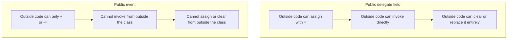
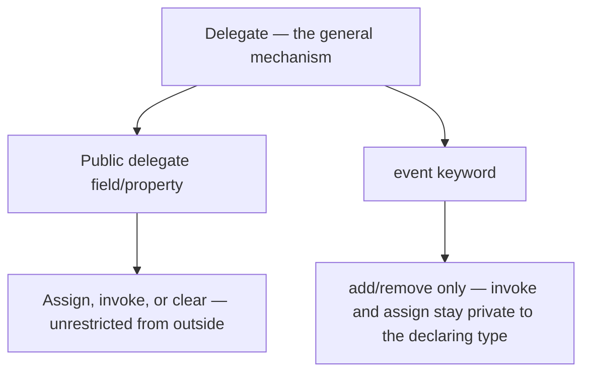

# Delegates vs Events — Comparison

## Introduction

Before reading this lesson, you should already be comfortable with **[The Weak Event Pattern](../06-delegates-events/06-09-weak-event-pattern.md)** and, really, with the entire arc of Module 06 — declaring a delegate type, combining handlers into a multicast delegate, reaching for `Func`, `Action`, and `Predicate` instead of custom delegate types, raising a proper `event`, carrying data through a custom `EventArgs`, writing that handler as a lambda, understanding what that lambda captures as a closure, recognizing the older anonymous-method syntax lambdas replaced, and guarding against the memory-leak risk a long-lived publisher creates. This lesson is the module's capstone, and it asks the question every one of those lessons has been building toward without ever asking directly: a delegate can do everything an event does — so why does `event` exist as a separate keyword at all, and what exactly does it protect you from?

By the end of this lesson, you will be able to:

- Explain that every event is backed by a delegate, but not every delegate is an event
- Identify what outside code can do with a public delegate field that it cannot do with a public event
- Explain why events restrict external code to `+=`/`-=` only, protecting both invocation and the subscriber list
- Design a class that exposes both a delegate-typed callback hook and a proper event, and justify the difference
- Recap the full arc of Module 06, from a single delegate declaration through to this comparison

## Delegates vs Events — A Layman's Perspective

Picture two very different pieces of equipment a household might install. The first is a general-purpose two-way radio handed out to household members: anyone holding one can key the microphone and broadcast whatever they like to whoever else has a radio tuned to that channel, and — because it's a shared physical object — anyone holding it can also just take it away from someone else, hand it to a different person entirely, or switch it off for the whole house without asking. It's powerful and flexible, but nothing about the radio itself stops one person from silencing everyone else's, or from broadcasting something on someone else's behalf.

The second is a proper doorbell system with a subscription list: visitors can only ever press the button, and residents can only ever add or remove their own name from the list of people who get notified when it rings. No visitor pressing the button can reach into the house and personally decide who's on the notification list, wipe out every resident's subscription at once, or fake a ring without actually pressing the button. The doorbell's design deliberately narrows what an outsider is allowed to do, compared to what the two-way radio allows — not because the doorbell is less capable, but because it was built specifically for one job — many independent people safely registering interest in one specific happening — and locked down to prevent anything else.

That's the entire difference between a delegate and an event, and it's worth being honest about why it matters: the radio isn't a worse design in general, it's just the wrong choice for a doorbell. A household intercom system, where any one member genuinely should be able to override or redirect the whole channel at will, is exactly the two-way-radio situation, and a locked-down subscription list would just get in the way. The lesson isn't "one is better" — it's "know which job you're building for, and pick the tool whose restrictions match it."

This entire module has been building both of these tools, one piece at a time: the radio itself (a delegate), the ability to broadcast to several listeners at once (multicast), a few ready-made radio models so you don't have to build your own from scratch (`Func`, `Action`, `Predicate`), the doorbell's proper button-and-list design (events), a way to hand the visitor's exact reason for ringing along with the notification (custom `EventArgs`), a shorthand way to write what happens when the doorbell rings (lambdas), a note about what that shorthand instruction is allowed to remember (closures), the doorbell's older, clunkier predecessor (anonymous methods), and a way to stop the notification list from growing forever with residents who moved out and forgot to update it (the weak event pattern). This lesson is where all of those pieces finally sit side by side.

## Delegates vs Events — A Programming Language Perspective

A **delegate** is a type-safe reference to one or more methods. Declaring a public field or property of a delegate type — `public Action<string>? OnTick;` — gives any code that can see that member direct access to the underlying delegate instance: it can invoke it, assign a brand-new delegate to it with `=` (silently discarding whatever was there before), clear it with `= null`, or attach further handlers with `+=`. Nothing about a plain delegate member restricts what outside code can do with it, because it's just a field like any other.

An **event** is a language construct, not a separate runtime type — under the hood, `public event EventHandler<T>? Ticked;` still compiles to a private multicast delegate field, but the compiler also synthesizes `add` and `remove` accessors and exposes *only those* to code outside the declaring class. That means external code may use `+=` and `-=` and nothing else: it cannot invoke the event directly, cannot assign to it with `=`, and cannot read its current subscriber list. Only the declaring class retains direct access to the underlying delegate, and therefore only it can raise the event or reset it entirely. This is the same encapsulation principle from Module 02 — hiding an implementation detail behind a controlled surface — applied specifically to callback plumbing.

## How Delegates and Events Differ in What Outside Code Can Do

The clearest way to see this restriction is to try to do the same three things — assign, invoke, and subscribe — to a public delegate field and to a public event, side by side. The delegate field allows all three without complaint. The event allows subscribing, and nothing else; attempting to invoke it or assign to it from outside its declaring class is a compile-time error, not a runtime surprise.


*Figure 1: A public delegate field has no restrictions from the outside; a public event allows only subscribe and unsubscribe.*

```csharp
// Program.cs — .NET 10 / C# 14
Publisher publisher = new();

// A public delegate field: outside code can assign, invoke, or replace it directly.
publisher.OnTick = message => Console.WriteLine($"[delegate] first handler: {message}");
publisher.OnTick?.Invoke("tick 1");

publisher.OnTick = message => Console.WriteLine($"[delegate] replaced handler: {message}");
publisher.OnTick?.Invoke("tick 2");
// The assignment above completely discarded the first handler — outside code
// can do this because it holds direct access to the delegate field itself.

// A public event: outside code may only += or -= ; it cannot invoke or replace it.
publisher.Ticked += message => Console.WriteLine($"[event] handler A: {message}");
publisher.Ticked += message => Console.WriteLine($"[event] handler B: {message}");
// publisher.Ticked.Invoke("tick 3");   // compile error: an event may only appear
// publisher.Ticked = message => { };   // on the left-hand side of += or -= here.

publisher.RaiseTicked("tick 3");

class Publisher
{
    public Action<string>? OnTick;

    public event Action<string>? Ticked;

    public void RaiseTicked(string message) => Ticked?.Invoke(message);
}
```

**Console Output:**

```text
[delegate] first handler: tick 1
[delegate] replaced handler: tick 2
[event] handler A: tick 3
[event] handler B: tick 3
```

Notice what's missing: `tick 1`'s handler never fires again after the reassignment, because assigning to `OnTick` with `=` replaced it outright — the first handler is simply gone. The event tells a completely different story: both `handler A` and `handler B` fire for `tick 3`, because `+=` only ever *adds* a handler, never replaces one, and the class itself — through its own `RaiseTicked` method — is the only code allowed to invoke `Ticked` at all.

## Real-Time Example: Delegates vs Events in a Banking/ATM Account

We extend the Banking/ATM domain with an `Account` class that deliberately exposes *both* a public delegate-typed callback hook and a proper event for the same underlying happening — a balance change — so the difference isn't theoretical. `OnBalanceChangedCallback` is a public `Action<decimal>` field; `BalanceChanged` is a proper `event EventHandler<BalanceChangedEventArgs>`. Two audit subscribers attach to each. Then a careless piece of calling code — the kind that slips into a large codebase without anyone noticing at first — overwrites the delegate hook, and we see exactly what that costs.

```csharp
// Program.cs — .NET 10 / C# 14 — Real-Time Example
using System.Globalization;

Account account = new("1234567890124477", 500.00m);

account.OnBalanceChangedCallback = balance =>
    Console.WriteLine($"[delegate hook] Fraud monitor: balance is now {Usd(balance)}");

account.BalanceChanged += (sender, e) =>
    Console.WriteLine($"[event] Statement service: {e.MaskedAccountNumber} balance changed to {Usd(e.NewBalance)}");
account.BalanceChanged += (sender, e) =>
    Console.WriteLine($"[event] Mobile push notifier: {e.MaskedAccountNumber} balance changed to {Usd(e.NewBalance)}");

Console.WriteLine("-- Legitimate deposit --");
account.Deposit(150.00m);

Console.WriteLine();
Console.WriteLine("-- A careless caller overwrites the delegate hook --");
account.OnBalanceChangedCallback = balance =>
    Console.WriteLine($"[delegate hook] Replacement handler only: {Usd(balance)}");
// The fraud monitor above is now permanently gone — nothing warned us, and it
// compiled without error, because 'OnBalanceChangedCallback' is a public field.

Console.WriteLine();
Console.WriteLine("-- The same careless code cannot touch BalanceChanged --");
// account.BalanceChanged = null;                    // compile error: an event may only
// account.BalanceChanged.Invoke(account, someArgs);  // appear on the left of += or -= here.
account.Deposit(25.00m);

static string Usd(decimal amount) => amount.ToString("C", CultureInfo.GetCultureInfo("en-US"));

class Account(string accountNumber, decimal balance)
{
    public string MaskedAccountNumber { get; } = $"****{accountNumber[^4..]}";
    public decimal Balance { get; private set; } = balance;

    // A public delegate-typed callback hook: any external code can invoke it,
    // replace it outright, or clear it — there is no protection at all.
    public Action<decimal>? OnBalanceChangedCallback;

    // A proper event: external code may only += or -=; only Account itself
    // can invoke it or clear the underlying delegate.
    public event EventHandler<BalanceChangedEventArgs>? BalanceChanged;

    public void Deposit(decimal amount)
    {
        if (amount <= 0)
        {
            throw new ArgumentOutOfRangeException(nameof(amount), "Deposit amount must be positive.");
        }

        Balance += amount;
        OnBalanceChangedCallback?.Invoke(Balance);
        BalanceChanged?.Invoke(this, new BalanceChangedEventArgs(MaskedAccountNumber, Balance));
    }
}

class BalanceChangedEventArgs(string maskedAccountNumber, decimal newBalance) : EventArgs
{
    public string MaskedAccountNumber { get; } = maskedAccountNumber;
    public decimal NewBalance { get; } = newBalance;
}
```

**Console Output:**

```text
-- Legitimate deposit --
[delegate hook] Fraud monitor: balance is now $650.00
[event] Statement service: ****4477 balance changed to $650.00
[event] Mobile push notifier: ****4477 balance changed to $650.00

-- A careless caller overwrites the delegate hook --

-- The same careless code cannot touch BalanceChanged --
[delegate hook] Replacement handler only: $675.00
[event] Statement service: ****4477 balance changed to $675.00
[event] Mobile push notifier: ****4477 balance changed to $675.00
```

After the "careless caller" section, the final deposit shows exactly what was lost and what wasn't: the fraud monitor never prints again — its handler was silently discarded the moment `OnBalanceChangedCallback` was reassigned — while both the statement service and the mobile push notifier keep working, completely undisturbed, because nothing in the entire program had any way to touch `BalanceChanged` except through `+=`. In a real banking application, a fraud-monitoring subscription silently disappearing is exactly the kind of defect that could go unnoticed for months. Modeling `BalanceChanged` as an event rather than a public delegate field is what makes that specific failure impossible to write, not just unlikely.

## Delegates vs Events — The Full Comparison

Every event in C# is a delegate underneath — but the reverse is never true, and that asymmetry is the entire point of the `event` keyword existing at all. A delegate is the general-purpose mechanism: a type-safe pointer to one or more methods, with no opinion about who's allowed to read it, replace it, or call it. An event is a deliberately narrowed *use* of that same mechanism, purpose-built for exactly one job — letting a publisher safely announce something happened to any number of independent subscribers — and every restriction it imposes exists to protect that one job specifically.

Think about what a genuine publish-subscribe scenario actually requires. First, many independent parts of a program need to be able to register interest in the same happening without knowing about each other or coordinating in any way — the statement service and the mobile push notifier in the example above never once needed to know the other existed. A public delegate field technically allows this too, through `+=`, but it also allows something no well-behaved subscriber would ever want: any one of them — or any unrelated code anywhere else with a reference to the publisher — assigning a fresh delegate with `=` and erasing every other subscriber's registration in one line, as happened to the fraud monitor. Second, only the object that owns the happening should ever be able to *announce* that it happened — nothing about being merely a subscriber, or merely a caller with a reference to the account, should let outside code fabricate a `BalanceChanged` notification that doesn't correspond to a real deposit or withdrawal. A public delegate field grants that power too, by accident, to anyone who can see it: `account.OnBalanceChangedCallback?.Invoke(999999m)` would compile and run just fine, faking a balance nobody actually has.

The `event` keyword closes both gaps at once, and it does so at compile time rather than by convention or code-review vigilance. Restricting external code to `+=` and `-=` guarantees that subscribing is always additive — no subscriber can ever be an unwitting casualty of another subscriber's carelessness — and restricting invocation to the declaring type guarantees that only `Account` itself decides when a balance genuinely changed. None of this makes delegates themselves worse; a raw delegate field remains exactly the right tool when the "outside code" in question really is the same component, or when a single, always-replaceable callback hook is the intended design — a strategy pattern, a customizable comparer, a single injected formatting function. The judgment call this entire comparison comes down to is simple: if more than one independent piece of code might ever want to observe the same happening, and none of them should be able to interfere with the others, reach for `event`. If there's exactly one callback, owned and replaced deliberately by whoever wires the object together, a plain delegate field is the honest, simpler choice.


*Figure 2: `event` is not a different runtime type — it's the same delegate, with its raise-and-replace surface locked down to the declaring class.*

| Aspect | Public delegate (field/property) | Event |
|---|---|---|
| Declared with | Just the delegate type — `Action<string>? OnTick;` | The `event` keyword — `event Action<string>? Ticked;` |
| External code can invoke it directly | Yes | No — only the declaring class can invoke it |
| External code can replace it with `=` | Yes — silently drops every other subscriber | No — compile error outside the declaring type |
| External code can clear it (`= null`) | Yes | No |
| External code can add/remove handlers | Yes, via `+=`/`-=`, but also via a destructive `=` | Yes, but only ever via `+=`/`-=` |
| Multiple independent subscribers safe from each other | Not guaranteed — any one can wipe out the rest | Guaranteed — `+=`/`-=` only ever add or remove |
| Typical use | A single, deliberately replaceable callback hook (a strategy, a custom comparer) | Public publish-subscribe notifications with multiple independent listeners |

## Module 06 at a Glance

This comparison rests on every earlier lesson in the module — each one is worth revisiting now that they all fit together:

1. **[Delegates in C#](../06-delegates-events/06-01-delegates-in-csharp.md)** — the type-safe method reference underlying everything else in this module.
2. **[Multicast Delegates](../06-delegates-events/06-02-multicast-delegates.md)** — how a single delegate variable can hold, and invoke, more than one method.
3. **[Events in C#](../06-delegates-events/06-04-events-in-csharp.md)** — the restricted delegate this entire lesson has been comparing against a plain one.
4. **[Custom `EventArgs`](../06-delegates-events/06-05-custom-eventargs.md)** — how a `BalanceChangedEventArgs`-style class carries information alongside a raised event.
5. **[Lambda Expressions](../06-delegates-events/06-06-lambda-expressions.md)** — the syntax every subscriber in this lesson's examples used to attach its handler.
6. **[The Weak Event Pattern](../06-delegates-events/06-09-weak-event-pattern.md)** — what happens when a subscriber to one of these events outlives its intended purpose.

## What You've Learned & What's Next

Every event is a delegate underneath, restricted by the compiler to `+=` and `-=` from outside its declaring class — which is exactly why a public delegate field lets any caller invoke it, replace it, or silently erase every other subscriber's registration, while a public event guarantees that subscribing is always additive and that only the declaring class can ever announce that something actually happened. That closes out Module 06: every mechanism this module covered, from a single delegate declaration through multicast, `Func`/`Action`/`Predicate`, events, custom `EventArgs`, lambdas, closures, anonymous methods, and the weak event pattern, converges on this one design decision.

Continue your learning journey with **[Introduction to Concurrency and Multithreading](../07-concurrency-parallel-async/07-01-introduction-to-concurrency.md)**, the first lesson of Module 07, where the callback-based thinking this entire module has built — a piece of code that runs later, in response to something else happening — becomes the foundation for running work on another thread entirely.

---
*Applies to: .NET 10 / C# 14. Last reviewed 2026-08-16.*
