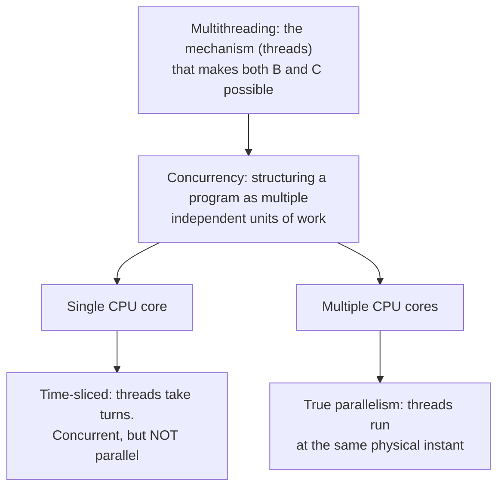
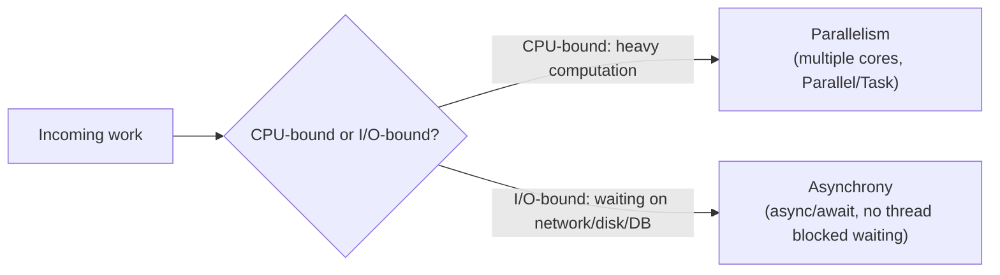

# Introduction to Concurrency and Multithreading

## Introduction

Before reading this lesson, you should already be comfortable with **[Delegates vs Events — Comparison](../06-delegates-events/06-10-delegates-vs-events-comparison.md)** and, more broadly, with the idea that closed this out: a piece of code — a handler — can be registered once and then run *later*, in response to something else happening, without the code that registered it needing to sit and wait. That "run later, elsewhere" mental model is exactly the seed this new module grows from. Module 07 asks a different question than Module 06 did: what if "elsewhere" means a genuinely different thread of execution, running at the same physical instant as the rest of your program, on a different CPU core?

This lesson does not write a single line of thread-management code yet. Its job is to build the vocabulary and the mental model — concurrency, multithreading, parallelism — that every remaining lesson in this module depends on, and to lay out the map of where Module 07 is headed.

By the end of this lesson, you will be able to:

- Define concurrency, multithreading, and parallelism precisely, and explain how they differ
- Explain why multi-core CPUs made these techniques essential rather than optional
- Distinguish CPU-bound work that benefits from parallelism from I/O-bound work that benefits from asynchrony instead
- Recognize the core hazards — race conditions and deadlocks — that this module exists to teach you to avoid
- Describe the four-part roadmap of Module 07 and where each upcoming lesson fits into it

## Concurrency and Multithreading — A Layman's Perspective

Imagine a single cashier working a small shop with one register. Customers line up, and the cashier serves them one at a time — ring up the first customer completely, then move to the second, then the third. That's the entire world most beginner programs live in: one instruction after another, one task finished before the next begins. If a customer's card reader is slow, everyone behind them simply waits. Nothing else can happen until that one transaction resolves, because there is only one cashier and only one register.

Now picture the same shop bringing in a second cashier and opening a second register. Customers can now be served by either register, and — crucially — both registers can be ringing up sales at the *exact same instant*, because there are genuinely two separate people doing the work. This is the physical difference between having one CPU core and having several: a single core, like the single cashier, can still *look* busy with several customers by rapidly switching attention between them, but only a second core lets two things truly happen simultaneously.

That rapid switching is worth sitting with, because it's precisely what "concurrency" means, and it's subtly different from "parallelism." Picture that same single cashier now handling two tasks by interleaving them — ringing up item one for customer A, then item one for customer B, then item two for customer A, and so on — making progress on both without either customer waiting through the other's entire transaction. Nothing is happening at the same *instant*; the cashier is just switching fast enough that both lines feel attended to. That's concurrency: multiple tasks making progress over the same span of time, whether or not any two of them are running at the literal same instant. Parallelism, by contrast, is what the two-cashier shop achieves: two things genuinely happening simultaneously, because there are two independent workers. Multithreading is the shop's actual staffing decision — hiring a second cashier (a second thread of execution) so that parallelism becomes *possible*, whether or not every moment of the day actually uses both registers at once.

The shop analogy also foreshadows the two problems this module spends real time on. First, imagine both cashiers sharing one single cash drawer, and both reaching in to make change at the same moment — the drawer's count can end up wrong, not because either cashier made a mistake individually, but because their two actions overlapped in a way nobody accounted for. That is a race condition, and it is coming in a later lesson. Second, imagine cashier one needs the shop's only stapler, which cashier two is holding, while cashier two needs the shop's only tape dispenser, which cashier one is holding — each waits forever for the other to let go. That is a deadlock, and it is coming too. Multiple registers make the shop faster, but only if the shop's owner plans carefully for the moments when two cashiers need to touch the same resource. That planning is the whole point of Module 07.

## Concurrency and Multithreading — A Programming Language Perspective

**Concurrency** is a program structure property: the ability to have more than one unit of work in progress during overlapping time periods, regardless of whether the underlying hardware executes them at the literal same instant. **Parallelism** is a hardware execution property: two or more units of work actually executing at the same instant, which requires at least two physical execution units — two CPU cores, or two logical cores via simultaneous multithreading. **Multithreading** is the specific *mechanism* the .NET runtime and the operating system use to achieve both: a single process can contain multiple **threads**, each an independent, OS-scheduled sequence of executing instructions that shares the same process memory (heap, static fields) but has its own call stack and instruction pointer.

A single-core machine can still be concurrent — the OS scheduler rapidly time-slices between threads, creating the *illusion* of simultaneity — but it cannot be parallel, because there is only one core to execute on. A multi-core machine can be both: the OS scheduler can place different threads on different cores, letting them run in true parallel, while still using time-slicing concurrency to host more threads than there are cores. .NET exposes this capability through `System.Threading.Thread` directly (Lesson 07-02), a managed `ThreadPool` (07-03), and higher-level abstractions — `Task`, `Parallel`, and `async`/`await` — built on top of that pool, covered later in this module.

## How Concurrency and Parallelism Relate in a Running Program

Before any code, it helps to see the relationship between the three terms as a diagram, since they're frequently — and incorrectly — used interchangeably. Concurrency is the umbrella structural concept; parallelism is one *possible outcome* of concurrency when hardware permits it; multithreading is the mechanism .NET uses to make either one possible.


*Figure 1: Concurrency is the structural goal; parallelism is what you get when hardware has multiple cores; multithreading is the mechanism that enables both.*

The simplest way to *observe* concurrency in code is to check what thread is running at a given moment. `Environment.ProcessorCount` reports how many logical cores the current machine exposes — the ceiling on genuine parallelism — and `Environment.CurrentManagedThreadId` identifies which thread a given line of code is executing on.

```csharp
// Program.cs — .NET 10 / C# 14
using System.Threading;

Console.WriteLine($"Logical processor count: {Environment.ProcessorCount}");
Console.WriteLine($"Main thread ID: {Environment.CurrentManagedThreadId}");

Thread worker = new(() =>
{
    Console.WriteLine($"Worker thread ID: {Environment.CurrentManagedThreadId}");
});

worker.Start();
worker.Join(); // Wait for the worker thread to finish before continuing.

Console.WriteLine("Back on the main thread — worker has finished.");
```

**Console Output:**

```text
Logical processor count: 8
Main thread ID: 1
Worker thread ID: 3
Back on the main thread — worker has finished.
```

The exact numbers depend on the machine running this: `ProcessorCount` reflects that machine's logical cores (8 here, but yours may differ), and the worker's thread ID is whatever the OS scheduler assigned — never assume it will be `2`. What matters conceptually is that two *different* thread IDs printed at all: the main thread (ID 1, by convention always the first) and a genuinely separate worker thread the runtime created and scheduled. `worker.Join()` blocks the main thread until the worker finishes, which is why "Back on the main thread" reliably prints last — without it, the program could reach its end before the worker even started. Lesson 07-02 covers `Thread`, `Start`, and `Join` in full depth; this preview exists only to make "a second thread is really running" tangible.

## Real-Time Example: Why Order Processing Needs Concurrency

Consider the E-Commerce Order Processing domain this curriculum returns to throughout. A single incoming `Order` triggers several genuinely independent pieces of work once payment is authorized: charge a validated payment, reserve inventory for each line item, and queue a confirmation email. Written sequentially, a slow step in any one of those — say, a payment gateway that takes 400ms to respond — delays every step after it, even though inventory reservation has nothing to do with how long the payment gateway takes to answer. This is precisely the kind of scenario multithreading exists for: independent units of work that don't need to wait on each other.

```csharp
// Program.cs — .NET 10 / C# 14 — Real-Time Example
using System.Diagnostics;
using System.Threading;

Order order = new(OrderId: "ORD-10042", Total: 249.99m);

Console.WriteLine($"Processing {order.OrderId} — total {order.Total:C}");

Stopwatch stopwatch = Stopwatch.StartNew();

Thread paymentThread = new(() => ChargePayment(order));
Thread inventoryThread = new(() => ReserveInventory(order));
Thread emailThread = new(() => QueueConfirmationEmail(order));

paymentThread.Start();
inventoryThread.Start();
emailThread.Start();

// Join blocks until each thread finishes, and joining in this fixed order
// still guarantees deterministic output below, regardless of which thread
// the OS scheduler actually finishes first internally.
paymentThread.Join();
inventoryThread.Join();
emailThread.Join();

stopwatch.Stop();
Console.WriteLine($"All steps complete for {order.OrderId} in {stopwatch.ElapsedMilliseconds}ms (approx).");

static void ChargePayment(Order order)
{
    Thread.Sleep(120); // Simulated payment-gateway latency.
    Console.WriteLine($"[Payment] {order.OrderId}: charged {order.Total:C}");
}

static void ReserveInventory(Order order)
{
    Thread.Sleep(80); // Simulated inventory-service latency.
    Console.WriteLine($"[Inventory] {order.OrderId}: stock reserved");
}

static void QueueConfirmationEmail(Order order)
{
    Thread.Sleep(40); // Simulated email-queue latency.
    Console.WriteLine($"[Email] {order.OrderId}: confirmation queued");
}

record Order(string OrderId, decimal Total);
```

**Console Output:**

```text
Processing ORD-10042 — total $249.99
[Email] ORD-10042: confirmation queued
[Inventory] ORD-10042: stock reserved
[Payment] ORD-10042: charged $249.99
All steps complete for ORD-10042 in 123ms (approx).
```

The three worker lines above print in the order each simulated task actually finished (email's 40ms delay resolves first, then inventory's 80ms, then payment's 120ms) — the exact interleaving depends on OS scheduling and could vary slightly run to run, but the total elapsed time is what matters: roughly 120ms, the *longest* single step, not the 240ms sum of all three. That's the entire economic case for concurrency in this scenario — three independent pieces of work overlapped in time instead of queued one after another, without any of them touching shared state that the others could corrupt. The moment two of those threads *did* need to touch the same shared data — say, a running total of reserved stock — is exactly where Lesson 07-04's race conditions become relevant.

## Concurrency vs Parallelism — The Full Comparison

It's worth stating the distinction one more time, plainly, because the two words get used interchangeably in casual conversation far more often than they should be: concurrency is about *dealing with* multiple things at once — structuring a program so independent units of work don't block each other unnecessarily — while parallelism is about *doing* multiple things at once — genuinely simultaneous execution, which requires hardware with more than one execution unit. A program can be concurrent without ever being parallel (a single-core machine juggling many threads via time-slicing), and in principle a system could be parallel without much explicit concurrency in the code (a single loop body vectorized across cores by the runtime with no threads visible to the programmer at all) — though in .NET, parallelism is almost always achieved *through* concurrency constructs like `Parallel.For` or multiple `Task`s.

This distinction also determines which tool solves which problem, a theme the rest of Module 07 returns to repeatedly. CPU-bound work — heavy computation that keeps a core continuously busy, like recalculating pricing across a large catalog — benefits from parallelism: splitting the computation across cores genuinely finishes it faster. I/O-bound work — waiting on a database, a network call, or a disk read, where the CPU is mostly idle *waiting*, not computing — does not benefit from more cores at all; it benefits from asynchrony, letting a thread go do other work instead of blocking on the wait. Confusing the two is a common and costly mistake: spinning up ten threads to wait on ten slow network calls wastes ten threads doing nothing but blocking, when a single thread using `async`/`await` could juggle all ten waits far more cheaply. This module covers raw threading first because it's the foundation everything else — the thread pool, `Task`, and `async`/`await` — is built on top of.


*Figure 2: The nature of the work — not habit — should decide whether you reach for parallelism or asynchrony.*

| Aspect | Concurrency | Parallelism |
|---|---|---|
| Definition | Structuring work as independent, interleavable units | Executing independent units at the same physical instant |
| Requires multiple CPU cores | No — achievable via time-slicing on one core | Yes — genuinely simultaneous execution needs multiple cores |
| Achieved in .NET via | Threads, `Task`, `async`/`await` | `Thread`/`Task` scheduled across cores, `Parallel.For`/`Parallel.ForEach` |
| Best suited for | I/O-bound waiting (network, disk, database) | CPU-bound computation (heavy math, image processing, bulk transforms) |
| Key hazard introduced | Race conditions, deadlocks (shared state touched from multiple threads) | Same hazards as concurrency, plus core-scheduling overhead if overused |

## The Roadmap: What Module 07 Covers

Module 07, "Multithreading Fundamentals," is deliberately large — concurrency is one of the areas where getting the mental model wrong early causes real, hard-to-debug production defects later. This first sub-area, covered across the five lessons that include this one, focuses purely on threads and the hazards of touching shared state from more than one of them:

1. **[The Thread Class](../07-concurrency-parallel-async/07-02-the-thread-class.md)** — creating, starting, and joining a raw `System.Threading.Thread`, and its lifecycle states.
2. **[The ThreadPool](../07-concurrency-parallel-async/07-03-the-threadpool.md)** — why reusing a managed pool of threads beats creating a new OS thread per task, and how `Task` builds on it.
3. **[Race Conditions and Deadlocks](../07-concurrency-parallel-async/07-04-race-conditions-and-deadlocks.md)** — reproducing a real lost-update bug and a real deadlock, and why both are notoriously hard to debug.
4. **[lock and Monitor](../07-concurrency-parallel-async/07-05-lock-and-monitor.md)** — the `lock` statement as sugar over `Monitor`, fixing the race condition from the previous lesson.
5. **[Mutex](../07-concurrency-parallel-async/07-06-mutex-in-csharp.md)** — a synchronization primitive that, unlike `lock`, can coordinate across process boundaries.

Beyond these five lessons, later parts of Module 07 move on to additional synchronization primitives (semaphores, reader-writer locks), the `Task` Parallel Library, and `async`/`await` — but every one of those later topics assumes you're solid on what a thread is and why shared state is dangerous, which is exactly what these first five lessons establish.

## What You've Learned & What's Next

Concurrency is a structural property of how you organize work; parallelism is what happens when hardware actually executes that work simultaneously; multithreading is the mechanism .NET uses to make both possible — and every one of those ideas comes with the same warning: as soon as two threads can touch the same piece of shared state, correctness stops being automatic.

Continue your learning journey with **[The Thread Class](../07-concurrency-parallel-async/07-02-the-thread-class.md)**, where we go beyond the preview above and cover creating, starting, joining, and inspecting the state of a `System.Threading.Thread` in full.

---
*Applies to: .NET 10 / C# 14. Last reviewed 2026-08-16.*
