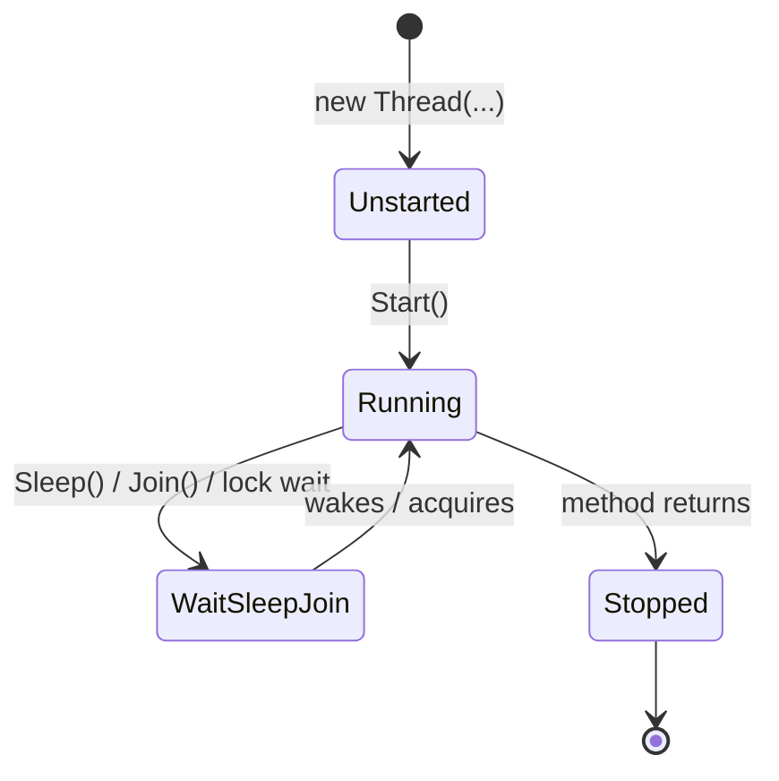
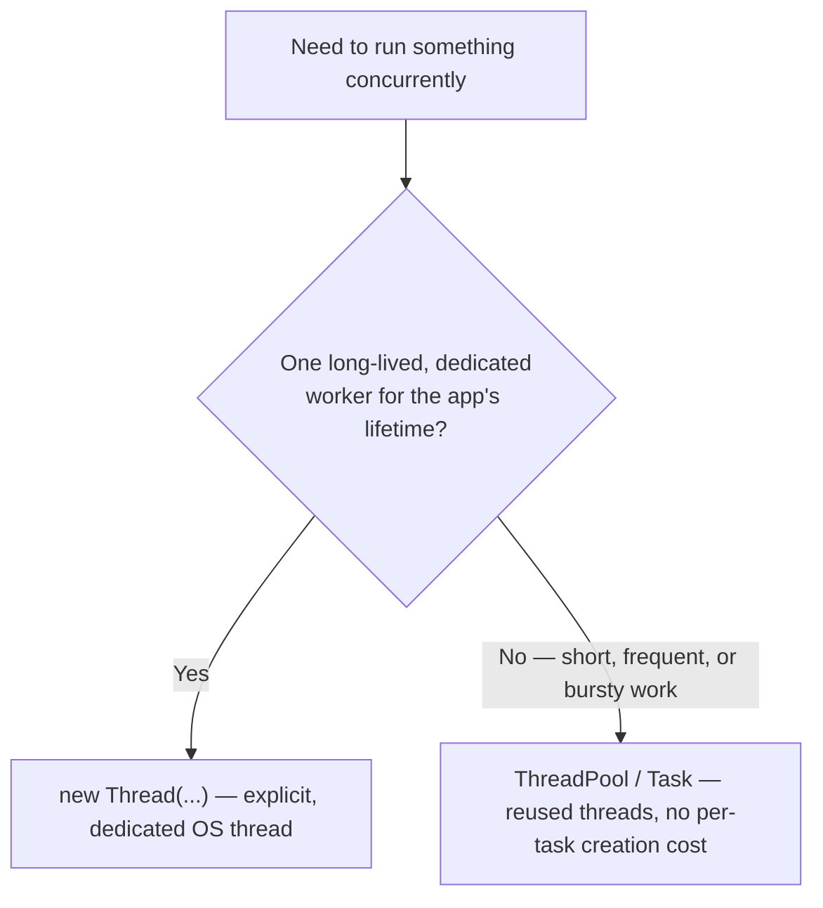

# The Thread Class

## Introduction

Before reading this lesson, you should already be comfortable with **[Introduction to Concurrency and Multithreading](../07-concurrency-parallel-async/07-01-introduction-to-concurrency.md)**, particularly the distinction between concurrency (structuring independent work) and parallelism (hardware actually executing it simultaneously), and the brief preview of `Thread`, `Start`, and `Join` shown there. This lesson stops previewing and starts teaching: `System.Threading.Thread` is the most direct, lowest-level way .NET exposes an operating-system thread to your code, and understanding it thoroughly is what makes the higher-level tools in the rest of this module — the thread pool, `Task`, `async`/`await` — make sense as *deliberate simplifications* of something you'll have seen working by hand first.

By the end of this lesson, you will be able to:

- Create a `Thread` object and start it running a method on a separate OS thread
- Pass data into a thread's starting method using both `ThreadStart` and `ParameterizedThreadStart`
- Use `Join()` to block the calling thread until another thread finishes
- Read and interpret a thread's `ThreadState` and identify its lifecycle stages
- Explain, with concrete reasons, why production C# code rarely constructs a raw `Thread` directly today

## The Thread Class — A Layman's Perspective

Think about what it actually takes to hire a temporary worker for a single, specific job — not a full-time employee with an ongoing role, just someone brought in once, given a task, and let go the moment it's done. You have to find them, explain exactly what they need to do, give them a moment to actually show up and get started, and then — if you need the result of their work before you can continue — you have to stand there and wait for them to finish before you do anything else. That entire process, from finding the worker to watching them walk off the job site when they're done, has real overhead attached to it: recruiting takes time, onboarding takes time, and someone has to manage the handoff at the end.

Creating a `Thread` object in C# is exactly that hiring process, and it's worth being honest that it's genuinely expensive by computing standards: the operating system has to allocate a fresh stack (typically a full megabyte, reserved whether or not the thread ever uses that much), register the thread with the OS scheduler, and set up all the bookkeeping the kernel needs to eventually give that thread its own slice of CPU time. A `Thread` isn't a lightweight abstraction living purely inside your program — it is a request to the operating system itself to create a genuinely new unit of scheduling, the same kind of thing every other process on the machine competes for CPU time with.

This is why, in the temporary-worker analogy, nobody hires and lets go a brand-new worker for every single five-minute task that comes up during the day — the hiring overhead alone would dwarf the work being done. A business that constantly needs short bursts of extra hands instead keeps a standing roster of on-call staff it can hand a task to instantly and release back to the roster the moment they're done, without repeating the entire hiring process each time. That roster is precisely what the next lesson's `ThreadPool` is for, and it's why this lesson exists first: you need to see what a raw, one-off `Thread` actually costs and does before appreciating why almost nobody uses one directly for routine work.

None of that makes `Thread` useless — sometimes you genuinely do need a dedicated, long-running worker, exactly the way a business occasionally does need to hire someone full-time rather than pull from the on-call roster. A background thread that runs for the entire lifetime of an application, or one that needs specific OS-level configuration (its own priority, its own name for diagnostics), is a legitimate reason to reach for `Thread` directly. What you're learning in this lesson is the tool itself, honestly, including its cost — not a recommendation to use it for every concurrent task from here on.

## The Thread Class — A Programming Language Perspective

`System.Threading.Thread` is a managed wrapper around an operating-system thread. Its constructor accepts a delegate describing the code the thread should run: either a `ThreadStart` — a parameterless `void` delegate — or a `ParameterizedThreadStart`, which accepts a single `object?` argument, letting you pass state into the thread's entry point without capturing it in a closure. Constructing a `Thread` does not start it; the OS thread is created and begins executing only once `Start()` (or `Start(object?)`) is called. `Join()` blocks the calling thread until the target thread terminates, optionally accepting a timeout (`Join(TimeSpan)`) that returns `false` if the thread hadn't finished by then.

Every `Thread` exposes a `ThreadState` property — a `[Flags]` enum describing its current lifecycle stage (`Unstarted`, `Running`, `WaitSleepJoin`, `Stopped`, and several less common states like `Background` and `Aborted`, the latter effectively vestigial since `Thread.Abort` was removed in .NET Core). A thread is a **foreground thread** by default, meaning the process will not exit until it finishes; setting `IsBackground = true` makes it a **background thread**, which the runtime terminates automatically when all foreground threads have exited — useful for workers that should never block application shutdown.

## How to Create, Start, and Join a Thread in C#

Creating a thread is a three-step sequence: construct it with a delegate describing what it should run, call `Start()` to hand it to the OS scheduler, and — if you need to know when it's done — call `Join()`. The diagram below shows a thread's lifecycle from creation through termination.


*Figure 1: A thread's lifecycle — created unstarted, moved to Running by `Start()`, possibly parked in WaitSleepJoin, and finally Stopped when its method returns.*

```csharp
// Program.cs — .NET 10 / C# 14
Thread worker = new(PrintNumbers);
Console.WriteLine($"Before Start(): {worker.ThreadState}");

worker.Start();
Console.WriteLine($"Just after Start(): {worker.ThreadState}");

worker.Join(); // Block the main thread until 'worker' finishes.
Console.WriteLine($"After Join(): {worker.ThreadState}");

static void PrintNumbers()
{
    for (int i = 1; i <= 3; i++)
    {
        Console.WriteLine($"Worker printing {i}");
    }
}
```

**Console Output:**

```text
Before Start(): Unstarted
Just after Start(): Running
Worker printing 1
Worker printing 2
Worker printing 3
After Join(): Stopped
```

Note that "Worker printing 1/2/3" reliably prints *before* "After Join()" — that ordering is guaranteed, because `Join()` blocks the main thread until `PrintNumbers` has fully returned. Without the `Join()` call, the main thread could reach the end of the program before the worker thread ever got scheduled, and .NET Console applications exit as soon as all foreground threads finish — so the worker's output might never appear at all. The `ThreadState` value read immediately after `Start()` shows `Running`, though in principle a very fast worker could already have transitioned toward `Stopped` by the time you read it — `ThreadState` is a live snapshot, not a guarantee about what you'll observe next.

## Real-Time Example: Background Stock-Reservation Workers in Order Processing

We extend the E-Commerce Order Processing domain from Lesson 07-01 with a scenario that specifically calls for `ParameterizedThreadStart`: a batch of orders arrives, and each order's inventory reservation needs to run on its own thread, receiving that specific order's data rather than closing over a shared loop variable. Passing state explicitly through `Start(object?)` avoids a classic closure-capture bug where all threads could otherwise end up reading the same, final loop variable value.

```csharp
// Program.cs — .NET 10 / C# 14 — Real-Time Example
using System.Collections.Concurrent;

List<Order> orders =
[
    new("ORD-9001", 3),
    new("ORD-9002", 1),
    new("ORD-9003", 5)
];

// Thread-safe collection so worker threads can report results without corrupting a shared list.
ConcurrentBag<string> results = [];
List<Thread> workers = [];

foreach (Order order in orders)
{
    Thread worker = new(ReserveStock)
    {
        Name = $"Reserve-{order.OrderId}"
    };
    workers.Add(worker);
    worker.Start(order); // Passing 'order' explicitly avoids capturing a shared loop variable.
}

foreach (Thread worker in workers)
{
    worker.Join(); // Wait for every reservation thread to finish before reporting.
}

Console.WriteLine("All reservations complete:");
foreach (string result in results.OrderBy(r => r))
{
    Console.WriteLine($"  {result}");
}

void ReserveStock(object? state)
{
    Order order = (Order)state!;
    Thread.Sleep(20 * order.Quantity); // Simulated per-unit reservation latency.
    results.Add($"{order.OrderId}: reserved {order.Quantity} unit(s) on '{Thread.CurrentThread.Name}'");
}

record Order(string OrderId, int Quantity);
```

**Console Output:**

```text
All reservations complete:
  ORD-9001: reserved 3 unit(s) on 'Reserve-ORD-9001'
  ORD-9002: reserved 1 unit(s) on 'Reserve-ORD-9002'
  ORD-9003: reserved 5 unit(s) on 'Reserve-ORD-9003'
```

The final report is sorted (`OrderBy(r => r)`) specifically to keep this output deterministic — the three worker threads actually finish in an order determined by their simulated latency (`ORD-9002` first at 20ms, `ORD-9001` next at 60ms, `ORD-9003` last at 100ms), but since we only read `results` after every thread has been joined, sorting before printing guarantees the same output every run. Each thread received its *own* `Order` through `Start(order)` rather than reading a shared loop variable, and each was named for clearer diagnostics — both details that matter once you're debugging which of several concurrent reservations went wrong in a real system.

## Thread vs ThreadPool — Why Raw Thread Is Rarely the Right Choice

Every `Thread` you construct directly asks the operating system to create a brand-new OS-level thread, complete with its own reserved stack — and tearing that thread down at the end has its own cost too. For short-lived, frequent units of work, that creation-and-teardown overhead can easily dwarf the actual work being done, especially in a server application handling many small concurrent requests per second. There's also a hard ceiling: an OS can only support so many live threads before scheduling overhead and memory pressure degrade the whole system, so naively spinning up a new `Thread` per incoming unit of work does not scale.

The `ThreadPool`, covered in full in the next lesson, solves exactly this by maintaining a standing pool of already-created, reusable threads that work items are handed to and returned to when finished — no per-task creation or teardown cost. `Task` and `async`/`await`, covered later in this module, are built on top of that pool. This doesn't make `Thread` obsolete: a long-lived, dedicated background worker — one that should exist for the application's entire lifetime and shouldn't compete with pooled work items — is still a legitimate, explicit reason to construct a `Thread` yourself.


*Figure 2: Reach for a raw `Thread` only when you specifically need a dedicated, long-lived worker; otherwise the pool exists precisely to avoid `Thread`'s creation overhead.*

| Aspect | Raw `Thread` | `ThreadPool` (previewed here, detailed next lesson) |
|---|---|---|
| Creation cost | New OS thread each time — relatively expensive | Threads pre-created and reused — near-zero per-task cost |
| Lifetime | Lives exactly as long as you keep it (or the process) | Threads persist in the pool across many work items |
| Best suited for | One dedicated, long-lived background worker | Many short, frequent, or bursty units of work |
| Naming / diagnostics | `Thread.Name` settable per instance | Pool threads are typically unnamed/shared |
| What builds on it | Nothing — it's the lowest level | `Task`, `Parallel`, and `async`/`await` all use it under the hood |

## Types of Thread-Related Members Worth Knowing

Beyond `Start` and `Join`, `Thread` exposes several members worth being aware of as you move through the rest of this module:

1. **[The ThreadPool](../07-concurrency-parallel-async/07-03-the-threadpool.md)** — the reusable alternative to constructing threads directly, covered next.
2. **`Thread.Sleep(int)`** — pauses the current thread for a given number of milliseconds; used throughout this module's examples to simulate latency.
3. **`Thread.IsBackground`** — marks a thread as background so it won't keep the process alive on its own.
4. **`Thread.Priority`** — hints to the OS scheduler about relative CPU-time priority (rarely adjusted in typical application code).
5. **`Thread.CurrentThread`** — a static property returning the `Thread` object for whichever thread is currently executing, useful for diagnostics like the `Name` read in this lesson's example.
6. **[Race Conditions and Deadlocks](../07-concurrency-parallel-async/07-04-race-conditions-and-deadlocks.md)** — what goes wrong once two `Thread`s touch the same shared state, covered two lessons ahead.

## What You've Learned & What's Next

A `Thread` gives you direct, explicit control over an operating-system thread — construct it with a `ThreadStart` or `ParameterizedThreadStart`, `Start()` it, and `Join()` it if you need to know when it's finished — but that directness comes with real creation and teardown cost, which is exactly why modern C# code reaches for a managed pool of reusable threads instead of constructing `Thread` objects for routine, short-lived work.

Continue your learning journey with **[The ThreadPool](../07-concurrency-parallel-async/07-03-the-threadpool.md)**, where we cover `ThreadPool.QueueUserWorkItem` and see exactly how `Task` and `async`/`await` build on the same pool under the hood.

---
*Applies to: .NET 10 / C# 14. Last reviewed 2026-08-16.*
