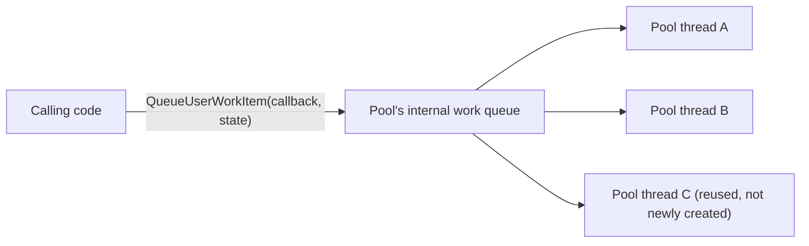
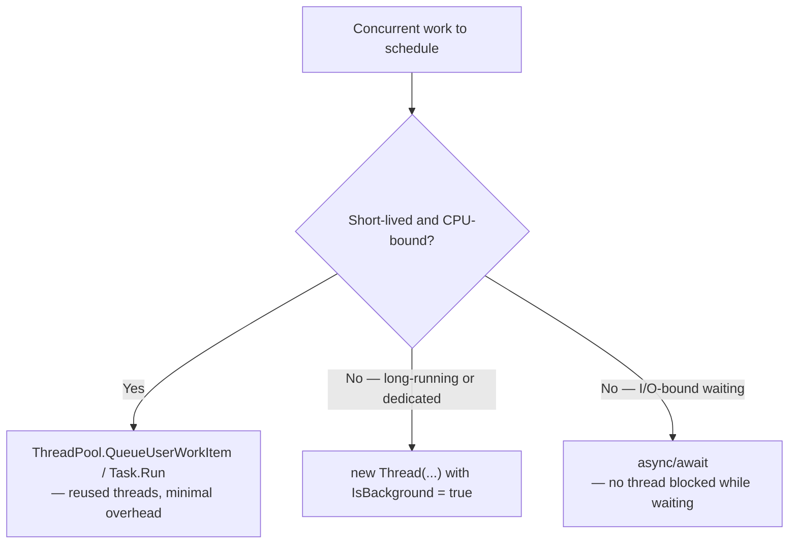

# The ThreadPool

## Introduction

Before reading this lesson, you should already be comfortable with **[The Thread Class](../07-concurrency-parallel-async/07-02-the-thread-class.md)**, in particular the closing point it built toward: constructing a raw `Thread` asks the operating system to create a genuinely new thread, with real creation and teardown cost, which makes it a poor fit for the many short, frequent units of work a typical application actually needs to run concurrently. This lesson introduces the tool .NET provides specifically to solve that problem — a managed pool of threads that are created once, reused across many work items, and never torn down between them.

By the end of this lesson, you will be able to:

- Explain what the `ThreadPool` is and why it exists as an alternative to constructing `Thread` objects directly
- Queue work onto the pool with `ThreadPool.QueueUserWorkItem` and pass state into it safely
- Explain the cost `Thread` creation avoids by reusing pool threads instead
- Describe, at a conceptual level, how `Task` and `async`/`await` are built on top of the same pool
- Recognize the kinds of work that are a poor fit for the thread pool (long-running or blocking work)

## The ThreadPool — A Layman's Perspective

Return to the temporary-worker hiring problem from the previous lesson, and now picture the business's solution to it: instead of running a fresh hiring process for every five-minute task, the business keeps a standing roster of on-call staff who are already vetted, already trained, and already sitting in the break room ready to go. When a task comes in, a manager just taps the shoulder of whoever's free on the roster, hands them the task, and — the moment they finish — they go straight back to the break room instead of being let go and needing to be re-hired next time. The roster has a sensible size: not one worker (that would be no better than the single-cashier line from Lesson 07-01), and not an unlimited number either, because the break room only fits so many people and the business only has so much floor space to actually put them to work on at once.

This is exactly what the `ThreadPool` is: a fixed-but-adjustable-size collection of already-created threads, sitting ready, that work items get handed to and returned from without any per-task hiring or firing. The manager handing out tasks is `ThreadPool.QueueUserWorkItem` — you describe the task, and the pool's internal scheduler picks whichever available worker thread picks it up next. You don't get to choose *which* physical thread runs your work, and you generally shouldn't care — the entire value proposition of a break-room roster is that any available worker can pick up any queued task interchangeably.

There is one more detail worth internalizing from the analogy, because it explains a rule this lesson comes back to: on-call staff are meant for quick, bounded tasks, not for someone who needs to disappear into a back office for six hours doing something else entirely. If a manager assigns a roster worker something that will tie them up indefinitely, that worker is now unavailable for every other quick task that comes in behind it — and if enough roster workers get tied up that way, the whole business grinds to a halt because there's nobody left on the roster to hand new work to. That's precisely why long-running or blocking operations are a poor fit for `ThreadPool` work items, a point this lesson returns to explicitly.

Finally, it's worth knowing that most C# code today doesn't even call the roster manager directly — it uses `Task.Run`, which is really just a friendlier front desk that talks to the same roster behind the scenes. Learning `QueueUserWorkItem` directly here is like learning how the break-room roster actually works before you start using the front desk that quietly manages it for you in every later lesson.

## The ThreadPool — A Programming Language Perspective

`System.Threading.ThreadPool` is a static class managing a shared, process-wide pool of worker threads maintained by the CLR. Rather than creating and destroying an OS thread per unit of work, the runtime creates a bounded set of threads up front (and grows or shrinks that set adaptively, within configurable minimum and maximum thread counts) and reuses them across successive work items submitted via `ThreadPool.QueueUserWorkItem(WaitCallback)` or its generic overload `QueueUserWorkItem<TState>(Action<TState>, TState)`, which avoids the closure-capture pitfalls of passing state through a lambda. Each call enqueues a work item onto an internal queue; whichever pool thread becomes free next dequeues and executes it.

Critically, `System.Threading.Tasks.Task` — and by extension `async`/`await`, `Task.Run`, and `Parallel.For`/`ForEach` — is implemented on top of the exact same thread pool for CPU-bound work by default. `Task.Run(() => DoWork())` ultimately queues `DoWork` onto the same pool `QueueUserWorkItem` targets; `Task` simply layers a much richer API on top — a return value via `Task<TResult>`, composable continuations, cancellation, and exception propagation that raw `QueueUserWorkItem` does not provide on its own.

## How to Queue Work onto the ThreadPool in C#

Queuing pool work is a single call: hand `QueueUserWorkItem` a delegate (and, with the generic overload, a state object), and the pool schedules it onto whichever worker thread becomes available. Because you don't control which thread runs it or exactly when, coordinating "wait until this finished" requires an explicit signal — a `ManualResetEventSlim`, a `CountdownEvent`, or, as shown here, a simple counter guarded by `Interlocked`.


*Figure 1: Work items are queued once and picked up by whichever pool thread is next available — the threads themselves already exist and are reused across items.*

```csharp
// Program.cs — .NET 10 / C# 14
using System.Threading;

using CountdownEvent countdown = new(initialCount: 3);

for (int i = 1; i <= 3; i++)
{
    ThreadPool.QueueUserWorkItem(state =>
    {
        int taskNumber = (int)state!;
        Thread.Sleep(taskNumber * 10); // Simulated variable-length work.
        Console.WriteLine($"Pool work item {taskNumber} finished on thread {Environment.CurrentManagedThreadId}");
        countdown.Signal();
    }, i);
}

countdown.Wait(); // Block the main thread until all three work items have signaled completion.
Console.WriteLine("All queued work items are done.");
```

**Console Output:**

```text
Pool work item 1 finished on thread 5
Pool work item 2 finished on thread 6
Pool work item 3 finished on thread 7
All queued work items are done.
```

The specific thread IDs (5, 6, 7 here) are whatever the pool happened to assign and will vary by machine and run — the exact IDs are never something to depend on. What is guaranteed is the *order* of completion, since each item's simulated delay (`taskNumber * 10` milliseconds) increases with its number, and `countdown.Wait()` only unblocks the main thread once all three have signaled, so "All queued work items are done" reliably prints last. Notice that no `Thread` was ever constructed directly — three separate work items ran concurrently using threads the pool already had on hand.

## Real-Time Example: Fan-Out Inventory Checks Across a Library Catalog

We extend the Library/Inventory Management domain with a catalog-wide availability check: given a batch of book titles a patron is interested in, the system needs to check each title's availability against a (simulated) catalog service concurrently, rather than one at a time, and report results only once every check has completed. This is exactly the "many short, independent units of work" shape the pool is built for — checking one title's availability has no dependency on any other title's check.

```csharp
// Program.cs — .NET 10 / C# 14 — Real-Time Example
using System.Collections.Concurrent;

string[] requestedTitles =
[
    "Clean Code",
    "The Pragmatic Programmer",
    "Design Patterns",
    "Refactoring"
];

ConcurrentDictionary<string, bool> availability = new();
using CountdownEvent countdown = new(requestedTitles.Length);

foreach (string title in requestedTitles)
{
    ThreadPool.QueueUserWorkItem(state =>
    {
        string bookTitle = (string)state!;
        bool isAvailable = CheckCatalog(bookTitle);
        availability[bookTitle] = isAvailable;
        countdown.Signal();
    }, title);
}

countdown.Wait();

Console.WriteLine("Availability report:");
foreach (string title in requestedTitles) // Report in the original request order, not completion order.
{
    string status = availability[title] ? "Available" : "Checked out";
    Console.WriteLine($"  {title}: {status}");
}

static bool CheckCatalog(string title)
{
    Thread.Sleep(Math.Abs(title.Length) % 5 * 10); // Simulated per-title catalog lookup latency.
    // A small, fixed rule stands in for a real catalog lookup, keeping output deterministic.
    return title.Length % 2 == 0;
}
```

**Console Output:**

```text
Availability report:
  Clean Code: Available
  The Pragmatic Programmer: Checked out
  Design Patterns: Available
  Refactoring: Checked out
```

Because the report loop iterates `requestedTitles` in its original order rather than whatever order the pool happened to finish each check, the output is fully deterministic regardless of how the four checks actually interleaved on the pool's worker threads. In a real system, `CheckCatalog` would be a call to a database or an external catalog API, and fanning four such lookups out across the pool lets them overlap in time — the total wait is bounded by the *slowest* single lookup rather than the sum of all four, the same economic benefit Lesson 07-01 demonstrated with `Thread` directly, but here without paying the cost of creating four brand-new OS threads for what is, individually, a short-lived task.

## ThreadPool vs Raw Thread — The Full Comparison

The core trade-off comes down to overhead versus control. A raw `Thread` gives you a dedicated OS thread with a name you can set, a priority you can adjust, and a lifetime entirely under your control — but every one you construct pays the full cost of OS thread creation and, eventually, teardown. The `ThreadPool` gives you none of that per-instance control — you cannot name a pool thread, and you don't know or control which one picks up your work item — but in exchange, queuing a work item is dramatically cheaper than constructing a `Thread`, because the threads already exist and are simply reused.

This is also where the pool's one hard rule comes from: never queue long-running or blocking work onto it. The pool sizes itself based on the assumption that work items are short-lived; a work item that blocks for a long time (waiting on a slow synchronous I/O call, for instance) ties up a pool thread that could otherwise serve other queued work, and if enough long-running items pile up simultaneously, the pool has to create additional threads to compensate — clawing back exactly the overhead the pool exists to avoid, and in servers under load, potentially exhausting the pool ("thread pool starvation") badly enough to stall unrelated requests. Genuinely long-running or dedicated work still belongs on a `Thread` created directly with `IsBackground = true`, exactly as covered in the previous lesson; genuinely blocking I/O belongs behind `async`/`await`, covered later in this module, which frees the thread entirely while waiting rather than parking it.


*Figure 2: The pool is the default for short CPU-bound work; dedicated `Thread`s and `async`/`await` remain the right tools for the two cases the pool is a poor fit for.*

| Aspect | Raw `Thread` | `ThreadPool` |
|---|---|---|
| Thread creation cost per task | Full OS thread creation — relatively expensive | None — threads already exist and are reused |
| Control over the specific thread | Full (name, priority, dedicated lifetime) | None — any available pool thread may run it |
| Best suited for | One dedicated, long-lived worker | Many short, frequent, CPU-bound work items |
| Risk if misused | Wasted overhead if used for tiny, frequent tasks | Pool starvation if work items block or run too long |
| What's built on top of it | Nothing — it is the lowest level | `Task`, `Task.Run`, `Parallel.For`/`ForEach`, `async`/`await` |

## Types and Related Members Worth Knowing

Beyond `QueueUserWorkItem`, several related members and constructs round out how work reaches and is coordinated on the pool:

1. **[Race Conditions and Deadlocks](../07-concurrency-parallel-async/07-04-race-conditions-and-deadlocks.md)** — what happens when two pool work items touch the same shared state without coordination, covered next.
2. **`ThreadPool.SetMinThreads` / `SetMaxThreads`** — tune the pool's minimum and maximum thread counts (rarely needed; the defaults handle most workloads well).
3. **`Task.Run(Action)`** — the modern, higher-level façade over `QueueUserWorkItem`, adding a `Task` handle, exceptions, and composability.
4. **`CountdownEvent` / `ManualResetEventSlim`** — synchronization primitives used to know when a batch of pool work items has finished, as shown in this lesson's examples.
5. **`Parallel.For` / `Parallel.ForEach`** — a higher-level API, covered later in this module, that also schedules its iterations onto the pool.
6. **I/O completion threads** — a second, related pool the runtime uses specifically for asynchronous I/O callbacks, distinct from the worker-thread pool shown here.

## What You've Learned & What's Next

The `ThreadPool` trades per-task control for dramatically lower overhead by keeping a standing set of reusable threads and queuing short units of work onto them via `QueueUserWorkItem` — and it's this exact pool that `Task`, `Task.Run`, and `async`/`await` quietly rely on for CPU-bound work throughout the rest of this module, which is why understanding it now makes everything built on top of it easier to reason about later.

Continue your learning journey with **[Race Conditions and Deadlocks](../07-concurrency-parallel-async/07-04-race-conditions-and-deadlocks.md)**, where multiple pool threads finally touch the *same* shared state at once, and we see exactly what goes wrong when nothing coordinates that access.

---
*Applies to: .NET 10 / C# 14. Last reviewed 2026-08-16.*
