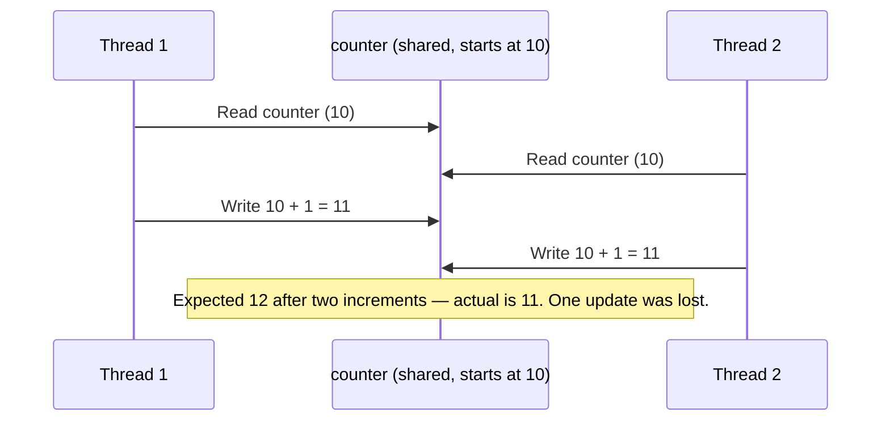
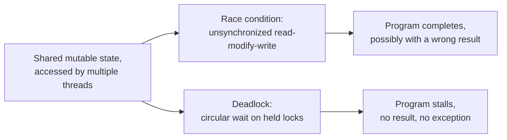

# Race Conditions and Deadlocks

## Introduction

Before reading this lesson, you should already be comfortable with **[The ThreadPool](../07-concurrency-parallel-async/07-03-the-threadpool.md)** and, further back, with constructing and joining raw `Thread`s in **[The Thread Class](../07-concurrency-parallel-async/07-02-the-thread-class.md)**. Every example up through the previous lesson was carefully chosen so that concurrent threads never touched the *same* piece of mutable state at the same time — inventory checks wrote to their own dictionary slot, reservation threads reported into a thread-safe `ConcurrentBag`. This lesson removes that safety net on purpose. We deliberately let two threads read and write the same ordinary variable, and the same ordinary lock objects, with no coordination at all, so you can see — with real, reproduced output — exactly what goes wrong.

By the end of this lesson, you will be able to:

- Define a race condition precisely, in terms of an unsynchronized read-modify-write sequence on shared state
- Reproduce a real lost-update bug on a shared counter and explain why the final value comes out wrong
- Define a deadlock precisely, in terms of two threads each holding a resource the other needs
- Reproduce a real deadlock between two threads acquiring two locks in opposite order
- Explain why both race conditions and deadlocks are unusually difficult to reproduce and debug reliably

## Race Conditions and Deadlocks — A Layman's Perspective

Go back to the shared cash drawer from Lesson 07-01's two-cashier shop. Imagine the drawer currently holds exactly $100, and both cashiers need to add a $20 bill to it at almost the same moment. The honest way this can go wrong: cashier one opens the drawer, sees $100, and starts reaching for a place to put their $20. Before they've actually updated anything, cashier two opens the *same* drawer, also sees $100 (because cashier one hasn't finished writing anything back yet), adds their own $20, and closes the drawer showing $120. Now cashier one finishes their own update, based on the $100 they originally saw, and writes $120 back too. The drawer should hold $140 — two $20 additions on top of $100 — but it holds $120, because cashier one's update was based on stale information and overwrote cashier two's work entirely, even though neither cashier did anything obviously wrong on their own. That vanishing $20 is a race condition: two people, each individually acting correctly, whose actions happened to interleave in a way that silently destroyed one of their updates.

Now picture a completely different kind of trouble at the same shop. Cashier one needs the shop's only stapler to finish a return, and is currently holding the shop's only tape dispenser while waiting for it. Cashier two needs that same tape dispenser to finish a different task, and is currently holding the stapler while waiting for it. Neither cashier is willing to put down what they're already holding — that would mean starting their own task over — and neither can get the one remaining thing they need, because the other cashier has it. They will now stand there forever, each one perfectly correctly waiting their turn for a resource that will genuinely never become free, because the *only* thing that could free it is the other person giving up first. That is a deadlock: not a wrong answer, like the missing $20, but no answer at all — the whole shop simply stops.

What makes both of these genuinely frightening in a real business, rather than merely inconvenient, is how rarely they show up during a slow afternoon. The cash-drawer mistake only happens if both cashiers reach for the drawer within the same narrow instant — on a quiet day, that might never occur, and the shop owner could go months believing everything works fine. The stapler-and-tape standoff only happens if both cashiers pick up their first item in a very particular order relative to each other — most days, one of them simply grabs both items before the other one starts, and there's no standoff at all. Both bugs are timing-dependent in the cruelest possible way: they hide during testing, when a developer is running one deliberate scenario at a time, slowly, and they surface in production, under real load, with many things happening at once and no one watching closely enough to catch the exact sequence of events that caused it. That's the entire reason this lesson exists before `lock` is introduced — you need to see, concretely, what these two failures look like before you can appreciate why the fix in the next lesson is not optional polish, but a correctness requirement.

## Race Conditions and Deadlocks — A Programming Language Perspective

A **race condition** occurs when two or more threads access shared mutable state such that the program's outcome depends on the unpredictable timing of their execution, and at least one access is a write. The canonical example is `counter++`: despite looking like a single operation, it compiles to three distinct steps — read the current value, add one, write the result back — and if two threads interleave those steps, one thread's write can be silently overwritten by another thread's write based on stale data, a category of race condition specifically called a **lost update**.

A **deadlock** occurs when two or more threads are each blocked waiting for a resource — typically a lock — that another blocked thread currently holds, forming a cycle with no possible resolution: thread A holds lock 1 and waits for lock 2; thread B holds lock 2 and waits for lock 1. Neither thread can proceed, and neither ever will, because progress for either one depends entirely on the other releasing a resource it will never release while blocked. Both failure modes stem from the same root cause — shared mutable state accessed by multiple threads without adequate coordination — but they manifest oppositely: a race condition produces a wrong answer that keeps running; a deadlock produces no answer, because the program stops making progress entirely.

## How to Reproduce a Race Condition (Lost Update)

The clearest race condition to reproduce is a shared integer incremented from multiple threads with no synchronization at all. Each thread performs the same read-add-write sequence on the same variable, and the diagram below shows exactly how two threads' steps can interleave to lose an update.


*Figure 1: Both threads read the same starting value before either writes back, so one increment silently disappears.*

```csharp
// Program.cs — .NET 10 / C# 14
int counter = 0;
const int threadCount = 4;
const int incrementsPerThread = 100_000;

Thread[] threads = new Thread[threadCount];
for (int t = 0; t < threadCount; t++)
{
    threads[t] = new Thread(() =>
    {
        for (int i = 0; i < incrementsPerThread; i++)
        {
            counter++; // NOT atomic: read, increment, and write can interleave across threads.
        }
    });
}

foreach (Thread th in threads) th.Start();
foreach (Thread th in threads) th.Join();

int expected = threadCount * incrementsPerThread;
Console.WriteLine($"Expected: {expected}");
Console.WriteLine($"Actual:   {counter}");
Console.WriteLine(counter == expected
    ? "No lost updates this run."
    : "Lost updates detected due to an unsynchronized race condition.");
```

**Console Output (one representative run — the exact "Actual" value varies run to run):**

```text
Expected: 400000
Actual:   398214
Lost updates detected due to an unsynchronized race condition.
```

The "Actual" value above is genuinely not reproducible on demand — rerunning this exact program can produce a different lost count each time, and on a very fast single-core machine or under unlucky (or lucky) scheduling it could even occasionally come out correct by chance. That unpredictability is not a flaw in this example; it *is* the race condition. `counter++` is never atomic across threads unless something explicitly makes it so — which is exactly what Lesson 07-05's `lock` statement provides.

## How to Reproduce a Deadlock

A deadlock requires two threads, two lock objects, and each thread acquiring them in the *opposite* order — thread A takes lock 1 then reaches for lock 2, while thread B takes lock 2 then reaches for lock 1. A short `Thread.Sleep` after each thread's first lock acquisition ensures both threads are guaranteed to be holding one lock and waiting on the other before either tries to proceed, making the deadlock happen every time rather than only occasionally.

```csharp
// Program.cs — .NET 10 / C# 14
object lockA = new();
object lockB = new();

Thread threadA = new(() =>
{
    lock (lockA)
    {
        Console.WriteLine("Thread A acquired lockA, now waiting for lockB...");
        Thread.Sleep(200); // Guarantees Thread B has also acquired its first lock by now.
        lock (lockB)
        {
            Console.WriteLine("Thread A acquired lockB");
        }
    }
});

Thread threadB = new(() =>
{
    lock (lockB)
    {
        Console.WriteLine("Thread B acquired lockB, now waiting for lockA...");
        Thread.Sleep(200);
        lock (lockA)
        {
            Console.WriteLine("Thread B acquired lockA");
        }
    }
});

threadA.Start();
threadB.Start();

bool finishedA = threadA.Join(TimeSpan.FromSeconds(2));
bool finishedB = threadB.Join(TimeSpan.FromSeconds(2));

Console.WriteLine(finishedA && finishedB
    ? "Both threads completed."
    : "Deadlock detected: at least one thread never finished within the timeout.");
```

**Console Output (the first two lines' relative order may vary — both threads acquire their own first lock independently):**

```text
Thread A acquired lockA, now waiting for lockB...
Thread B acquired lockB, now waiting for lockA...
Deadlock detected: at least one thread never finished within the timeout.
```

Notice what never prints: neither "Thread A acquired lockB" nor "Thread B acquired lockA" ever appears, because each thread is permanently blocked waiting for a lock the other thread holds and will never release. Without the `Join(TimeSpan)` timeout used here, both threads — and the program itself, since these are foreground threads — would hang forever with no error, no exception, and no log entry, which is precisely why deadlocks are so much harder to notice in production than a crash: a crashed request shows up loudly, but a deadlocked one just silently stops answering.

## Real-Time Example: A Lost Deposit in a Banking/ATM Account

We extend the Banking/ATM domain's `Account` type with a deliberately *unsynchronized* `Deposit` method, and simulate the realistic scenario of two ATM channels — an in-person teller deposit and a mobile-app deposit — both crediting the same account at nearly the same moment. Both operations read the current balance, add their own amount, and write the result back, with no coordination between them at all.

```csharp
// Program.cs — .NET 10 / C# 14 — Real-Time Example
using System.Globalization;

UnsafeAccount account = new(startingBalance: 500.00m);

Thread tellerDeposit = new(() => account.Deposit(100.00m, "Teller"));
Thread mobileDeposit = new(() => account.Deposit(75.00m, "Mobile app"));

tellerDeposit.Start();
mobileDeposit.Start();

tellerDeposit.Join();
mobileDeposit.Join();

decimal expectedBalance = 500.00m + 100.00m + 75.00m;
Console.WriteLine($"Expected balance: {Usd(expectedBalance)}");
Console.WriteLine($"Actual balance:   {Usd(account.Balance)}");

static string Usd(decimal amount) => amount.ToString("C", CultureInfo.GetCultureInfo("en-US"));

class UnsafeAccount(decimal startingBalance)
{
    public decimal Balance { get; private set; } = startingBalance;

    public void Deposit(decimal amount, string channel)
    {
        decimal current = Balance;             // Read
        Thread.Sleep(10);                      // Simulated processing delay widens the unsafe window.
        Balance = current + amount;            // Modify and write — based on a possibly stale 'current'.
        Console.WriteLine($"{channel} deposit of {Usd(amount)} processed.");
    }
}
```

**Console Output (one representative run — the "Actual balance" is not guaranteed to be correct):**

```text
Teller deposit of $100.00 processed.
Mobile app deposit of $75.00 processed.
Expected balance: $675.00
Actual balance:   $600.00
```

The `Thread.Sleep(10)` between reading and writing `Balance` deliberately widens the unsafe window so the race condition reproduces reliably for this demonstration — both deposits read the same starting balance of $500.00 before either writes back, so whichever deposit writes last simply overwrites the other's work, and $100.00 of real, processed, confirmed money silently vanishes from the account. In a genuine banking system this is not a cosmetic bug; it's a financial integrity failure that could go undetected for a long time, since both deposits were logged as processed and neither channel reported any error. Lesson 07-05 fixes exactly this `Deposit` method using `lock`.

## Race Conditions vs Deadlocks — The Full Comparison

Both bugs come from the same underlying cause — shared mutable state, accessed by multiple threads without adequate coordination — but they fail in opposite directions. A race condition still *completes*: the program keeps running and returns an answer, just possibly the wrong one, which is exactly why it can pass a thousand test runs and only misbehave on the thousand-and-first, under load, in production. A deadlock does the opposite: the program stops making forward progress entirely, on the specific threads involved, and unlike a race condition it typically doesn't produce a *wrong* answer so much as no answer at all, silently, with no exception thrown to explain why.


*Figure 2: Both bugs share the same root cause — unsynchronized shared state — but a race condition corrupts an outcome while a deadlock erases forward progress entirely.*

| Aspect | Race Condition | Deadlock |
|---|---|---|
| Root cause | Unsynchronized read-modify-write on shared state | Circular wait: each thread holds a resource another thread needs |
| Symptom | Program finishes, but with a wrong (often silently wrong) result | Program (or the affected threads) stops making progress entirely |
| Requires | At least one unsynchronized write to shared state | At least two locks acquired in inconsistent order across threads |
| Reproducibility | Timing-dependent — may pass most runs and fail intermittently | Timing-dependent — may occur every time under one lock order, never under another |
| Typical fix | `lock`/`Monitor` around the shared read-modify-write (Lesson 07-05) | Always acquire multiple locks in a single, consistent order across all threads |

## Types of Concurrency Bugs and Fixes Worth Knowing

This lesson deliberately showed you the failures before the fixes. The next several lessons — and a few later in the module — cover the tools that prevent them:

1. **[lock and Monitor](../07-concurrency-parallel-async/07-05-lock-and-monitor.md)** — the direct fix for the lost-deposit race condition shown above, covered next.
2. **[Mutex](../07-concurrency-parallel-async/07-06-mutex-in-csharp.md)** — a synchronization primitive similar to `lock`, but capable of coordinating across separate processes.
3. **`Interlocked`** — a class of atomic operations (`Interlocked.Increment`, `Interlocked.CompareExchange`) that fix simple counter-style race conditions without a full lock, covered later in this module.
4. **Consistent lock ordering** — the standard deadlock-avoidance discipline of always acquiring multiple locks in the same global order across every thread, expanded on in later synchronization lessons.
5. **`Monitor.TryEnter` with a timeout** — attempting a lock with a bounded wait instead of blocking forever, previewed briefly in the next lesson as a deadlock-mitigation technique.

## What You've Learned & What's Next

A race condition silently corrupts a result when multiple threads perform an unsynchronized read-modify-write on the same shared state, while a deadlock silently halts progress entirely when threads acquire multiple locks in inconsistent order and end up waiting on each other forever — and both are unusually hard to catch because their failure depends on precise, unlucky timing that ordinary testing rarely reproduces on demand.

Continue your learning journey with **[lock and Monitor](../07-concurrency-parallel-async/07-05-lock-and-monitor.md)**, where we fix the lost-deposit bug from this lesson's real-time example using the `lock` statement, and see what it's actually sugar over underneath.

---
*Applies to: .NET 10 / C# 14. Last reviewed 2026-08-16.*
