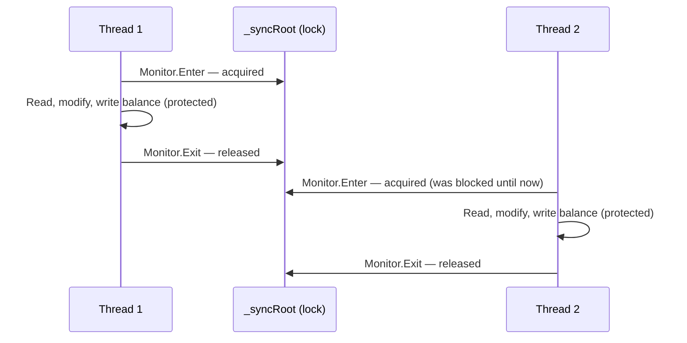
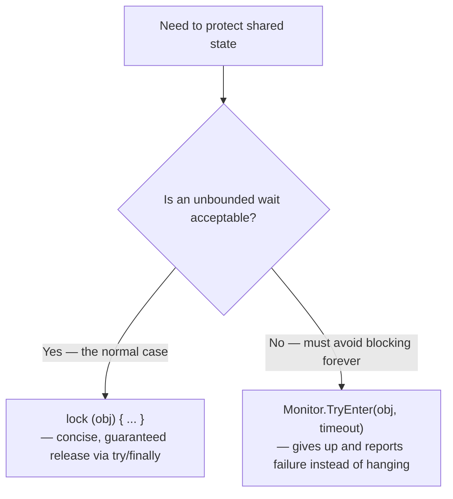

# lock and Monitor

## Introduction

Before reading this lesson, you should already be comfortable with **[Race Conditions and Deadlocks](../07-concurrency-parallel-async/07-04-race-conditions-and-deadlocks.md)**, in particular the reproduced lost-deposit bug in the `UnsafeAccount.Deposit` method, where two threads reading the same stale balance before either wrote back caused $100.00 of a real, processed deposit to silently vanish. This lesson introduces the tool that fixes that bug outright: the `lock` statement, and the `Monitor` class it compiles down to underneath.

By the end of this lesson, you will be able to:

- Explain what `lock` actually compiles into, in terms of `Monitor.Enter`, `Monitor.Exit`, and `try`/`finally`
- Fix an unsynchronized read-modify-write race condition using `lock`
- Explain why the object passed to `lock` matters, and what makes a safe lock target
- Use `Monitor.TryEnter` to attempt a lock with a bounded timeout instead of blocking indefinitely
- Recognize when reaching for `Monitor` directly, instead of `lock`, is actually necessary

## lock and Monitor — A Layman's Perspective

Think back to that shared cash drawer, and imagine the shop owner finally fixing the problem after the missing $20 got noticed. The fix isn't complicated: install a single physical key to the drawer, and make a simple rule — nobody touches the drawer's contents without holding the key first, and whoever holds the key must return it the moment they're done, no exceptions, even if something goes wrong partway through and they have to stop early. Now, when cashier one wants to add money, they take the key, open the drawer, see the true current amount, add their money, close the drawer, and put the key back. If cashier two reaches for the key while cashier one still has it, cashier two simply waits — there's nothing else to do, because there's only one key, and the drawer cannot be safely touched without it.

That key is exactly what `lock` gives you, and it's worth being precise about what the key actually protects: it isn't the drawer's *physical existence* that's protected — anyone can still see the drawer sitting there. What's protected is the sequence of actions around touching its contents — see the balance, change it, put it back — happening as one uninterrupted unit, with nobody else's hands anywhere near the drawer partway through. The moment cashier two takes their turn, they're guaranteed to see whatever cashier one actually left behind, not some half-finished state from an update still in progress.

There's a second, quieter rule this analogy needs to make honest: whoever holds the key must give it back, always, even if they trip and drop everything they were carrying halfway through the transaction. A key that could get lost forever because someone had an accident while holding it would eventually leave every other cashier standing at a drawer they can never open again — which is precisely why the fix this lesson introduces doesn't just take the key, it *guarantees* the key gets returned no matter what happens in between, including things going wrong unexpectedly. That guarantee is the entire reason `lock` is built the way it is under the hood, rather than being a bare "take it, do the work, give it back" with nothing protecting the "give it back" step.

Finally, imagine a cashier who's willing to wait for the key, but only for a reasonable amount of time — if it's still not back within, say, thirty seconds, they'll go do something else instead of standing there indefinitely, in case something has actually gone wrong and the key is never coming back. That bounded patience — try to get the key, but give up after a fixed wait rather than waiting forever — is what `Monitor.TryEnter` with a timeout gives you, and it's a direct, practical mitigation against the deadlock scenario from the previous lesson: a thread that refuses to wait forever for a lock can at least detect that something is wrong and recover, rather than freezing permanently alongside whatever it was waiting on.

## lock and Monitor — A Programming Language Perspective

The `lock (obj) { ... }` statement is C# syntactic sugar. It compiles to a call to `Monitor.Enter(obj)` before the block, and `Monitor.Exit(obj)` inside a `finally` block guaranteeing it runs even if an exception is thrown inside the locked region — since C# 5, using the `Enter(object, ref bool)` overload internally to avoid a narrow race between acquiring the lock and entering the `try`. `Monitor` implements a **mutual exclusion** lock scoped to a single .NET process: at most one thread may hold the monitor associated with a given object at any moment, and any other thread calling `Monitor.Enter` (or entering a `lock` block) on that same object blocks until the holder calls `Monitor.Exit`.

The object passed to `lock` — conventionally a private, readonly, reference-type field created solely for this purpose (`private readonly object _syncRoot = new();`) — is not itself protected data; it's purely a mutual-exclusion token. Locking on a publicly accessible object (`this`, a boxed value, a `string` literal, or a `Type` object) is a well-known anti-pattern, because unrelated code elsewhere with a reference to that same object could lock on it too, creating unintended contention or, worse, a deadlock between code that has no idea it's sharing a lock target. `Monitor.TryEnter(object, TimeSpan)` provides the same mutual exclusion but returns `false` instead of blocking indefinitely if the lock isn't acquired within the given timeout, making it the direct tool for avoiding an indefinite wait against a potential deadlock.

## How to Fix a Race Condition with lock

Wrapping the unsynchronized read-modify-write sequence from the previous lesson in a `lock` block guarantees that only one thread executes that sequence at a time — the second thread waits at the `lock` boundary until the first has fully finished, including writing the result back.


*Figure 1: With `lock`, Thread 2's entire read-modify-write sequence waits until Thread 1's has completely finished — no interleaving is possible.*

```csharp
// Program.cs — .NET 10 / C# 14
SafeCounter counter = new();
const int threadCount = 4;
const int incrementsPerThread = 100_000;

Thread[] threads = new Thread[threadCount];
for (int t = 0; t < threadCount; t++)
{
    threads[t] = new Thread(() =>
    {
        for (int i = 0; i < incrementsPerThread; i++)
        {
            counter.Increment();
        }
    });
}

foreach (Thread th in threads) th.Start();
foreach (Thread th in threads) th.Join();

int expected = threadCount * incrementsPerThread;
Console.WriteLine($"Expected: {expected}");
Console.WriteLine($"Actual:   {counter.Value}");
Console.WriteLine(counter.Value == expected ? "No lost updates — lock protected every increment." : "Lost updates detected.");

class SafeCounter
{
    private readonly object _syncRoot = new();
    private int _value;

    public int Value => _value;

    public void Increment()
    {
        lock (_syncRoot)
        {
            _value++; // Now protected: only one thread executes this line at a time.
        }
    }
}
```

**Console Output:**

```text
Expected: 400000
Actual:   400000
No lost updates — lock protected every increment.
```

Unlike the previous lesson's unsynchronized version, this output is fully deterministic — `Actual` will read `400000` on every run, not just this one, because `lock` guarantees that no two threads ever execute `_value++` at overlapping times. The cost of that guarantee is real: threads that arrive at the `lock` while another thread holds it must wait, so heavily contended locks reduce the parallelism the rest of this module has been building toward. That trade-off — correctness in exchange for some serialization — is exactly what `lock` is for.

## Real-Time Example: Fixing the Lost Deposit in the Banking/ATM Account

We return to the exact `UnsafeAccount.Deposit` method from the previous lesson's real-time example and fix it by wrapping the read-modify-write sequence in a `lock`, renaming the type to reflect the fix. The scenario is identical — a teller deposit and a mobile-app deposit hitting the same account at nearly the same moment — so the fix can be judged directly against the bug it resolves.

```csharp
// Program.cs — .NET 10 / C# 14 — Real-Time Example
using System.Globalization;

SafeAccount account = new(startingBalance: 500.00m);

Thread tellerDeposit = new(() => account.Deposit(100.00m, "Teller"));
Thread mobileDeposit = new(() => account.Deposit(75.00m, "Mobile app"));

tellerDeposit.Start();
mobileDeposit.Start();

tellerDeposit.Join();
mobileDeposit.Join();

decimal expectedBalance = 500.00m + 100.00m + 75.00m;
Console.WriteLine($"Expected balance: {Usd(expectedBalance)}");
Console.WriteLine($"Actual balance:   {Usd(account.Balance)}");

static string Usd(decimal amount) => amount.ToString("C", CultureInfo.GetCultureInfo("en-US"));

class SafeAccount(decimal startingBalance)
{
    private readonly object _syncRoot = new();
    private decimal _balance = startingBalance;

    public decimal Balance
    {
        get { lock (_syncRoot) { return _balance; } }
    }

    public void Deposit(decimal amount, string channel)
    {
        lock (_syncRoot)
        {
            decimal current = _balance;        // Read — now protected.
            Thread.Sleep(10);                   // Same simulated delay as before — no longer unsafe.
            _balance = current + amount;        // Modify and write — still inside the same lock.
            Console.WriteLine($"{channel} deposit of {Usd(amount)} processed.");
        }
    }
}
```

**Console Output:**

```text
Teller deposit of $100.00 processed.
Mobile app deposit of $75.00 processed.
Expected balance: $675.00
Actual balance:   $675.00
```

The `Thread.Sleep(10)` between reading and writing `_balance` is still there, deliberately, to prove the fix actually works rather than merely happening to avoid the bad timing this time — even with that widened window, the second deposit to enter the lock cannot begin its own read until the first deposit's entire read-modify-write sequence, and its `Monitor.Exit`, have completed. Notice too that the `Balance` getter is also wrapped in the same `lock` — reading `_balance` from outside while a deposit is mid-update could otherwise observe a partially-updated value in more complex scenarios, so every access to shared state, not just the writes, goes through the same synchronization. This is the fix that makes the Banking/ATM domain's account balance trustworthy under real concurrent load.

## lock vs Monitor.TryEnter — The Full Comparison

`lock` and bare `Monitor.Enter`/`Monitor.Exit` provide identical mutual exclusion — `lock` is simply the safer, more concise way to write the same `Monitor.Enter` / `try` / `finally` / `Monitor.Exit` pattern, and for the overwhelming majority of synchronization needs, `lock` is the right choice specifically because the compiler guarantees the `finally` release for you. `Monitor.TryEnter` earns its place when blocking indefinitely is itself the risk you're trying to avoid — most notably, as a mitigation against the deadlock scenario from the previous lesson, where a thread that gives up on acquiring a lock after a bounded wait can log a warning and back off, rather than freezing forever alongside whatever it was contending with.

```csharp
// Program.cs — .NET 10 / C# 14
object resource = new();
bool acquired = Monitor.TryEnter(resource, TimeSpan.FromMilliseconds(200));

if (acquired)
{
    try
    {
        Console.WriteLine("Lock acquired within the timeout — proceeding.");
    }
    finally
    {
        Monitor.Exit(resource);
    }
}
else
{
    Console.WriteLine("Lock not acquired within the timeout — backing off instead of blocking forever.");
}
```

**Console Output:**

```text
Lock acquired within the timeout — proceeding.
```

In this specific example nothing else is contending for `resource`, so the lock is acquired immediately and the `else` branch never runs — but the same code, aimed at a lock another thread is holding for longer than 200ms, prints the "backing off" message instead of hanging, which is exactly the behavior `lock` alone cannot offer, since a plain `lock` block blocks indefinitely with no way to give up early.


*Figure 2: `lock` is the default; reach for `Monitor.TryEnter` specifically when an indefinite wait is itself unacceptable — such as guarding against a potential deadlock.*

| Aspect | `lock` statement | `Monitor.TryEnter(obj, timeout)` |
|---|---|---|
| Underlying mechanism | Compiles to `Monitor.Enter` + `try`/`finally` + `Monitor.Exit` | Direct `Monitor` call — you write the `try`/`finally` yourself |
| Waits indefinitely if contended | Yes | No — returns `false` after the given timeout |
| Release guaranteed on exception | Yes, automatically | Only if you write your own `try`/`finally` around `Monitor.Exit` |
| Typical use | The default choice for protecting shared state | Deadlock mitigation, or any case where giving up is preferable to hanging |
| Verbosity | Minimal — a single block | More code — explicit success check and manual release |

## Types of Synchronization Tools Worth Knowing

`lock`/`Monitor` is the most commonly used synchronization primitive in .NET, but it isn't the only one — several related tools are worth knowing as you continue through this module:

1. **[Mutex](../07-concurrency-parallel-async/07-06-mutex-in-csharp.md)** — a synchronization primitive similar to `Monitor`, but capable of coordinating across process boundaries, covered next.
2. **`SemaphoreSlim`** — allows a limited *number* of threads (rather than exactly one) into a protected region at a time, covered later in this module.
3. **`ReaderWriterLockSlim`** — allows many concurrent readers but only one exclusive writer, useful when reads vastly outnumber writes.
4. **`Interlocked`** — atomic operations (`Interlocked.Increment`, `Interlocked.CompareExchange`) that protect simple operations like counters without a full lock's overhead.
5. **`ManualResetEventSlim` / `CountdownEvent`** — signaling primitives (already used in Lesson 07-03) for "wait until an event occurs" rather than mutual exclusion.

## What You've Learned & What's Next

`lock` is syntactic sugar over `Monitor.Enter` and `Monitor.Exit` wrapped in a guaranteed `try`/`finally`, and wrapping a shared read-modify-write sequence in `lock` is exactly what turns a nondeterministic lost-update bug — like the vanishing $100.00 deposit from the previous lesson — into a fully deterministic, correct result; `Monitor.TryEnter` extends the same mechanism with a bounded wait, trading an indefinite block for the ability to detect and back off from contention that looks like it might never resolve.

Continue your learning journey with **[Mutex](../07-concurrency-parallel-async/07-06-mutex-in-csharp.md)**, where we cover a synchronization primitive that extends the same mutual-exclusion idea beyond a single process, to coordinate threads running in entirely separate applications.

---
*Applies to: .NET 10 / C# 14. Last reviewed 2026-08-16.*
