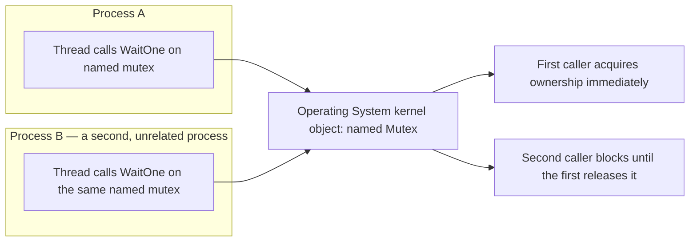
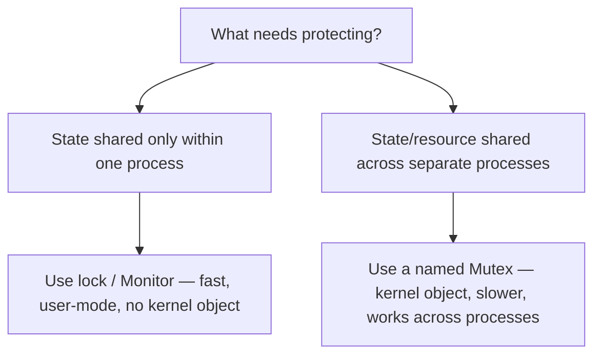

# Mutex

## Introduction

Before reading this lesson, you should already be comfortable with **[lock and Monitor](../07-concurrency-parallel-async/07-05-lock-and-monitor.md)** — how a single process protects a piece of shared state so that only one thread touches it at a time. That mechanism has a quiet limitation nobody mentions until it bites: `lock` and `Monitor` only work *inside* one running process. They have no way to coordinate with a second, entirely separate process, even if that process is running the very same program on the very same machine. `System.Threading.Mutex` exists to close exactly that gap — a synchronization primitive backed by the operating system itself, capable of being shared by name across process boundaries.

By the end of this lesson, you will be able to:

- Explain why `lock`/`Monitor` cannot coordinate two separate processes, and what a `Mutex` adds that closes that gap
- Create and use both unnamed (single-process) and named (cross-process) mutexes with `WaitOne` and `ReleaseMutex`
- Apply the standard single-instance-application pattern using a named `Mutex` and its `createdNew` output parameter
- Recognize the performance cost a `Mutex` carries compared to `lock`/`Monitor`, and why that cost matters when choosing between them
- Identify the rare, legitimate situations where a `Mutex` is actually the right tool, versus the common case where `lock` suffices

## Mutex — A Layman's Perspective

Picture a single shared loading dock behind a warehouse, used by two completely separate trucking companies that have nothing to do with each other — different owners, different payroll, different offices across town. Both companies need the dock at different times during the day, and only one truck can physically back into it at once. Inside either company's own office, coordinating who uses *their own* forklift is easy: the shift supervisor just tells the team, out loud, "wait until I say it's clear," and everyone in that one building hears it and obeys. That works perfectly, but only because everyone involved works for the same company and stands within earshot of the same supervisor.

The loading dock is a different problem entirely. Neither company's supervisor can shout loud enough to be heard inside the other company's office, and there's no shared boss standing over both of them to coordinate. What actually works is a single physical padlock on the dock gate, with exactly one key. Whichever truck driver — from either company — gets there first takes the key off its hook, unlocks the gate, backs in, does the work, then returns the key to the hook when finished. The key doesn't care which company the driver works for. It doesn't even care that the two companies never agreed on any shared internal protocol; the padlock and the hook are a neutral, physical arrangement that sits *outside* both companies, enforced by nobody's supervisor and everybody's respect for the same physical object.

That neutral, external padlock is the entire idea behind a named `Mutex`. The operating system plays the role of the padlock and the hook — a piece of shared infrastructure that sits outside any one process, so that two entirely separate programs, with no other way of talking to each other, can still take turns safely. And just like the padlock, it's slower and clunkier than the supervisor simply shouting across one office: walking out to the gate, checking the hook, and physically locking or unlocking it takes real, measurable extra effort compared to a coworker just yelling "hold on" from three desks away. That's exactly why, when the two teams that need to coordinate *are* in the same office — the same running process — nobody bothers installing a padlock. They just use the supervisor's voice. The padlock earns its keep only when the two parties genuinely have no other way to reach each other.

## Mutex — A Programming Language Perspective

`System.Threading.Mutex` is a `WaitHandle`-derived synchronization primitive backed by an operating system kernel object, rather than the lightweight, in-process sync block that `Monitor` uses. A thread acquires ownership by calling `WaitOne()`, which blocks until the mutex is free, and releases it by calling `ReleaseMutex()` — and, like `Monitor`, a `Mutex` is thread-affine: only the thread that acquired it may release it. An **unnamed** `Mutex` behaves like a heavier, cross-thread-only version of `lock`, useful only within one process. A **named** `Mutex`, created with `new Mutex(initiallyOwned, name, out bool createdNew)`, is registered with the operating system under that string name, so any process on the machine that constructs a `Mutex` with the same name is referring to the *same* underlying kernel object — this is what makes cross-process coordination possible. If the thread holding a mutex terminates without releasing it, the next `WaitOne()` call throws `AbandonedMutexException` rather than blocking forever.

## How to Use Mutex in C#

Every `Mutex` — named or not — follows the same acquire/work/release shape: call `WaitOne()`, do the protected work inside a `try` block, and call `ReleaseMutex()` inside a `finally` block so the mutex is always released even if the work throws. The example below uses an **unnamed** mutex shared by three threads in a single process, purely to show the API; it offers nothing that `lock` doesn't already do more cheaply, which is exactly the point this lesson is building toward.


*Figure 1: A named mutex is a kernel object the operating system arbitrates between — the only synchronization primitive in this module that reaches across process boundaries.*

```csharp
// Program.cs — .NET 10 / C# 14
using System.Threading;

using var mutex = new Mutex();
int sharedCounter = 0;
var threads = new Thread[3];

for (int i = 0; i < threads.Length; i++)
{
    int workerId = i + 1;
    threads[i] = new Thread(() =>
    {
        mutex.WaitOne();
        try
        {
            int current = sharedCounter;
            Thread.Sleep(50); // simulate work while holding the mutex
            sharedCounter = current + 1;
            Console.WriteLine($"Worker {workerId} incremented the counter to {sharedCounter}");
        }
        finally
        {
            mutex.ReleaseMutex();
        }
    });
}

foreach (var thread in threads)
{
    thread.Start();
}

foreach (var thread in threads)
{
    thread.Join();
}

Console.WriteLine($"Final counter value: {sharedCounter}");
```

**Console Output:**

```text
Worker 1 incremented the counter to 1
Worker 2 incremented the counter to 2
Worker 3 incremented the counter to 3
Final counter value: 3
```

All three threads race to call `WaitOne()` at nearly the same moment, so exactly which worker prints first can vary between runs — the output above shows one representative ordering. What the mutex *does* guarantee, on every single run, is that no two increments ever interleave and the final value is always `3`. Notice this example needed no cross-process behavior at all; it's using a kernel-backed primitive to do a job `lock` would do faster.

## Real-Time Example: Mutex in a Banking/ATM Cash-Dispenser Service

We extend the Banking/ATM domain with the one scenario where a `Mutex` genuinely earns its keep: enforcing that only a single instance of ATM #042's cash-dispenser control service is ever running against the physical dispenser hardware at once. Two copies running simultaneously — say, after an operator accidentally double-clicks the startup shortcut — could both believe they're free to eject cash, with no in-process `lock` able to stop them, because they're two separate processes with no shared memory at all. We simulate the scenario within one program by opening the same named mutex twice in sequence and, later, letting a legitimate restart succeed once the first instance has fully exited.

```csharp
// Program.cs — .NET 10 / C# 14 — Real-Time Example
using System.Threading;

const string DispenserMutexName = @"Global\ATM042_CashDispenserService";

Console.WriteLine("-- Instance 1: launching the cash-dispenser service for ATM #042 --");
using (var instance1 = new Mutex(initiallyOwned: true, name: DispenserMutexName, out bool createdNew1))
{
    ReportStartupResult("Instance 1", createdNew1);

    Console.WriteLine();
    Console.WriteLine("-- Instance 2: a second copy of the service starts on the same machine --");
    using (var instance2 = new Mutex(initiallyOwned: true, name: DispenserMutexName, out bool createdNew2))
    {
        ReportStartupResult("Instance 2", createdNew2);
    }

    Console.WriteLine();
    Console.WriteLine("-- Instance 1 finishes dispensing and shuts down cleanly --");
    instance1.ReleaseMutex();
}

Console.WriteLine();
Console.WriteLine("-- Instance 3: a legitimate restart, launched after Instance 1 fully exited --");
using (var instance3 = new Mutex(initiallyOwned: true, name: DispenserMutexName, out bool createdNew3))
{
    ReportStartupResult("Instance 3", createdNew3);
    instance3.ReleaseMutex();
}

static void ReportStartupResult(string label, bool createdNew)
{
    Console.WriteLine(createdNew
        ? $"{label}: no other instance detected. Taking control of the cash dispenser."
        : $"{label}: another instance already controls this dispenser. Refusing to start.");
}
```

**Console Output:**

```text
-- Instance 1: launching the cash-dispenser service for ATM #042 --
Instance 1: no other instance detected. Taking control of the cash dispenser.

-- Instance 2: a second copy of the service starts on the same machine --
Instance 2: another instance already controls this dispenser. Refusing to start.

-- Instance 1 finishes dispensing and shuts down cleanly --

-- Instance 3: a legitimate restart, launched after Instance 1 fully exited --
Instance 3: no other instance detected. Taking control of the cash dispenser.
```

`createdNew` is doing all the work here: it's `true` only for the call that actually creates the named kernel object, so Instance 2 sees `false` and refuses to start rather than risking a double-dispense. Once Instance 1's `using` block disposes its handle — and Instance 2's already-closed handle is gone too — the operating system has no reason left to keep the named object alive, so Instance 3's restart sees `createdNew == true` again, exactly as a legitimate restart should. Nothing about this coordination could have been expressed with `lock`, because `lock` has no way to reach outside its own process.

## Mutex vs lock/Monitor

The comparison here isn't "which one is better" — it's "which one matches the boundary you're actually protecting." `lock`/`Monitor` protect state that lives inside one process's memory, shared only by that process's own threads; nothing outside the process can even see that state, so nothing outside the process needs a say in who touches it. A `Mutex` protects something that genuinely spans process boundaries — a piece of physical hardware, a well-known system-wide name, a guarantee that must hold even for a process that doesn't yet exist when the first one starts. Reaching for a kernel object to protect a private in-process field is solving a problem you don't have, at a cost you didn't need to pay: every `WaitOne()`/`ReleaseMutex()` pair involves the operating system, where an uncontended `lock` typically resolves entirely in user-mode without ever asking the kernel for anything.


*Figure 2: The deciding question is the boundary being protected, not raw preference — a process boundary is the one case `lock` genuinely cannot cross.*

| Aspect | lock / Monitor | Mutex |
|---|---|---|
| Scope | Single process only | Single process, or cross-process when named |
| Backed by | In-process sync block (fast, user-mode in the uncontended case) | An OS kernel object — every acquire/release can involve a kernel-mode transition |
| Relative performance | Much faster for ordinary in-process critical sections | Noticeably slower; a real kernel synchronization object, not a language-level construct |
| Can be shared by name across processes | No | Yes — via a string name such as `Global\ATM042_CashDispenserService` |
| Detects a crashed owner | No — a thread that dies mid-lock leaves everyone else blocked indefinitely | Yes — the next `WaitOne()` throws `AbandonedMutexException`, and the mutex is still granted |
| Typical use case | Protecting shared in-memory state inside one process | Single-instance application enforcement; coordinating with a genuinely separate process |

## Types of Mutual-Exclusion Primitives in C#

`Mutex` is one option in a small family of primitives that all serialize access to a resource, each suited to a different boundary or access pattern:

1. **[lock and Monitor](../07-concurrency-parallel-async/07-05-lock-and-monitor.md)** — the default, in-process choice; almost always the right one unless you specifically need to cross a process boundary.
2. **[Semaphore and SemaphoreSlim](../07-concurrency-parallel-async/07-07-semaphore-and-semaphoreslim.md)** — allow a fixed number of concurrent holders rather than just one, with an async-friendly `WaitAsync`.
3. **[ReaderWriterLockSlim](../07-concurrency-parallel-async/07-08-readerwriterlockslim.md)** — lets any number of readers proceed together, reserving exclusivity only for writers.
4. **[The System.Threading.Lock type and thread-local storage](../07-concurrency-parallel-async/07-09-lock-type-and-thread-local-storage.md)** — the newest dedicated in-process lock primitive, plus per-thread state that needs no locking at all.

## What You've Learned & What's Next

A `Mutex` is a kernel-backed synchronization object, capable of being named and shared across process boundaries — the one thing `lock`/`Monitor` can never do — but that cross-process capability costs real performance, so it's the right tool only for genuinely rare cases like single-instance-application enforcement or coordinating with hardware another process controls. For everything that lives inside one process, `lock` remains the faster, simpler default.

Continue your learning journey with **[Semaphore and SemaphoreSlim](../07-concurrency-parallel-async/07-07-semaphore-and-semaphoreslim.md)**, where we relax the "only one at a time" restriction entirely and learn to allow a fixed number of concurrent holders instead.

---
*Applies to: .NET 10 / C# 14. Last reviewed 2026-08-16.*
