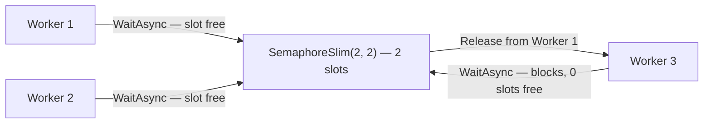
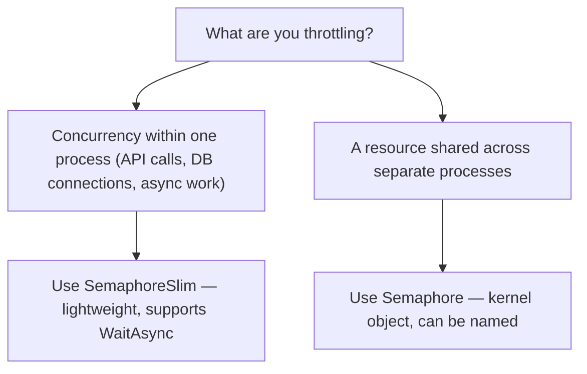

# Semaphore and SemaphoreSlim

## Introduction

Before reading this lesson, you should already be comfortable with **[Mutex](../07-concurrency-parallel-async/07-06-mutex-in-csharp.md)** — a primitive that, like `lock`/`Monitor`, only ever allows a single caller through at a time. That "one at a time" restriction is exactly right when a piece of shared state can only tolerate one writer. But plenty of real problems aren't that strict — they can tolerate *some* concurrency, just not unlimited concurrency. A third-party API might allow 5 simultaneous connections but reject a 6th; a database connection pool might have exactly 20 slots. `Semaphore` and `SemaphoreSlim` are the primitives built for exactly that shape of problem: not "only one," but "only N."

By the end of this lesson, you will be able to:

- Explain how a semaphore generalizes mutual exclusion from a single slot to a fixed count of `N` slots
- Use `SemaphoreSlim` with `WaitAsync`/`Release` to throttle concurrent asynchronous work
- Distinguish `SemaphoreSlim` (lightweight, in-process, async-capable) from `Semaphore` (kernel-backed, nameable, cross-process)
- Apply a semaphore to limit concurrent outbound calls to a rate-limited external API
- Recognize when a semaphore is the right tool instead of a plain `lock`

## Semaphore and SemaphoreSlim — A Layman's Perspective

Picture a small parking garage with a barrier arm at the entrance and exactly five spaces inside. The attendant's rule is simple: as long as there's an open space, wave the next car in; once all five spaces are full, lower the barrier arm and make every additional car wait in a line outside, in the order they arrived. The moment any parked car leaves, the attendant raises the barrier for the next car in line. Nobody needs to know exactly which of the five spaces is free, or coordinate directly with the other drivers already parked — the attendant with the barrier arm and the running count of open spaces handles all of that. This is a completely different arrangement from a single-car garage with one door and one key, where only one vehicle can ever be inside at all; here, five vehicles can be inside genuinely at the same time, doing their own independent business, and only the sixth car actually has to wait.

Now picture what would happen if this garage worked like the single-key setup from a strict one-at-a-time system instead — imagine a well-meaning security guard insisting that only one car may be anywhere in the garage at any time, even though there's physically room for five. Every other legitimate parking space would sit empty while four capable, ready vehicles idled outside for no real reason, purely because the coordination mechanism was more restrictive than the actual resource required. That's the exact cost of reaching for a plain lock when a resource can genuinely support several simultaneous users: you throw away real capacity that was sitting right there, unused.

The barrier arm's counter is the heart of the idea — it doesn't care about identity, ordering rules beyond first-come-first-served, or which specific space anyone occupies; it just tracks a single number: how many spaces remain, incrementing it each time a car leaves and decrementing it each time a car enters, and refusing entry the moment that number hits zero. A shipping company's own loading bay might only be able to load two trucks at once regardless of how many drivers show up — not because of some arbitrary rule, but because there are physically only two loading doors. The barrier arm, sized to five, or two, or however many slots genuinely exist, is precisely what a semaphore models in code: a shared counter that gates entry to a limited — but not singular — resource.

## Semaphore and SemaphoreSlim — A Programming Language Perspective

A **semaphore** is a synchronization primitive that maintains an internal count of available "slots" rather than a single ownership flag. Calling its wait operation decrements the count and proceeds immediately if the count is still non-negative, or blocks the calling thread if the count has reached zero; calling its release operation increments the count and, if any callers are waiting, allows one of them to proceed. `System.Threading.Semaphore` is the kernel-backed variant — it derives from `WaitHandle`, can be created with a system-wide name for cross-process use exactly like a named `Mutex`, and is not thread-affine: unlike `Mutex`, any thread may call `Release()`, not only the thread that called `WaitOne()`. `System.Threading.SemaphoreSlim` is a lightweight, in-process-only alternative introduced specifically to avoid that kernel-object overhead for the common case, and it adds something `Semaphore` and `Mutex` do not offer at all: an asynchronous `WaitAsync()` method that suspends without blocking a thread, making it the natural choice for throttling concurrency in `async` code.

## How to Use SemaphoreSlim in C#

`SemaphoreSlim` is constructed with an initial count and a maximum count — `new SemaphoreSlim(initialCount, maxCount)` — representing how many callers may hold a slot simultaneously. Each caller awaits `WaitAsync()` to acquire a slot, does its work inside a `try` block, and calls `Release()` inside a `finally` block, exactly mirroring the acquire/work/release shape from `Mutex`, but now up to `maxCount` callers can be inside that block at once instead of just one.


*Figure 1: With two slots, Workers 1 and 2 proceed immediately; Worker 3 waits until one of them releases its slot.*

```csharp
// Program.cs — .NET 10 / C# 14
using System.Threading;

using var gate = new SemaphoreSlim(initialCount: 2, maxCount: 2);
object consoleLock = new();
var workers = new List<Task>();

for (int i = 1; i <= 3; i++)
{
    int workerId = i;
    int staggerMs = (workerId - 1) * 50; // stagger starts so this lesson's output is deterministic
    workers.Add(RunWorkerAsync(workerId, staggerMs, gate, consoleLock));
}

await Task.WhenAll(workers);

static async Task RunWorkerAsync(int workerId, int staggerMs, SemaphoreSlim gate, object consoleLock)
{
    await Task.Delay(staggerMs);
    await gate.WaitAsync();
    try
    {
        lock (consoleLock)
        {
            Console.WriteLine($"Worker {workerId}: acquired a slot");
        }

        await Task.Delay(300); // simulate work while holding the slot

        lock (consoleLock)
        {
            Console.WriteLine($"Worker {workerId}: releasing its slot");
        }
    }
    finally
    {
        gate.Release();
    }
}
```

**Console Output:**

```text
Worker 1: acquired a slot
Worker 2: acquired a slot
Worker 1: releasing its slot
Worker 3: acquired a slot
Worker 2: releasing its slot
Worker 3: releasing its slot
```

Workers 1 and 2 start 50ms apart and both find a free slot immediately, since the semaphore was created with two. Worker 3 starts 100ms after Worker 1, by which point both slots are already taken, so it blocks inside `WaitAsync()` — asynchronously, without occupying a thread while it waits — until Worker 1 finishes its simulated work and releases, at which point Worker 3 is let through. Because only one caller is ever waiting at a time in this example, the acquire order shown above is guaranteed; with several callers queued simultaneously, `SemaphoreSlim` does not promise any particular release order among them.

## Real-Time Example: SemaphoreSlim in E-Commerce Order Processing

We continue the E-Commerce Order Processing domain, extending the minimal `Order` record used throughout this module. A fulfillment batch job needs to fetch a live shipping-rate quote for each pending order from a third-party carrier's API — but the carrier's contract permits at most 2 concurrent connections from our account, and a 3rd simultaneous request would simply be rejected. `SemaphoreSlim` throttles our own outbound calls so we never violate that limit in the first place.

```csharp
// Program.cs — .NET 10 / C# 14 — Real-Time Example
using System.Threading;

// The shipping carrier's contract allows at most 2 concurrent rate-lookup connections.
using var rateApiGate = new SemaphoreSlim(initialCount: 2, maxCount: 2);
object consoleLock = new();

Order[] pendingOrders =
[
    new Order("ORD-3001", 84.50m),
    new Order("ORD-3002", 129.00m),
    new Order("ORD-3003", 42.75m),
    new Order("ORD-3004", 265.10m),
    new Order("ORD-3005", 19.99m),
];

var lookups = new List<Task>();
for (int i = 0; i < pendingOrders.Length; i++)
{
    Order order = pendingOrders[i];
    int staggerMs = i * 120; // stagger arrivals so this lesson's output is deterministic
    lookups.Add(GetShippingRateAsync(order, staggerMs, rateApiGate, consoleLock));
}

await Task.WhenAll(lookups);
Console.WriteLine("All shipping-rate quotes retrieved.");

static async Task GetShippingRateAsync(Order order, int staggerMs, SemaphoreSlim rateApiGate, object consoleLock)
{
    await Task.Delay(staggerMs);
    lock (consoleLock)
    {
        Console.WriteLine($"{order.OrderId}: requesting a shipping-rate quote");
    }

    await rateApiGate.WaitAsync();
    try
    {
        lock (consoleLock)
        {
            Console.WriteLine($"{order.OrderId}: acquired a connection slot");
        }

        await Task.Delay(300); // simulate the carrier API round trip

        lock (consoleLock)
        {
            Console.WriteLine($"{order.OrderId}: rate quote received, releasing slot");
        }
    }
    finally
    {
        rateApiGate.Release();
    }
}

record Order(string OrderId, decimal Total);
```

**Console Output:**

```text
ORD-3001: requesting a shipping-rate quote
ORD-3001: acquired a connection slot
ORD-3002: requesting a shipping-rate quote
ORD-3002: acquired a connection slot
ORD-3003: requesting a shipping-rate quote
ORD-3001: rate quote received, releasing slot
ORD-3003: acquired a connection slot
ORD-3004: requesting a shipping-rate quote
ORD-3002: rate quote received, releasing slot
ORD-3004: acquired a connection slot
ORD-3005: requesting a shipping-rate quote
ORD-3003: rate quote received, releasing slot
ORD-3005: acquired a connection slot
ORD-3004: rate quote received, releasing slot
ORD-3005: rate quote received, releasing slot
All shipping-rate quotes retrieved.
```

`ORD-3003`, `ORD-3004`, and `ORD-3005` each have to wait their turn behind whichever earlier order finishes first, but not one of the five ever needed to know about the other four directly — `rateApiGate` is the only thing any of them talk to. In a real fulfillment service, this is the difference between a batch job that respects a carrier's rate limit automatically and one that occasionally gets requests rejected — or the account throttled entirely — because five orders happened to be processed at the exact same moment.

## Semaphore vs SemaphoreSlim

Both types express the same idea — a counting gate with `N` slots — but they're built for different boundaries, echoing the `Mutex` vs `lock` distinction from the previous lesson. `Semaphore` is backed by an OS kernel object, can be given a system-wide name so multiple *processes* can share the same counter, and is not thread-affine. `SemaphoreSlim` deliberately gives up cross-process sharing in exchange for being dramatically lighter weight for the overwhelmingly common case: throttling concurrency *within* one process. It also adds `WaitAsync()`, which `Semaphore` has never offered, making `SemaphoreSlim` the default choice for any `async` codebase — which today means nearly all of them.


*Figure 2: SemaphoreSlim is the default; Semaphore is reserved for the rare case where the limit must be enforced across process boundaries.*

| Aspect | Semaphore | SemaphoreSlim |
|---|---|---|
| Backed by | OS kernel object | Lightweight in-process construct |
| Can be named / cross-process | Yes | No |
| Async support (`WaitAsync`) | No | Yes |
| Release restriction | Any thread may call `Release()` | Any thread may call `Release()` |
| Relative performance | Slower — kernel object overhead on every wait/release | Much faster; designed for frequent, in-process use |
| Typical use case | A resource limit shared across multiple processes | Throttling concurrent async work — outbound API calls, DB pools, file handles |

## Types of Concurrency-Limiting Primitives in C#

`SemaphoreSlim` sits in the same family as the primitives from earlier and later lessons in this module, each suited to a different concurrency shape:

1. **[lock and Monitor](../07-concurrency-parallel-async/07-05-lock-and-monitor.md)** — the single-slot special case: exactly one caller, ever.
2. **[Mutex](../07-concurrency-parallel-async/07-06-mutex-in-csharp.md)** — the single-slot primitive that, unlike `lock`, can be shared across processes.
3. **[ReaderWriterLockSlim](../07-concurrency-parallel-async/07-08-readerwriterlockslim.md)** — a specialized two-tier limit: unlimited readers, or exactly one writer.
4. **[The System.Threading.Lock type and thread-local storage](../07-concurrency-parallel-async/07-09-lock-type-and-thread-local-storage.md)** — the newest dedicated single-slot lock, plus per-thread state that needs no slot at all.

## What You've Learned & What's Next

A semaphore generalizes mutual exclusion from "one caller at a time" to "up to `N` callers at a time," tracked with a simple internal counter. `SemaphoreSlim`, with its async-friendly `WaitAsync`, is the right default for throttling concurrent work inside a process — reserving the heavier, kernel-backed `Semaphore` for the rare case where the limit must be enforced across separate processes.

Continue your learning journey with **[ReaderWriterLockSlim](../07-concurrency-parallel-async/07-08-readerwriterlockslim.md)**, where we look at a concurrency shape that's neither "one at a time" nor "N at a time" — any number of readers together, but only one writer, ever.

---
*Applies to: .NET 10 / C# 14. Last reviewed 2026-08-16.*
