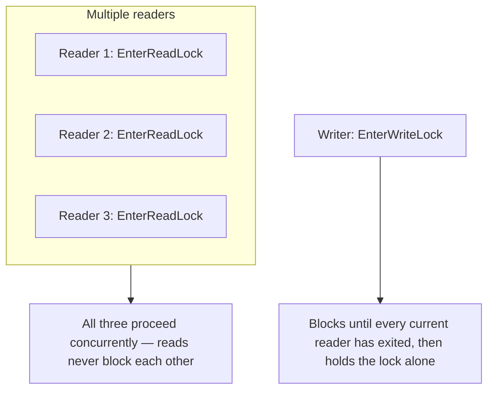
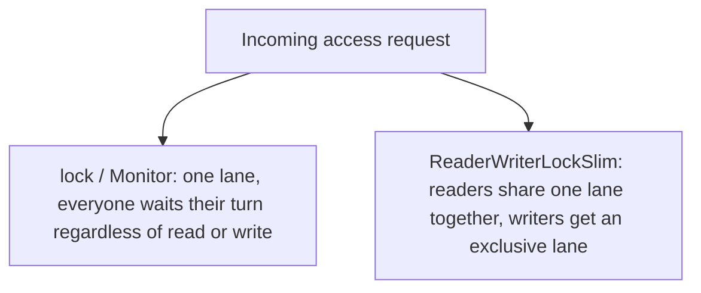

# ReaderWriterLockSlim

## Introduction

Before reading this lesson, you should already be comfortable with **[Semaphore and SemaphoreSlim](../07-concurrency-parallel-async/07-07-semaphore-and-semaphoreslim.md)** — a gate that lets a fixed number of callers through regardless of what they're doing. `ReaderWriterLockSlim` narrows that idea to a specific, very common shape of problem: shared data that gets *read* constantly but *written* rarely. A plain `lock` treats every access the same way, serializing readers behind other readers even though two threads simply reading the same unchanging value can never actually interfere with each other. `ReaderWriterLockSlim` recognizes that distinction directly, letting any number of readers proceed together while reserving true exclusivity for the rarer case of a write.

By the end of this lesson, you will be able to:

- Explain why serializing readers behind other readers is unnecessary overhead when nothing is being modified
- Use `EnterReadLock`/`ExitReadLock` and `EnterWriteLock`/`ExitWriteLock` to allow concurrent reads but exclusive writes
- Use `EnterUpgradeableReadLock` to safely check a condition and then upgrade to a write lock without a race
- Judge when `ReaderWriterLockSlim`'s added complexity is worth it, and when a plain `lock` is the better call

## ReaderWriterLockSlim — A Layman's Perspective

Picture a large reference room in a library — a room full of index cards nobody is allowed to remove, only consult. Any number of visitors can walk in and read the same card at the same time; nothing about one visitor reading a card changes what any other visitor sees on it, so the librarian never stops a second or third visitor from reading right alongside the first. But every so often, a librarian needs to physically update one of those cards — correcting a shelf number, say — and while that update is happening, nobody else can be looking at the card, because a visitor might read it exactly mid-correction and walk away with half-old, half-new information. So the librarian clears the room just for that one card, makes the change, and only then lets readers back in.

Compare that to a much stricter (and, for this room, needlessly cautious) policy: one visitor in the reference room at a time, full stop, whether they're reading or the librarian is updating. That stricter policy is perfectly safe — nothing ever goes wrong — but it wastes enormous amounts of everyone's time, because ninety-nine visits out of a hundred are just people reading, and there was never any actual conflict between two readers to prevent. The smarter policy — many readers together, one writer alone, and never both at once — gets exactly the same safety guarantee while giving up none of the throughput that pure reading was always entitled to.

There's one more wrinkle the reference room has to handle carefully: what happens when a librarian wants to check a card first — "is this shelf number actually wrong?" — before committing to the trouble of clearing the room to fix it? If two librarians both do that check at the same moment, both might see the same problem, both decide to fix it, and then both try to clear the room and edit at once, stepping on each other. The reference room's actual policy solves this by handing out a special "inspector" badge — only one librarian may hold it at a time — that lets its holder read the card alongside everyone else, and *then*, if a fix genuinely is needed, escalate to full exclusive control without any other librarian sneaking in during the gap. That single-inspector badge is the one that makes the check-then-fix sequence safe, and it's the piece most easily forgotten when people build their own version of this idea by hand.

## ReaderWriterLockSlim — A Programming Language Perspective

`System.Threading.ReaderWriterLockSlim` is a lightweight, in-process synchronization primitive that distinguishes between two categories of access to shared data: **read** access, which any number of threads may hold concurrently, and **write** access, which exactly one thread may hold, to the exclusion of every reader and every other writer. A thread enters read mode with `EnterReadLock()` and exits with `ExitReadLock()`; it enters write mode with `EnterWriteLock()` — which blocks until no readers or writers remain — and exits with `ExitWriteLock()`. A third mode, `EnterUpgradeableReadLock()`/`ExitUpgradeableReadLock()`, grants read access that a single thread — and only one thread at a time — may later promote to a write lock via a nested `EnterWriteLock()` call, without releasing its read access and re-acquiring in between, closing the race window that a manual "release the read lock, then acquire a write lock" sequence would otherwise leave open. Every `Enter*` call must be paired with its matching `Exit*` call inside a `try`/`finally` block, just as with `Monitor` and `Mutex`.

## How to Use ReaderWriterLockSlim in C#

The three lock modes map directly onto the three things code needs to do with shared data: read it, change it, or check it before conditionally changing it. The example below shows the first two — several readers observing a shared value concurrently, then a writer updating it exclusively — using small staggered delays so this lesson's output is deterministic while the reads still genuinely overlap in time.


*Figure 1: Readers share access freely; a writer waits for exclusivity and blocks out every reader while it holds it.*

```csharp
// Program.cs — .NET 10 / C# 14
using System.Diagnostics;
using System.Threading;

var rwLock = new ReaderWriterLockSlim();
int sharedValue = 42;
object consoleLock = new();

var stopwatch = Stopwatch.StartNew();
var readers = new Task[3];
for (int i = 0; i < readers.Length; i++)
{
    int readerId = i + 1;
    int staggerMs = readerId * 20; // stagger entry order without preventing overlap
    readers[i] = Task.Run(() =>
    {
        Thread.Sleep(staggerMs);
        rwLock.EnterReadLock();
        try
        {
            lock (consoleLock)
            {
                Console.WriteLine($"Reader {readerId} sees value {sharedValue}");
            }
            Thread.Sleep(200); // simulated read work; readers overlap because reads don't block each other
        }
        finally
        {
            rwLock.ExitReadLock();
        }
    });
}

Task.WaitAll(readers);
stopwatch.Stop();

bool readersOverlapped = stopwatch.ElapsedMilliseconds < 400; // would be ~600ms+ if reads were serialized
Console.WriteLine($"All three reads finished concurrently: {readersOverlapped}");

rwLock.EnterWriteLock();
try
{
    sharedValue = 100;
    Console.WriteLine("Writer updated value to 100 (exclusive access)");
}
finally
{
    rwLock.ExitWriteLock();
}

rwLock.EnterReadLock();
try
{
    Console.WriteLine($"Reader 4 sees value {sharedValue}");
}
finally
{
    rwLock.ExitReadLock();
}
```

**Console Output:**

```text
Reader 1 sees value 42
Reader 2 sees value 42
Reader 3 sees value 42
All three reads finished concurrently: True
Writer updated value to 100 (exclusive access)
Reader 4 sees value 100
```

The 20ms stagger guarantees Readers 1, 2, and 3 print in that order, but each simulated read takes 200ms — far longer than the staggers between them — so all three are genuinely inside their read locks at the same time. The total elapsed time stays under the 400ms threshold that would only be possible if the reads overlapped; had `ReaderWriterLockSlim` serialized them like a plain `lock` would, the total would have been closer to 600ms. The writer afterward gets sole access, and Reader 4 confirms the update is visible once the writer releases.

## Real-Time Example: ReaderWriterLockSlim in Library/Inventory Management

We extend the Library/Inventory Management domain's catalog concept — the `Book`, `Member`, and checkout ideas from Module 02's `Catalog` — with a `BookAvailability` class that tracks how many physical copies of each title remain, safely, under concurrent access from multiple checkout terminals. The interesting case is `TryCheckOut`: it must check whether a copy is available and, if so, decrement the count — two steps that must happen as one atomic unit, or two members could both see "1 copy available" and both walk out with it. `EnterUpgradeableReadLock` is exactly the tool for that.

```csharp
// Program.cs — .NET 10 / C# 14 — Real-Time Example
using System.Threading;

var catalog = new BookAvailability();
catalog.Restock("978-0132350884", copies: 3); // "Clean Code" — 3 physical copies

string[] members = ["M-201", "M-202", "M-203", "M-204", "M-205"];
var checkouts = new List<Task>();

for (int i = 0; i < members.Length; i++)
{
    string memberId = members[i];
    int staggerMs = i * 50; // each member's request resolves well before the next one arrives
    checkouts.Add(Task.Run(async () =>
    {
        await Task.Delay(staggerMs);
        bool success = catalog.TryCheckOut("978-0132350884", memberId);
        Console.WriteLine(success
            ? $"{memberId}: checked out 'Clean Code' successfully"
            : $"{memberId}: no copies of 'Clean Code' available");
    }));
}

await Task.WhenAll(checkouts);
Console.WriteLine($"Remaining copies: {catalog.GetAvailableCopies("978-0132350884")}");

class BookAvailability
{
    private readonly Dictionary<string, int> _availableCopies = new();
    private readonly ReaderWriterLockSlim _lock = new();

    public void Restock(string isbn, int copies)
    {
        _lock.EnterWriteLock();
        try
        {
            _availableCopies[isbn] = _availableCopies.GetValueOrDefault(isbn) + copies;
        }
        finally
        {
            _lock.ExitWriteLock();
        }
    }

    public int GetAvailableCopies(string isbn)
    {
        _lock.EnterReadLock();
        try
        {
            return _availableCopies.GetValueOrDefault(isbn);
        }
        finally
        {
            _lock.ExitReadLock();
        }
    }

    public bool TryCheckOut(string isbn, string memberId)
    {
        _lock.EnterUpgradeableReadLock();
        try
        {
            if (_availableCopies.GetValueOrDefault(isbn) <= 0)
            {
                return false; // safe to check without ever having blocked another reader
            }

            _lock.EnterWriteLock();
            try
            {
                _availableCopies[isbn]--;
            }
            finally
            {
                _lock.ExitWriteLock();
            }

            return true;
        }
        finally
        {
            _lock.ExitUpgradeableReadLock();
        }
    }
}
```

**Console Output:**

```text
M-201: checked out 'Clean Code' successfully
M-202: checked out 'Clean Code' successfully
M-203: checked out 'Clean Code' successfully
M-204: no copies of 'Clean Code' available
M-205: no copies of 'Clean Code' available
Remaining copies: 0
```

`ReaderWriterLockSlim` guarantees at most one thread ever holds the upgradeable read lock at a time, so even if all five members' requests genuinely overlapped, two of them could never both see "1 copy left" and both succeed — a real risk with a naive check-then-write sequence built from separate read and write locks. Members 204 and 205 fail cleanly and predictably once the third copy is gone, which is exactly the behavior a real circulation desk needs: no overselling, and no unnecessary blocking of members who are only checking availability, not one another out.

## ReaderWriterLockSlim vs lock

A plain `lock` treats every access the same way — read or write, it doesn't matter, only one thread gets in at a time. That's the right call whenever writes are frequent enough, or critical sections short enough, that the bookkeeping `ReaderWriterLockSlim` needs to track readers separately from writers just isn't worth paying for. `ReaderWriterLockSlim` earns its keep specifically when reads vastly outnumber writes on data many threads touch constantly — a configuration cache, a catalog of availability counts, a routing table — where letting readers pile up behind each other for no reason would waste real throughput. The trade-off is real: `ReaderWriterLockSlim` has more internal state to manage than a bare `lock`, so for a short, simple critical section it can actually be *slower* in practice than just serializing everyone with `lock`. Reach for it only when profiling or the shape of the workload — heavily read, rarely written — actually justifies the added machinery.


*Figure 2: `lock` has a single lane for every access; `ReaderWriterLockSlim` splits that lane so readers never block other readers.*

| Aspect | lock / Monitor | ReaderWriterLockSlim |
|---|---|---|
| Concurrent readers allowed | No — every access is serialized | Yes — any number of readers proceed together |
| Writer access | Exclusive, same as any other access | Exclusive, and waits for every current reader to finish |
| API surface | One `Enter`/`Exit` pair | `EnterReadLock`/`EnterWriteLock`/`EnterUpgradeableReadLock`, each with a matching `Exit` |
| Safe check-then-write upgrade | Not directly supported — releasing and reacquiring risks a race | `EnterUpgradeableReadLock` supports it directly, race-free |
| Per-call overhead | Lower | Higher — more internal bookkeeping than a plain lock |
| Best suited for | Balanced or write-heavy access, or very short critical sections | Read-heavy, write-rare shared state under real contention |

## Types of Locking Primitives in C#

`ReaderWriterLockSlim` is the specialized member of this module's locking family, worth choosing only when its specific trade-off actually applies:

1. **[lock and Monitor](../07-concurrency-parallel-async/07-05-lock-and-monitor.md)** — the simple, general-purpose default: one caller at a time, regardless of intent.
2. **[Mutex](../07-concurrency-parallel-async/07-06-mutex-in-csharp.md)** — the single-slot primitive that can also cross process boundaries.
3. **[SemaphoreSlim](../07-concurrency-parallel-async/07-07-semaphore-and-semaphoreslim.md)** — a fixed count of `N` slots, with no distinction between what each caller intends to do.
4. **[The System.Threading.Lock type and thread-local storage](../07-concurrency-parallel-async/07-09-lock-type-and-thread-local-storage.md)** — the newest dedicated single-slot lock, plus per-thread state that needs no lock at all.

## What You've Learned & What's Next

`ReaderWriterLockSlim` splits access into concurrent reads and exclusive writes, with `EnterUpgradeableReadLock` closing the race that a naive check-then-write sequence would otherwise leave open — but it's a specialized tool, worth its added bookkeeping only when reads genuinely dominate writes on data under real contention. When that's not the shape of the problem, a plain `lock` remains simpler and often faster.

Continue your learning journey with **[The System.Threading.Lock Type and Thread-Local Storage](../07-concurrency-parallel-async/07-09-lock-type-and-thread-local-storage.md)**, the capstone of this sub-area, where we look at the newest dedicated lock primitive in .NET and a way to give each thread its own state that needs no locking whatsoever.

---
*Applies to: .NET 10 / C# 14. Last reviewed 2026-08-16.*
