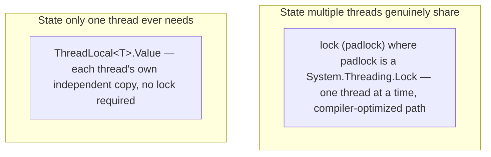
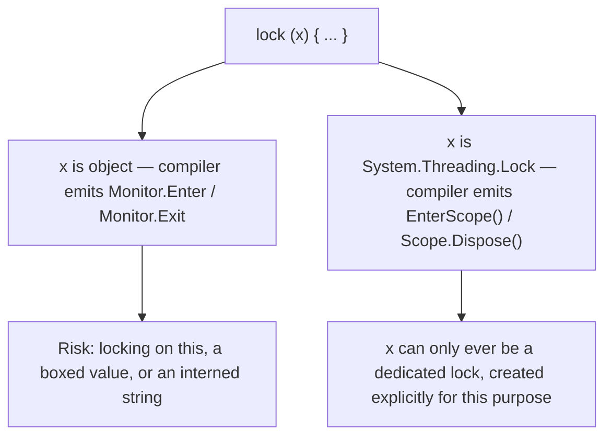

# The System.Threading.Lock Type and Thread-Local Storage

## Introduction

Before reading this lesson, you should already be comfortable with **[ReaderWriterLockSlim](../07-concurrency-parallel-async/07-08-readerwriterlockslim.md)** and, really, with this entire sub-area — protecting shared state with `lock`/`Monitor`, reaching across process boundaries with `Mutex`, throttling concurrency to `N` slots with `Semaphore`/`SemaphoreSlim`, and splitting access into concurrent reads versus exclusive writes with `ReaderWriterLockSlim`. Every one of those tools shares a quiet assumption: that the state being protected genuinely needs to be *shared* between threads at all. This capstone lesson closes the sub-area with two ideas that both, in different ways, refine that assumption — a brand-new, dedicated lock primitive that replaces the everyday `lock(object)` you've been using since the very first lesson, and a completely different escape hatch for the cases where a thread doesn't need to share its state with anyone else in the first place.

By the end of this lesson, you will be able to:

- Explain the subtle pitfalls of locking on a plain `object` — accidental sharing, boxing, reentrancy assumptions — that motivated a dedicated lock type
- Use the new `System.Threading.Lock` type (C# 13 / .NET 9, and the recommended default in C# 14 / .NET 10) with the ordinary `lock` statement
- Explain how the compiler recognizes `System.Threading.Lock` and compiles `lock` differently for it than for a plain `object`
- Use `ThreadLocal<T>` to give each thread its own independent state that requires no locking whatsoever
- Contrast `ThreadLocal<T>` with the older `[ThreadStatic]` attribute, including its lazy-initialization gotcha
- Recap the full Multithreading Fundamentals sub-area, from `lock`/`Monitor` through this capstone

## The Lock Type and Thread-Local Storage — A Layman's Perspective

For nine lessons now, every locking tool in this module has assumed the same starting point: several workers genuinely need to share one thing, so somebody has to hand out turns. But picture a workshop that's been using an ordinary spare padlock — the same generic model sold at any hardware store — to secure its one shared tool cabinet. It works, but it's also just a padlock; nothing about it was designed specifically for this cabinet, so nothing stops someone from accidentally grabbing that exact same padlock model to secure a totally unrelated shed across town, or from assuming two different padlocks that happen to look alike are somehow the same lock. A purpose-built cabinet lock, sold and installed specifically for this one cabinet and nothing else, closes off that entire category of mix-up — not because the generic padlock was ever unsafe when used correctly, but because a dedicated lock, built for exactly one job, is harder to misuse and often engineered to open and close a little more efficiently besides. That's the entire idea behind the new `Lock` type: everything `lock(object)` already did, done by a tool built for nothing else.

The second idea in this lesson is a different kind of workshop insight entirely. Not every tool in the building actually needs to live in the shared cabinet. Each worker already has their own personal toolbox at their own workbench — a tape measure, a favorite pencil, a notepad of measurements they're currently jotting down — and none of that ever needs a sign-out sheet, because no other worker will ever reach into someone else's toolbox. The moment you realize a given piece of "state" is only ever touched by the one worker who created it, the entire question of locks, turns, and cabinets disappears — there was never anything to share in the first place. Giving each worker their own private drawer, automatically, without anyone having to ask for one, is exactly what thread-local storage does for a running program: it's not a faster lock, it's a recognition that some state was never meant to be shared at all.

Put together, these two ideas complete the picture this whole module has been building: when something truly must be shared, reach for the right dedicated tool — now, specifically, the purpose-built `Lock` — and when it doesn't have to be shared, give it its own private space instead and skip the coordination overhead entirely.

## The Lock Type and Thread-Local Storage — A Programming Language Perspective

`System.Threading.Lock`, introduced in .NET 9 with C# 13, is a dedicated mutual-exclusion type built specifically to back the `lock` statement, rather than repurposing an arbitrary `object`. When the compile-time type of a `lock` statement's expression is `Lock`, the C# 13+ compiler emits a call to `Lock.EnterScope()` — which returns a ref struct `Lock.Scope` implementing `Dispose()` — instead of the `Monitor.Enter`/`Monitor.Exit` pair it emits for a plain `object`. `Lock` is thread-affine and reentrant, exactly like `Monitor`, but avoids the classic anti-patterns a plain object invites: locking on `this`, on a boxed value type, or on an interned string literal, all of which can accidentally share a lock across code that never intended to. `ThreadLocal<T>` provides lazily-initialized, per-thread storage via a factory delegate passed to its constructor; each thread reads and writes its own independent copy through `.Value`, with no synchronization required. The older `[ThreadStatic]` attribute achieves a similar effect on a static field, but its initializer runs only once — for whichever thread happens to trigger it first — leaving every other thread to see the field's default value unless the code checks and initializes it explicitly on each thread.

## How to Use the Lock Type and ThreadLocal in C#

Adopting the new `Lock` type takes exactly one change: declare the field as `System.Threading.Lock` instead of `object`, and every existing `lock (myLock) { ... }` statement compiles to the newer, faster path automatically — no other code changes. Giving a thread its own private state is just as direct: declare a `ThreadLocal<T>`, and every thread that touches `.Value` gets its own independent copy, seeded by the factory delegate the first time that thread touches it.


*Figure 1: Shared state still needs a lock — now the dedicated `Lock` type; state that was never actually shared needs no lock at all.*

```csharp
// Program.cs — .NET 10 / C# 14 — The new Lock type
using System.Threading;

Lock padlock = new();
int counter = 0;

var threads = new Thread[3];
for (int i = 0; i < threads.Length; i++)
{
    int workerId = i + 1;
    threads[i] = new Thread(() =>
    {
        lock (padlock)
        {
            int current = counter;
            Thread.Sleep(50);
            counter = current + 1;
            Console.WriteLine($"Worker {workerId} incremented counter to {counter}");
        }
    });
}

foreach (var thread in threads)
{
    thread.Start();
}

foreach (var thread in threads)
{
    thread.Join();
}

Console.WriteLine($"Final counter value: {counter}");
```

**Console Output:**

```text
Worker 1 incremented counter to 1
Worker 2 incremented counter to 2
Worker 3 incremented counter to 3
Final counter value: 3
```

As with `Mutex` in an earlier lesson, the three threads race to enter the `lock` block, so the exact print order can vary between runs — the output above shows one representative ordering. What's new here isn't the *behavior*, which is identical to `lock (object)`: it's that `padlock`'s declared type of `Lock` tells the compiler to skip `Monitor` entirely and call `EnterScope()` directly, which is measurably cheaper under contention while looking exactly like the `lock` syntax you already know.

```csharp
// Program.cs — .NET 10 / C# 14 — Thread-local storage: no lock needed at all
using System.Threading;

ThreadLocal<int> operationsOnThisThread = new(() => 0);
object consoleLock = new();

var threads = new Thread[3];
for (int i = 0; i < threads.Length; i++)
{
    int workerId = i + 1;
    threads[i] = new Thread(() =>
    {
        for (int op = 0; op < 3; op++)
        {
            operationsOnThisThread.Value++; // this thread's own copy — no other thread can see or touch it
        }

        lock (consoleLock)
        {
            Console.WriteLine($"Worker {workerId} performed {operationsOnThisThread.Value} operations on its own thread");
        }
    });
}

foreach (var thread in threads)
{
    thread.Start();
}

foreach (var thread in threads)
{
    thread.Join();
}
```

**Console Output:**

```text
Worker 1 performed 3 operations on its own thread
Worker 2 performed 3 operations on its own thread
Worker 3 performed 3 operations on its own thread
```

Again, the order these three lines print in can vary between runs, but the *value* never does: every worker sees exactly `3`, because `operationsOnThisThread` gives each thread its own private counter, seeded independently from the same `() => 0` factory the first time that thread touches `.Value`. No `lock` protects this counter anywhere in the code, and none is needed — nothing about one thread's copy is ever visible to another thread.

## Real-Time Example: The Lock Type and ThreadLocal in a Banking/ATM Account

We extend the Banking/ATM `Account` class first introduced in Module 06, giving it a proper `Withdraw` operation and switching its internal synchronization from `lock(object)` to the new `Lock` type. Three tellers process deposits and withdrawals concurrently against the same account, and each teller generates its own transaction reference numbers using `ThreadLocal<int>` — a per-teller sequence that needs no coordination with the other tellers at all, even while the account balance itself remains fully protected.

```csharp
// Program.cs — .NET 10 / C# 14 — Real-Time Example
using System.Globalization;
using System.Threading;

var account = new Account("1234567890129981", balance: 1000.00m);
ThreadLocal<int> txnSequence = new(() => 0);
object consoleLock = new();

Thread tellerA = new(() =>
{
    Thread.Sleep(0);
    Process("Teller-A", account, txnSequence, consoleLock, amount: 200.00m, isWithdrawal: false);
    Thread.Sleep(90);
    Process("Teller-A", account, txnSequence, consoleLock, amount: 150.00m, isWithdrawal: true);
});

Thread tellerB = new(() =>
{
    Thread.Sleep(30);
    Process("Teller-B", account, txnSequence, consoleLock, amount: 300.00m, isWithdrawal: true);
    Thread.Sleep(90);
    Process("Teller-B", account, txnSequence, consoleLock, amount: 50.00m, isWithdrawal: false);
});

Thread tellerC = new(() =>
{
    Thread.Sleep(60);
    Process("Teller-C", account, txnSequence, consoleLock, amount: 1000.00m, isWithdrawal: true);
    Thread.Sleep(90);
    Process("Teller-C", account, txnSequence, consoleLock, amount: 100.00m, isWithdrawal: true);
});

tellerA.Start();
tellerB.Start();
tellerC.Start();
tellerA.Join();
tellerB.Join();
tellerC.Join();

Console.WriteLine($"Final balance: {Usd(account.Balance)}");

static void Process(string tellerName, Account account, ThreadLocal<int> txnSequence, object consoleLock, decimal amount, bool isWithdrawal)
{
    txnSequence.Value++; // each teller thread keeps its own independent transaction count — no lock needed
    string reference = $"{tellerName}-TXN-{txnSequence.Value}";
    string action = isWithdrawal ? "withdraw" : "deposit";
    bool success;

    if (isWithdrawal)
    {
        success = account.TryWithdraw(amount);
    }
    else
    {
        account.Deposit(amount);
        success = true;
    }

    lock (consoleLock)
    {
        Console.WriteLine(success
            ? $"{reference}: {tellerName} {action}s {Usd(amount)} -- new balance {Usd(account.Balance)}"
            : $"{reference}: {tellerName} {action}s {Usd(amount)} -- declined, insufficient funds (balance {Usd(account.Balance)})");
    }
}

static string Usd(decimal amount) => amount.ToString("C", CultureInfo.GetCultureInfo("en-US"));

class Account(string accountNumber, decimal balance)
{
    private readonly Lock _balanceLock = new();

    public string MaskedAccountNumber { get; } = $"****{accountNumber[^4..]}";
    public decimal Balance { get; private set; } = balance;

    public void Deposit(decimal amount)
    {
        lock (_balanceLock)
        {
            Balance += amount;
        }
    }

    public bool TryWithdraw(decimal amount)
    {
        lock (_balanceLock)
        {
            if (amount > Balance)
            {
                return false;
            }

            Balance -= amount;
            return true;
        }
    }
}
```

**Console Output:**

```text
Teller-A-TXN-1: Teller-A deposits $200.00 -- new balance $1,200.00
Teller-B-TXN-1: Teller-B withdraws $300.00 -- new balance $900.00
Teller-C-TXN-1: Teller-C withdraws $1,000.00 -- declined, insufficient funds (balance $900.00)
Teller-A-TXN-2: Teller-A withdraws $150.00 -- new balance $750.00
Teller-B-TXN-2: Teller-B deposits $50.00 -- new balance $800.00
Teller-C-TXN-2: Teller-C withdraws $100.00 -- new balance $700.00
Final balance: $700.00
```

Each teller's operations are staggered just enough to keep this lesson's trace deterministic, but the safety here doesn't come from that timing — it comes from `_balanceLock`, the `Lock`-typed field every `Deposit` and `TryWithdraw` call passes through, which guarantees Teller-C's declined $1,000.00 withdrawal at a $900.00 balance can never corrupt or race with any other teller's change. Meanwhile, every reference number — `Teller-A-TXN-1`, `Teller-A-TXN-2`, and so on — comes from `txnSequence`, and not one of those increments ever touched `_balanceLock`, because no teller's transaction count was ever anyone else's business.

## lock(object) vs the New Lock Type

Both compile to a genuine mutual-exclusion critical section, and both use the identical `lock (x) { ... }` syntax — this is a deliberate design choice, so that adopting `Lock` is a change to a field's declared type, not a rewrite of every call site. The difference is entirely in what `x`'s type buys you. A plain `object` is not a lock; it's whatever object happened to be lying around, pressed into service as one — nothing stops it from being `this`, a boxed `int`, or a string literal the runtime might intern and silently share with unrelated code elsewhere in the process, any of which can create a lock shared across code that never intended to share anything. A `Lock` instance can only ever be exactly what it says it is, created explicitly for this one purpose, and the compiler backs that guarantee by compiling `lock` differently for it — calling `EnterScope()` directly rather than going through `Monitor`, which removes overhead `Monitor`'s more general-purpose object-header-based implementation carries.


*Figure 2: Identical `lock` syntax, two different compiled paths — the type of the expression is what the compiler keys off of.*

| Aspect | lock (object) | lock (System.Threading.Lock) |
|---|---|---|
| Introduced | Available since C# 1.0 | C# 13 / .NET 9 |
| Compiles to | `Monitor.Enter` / `Monitor.Exit` | `Lock.EnterScope()` / `Scope.Dispose()` |
| Can accidentally lock on `this`, a boxed value, or an interned string | Yes — nothing stops it | No — the field must be explicitly declared as `Lock` |
| Reentrant on the same thread | Yes | Yes |
| Relative performance under contention | Good, but carries `Monitor`'s general-purpose overhead | Faster — a dedicated fast path with no unrelated object-header baggage |
| Recommended default for new code | Superseded | Yes, in C# 13 / .NET 9 and later |

## Multithreading Fundamentals at a Glance

This capstone rests on every earlier lesson in this sub-area — each one is worth revisiting now that they all fit together as one family of tools:

1. **[lock and Monitor](../07-concurrency-parallel-async/07-05-lock-and-monitor.md)** — the everyday, single-slot default this capstone's `Lock` type now supersedes.
2. **[Mutex](../07-concurrency-parallel-async/07-06-mutex-in-csharp.md)** — the single-slot primitive that reaches across process boundaries, at a real performance cost.
3. **[Semaphore and SemaphoreSlim](../07-concurrency-parallel-async/07-07-semaphore-and-semaphoreslim.md)** — a fixed count of `N` slots instead of just one, with async-friendly waiting.
4. **[ReaderWriterLockSlim](../07-concurrency-parallel-async/07-08-readerwriterlockslim.md)** — concurrent readers, exclusive writers, for read-heavy shared state.

## What You've Learned & What's Next

The new `Lock` type is a dedicated, purpose-built replacement for `lock(object)` — same syntax, safer by construction, and faster under contention — while `ThreadLocal<T>` (and its older cousin `[ThreadStatic]`) sidesteps the entire locking question for state that was never actually shared between threads in the first place. That closes out Multithreading Fundamentals: from a single `lock` statement through `Mutex`, `Semaphore`/`SemaphoreSlim`, `ReaderWriterLockSlim`, and now this dedicated lock type and per-thread storage, every tool in this sub-area answers the same underlying question — does this state need to be shared, and if so, exactly how much coordination does sharing it actually require?

Continue your learning journey with **[Introduction to Asynchronous Programming](../07-concurrency-parallel-async/07-10-introduction-to-async-programming.md)**, where the thread-based coordination this entire sub-area has built gives way to `async`/`await` — writing code that waits efficiently without ever blocking a thread at all.

---
*Applies to: .NET 10 / C# 14. Last reviewed 2026-08-16.*
