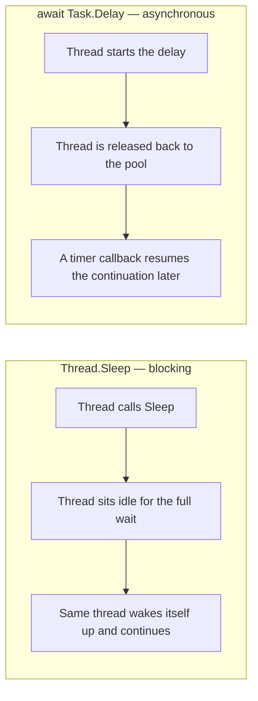
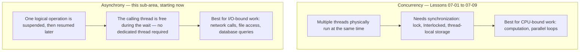

# Introduction to Asynchronous Programming

## Introduction

Before reading this lesson, you should already be comfortable with **[The System.Threading.Lock Type and Thread-Local Storage](../07-concurrency-parallel-async/07-09-lock-type-and-thread-local-storage.md)** and, more broadly, with everything Module 07 has covered up to this point: creating threads, running work on the thread pool, protecting shared state with `lock`, and giving each thread its own private copy of data. Every one of those lessons has been about **concurrency** — getting more than one thread to make genuine physical progress at the same time. This lesson turns to a different question entirely: what do you do when a piece of code has to *wait* — for a network response, a disk read, a database query — and you don't want to waste a thread just standing around while it does?

That question is what **asynchronous programming** answers, and it opens an entirely new sub-area of Module 07 that will run through the next several lessons. Unlike everything before it, asynchrony does not require multiple threads at all — it's a different axis of design, and this lesson's job is to make sure that distinction is clear before you see a single line of `async`/`await` syntax.

By the end of this lesson, you will be able to:

- Explain why blocking a thread to wait on I/O wastes a limited, reusable resource
- State the precise difference between concurrency (multiple threads making progress) and asynchrony (non-blocking waiting that doesn't require extra threads)
- Describe what happens to a calling thread while an asynchronous I/O operation is in flight
- Distinguish CPU-bound work from I/O-bound work, and identify which tool this module has already given you for each
- Preview the roadmap of lessons that make up the Asynchronous Programming sub-area

## Asynchronous Programming — A Layman's Perspective

Imagine you need to send an important letter and wait for a reply. There are two very different ways you could handle that wait. The first: you walk to the mailbox, drop the letter in, and then stand right there at the mailbox — not reading, not doing errands, not answering your phone — simply staring at the little door, waiting for the reply to arrive, because you've decided that's the only way to be sure you don't miss it. You are, for the entire time it takes the postal system to deliver your letter and bring back a response, completely unavailable for anything else. If that round trip takes two days, you've spent two days standing at a mailbox.

The second way: you drop the letter in the mailbox, walk away, and go live your life — cook dinner, answer other letters, help a neighbor — and you've arranged for the mailbox itself to notify you the moment a reply lands in it. You lose absolutely nothing in terms of when you find out about the reply; you're notified the instant it arrives, same as if you'd been standing there. What you gain is every single minute you would otherwise have spent doing nothing at all.

Notice what this second approach does *not* require: it does not require hiring a second person to stand at the mailbox in your place. That would solve the same problem, but it costs you an entire additional person's time for the whole wait — expensive, and often unnecessary. All the second approach actually requires is a way to be notified later, and the discipline to not just sit there in the meantime. One person, doing other useful things, picking the task back up exactly when it's ready to continue — that's the whole idea.

This is precisely the distinction this lesson draws in code. Hiring a second person to stand at a second mailbox is concurrency — it's what threads, `Task.Run`, and `lock` from earlier lessons in this module are for, and it's the right call when the work itself needs to happen at the same time as other work, such as two genuinely independent calculations running in parallel. But waiting for a reply that hasn't arrived yet doesn't need a second person at all — it needs the first person to simply not block themselves while nothing is happening. That's asynchrony, and it's a single person — potentially a single thread — freed up to do something else, then notified and resumed the moment the wait is over. Learning to tell these two apart, and to reach for the right one, is what the next several lessons build toward.

## Asynchronous Programming — A Programming Language Perspective

**Asynchronous programming** is a style of writing code where an operation that must wait for something external — a network response, a disk I/O completion, a timer — can be *suspended* without occupying the thread that started it, and later *resumed* from exactly where it left off once the awaited operation completes. Critically, suspension and resumption are not the same thing as running on multiple threads: a single thread can start an asynchronous operation, be released to do other work, and later run the continuation — possibly on that same thread, possibly on a different one drawn from the pool, but never by sitting idle for the duration.

C# implements this through the **Task-based Asynchronous Pattern (TAP)**, built around the `Task` and `Task<TResult>` types and the `async`/`await` keywords, which the next two lessons cover in depth. Under the hood, .NET's I/O APIs use operating-system facilities — I/O completion ports on Windows — that let the runtime register "notify me when this finishes" without dedicating any thread to the wait itself. This is fundamentally different from the `Thread`- and `Task.Run`-based concurrency you've already learned, which genuinely occupies a thread for the full duration of the work.

## How Blocking and Non-Blocking Waits Differ in C#

The clearest way to see this distinction is to compare a *blocking* wait — `Thread.Sleep` — with a *non-blocking* wait — `await Task.Delay`. Both examples below wait for the same one second, simulating a slow network round-trip. Watch what the surrounding comments say happens to the thread in each case; the observable console output is identical in order, but what's happening underneath is not.


*Figure 1: `Thread.Sleep` occupies its thread for the entire wait. `await Task.Delay` releases the thread and resumes the continuation only when the wait is over.*

```csharp
// Program.cs — .NET 10 / C# 14
Console.WriteLine("Requesting exchange rate (synchronous, blocking call)...");
FetchExchangeRateBlocking();
Console.WriteLine("Blocking call returned.");

Console.WriteLine();

Console.WriteLine("Requesting exchange rate (asynchronous, non-blocking call)...");
await FetchExchangeRateAsync();
Console.WriteLine("Asynchronous call returned.");

static void FetchExchangeRateBlocking()
{
    Console.WriteLine("  Thread is now blocked, doing nothing else while it waits...");
    Thread.Sleep(1000); // Simulates a slow network call — the thread is stuck here.
    Console.WriteLine("  Blocking wait finished.");
}

static async Task FetchExchangeRateAsync()
{
    Console.WriteLine("  Await starts — the calling thread is free to do other work...");
    await Task.Delay(1000); // Simulates the same slow network call, but non-blocking.
    Console.WriteLine("  Await resumed after the operation completed.");
}
```

**Console Output:**

```text
Requesting exchange rate (synchronous, blocking call)...
  Thread is now blocked, doing nothing else while it waits...
  Blocking wait finished.
Blocking call returned.

Requesting exchange rate (asynchronous, non-blocking call)...
  Await starts — the calling thread is free to do other work...
  Await resumed after the operation completed.
Asynchronous call returned.
```

Both blocks print in the same order and take about the same wall-clock time, so the output alone can't show the difference — and that's the point worth sitting with. `Thread.Sleep(1000)` parks its thread for a full second, unable to do anything else, even though there is nothing for it to actively do. `await Task.Delay(1000)` schedules a timer, hands control back to whoever called `FetchExchangeRateAsync`, and only resumes the rest of the method once that timer fires — during that second, the thread that started the delay is completely free to run other code. In a program juggling many such waits at once, that difference is the entire reason asynchronous I/O scales where blocking I/O does not.

## Real-Time Example: Asynchronous Checkout in E-Commerce Order Processing

We begin a new case study thread that this Asynchronous Programming sub-area will keep extending: an **E-Commerce Order Processing** system built around an `Order` record, an `OrderService`, and a `PaymentGateway`. Placing an order requires calling out to a card processor — a textbook I/O-bound operation — and the storefront should never freeze while that call is in flight. `PaymentGateway.ChargeCardAsync` simulates that network round-trip with `Task.Delay`, and `OrderService.PlaceOrderAsync` awaits it rather than blocking on it.

```csharp
// Program.cs — .NET 10 / C# 14 — Real-Time Example
using System.Globalization;

Order order = new("ORD-58120", "Priya Nair", 249.50m);

Console.WriteLine($"Checkout started for {order.OrderId} ({order.CustomerName}), total {Money.Usd(order.Total)}");

OrderService orderService = new(new PaymentGateway());
string receipt = await orderService.PlaceOrderAsync(order);

Console.WriteLine(receipt);
Console.WriteLine("Storefront remains responsive — no thread sat idle waiting on the card processor.");

static class Money
{
    // A regular static class member — unlike a top-level local function, this
    // is visible from every class below, no matter which file-scoped type calls it.
    public static string Usd(decimal amount) => amount.ToString("C", CultureInfo.GetCultureInfo("en-US"));
}

record Order(string OrderId, string CustomerName, decimal Total);

class OrderService(PaymentGateway paymentGateway)
{
    public async Task<string> PlaceOrderAsync(Order order)
    {
        Console.WriteLine($"  Sending {Money.Usd(order.Total)} to the payment gateway for {order.OrderId}...");
        string authorizationCode = await paymentGateway.ChargeCardAsync(order.Total);
        Console.WriteLine($"  Payment authorized: {authorizationCode}");
        return $"Order {order.OrderId} confirmed for {order.CustomerName}.";
    }
}

class PaymentGateway
{
    public async Task<string> ChargeCardAsync(decimal amount)
    {
        // Simulates the real network round-trip to a card processor. While this
        // await is pending, the calling thread is not blocked or reserved.
        await Task.Delay(800);
        int cents = (int)(amount * 100) % 100000;
        return $"AUTH-{cents}";
    }
}
```

**Console Output:**

```text
Checkout started for ORD-58120 (Priya Nair), total $249.50
  Sending $249.50 to the payment gateway for ORD-58120...
  Payment authorized: AUTH-24950
Order ORD-58120 confirmed for Priya Nair.
Storefront remains responsive — no thread sat idle waiting on the card processor.
```

In a real storefront handling thousands of simultaneous checkouts, blocking a thread for every card authorization would exhaust the thread pool almost immediately — every waiting checkout would hold a thread hostage for the entire round-trip to the payment processor. Because `ChargeCardAsync` is awaited rather than blocked on, the ASP.NET Core request thread (covered later in Module 10) is free to serve other requests while the card processor does its work, and only picks the `PlaceOrderAsync` continuation back up once `AUTH-24950` actually comes back. This `Order`, `OrderService`, and `PaymentGateway` trio is the foundation the rest of this sub-area builds on.

## Concurrency vs Asynchrony

It's worth being precise about where these two ideas overlap and where they don't, because the rest of this module will use both. **Concurrency**, as built in Lessons 07-01 through 07-09, means more than one thread is physically making progress at the same moment — that's what `Thread`, `Task.Run`, `lock`, and thread-local storage are all in service of, and it's the right tool when work is CPU-bound: number crunching, image processing, anything the processor itself must actually compute. **Asynchrony** means an operation can be suspended and resumed without blocking the thread that started it — and, crucially, it does not require a second thread to exist at all. A single-threaded program can be fully asynchronous, juggling many in-flight waits, as long as none of those waits ever blocks.

The two are not opposites, and they compose: `Task.Run` genuinely hands CPU-bound work to another thread, and that call still returns a `Task` you can `await` — so the *calling* code stays non-blocking even though real concurrency is happening underneath. Conversely, ten thousand concurrent `await Task.Delay(...)`-style waits can be in flight on a single thread with room to spare, because none of them ever occupies that thread while waiting. Choosing the right tool starts with asking one question: is this wait for something to *finish computing* (CPU-bound — reach for concurrency), or for something *external to respond* (I/O-bound — reach for asynchrony)?


*Figure 2: Concurrency and asynchrony solve different problems and can be combined — `Task.Run` bridges them by making CPU-bound work awaitable.*

| Aspect | Concurrency (multithreading) | Asynchrony |
|---|---|---|
| Definition | Multiple threads making progress at the same physical time | An operation suspended and resumed without blocking its caller |
| Requires an extra OS thread | Yes — that is the entire point | Not necessarily — one thread can start work, leave, and resume later |
| Optimizes for | CPU-bound work: calculations, parallel loops | I/O-bound work: network, disk, database round-trips |
| Primary C# tools | `Thread`, `Task.Run`, `lock`, `ThreadLocal<T>` | `async`, `await`, `Task` / `Task<T>` |
| Cost of doing it wrong | Wasted CPU cycles from contention, or race conditions | Wasted threads sitting idle, capping how many operations can be in flight |

## The Asynchronous Programming Sub-Area at a Glance

This lesson opens a five-lesson (and beyond) arc that builds up the full Task-based Asynchronous Pattern in C#:

1. **[Task and Task&lt;T&gt;](../07-concurrency-parallel-async/07-11-task-and-task-t.md)** — the type that represents an in-flight or completed asynchronous operation.
2. **[async/await Fundamentals](../07-concurrency-parallel-async/07-12-async-await-fundamentals.md)** — the keywords that let you write asynchronous code that reads like synchronous code.
3. **[Composing Tasks: WhenAll, WhenAny, ContinueWith](../07-concurrency-parallel-async/07-13-composing-tasks-whenall-whenany.md)** — running several asynchronous operations together and reacting to how they finish.
4. **[Exception Handling in Async Code](../07-concurrency-parallel-async/07-14-exception-handling-in-async-code.md)** — how faults surface through `await`, and how they differ when several tasks fail at once.
5. **[ConfigureAwait and SynchronizationContext](../07-concurrency-parallel-async/07-15-configureawait-and-synccontext.md)** — controlling exactly which thread a continuation resumes on.

## What You've Learned & What's Next

Asynchronous programming lets a thread start a long-running I/O operation, walk away, and resume only once that operation is actually done — without ever standing idle, and without necessarily involving a second thread at all. That's a fundamentally different tool from the concurrency this module has built so far, reserved for a different problem: waiting on something external rather than computing something CPU-bound.

Continue your learning journey with **[Task and Task&lt;T&gt;](../07-concurrency-parallel-async/07-11-task-and-task-t.md)**, where you'll meet the type that represents these in-flight operations directly, and see how `Task.Run` bridges CPU-bound work into this same asynchronous model.

---
*Applies to: .NET 10 / C# 14. Last reviewed 2026-08-16.*
