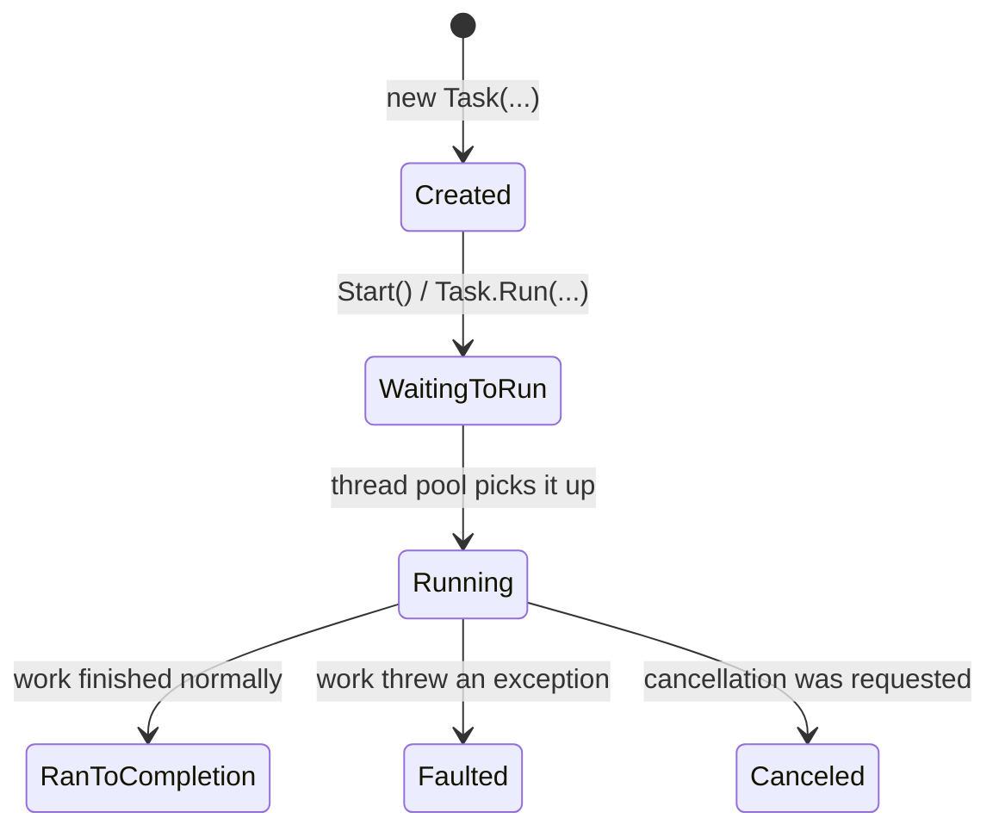
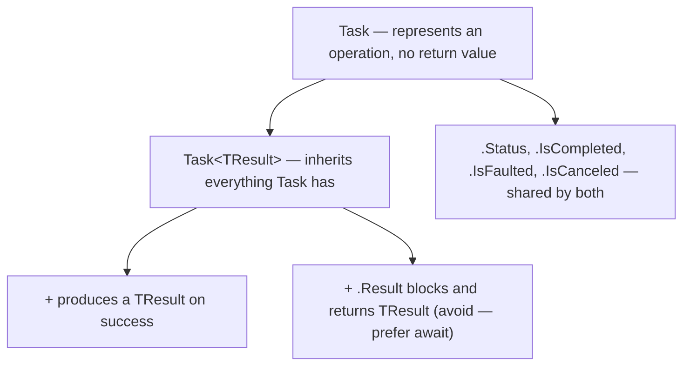

# Task and Task<T>

## Introduction

Before reading this lesson, you should already be comfortable with **[Introduction to Asynchronous Programming](../07-concurrency-parallel-async/07-10-introduction-to-async-programming.md)** — specifically, the idea that an asynchronous operation can be suspended and resumed without occupying a thread for the entire wait. That lesson described the *behavior* asynchrony gives you; this one introduces the actual .NET type that makes it possible to talk about an operation that hasn't finished yet: `Task`, and its value-producing counterpart, `Task<TResult>`.

Every `await` you'll write from this point forward is awaiting a `Task` or a `Task<TResult>`. Understanding what that object actually represents — a *handle* to work that may still be running, may have already finished, may have thrown, or may have been canceled — is the foundation the rest of this sub-area builds on.

By the end of this lesson, you will be able to:

- Explain that a `Task` represents a handle to an operation, not the operation's result itself
- Distinguish `Task` (no return value) from `Task<TResult>` (produces a value of type `TResult`)
- Use `Task.Run` to offload CPU-bound work onto the thread pool and obtain a `Task` you can await
- Enumerate the states a task moves through: Created, Running, RanToCompletion, Faulted, Canceled
- Read a task's `.Status` property to reason about where it currently stands in that lifecycle

## Task and Task&lt;T&gt; — A Layman's Perspective

Think about ordering a custom cake for a birthday party. The moment you place the order, the bakery hands you a claim ticket — a little numbered slip of paper. That ticket is not the cake. You cannot eat it, you cannot show it to guests as dessert, and it doesn't taste like anything. What it *is* is a handle: a promise that, at some point, the actual cake will exist, and a way for you to check in on that promise without having to stand in the kitchen watching the baking happen.

While you hold that ticket, several things could be true at once, depending on when you check. Maybe the order has been written down but the baker hasn't started yet. Maybe it's in the oven right now. Maybe it's finished, boxed, and sitting on the counter waiting for you. Maybe — unfortunately — the oven broke, and the whole thing burned, so the cake will never be ready, and your ticket now represents a failure rather than a pending success. Or maybe you called ahead and canceled the order before the baker even started the batter. In every one of these cases, the ticket itself doesn't change what it looks like in your hand — a scrap of paper — but it always corresponds to exactly one of these situations, and the bakery can always tell you which one, right now, if you ask.

A plain claim ticket that just represents "your order is somewhere in this process" is like a `Task` — it tells you *whether* something finished, not *what* came out of it, because some orders don't produce a thing you take home at all (imagine the "order" was actually a request to have the kitchen cleaned — there's nothing to hand you, just confirmation it's done). A claim ticket for the cake specifically, though, is like a `Task<TResult>` — when you redeem it, you get an actual cake back, a real value, not just a confirmation that baking happened.

And here's the part that matters most for how you'll use these tickets in code: the ticket exists, and is valid to hold and check on, from the moment the order is placed — long before the cake exists. You can glance at it and learn "still baking," you can wait around until it says "ready," or you can walk away and come back later. The one thing you'd never do is assume the ticket itself is the finished product. That confusion — mistaking the handle for the result — is exactly the trap `Task` versus `Task<TResult>` is designed to make impossible to fall into by accident, because the compiler simply won't let you treat a `Task<int>` as though it already were an `int`.

## Task and Task&lt;T&gt; — A Programming Language Perspective

`System.Threading.Tasks.Task` represents an asynchronous operation that does not produce a value — it models "this ran, and either completed, faulted, or was canceled." `Task<TResult>`, which derives from `Task`, represents an asynchronous operation that *does* produce a value: once it completes successfully, its `.Result` property (or, far more commonly, `await`ing it) yields a `TResult`. Both types expose a `.Status` property of type `TaskStatus`, an enum whose members include `Created`, `WaitingToRun`, `Running`, `RanToCompletion`, `Faulted`, and `Canceled` — a task moves through this lifecycle exactly once, from creation to exactly one terminal state.

Tasks are created in several ways: `Task.Run(Action)` or `Task.Run(Func<TResult>)` schedules work onto the thread pool immediately and returns a task representing it; an `async` method (covered next lesson) implicitly returns a `Task` or `Task<TResult>` that represents the method's own eventual completion; and `new Task(...)` constructs a task that must be started explicitly with `.Start()`. `Task.Run` is specifically the tool for **CPU-bound** work — computation that genuinely needs a thread to execute — bridging it into the same awaitable model that I/O-bound asynchrony uses.

## How to Create and Inspect a Task in C#

A task's `.Status` tells you exactly where it sits in its lifecycle at any given moment. Two of those states are easy to observe deterministically: `Created`, immediately after constructing a task with `new Task<TResult>(...)` and before calling `.Start()`, and `RanToCompletion`, immediately after successfully `await`-ing it. The example below also uses `Task.Run` to offload CPU-bound work — computing a sum of squares — onto the thread pool, and shows what a task's status looks like when the work throws instead of succeeding.


*Figure 1: A task moves through exactly one path from Created to a single terminal state — RanToCompletion, Faulted, or Canceled.*

```csharp
// Program.cs — .NET 10 / C# 14
Task<int> pending = new(() => SumSquares(1, 1000));
Console.WriteLine($"Before Start(): {pending.Status}");

pending.Start();
int total = await pending;
Console.WriteLine($"After awaiting: {pending.Status}");
Console.WriteLine($"Sum of squares 1..1000: {total}");

Console.WriteLine();

Task<int> offloaded = Task.Run(() => SumSquares(1, 1000));
int offloadedTotal = await offloaded;
Console.WriteLine($"Task.Run offloaded CPU-bound work; status: {offloaded.Status}");
Console.WriteLine($"Sum of squares 1..1000 (offloaded): {offloadedTotal}");

Console.WriteLine();

Func<int> throwingWork = () => throw new InvalidOperationException("Simulated failure.");
Task<int> failing = Task.Run(throwingWork);
try
{
    await failing;
}
catch (InvalidOperationException ex)
{
    Console.WriteLine($"Caught: {ex.Message}");
}
Console.WriteLine($"Status of the failed task: {failing.Status}");

static int SumSquares(int start, int end)
{
    int sum = 0;
    for (int i = start; i <= end; i++)
    {
        sum += i * i;
    }
    return sum;
}
```

**Console Output:**

```text
Before Start(): Created
After awaiting: RanToCompletion
Sum of squares 1..1000: 333833500

Task.Run offloaded CPU-bound work; status: RanToCompletion
Sum of squares 1..1000 (offloaded): 333833500

Caught: Simulated failure.
Status of the failed task: Faulted
```

Notice that `pending.Status` reads `Created` only because we deliberately built the task with `new Task<int>(...)` instead of starting it immediately — this is the one state you can reliably catch without a race, since nothing has scheduled the work yet. Once `.Start()` runs, or once `Task.Run` schedules the work directly, the task moves through `WaitingToRun` and `Running` on its own, and by the time `await` returns control to us, the only status left to observe is a terminal one — `RanToCompletion` for the two successful computations, and `Faulted` for the one that threw. `await`-ing a faulted task rethrows the underlying exception at the `await` point (Lesson 07-14 covers this in depth), but the task object itself still reports `Faulted` afterward if you check it directly.

## Real-Time Example: Task.Run and Task&lt;T&gt; in E-Commerce Order Processing

We continue building the **E-Commerce Order Processing** case study, extending the `Order` record and `OrderService` class introduced in the previous lesson. Finalizing an order summary here requires two very different kinds of work: estimating a delivery date, which is I/O-bound (a call to a shipping carrier's API), and calculating loyalty points, which is CPU-bound (a tiered points calculation over the order total). `EstimateDeliveryAsync` returns a `Task<DateOnly>` backed by `Task.Delay`, while the loyalty-point calculation is deliberately synchronous CPU work that we offload with `Task.Run` so it doesn't run on whatever thread called `BuildOrderSummaryAsync`.

```csharp
// Program.cs — .NET 10 / C# 14 — Real-Time Example
using System.Globalization;

Order order = new("ORD-58121", "Marcus Webb", 899.00m);

Console.WriteLine($"Processing {order.OrderId} for {order.CustomerName}, total {Usd(order.Total)}");

OrderService orderService = new();
string summary = await orderService.BuildOrderSummaryAsync(order);

Console.WriteLine(summary);

static string Usd(decimal amount) => amount.ToString("C", CultureInfo.GetCultureInfo("en-US"));

record Order(string OrderId, string CustomerName, decimal Total);

class OrderService
{
    public async Task<string> BuildOrderSummaryAsync(Order order)
    {
        Console.WriteLine("  Estimating delivery date (I/O-bound call to shipping carrier)...");
        Task<DateOnly> deliveryTask = EstimateDeliveryAsync();

        Console.WriteLine("  Calculating loyalty points (CPU-bound, offloaded with Task.Run)...");
        Task<int> pointsTask = Task.Run(() => CalculateLoyaltyPoints(order.Total));

        DateOnly deliveryDate = await deliveryTask;
        Console.WriteLine($"  Delivery task status after awaiting: {deliveryTask.Status}");

        int points = await pointsTask;
        Console.WriteLine($"  Points task status after awaiting: {pointsTask.Status}");

        return $"Order {order.OrderId}: arrives {deliveryDate:yyyy-MM-dd}, earns {points} loyalty points.";
    }

    private static async Task<DateOnly> EstimateDeliveryAsync()
    {
        await Task.Delay(500); // Simulates an async call to a shipping carrier's API.
        return new DateOnly(2026, 8, 20);
    }

    private static int CalculateLoyaltyPoints(decimal orderTotal)
    {
        // A deliberately CPU-heavy tiered calculation — a good fit for Task.Run.
        int points = 0;
        for (decimal dollar = 1m; dollar <= orderTotal; dollar++)
        {
            points += dollar <= 500m ? 1 : 2; // Double points past the first $500.
        }
        return points;
    }
}
```

**Console Output:**

```text
Processing ORD-58121 for Marcus Webb, total $899.00
  Estimating delivery date (I/O-bound call to shipping carrier)...
  Calculating loyalty points (CPU-bound, offloaded with Task.Run)...
  Delivery task status after awaiting: RanToCompletion
  Points task status after awaiting: RanToCompletion
Order ORD-58121: arrives 2026-08-20, earns 1298 loyalty points.
```

Both `deliveryTask` and `pointsTask` are started before either is awaited, so the shipping estimate's simulated network wait and the loyalty-point computation are both already underway by the time we get to the first `await` — a preview of the true concurrent composition Lesson 07-13 formalizes with `Task.WhenAll`. What matters here is that `CalculateLoyaltyPoints` is pure CPU work looping nearly nine hundred times; running it via `Task.Run` keeps it off whichever thread is orchestrating the rest of `BuildOrderSummaryAsync`, exactly the kind of workload `Task.Run` exists for, while `EstimateDeliveryAsync`'s wait costs no dedicated thread at all.

## Task vs Task&lt;TResult&gt;

The relationship between these two types is inheritance, not a coincidence of naming: `Task<TResult>` *is* a `Task`, with one addition — a produced value. Every task, generic or not, can be awaited, can be inspected via `.Status`, `.IsCompleted`, `.IsFaulted`, and `.IsCanceled`, and eventually settles into exactly one terminal state. The difference only shows up when the operation succeeds: awaiting a plain `Task` gives you nothing back — the `await` expression itself has no value — while awaiting a `Task<TResult>` gives you the produced `TResult`.

It's worth calling out `.Result` specifically, since it's the one place these two types diverge sharply in how they're safe to use. `Task<TResult>.Result` synchronously blocks the calling thread until the task completes, then returns the value — or rethrows, wrapped in an `AggregateException`, if the task faulted. Reaching for `.Result` on a task that hasn't finished yet reintroduces exactly the blocking-wait problem the previous lesson spent an entire analogy warning against, and on a thread with a synchronization context it can even deadlock. `await` is almost always the right choice; `.Result` and `.Wait()` belong to synchronous code paths that genuinely cannot use `async`.


*Figure 2: `Task<TResult>` adds a produced value on top of everything a plain `Task` already tracks.*

| Aspect | `Task` | `Task<TResult>` |
|---|---|---|
| Represents | An operation with no return value | An operation that produces a `TResult` value |
| Awaiting it yields | Nothing — the `await` expression has no value | The produced `TResult` |
| Typical creation | `Task.Run(Action)`, an `async Task` method | `Task.Run(Func<TResult>)`, an `async Task<TResult>` method |
| Type relationship | Base type | Derives from `Task` |
| Synchronous result access | N/A — nothing to retrieve | `.Result` blocks until complete; prefer `await` instead |

## Types of Task-Returning Work in C#

`Task` and `Task<TResult>` show up across several related mechanisms, most of which get their own dedicated lesson in this sub-area:

1. **`Task.Run`** — offloads CPU-bound work onto the thread pool and returns an awaitable task (covered in this lesson).
2. **[async Task / async Task&lt;TResult&gt; methods](../07-concurrency-parallel-async/07-12-async-await-fundamentals.md)** — methods that return a task representing their own eventual completion.
3. **[Task.WhenAll and Task.WhenAny](../07-concurrency-parallel-async/07-13-composing-tasks-whenall-whenany.md)** — composing several tasks together and waiting on all or the first to finish.
4. **[ContinueWith](../07-concurrency-parallel-async/07-13-composing-tasks-whenall-whenany.md)** — the older, lower-level way to attach a continuation directly to a task.
5. **[Faulted and Canceled task inspection](../07-concurrency-parallel-async/07-14-exception-handling-in-async-code.md)** — how exceptions captured on a task surface when you await it.

## What You've Learned & What's Next

A `Task` is a handle to an asynchronous operation — Created, then Running, then exactly one terminal state: RanToCompletion, Faulted, or Canceled — and `Task<TResult>` is that same handle with a produced value attached. `Task.Run` is the bridge that lets genuinely CPU-bound work participate in this same awaitable model that I/O-bound asynchrony already uses.

Continue your learning journey with **[async/await Fundamentals](../07-concurrency-parallel-async/07-12-async-await-fundamentals.md)**, where you'll see exactly what the compiler does with the `async` and `await` keywords you've already been using in this lesson's examples — and why `await` never blocks the thread that reaches it.

---
*Applies to: .NET 10 / C# 14. Last reviewed 2026-08-16.*
