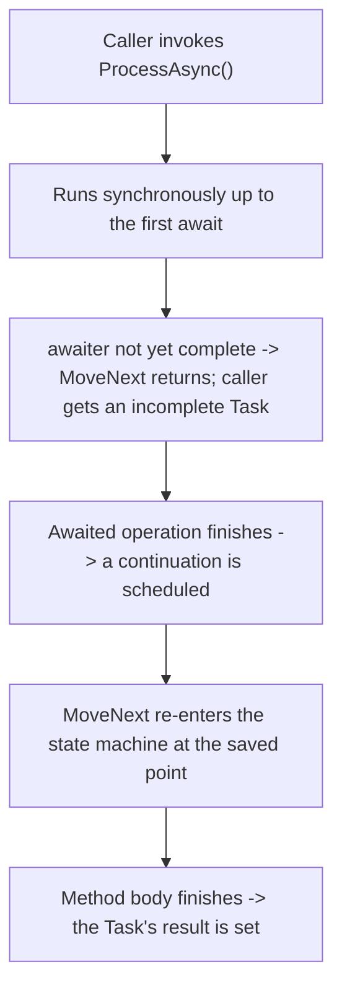
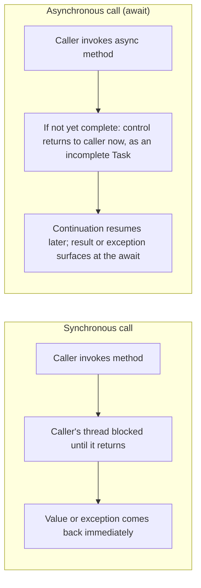

# async/await Fundamentals

## Introduction

Before reading this lesson, you should already be comfortable with **[Task and Task&lt;T&gt;](../07-concurrency-parallel-async/07-11-task-and-task-t.md)** — the idea that a `Task` is a handle to an operation that may still be running, and that it moves through a lifecycle from `Created` through to exactly one terminal state. Every example in that lesson used `await` without stopping to explain what that keyword actually does. This lesson closes that gap.

`async` and `await` are the two keywords that let you write asynchronous code that *reads* like ordinary, top-to-bottom synchronous code, while the compiler quietly does the hard part: transforming your method into something that can pause partway through, hand control back to whoever called it, and resume later from exactly where it left off — without ever blocking a thread while it waits.

By the end of this lesson, you will be able to:

- Explain what the `async` modifier does to a method, and clarify that it does not, by itself, create any concurrency
- Describe, at a conceptual level, the state-machine transformation the compiler performs on an `async` method
- Write an `async Task<TResult>` method that awaits another `async` method and returns a computed result
- Explain precisely why reaching an `await` returns control to the caller instead of blocking the calling thread
- Distinguish `async Task`, `async Task<TResult>`, and `async void`, and explain why `async void` should be avoided outside event handlers

## async/await — A Layman's Perspective

Picture a cook working through a recipe that includes the line "let the dough rest for thirty minutes." A cook who didn't know any better might stand at the counter for the full half hour, watching the dough do nothing. A better cook does something different: she pins a sticky note directly onto that line of the recipe, and on it she writes down everything she'd need to pick the recipe back up later — which ingredients are already measured, which bowls are dirty, exactly which step comes next — and then she walks away entirely to go work on a completely different dish. When the timer eventually rings, whoever happens to be free in the kitchen at that moment — maybe the same cook, maybe someone else who just finished their own task — reads the sticky note and continues the recipe from precisely that line, as if no time had passed for the recipe itself, even though real minutes ticked by all around it.

The sticky note is the whole trick, and it's worth noticing what makes it work: it isn't a vague "come back later" reminder. It's a complete, specific record of everything the recipe needs remembered in order to resume correctly — nothing more, nothing less. Write too little on it, and whoever picks the recipe back up won't know what to do next. This is exactly what happens automatically, behind the scenes, every single time you write `await` in your own code: whatever local information your method still needs once the wait is over gets written down for you, without you ever having to track it by hand.

Now stretch the analogy one step further, because real recipes nest sub-tasks inside each other. Suppose the dough-resting step also calls for "meanwhile, start the sauce recipe, and let me know when it's done." That's a second recipe card, run by whoever's available, with its own steps and its own waiting points — and the first recipe's sticky note doesn't get resolved until that whole sub-recipe finishes too. One recipe waiting on another recipe, each capable of pausing and resuming independently, is precisely what it looks like when one `async` method awaits another.

The part that separates a good kitchen from a wasteful one isn't cleverness — it's simply refusing to let a capable person stand idle in front of something that isn't ready yet. That refusal, formalized into a language feature the compiler enforces for you automatically at every single `await`, is the entire idea behind `async` and `await` in C#.

## async/await — A Programming Language Perspective

The `async` modifier marks a method as one whose body may contain `await` expressions; it does **not**, by itself, create a new thread or run anything concurrently — it is purely a signal to the compiler to perform a transformation. That transformation turns the method's body into a **state machine**: a compiler-generated type implementing `IAsyncStateMachine`, whose `MoveNext` method contains your code, split into segments at each `await` point. Local variables that must survive across an `await` become fields on that generated type rather than ordinary stack locals, exactly like the cook's sticky note recording what to remember.

When execution reaches an `await`, the compiler-generated code checks whether the awaited task has already completed. If not, `MoveNext` returns immediately — handing control back to the caller with an incomplete `Task` — and schedules a continuation that re-enters `MoveNext` at the saved point once the awaited operation finishes. This is precisely why `await` never blocks: the method doesn't wait in place, it *exits and gets called again later*.

## How the Compiler Transforms an async Method

The example below has one `async Task<string>` method, `ProcessAsync`, awaiting another, `FetchDataAsync` — a nested async call, exactly like one recipe card invoking a second one. Watch the order the console lines print in: it reveals exactly where control leaves `ProcessAsync` and where it resumes.


*Figure 1: An `async` method's body is split at each `await` into segments a generated state machine re-enters, rather than a single method that runs start to finish in one call.*

```csharp
// Program.cs — .NET 10 / C# 14
string result = await ProcessAsync();
Console.WriteLine(result);

static async Task<string> ProcessAsync()
{
    Console.WriteLine("ProcessAsync: about to await FetchDataAsync");
    string data = await FetchDataAsync();
    Console.WriteLine("ProcessAsync: resumed after FetchDataAsync completed");
    return $"Processed: {data}";
}

static async Task<string> FetchDataAsync()
{
    Console.WriteLine("FetchDataAsync: starting simulated I/O");
    await Task.Delay(500);
    Console.WriteLine("FetchDataAsync: simulated I/O complete");
    return "raw-data-42";
}
```

**Console Output:**

```text
ProcessAsync: about to await FetchDataAsync
FetchDataAsync: starting simulated I/O
FetchDataAsync: simulated I/O complete
ProcessAsync: resumed after FetchDataAsync completed
Processed: raw-data-42
```

Follow the control flow, not just the text: `ProcessAsync` runs synchronously until its own `await`, which immediately calls `FetchDataAsync`. That method, in turn, runs synchronously until *its* `await Task.Delay(500)`, at which point `FetchDataAsync` hands an incomplete task back to `ProcessAsync` — which itself is now suspended, waiting on that task, and has handed *its own* incomplete task back to whatever called it at the very top. Nothing in this chain is blocked; every method has simply returned control upward, and the compiler-generated continuations stitch everything back together once `Task.Delay` actually finishes, in the reverse order things paused.

## Real-Time Example: async/await in a Banking/ATM Withdrawal

We extend the **Banking/ATM** domain with an `Account` class whose `WithdrawAsync` method is itself `async`, and which awaits a second `async` method — `FraudCheckService.ScreenAsync` — before completing the withdrawal. This mirrors a real ATM: dispensing cash has to wait on a genuine network call to a fraud-scoring service, and that call must not freeze the machine while it's in flight.

```csharp
// Program.cs — .NET 10 / C# 14 — Real-Time Example
using System.Globalization;

Account account = new("9988776655443322", 1200.00m);
FraudCheckService fraudCheckService = new();

Console.WriteLine(await account.WithdrawAsync(300.00m, fraudCheckService));
Console.WriteLine();
Console.WriteLine(await account.WithdrawAsync(700.00m, fraudCheckService));

static class Money
{
    public static string Usd(decimal amount) => amount.ToString("C", CultureInfo.GetCultureInfo("en-US"));
}

class Account(string accountNumber, decimal balance)
{
    public string MaskedAccountNumber { get; } = $"****{accountNumber[^4..]}";
    public decimal Balance { get; private set; } = balance;

    public async Task<string> WithdrawAsync(decimal amount, FraudCheckService fraudCheckService)
    {
        Console.WriteLine($"  {MaskedAccountNumber}: requesting withdrawal of {Money.Usd(amount)}");

        // WithdrawAsync is itself async, and it awaits another async method
        // (ScreenAsync) — the compiler links the two generated state machines
        // so control returns here only once screening actually finishes.
        bool approved = await fraudCheckService.ScreenAsync(MaskedAccountNumber, amount);

        if (!approved)
        {
            return $"  Withdrawal declined for {MaskedAccountNumber}: flagged by fraud screening.";
        }

        Balance -= amount;
        return $"  Dispensed {Money.Usd(amount)} from {MaskedAccountNumber}. New balance: {Money.Usd(Balance)}";
    }
}

class FraudCheckService
{
    public async Task<bool> ScreenAsync(string maskedAccountNumber, decimal amount)
    {
        Console.WriteLine($"  Fraud screening {maskedAccountNumber} for {Money.Usd(amount)}...");
        await Task.Delay(400); // Simulates a call to an external fraud-scoring service.
        Console.WriteLine($"  Fraud screening complete for {maskedAccountNumber}.");
        return amount <= 500.00m; // Simple rule: flag withdrawals over $500.
    }
}
```

**Console Output:**

```text
  ****3322: requesting withdrawal of $300.00
  Fraud screening ****3322 for $300.00...
  Fraud screening complete for ****3322.
  Dispensed $300.00 from ****3322. New balance: $900.00

  ****3322: requesting withdrawal of $700.00
  Fraud screening ****3322 for $700.00...
  Fraud screening complete for ****3322.
  Withdrawal declined for ****3322: flagged by fraud screening.
```

Neither withdrawal ever blocks the thread running this program while `ScreenAsync` is out at the (simulated) fraud-scoring service — `WithdrawAsync` simply suspends at its `await` and resumes once screening reports back. In a real ATM network, thousands of machines might be screening withdrawals at once; if each one blocked a thread for the full round-trip to the fraud service, the number of machines a single server could support would be capped by how many threads it has, rather than by how much real work is actually happening. `async`/`await` is what removes that cap.

## Synchronous Calls vs Asynchronous Calls

A normal synchronous method call and an `await`-ed asynchronous call look almost identical on the page, but the control-flow story underneath them is fundamentally different. Calling a synchronous method hands control to it and gets nothing back until that method has completely finished — the calling thread has no choice but to sit in that call frame the entire time. Calling an `async` method and immediately `await`-ing it *can* look the same from the outside if the work happens to finish instantly, but the moment the awaited operation genuinely isn't done yet, control returns to whoever called the `async` method — as an incomplete `Task` — long before the method's own logic has finished running.

This is also where failure signaling diverges, in a way Lesson 07-14 covers fully: a synchronous method that fails throws its exception immediately, at the call site, into the caller's own stack. An `async` method that fails captures that exception *on the returned Task* instead, and only re-raises it at the point where that task is `await`-ed — which might be much later, and might be a different piece of code entirely than whatever originally triggered the failure.


*Figure 2: A synchronous call occupies the caller until it finishes. An awaited async call can return control to the caller long before its own work is done.*

| Aspect | Synchronous method call | Asynchronous call (`await`) |
|---|---|---|
| Control returns to caller | Only after the method fully finishes | Immediately, if the awaited operation isn't done yet — as an incomplete `Task` |
| Thread while waiting | Occupied for the entire call | Free — released back to the pool (or the UI message loop) |
| What resumes the method | Nothing extra — it's one continuous call | A continuation scheduled by the compiler-generated state machine |
| Return type | The actual value | `Task` / `Task<TResult>` — a handle, resolved later |
| Failure signaling | Exception thrown immediately at the call site | Exception captured on the `Task`, rethrown when awaited |

## Shapes an Async Method Can Take

`async` methods aren't all the same shape — the return type changes what callers can do with them:

1. **`async Task`** — no produced value, but still awaitable, so callers can wait for it to finish.
2. **`async Task<TResult>`** — produces a value, awaited to obtain it (every example in this lesson).
3. **`async void`** — fire-and-forget; reserved for event handlers, because callers cannot `await` it and an exception thrown inside one crashes the process rather than surfacing anywhere catchable.
4. **[Composing several async calls together](../07-concurrency-parallel-async/07-13-composing-tasks-whenall-whenany.md)** — `Task.WhenAll`, `Task.WhenAny`, and `ContinueWith`.
5. **[Exception propagation through await](../07-concurrency-parallel-async/07-14-exception-handling-in-async-code.md)** — precisely how and when a faulted task's exception resurfaces.

## What You've Learned & What's Next

`async` marks a method for the compiler to transform into a state machine, splitting its body at each `await` so it can suspend without blocking and resume later from exactly where it left off — and none of this requires an extra thread. An `async` method awaiting another `async` method chains these state machines together, exactly the way `WithdrawAsync` awaited `ScreenAsync` above.

Continue your learning journey with **[Composing Tasks: WhenAll, WhenAny, ContinueWith](../07-concurrency-parallel-async/07-13-composing-tasks-whenall-whenany.md)**, where you'll run several independent asynchronous operations together instead of one at a time.

---
*Applies to: .NET 10 / C# 14. Last reviewed 2026-08-16.*
