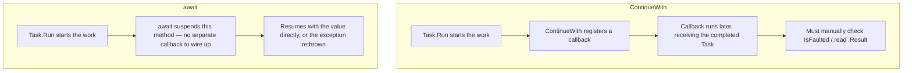

# Composing Tasks: WhenAll, WhenAny, ContinueWith

## Introduction

Before reading this lesson, you should already be comfortable with **[async/await Fundamentals](../07-concurrency-parallel-async/07-12-async-await-fundamentals.md)** — how `async` methods are transformed into state machines, and how one `async` method awaiting another chains those state machines together without blocking any thread. Every example so far has awaited one task at a time, in sequence. Real programs rarely work that way: an order confirmation page might need to check three warehouses, a dashboard might need to query five independent services, and none of them should have to wait for the others one at a time if they could all be in flight together.

This lesson covers the three tools C# gives you for working with more than one task at once: `Task.WhenAll`, which waits for every task in a group to finish; `Task.WhenAny`, which reacts the moment the *first* one finishes; and `ContinueWith`, an older, lower-level API that predates `async`/`await` entirely and is worth understanding by contrast.

By the end of this lesson, you will be able to:

- Start multiple independent asynchronous operations and run them concurrently rather than one after another
- Use `Task.WhenAll` to wait for every operation in a group to complete and collect all of their results
- Use `Task.WhenAny` to react to whichever operation finishes first, including building a timeout pattern
- Explain what `ContinueWith` does and why `await`-based code is generally clearer and safer
- Recognize when `ContinueWith` still shows up in older or more specialized codebases

## Composing Tasks — A Layman's Perspective

Imagine you're renovating a house and you need three different specialists to each give you a quote: an electrician, a plumber, and a roofer. The slow way to do this is to call the electrician, sit by the phone until they call back, *then* call the plumber, sit by the phone again, and only after that call the roofer. Nothing stops you from calling all three the moment you start — leaving a message with each of them, telling each "call me back when you've worked out your number" — and then getting on with your day until every single one has called back. You don't need three of you to make this work; you just need to stop treating "waiting for a callback" as something that has to happen one specialist at a time.

That's the idea behind waiting for *every* quote before deciding — the renovation can't really begin planning its budget until all three numbers are in. But sometimes you don't need every answer, you need the *fastest* one. If you're getting a burst pipe fixed right now and you called four different emergency plumbers hoping at least one could come immediately, you don't wait for all four to call back — you take whichever one calls back first and tell the other three "never mind, we're covered." And there's a third situation worth naming: sometimes you're willing to wait for that first callback, but only up to a point — if nobody's called back within twenty minutes, you stop waiting and just drive to the hardware store yourself. You've set yourself a deadline, and whichever happens first — a callback, or the twenty minutes running out — decides what you do next.

These three situations map directly onto the three tools this lesson covers. Waiting for every specialist's quote before moving forward is `Task.WhenAll`. Taking whichever plumber calls back first and telling the rest never mind is `Task.WhenAny`. And setting yourself a twenty-minute deadline alongside the wait is the timeout pattern `Task.WhenAny` is most often used for in real applications — racing a genuine operation against a plain timer, and treating whichever one finishes first as your answer.

There's an older way people used to handle callbacks, too, worth a brief mention before we move to code: writing yourself an explicit note — "when the electrician calls, immediately do X with whatever they say" — pinned to your fridge for each specialist individually, rather than simply being told "call me back" and continuing your normal train of thought when they do. It works, but it's noticeably clunkier to read back later, and it's easy to lose track of which note was for which callback once you have several. That older, explicit-note way of handling a callback is exactly what `ContinueWith` looks like next to `await`.

## Composing Tasks — A Programming Language Perspective

`Task.WhenAll(params Task[])` (and its `Task<TResult>` overload) returns a single task that completes only once every task passed to it has completed; awaiting it with the generic overload yields an array of all the individual results, in the same order the tasks were passed in — regardless of the order they actually finished in. `Task.WhenAny(params Task[])` returns a task that completes as soon as *any one* of the supplied tasks completes, yielding that one completed task itself, which you can then inspect or await again to retrieve its result.

`ContinueWith`, part of the original Task Parallel Library introduced before `async`/`await` existed in C#, attaches a delegate directly to a task that runs once that task completes, receiving the completed task as its argument. It requires manually checking `.IsFaulted`, `.IsCanceled`, or reading `.Result`/`.Exception`, and its behavior around which thread or context the continuation runs on depends on which overload and `TaskContinuationOptions` you choose — all things `await` handles for you by default.

## How to Compose Tasks with WhenAll and WhenAny

`Task.WhenAll` and `Task.WhenAny` both take a collection of already-started tasks — note that none of the tasks below are awaited individually before being handed to either method, which is what lets them run concurrently in the first place.

```csharp
// Program.cs — .NET 10 / C# 14
Task<string> reportA = BuildReportAsync("Sales", 600);
Task<string> reportB = BuildReportAsync("Inventory", 300);
Task<string> reportC = BuildReportAsync("Shipping", 450);

string[] allReports = await Task.WhenAll(reportA, reportB, reportC);
Console.WriteLine("All reports ready:");
foreach (string report in allReports)
{
    Console.WriteLine($"  {report}");
}

Console.WriteLine();

Task<string> fastQuote = GetShippingQuoteAsync("Carrier A", 700);
Task<string> slowQuote = GetShippingQuoteAsync("Carrier B", 1200);

Task<string> firstQuote = await Task.WhenAny(fastQuote, slowQuote);
Console.WriteLine($"First quote back: {await firstQuote}");

static async Task<string> BuildReportAsync(string name, int delayMs)
{
    await Task.Delay(delayMs); // Simulates an async data-gathering call.
    return $"{name} report complete";
}

static async Task<string> GetShippingQuoteAsync(string carrier, int delayMs)
{
    await Task.Delay(delayMs); // Simulates an async call to a carrier's quote API.
    return $"{carrier} quote";
}
```

**Console Output:**

```text
All reports ready:
  Sales report complete
  Inventory report complete
  Shipping report complete

First quote back: Carrier A quote
```

Notice that the three reports print in the order they were *passed in* to `Task.WhenAll` — Sales, Inventory, Shipping — even though `Inventory` (300ms) actually finished before `Shipping` (450ms) or `Sales` (600ms). `Task.WhenAll` preserves input order for its results, which matters when you need to know which result came from which task. `Task.WhenAny`, by contrast, races `fastQuote` (700ms) against `slowQuote` (1200ms) and returns whichever task genuinely finishes first — `fastQuote` — without ever waiting on the slower one at all.

## Real-Time Example: Concurrent Warehouse Checks and a Restock Timeout in E-Commerce Order Processing

We extend the **E-Commerce Order Processing** case study with a `WarehouseStockChecker` that checks stock across three warehouses concurrently using `Task.WhenAll`, and separately queries a supplier for a restock ETA using `Task.WhenAny` raced against a timeout — exactly the pattern from the layman's analogy of setting yourself a deadline alongside a genuine wait.

```csharp
// Program.cs — .NET 10 / C# 14 — Real-Time Example
string sku = "SKU-4471-BLK-M";

WarehouseStockChecker stockChecker = new();
int totalAvailable = await stockChecker.CheckAllWarehousesAsync(sku);
Console.WriteLine($"Total available for {sku} across all warehouses: {totalAvailable} units");

Console.WriteLine();

string eta = await stockChecker.GetFastestRestockEtaAsync(sku, timeoutMs: 500);
Console.WriteLine(eta);

class WarehouseStockChecker
{
    public async Task<int> CheckAllWarehousesAsync(string sku)
    {
        Task<int> east = CheckWarehouseAsync("East", sku, 400, 12);
        Task<int> west = CheckWarehouseAsync("West", sku, 250, 5);
        Task<int> central = CheckWarehouseAsync("Central", sku, 600, 30);

        int[] quantities = await Task.WhenAll(east, west, central);
        return quantities.Sum();
    }

    public async Task<string> GetFastestRestockEtaAsync(string sku, int timeoutMs)
    {
        Task<string> supplierResponse = QuerySupplierAsync(sku, 900);
        Task timeoutTask = Task.Delay(timeoutMs);

        Task winner = await Task.WhenAny(supplierResponse, timeoutTask);

        if (winner == supplierResponse)
        {
            return $"Supplier ETA for {sku}: {await supplierResponse}";
        }

        return $"Supplier ETA for {sku}: no response within {timeoutMs}ms — showing 'unknown' instead of blocking the page.";
    }

    private static async Task<int> CheckWarehouseAsync(string warehouseName, string sku, int delayMs, int quantity)
    {
        await Task.Delay(delayMs); // Simulates an async call to that warehouse's inventory API.
        Console.WriteLine($"  {warehouseName} warehouse: {quantity} units of {sku}");
        return quantity;
    }

    private static async Task<string> QuerySupplierAsync(string sku, int delayMs)
    {
        await Task.Delay(delayMs); // Simulates a slow supplier restock-ETA API.
        return "3-5 business days";
    }
}
```

**Console Output:**

```text
  West warehouse: 5 units of SKU-4471-BLK-M
  East warehouse: 12 units of SKU-4471-BLK-M
  Central warehouse: 30 units of SKU-4471-BLK-M
Total available for SKU-4471-BLK-M across all warehouses: 47 units

Supplier ETA for SKU-4471-BLK-M: no response within 500ms — showing 'unknown' instead of blocking the page.
```

All three warehouse checks in `CheckAllWarehousesAsync` are started before any of them is awaited, so their simulated network calls genuinely overlap — the fastest (West, 250ms) reports first, and the total waits only as long as the slowest (Central, 600ms), not the sum of all three. `GetFastestRestockEtaAsync` shows the timeout pattern directly: the supplier API takes 900ms to respond, but the checkout page only ever waits 500ms before falling back to a graceful "unknown" message, because `timeoutTask` — a bare `Task.Delay(500)` — wins the race. A real storefront would rather show "ETA unknown" quickly than freeze the page for a slow third-party API.

## ContinueWith vs await

Both `ContinueWith` and `await` let you run code once a task completes, but they read very differently and one of them is almost always the better choice for new code. `ContinueWith` is an explicit callback registration: you hand it a delegate, and that delegate receives the *completed task itself* — meaning you're responsible for checking whether it succeeded, faulted, or was canceled before touching `.Result`. `await`, by contrast, simply picks up where your code left off, with the produced value directly in hand, or the original exception rethrown naturally at the `await` point for an ordinary `try`/`catch` to handle (Lesson 07-14 covers this fully).

```csharp
// Program.cs — .NET 10 / C# 14
Console.WriteLine("-- ContinueWith style --");
Task<int> squareTask = Task.Run(() => 7 * 7);
Task continuation = squareTask.ContinueWith(completedTask =>
{
    Console.WriteLine($"ContinueWith: result is {completedTask.Result}");
});
await continuation;

Console.WriteLine();

Console.WriteLine("-- await style --");
int square = await Task.Run(() => 7 * 7);
Console.WriteLine($"await: result is {square}");
```

**Console Output:**

```text
-- ContinueWith style --
ContinueWith: result is 49

-- await style --
await: result is 49
```

Both blocks arrive at the same number, but the `ContinueWith` version requires reaching into `completedTask.Result` from inside a separate callback, while the `await` version reads as one continuous, ordinary line of code. `ContinueWith` still earns its place in advanced scenarios — chaining continuations onto a task without ever entering an `async` method, or precisely controlling which `TaskScheduler` a continuation runs on — but for the overwhelming majority of code written today, `await` is clearer, safer, and the default choice.


*Figure 2: `ContinueWith` wires an explicit callback onto a task; `await` reads as ordinary sequential code and resumes with the value or exception directly.*

| Aspect | `ContinueWith` | `await` |
|---|---|---|
| Introduced | .NET 4.0, part of the original Task Parallel Library | C# 5 / .NET 4.5, alongside `async` |
| Access to the antecedent's outcome | Receives the completed `Task`; must check `.IsFaulted` / read `.Result` manually | Yields the value directly, or rethrows the exception naturally |
| Reads like | An explicit callback registered on a task | Ordinary sequential code |
| Exception handling | Manual inspection of the completed task | Plain `try`/`catch` around the `await` |
| Thread/context control | Explicit via `TaskContinuationOptions` / scheduler overloads | Explicit via `ConfigureAwait` (Lesson 07-15) |
| Recommended today | Advanced scheduling scenarios only | Default choice for virtually all new code |

## Ways to Compose Multiple Tasks in C#

1. **`Task.WhenAll`** — wait for every task in a group to complete and collect all of their results (this lesson).
2. **`Task.WhenAny`** — react to whichever task finishes first, including timeout patterns (this lesson).
3. **`ContinueWith`** — the older, explicit-callback way to attach a continuation to a task (this lesson).
4. **[Exception handling when WhenAll has multiple faulted tasks](../07-concurrency-parallel-async/07-14-exception-handling-in-async-code.md)** — what you actually see when more than one task in a group fails.
5. **[ConfigureAwait and SynchronizationContext](../07-concurrency-parallel-async/07-15-configureawait-and-synccontext.md)** — controlling which thread a continuation resumes on, an alternative to `ContinueWith`'s scheduler options.

## What You've Learned & What's Next

`Task.WhenAll` lets you start several independent asynchronous operations together and wait for every one of them, preserving input order in the results; `Task.WhenAny` lets you react to whichever finishes first, which is exactly how timeout patterns are built by racing real work against a plain `Task.Delay`. `ContinueWith` can do similar things but requires manual outcome-checking that `await` handles for you automatically.

Continue your learning journey with **[Exception Handling in Async Code](../07-concurrency-parallel-async/07-14-exception-handling-in-async-code.md)**, where you'll see exactly what happens when one — or several — of the tasks you're composing here actually fail.

---
*Applies to: .NET 10 / C# 14. Last reviewed 2026-08-16.*
