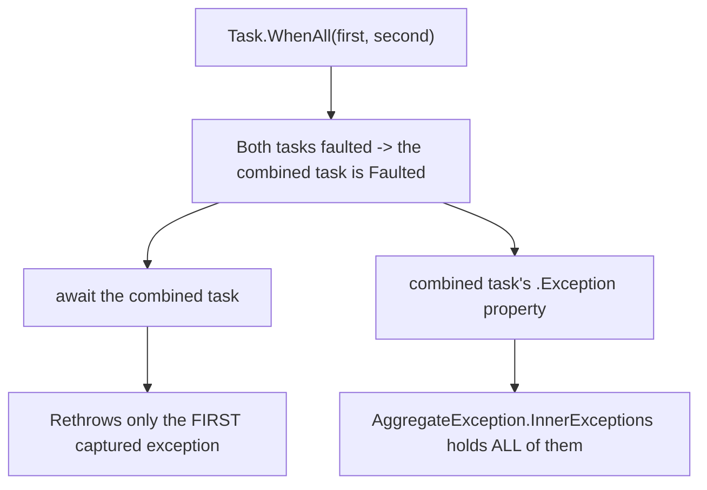
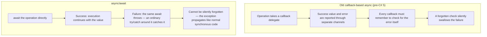

# Exception Handling in Async Code

## Introduction

Before reading this lesson, you should already be comfortable with **[Composing Tasks: WhenAll, WhenAny, ContinueWith](../07-concurrency-parallel-async/07-13-composing-tasks-whenall-whenany.md)** — running several independent asynchronous operations together and waiting for all of them with `Task.WhenAll`. That lesson's examples all assumed everything succeeded. Real checkout pages, real ATM transactions, and real inventory checks fail sometimes, and this lesson covers exactly what happens to an exception once it occurs inside asynchronous code — both for a single `await`, and for the trickier case where several tasks in a `Task.WhenAll` group fail at once.

By the end of this lesson, you will be able to:

- Explain how an exception thrown inside a `Task` is captured rather than thrown immediately, and rethrown at the point where the task is `await`-ed
- Use an ordinary `try`/`catch` around an `await` and explain why this works naturally, unlike older callback-based async patterns
- Explain why `await`-ing a faulted `Task.WhenAll` rethrows only the *first* exception, even when several tasks failed
- Inspect a faulted task's `.Exception` property directly to see every failure as an `AggregateException`
- Decide, for a given scenario, whether catching the first exception is enough or whether every failure needs to be surfaced

## Exception Handling in Async Code — A Layman's Perspective

Imagine a manager who sends three employees out on separate errands at the same time — one to the bank, one to the post office, one to the print shop — and asks each of them to text her the moment they're done, whether the errand succeeded or not. If two of the three errands go wrong — the bank was closed, and the print shop lost the order — the manager will get texts from all three employees eventually, since she asked every one of them to report back regardless of outcome. What she does with those texts, though, depends entirely on how she's chosen to check her phone.

If she's only glancing at her phone for the very first text that arrives and then putting it away, she'll only ever learn about whichever problem got reported to her first — maybe the bank's closure, simply because that employee happened to text a few seconds before the print shop's employee did. The second problem is sitting right there in her phone's message history the whole time, but she never opened it, because she stopped looking after the first one came in. That's not the same as the problem not existing — it's still fully documented, waiting for her, if she ever bothers to open her phone and actually scroll through everything.

If instead she waits until she's heard from all three employees and then reads every single message before deciding what to do, she gets the complete picture: both the bank closure and the lost print order, together, and can act on both problems at once instead of fixing one, sending someone back out, and only then discovering the second one.

Neither approach is wrong — it depends on what she needs. If all she needs to know is "did anything go wrong at all, yes or no, so I can start dealing with it," glancing at the first text and reacting immediately is perfectly reasonable, and it's faster. If she genuinely needs the full list of everything that went sideways before she can plan her next move — maybe she needs to apologize to the customer for every single issue, not just the first one anyone happened to mention — she has to deliberately go check every message, not just react to whichever one buzzed her phone first.

This is precisely the choice C# hands you when several asynchronous operations fail at once. Reacting to the first exception that surfaces through an ordinary `await` is fast and simple, and it's exactly what happens by default, with no extra effort. Seeing every single failure requires deliberately going to look — checking the equivalent of the full message history — which in code means inspecting the task's exception collection directly rather than relying on whatever `await` happened to rethrow first.

## Exception Handling in Async Code — A Programming Language Perspective

When code running inside a `Task` throws an unhandled exception, the runtime does not let that exception propagate immediately the way a synchronous method's exception would — it **captures** the exception and stores it as part of the task's final state, transitioning the task to `Faulted`. The exception only actually gets rethrown later, at the point where that task is `await`-ed (or where `.Wait()`/`.Result` is called), via `ExceptionDispatchInfo`, which preserves the original stack trace across that boundary. Because this rethrow happens at a perfectly ordinary point in your code, an ordinary `try`/`catch` wrapped around the `await` catches it exactly as it would catch a synchronous throw — no special async-aware exception-handling syntax is needed.

This is a deliberate improvement over the callback-based asynchronous patterns C# supported before `async`/`await` existed (the Asynchronous Programming Model and the Event-based Asynchronous Pattern), where a failure had to be reported through a separate error parameter or property on a callback, and every single callback was individually responsible for remembering to check it — an easy thing to forget, and easy for a failure to be silently dropped as a result.

`Task.WhenAll` introduces one further wrinkle: if more than one of its constituent tasks faults, the combined task's `.Exception` property holds an `AggregateException` containing every one of them — but `await`-ing that combined task rethrows only the *first* captured exception, for ergonomics. Seeing the rest requires checking `.Exception` directly.

## How Exceptions Surface Through await and Task.WhenAll

The example below shows both cases: a single faulted operation caught with an ordinary `try`/`catch`, and a `Task.WhenAll` group where two of three tasks fail, demonstrating that `await` surfaces only the first failure while `.Exception` reveals both.


*Figure 1: `await` on a faulted `Task.WhenAll` surfaces one exception; the task's `.Exception` property still holds every one of them.*

```csharp
// Program.cs — .NET 10 / C# 14
Console.WriteLine("-- try/catch around a single await --");
try
{
    await FailingOperationAsync("network timeout");
}
catch (InvalidOperationException ex)
{
    Console.WriteLine($"Caught: {ex.Message}");
}

Console.WriteLine();

Console.WriteLine("-- Task.WhenAll with two faulted tasks --");
Task first = FailingOperationAsync("first failure");
Task second = FailingOperationAsync("second failure");
Task whenAllTask = Task.WhenAll(first, second);

try
{
    await whenAllTask;
}
catch (InvalidOperationException ex)
{
    Console.WriteLine($"await rethrew only the first exception: {ex.Message}");
}

Console.WriteLine($"whenAllTask.Exception has {whenAllTask.Exception!.InnerExceptions.Count} inner exception(s):");
foreach (Exception inner in whenAllTask.Exception.InnerExceptions)
{
    Console.WriteLine($"  - {inner.Message}");
}

static async Task FailingOperationAsync(string reason)
{
    await Task.Delay(100);
    throw new InvalidOperationException(reason);
}
```

**Console Output:**

```text
-- try/catch around a single await --
Caught: network timeout

-- Task.WhenAll with two faulted tasks --
await rethrew only the first exception: first failure
whenAllTask.Exception has 2 inner exception(s):
  - first failure
  - second failure
```

The first block is the simple, common case: `FailingOperationAsync` throws inside its own `await`-ed delay, the exception is captured on its task, and rethrown right where we `await` it — an ordinary `catch (InvalidOperationException)` handles it with no special ceremony. The second block shows the subtlety: both `first` and `second` fault, and `Task.WhenAll` combines them into `whenAllTask`. `await`-ing `whenAllTask` only ever rethrows `first`'s exception — the one that appears first in the array passed to `WhenAll` — but `whenAllTask.Exception` reveals both, because `Task.Exception` always exposes the complete `AggregateException` regardless of which single exception `await` chose to rethrow.

## Real-Time Example: Surfacing Every Validation Failure in E-Commerce Order Processing

We extend the **E-Commerce Order Processing** case study with an `OrderValidator` that runs three checks concurrently with `Task.WhenAll` — payment, inventory, and fraud — before an order is accepted. A real checkout page shouldn't tell a customer about only the *first* problem it happens to notice and make them fix it, resubmit, and discover a second problem on the next attempt; it should collect every validation failure at once. That means deliberately inspecting the combined task's `AggregateException` rather than relying on what a plain `await` rethrows.

```csharp
// Program.cs — .NET 10 / C# 14 — Real-Time Example
using System.Linq;

Order order = new("ORD-58122", "Sana Iyer", 1450.00m, "SKU-9002-RED-L", 3);

OrderValidator validator = new();
string outcome = await validator.ValidateOrderAsync(order);
Console.WriteLine(outcome);

record Order(string OrderId, string CustomerName, decimal Total, string Sku, int Quantity);

class OrderValidator
{
    public async Task<string> ValidateOrderAsync(Order order)
    {
        Task paymentCheck = ValidatePaymentAsync(order.Total);
        Task inventoryCheck = ValidateInventoryAsync(order.Sku, order.Quantity);
        Task fraudCheck = ValidateFraudRiskAsync(order.CustomerName);

        Task allValidations = Task.WhenAll(paymentCheck, inventoryCheck, fraudCheck);

        try
        {
            await allValidations;
        }
        catch (Exception)
        {
            // await only rethrew the FIRST failure — but a real checkout page
            // should tell the customer about every problem, not just one.
            List<string> failures = allValidations.Exception!.InnerExceptions
                .Select(ex => ex.Message)
                .ToList();

            return $"Order {order.OrderId} rejected with {failures.Count} problem(s):{Environment.NewLine}" +
                   string.Join(Environment.NewLine, failures.Select(message => $"  - {message}"));
        }

        return $"Order {order.OrderId} passed all validations.";
    }

    private static async Task ValidatePaymentAsync(decimal total)
    {
        await Task.Delay(150);
        if (total > 1000.00m)
        {
            throw new InvalidOperationException("Payment declined: amount exceeds the card's single-transaction limit.");
        }
    }

    private static async Task ValidateInventoryAsync(string sku, int quantity)
    {
        await Task.Delay(100);
        if (quantity > 2)
        {
            throw new InvalidOperationException($"Inventory shortfall: only 2 units of {sku} remain in stock.");
        }
    }

    private static async Task ValidateFraudRiskAsync(string customerName)
    {
        await Task.Delay(200);
        Console.WriteLine($"  Fraud check passed for {customerName}.");
    }
}
```

**Console Output:**

```text
  Fraud check passed for Sana Iyer.
Order ORD-58122 rejected with 2 problem(s):
  - Payment declined: amount exceeds the card's single-transaction limit.
  - Inventory shortfall: only 2 units of SKU-9002-RED-L remain in stock.
```

`ValidatePaymentAsync` and `ValidateInventoryAsync` both fail — the order's total exceeds the transaction limit, and there isn't enough stock for the requested quantity — while `ValidateFraudRiskAsync` passes cleanly. Because `ValidateOrderAsync` deliberately reads `allValidations.Exception!.InnerExceptions` inside its `catch` block instead of trusting whatever the bare `await` rethrew, the returned message lists *both* problems, not just whichever one happened to be first in the array. A customer fixing only the payment issue and resubmitting would otherwise hit the inventory failure on a second attempt — exactly the frustrating, one-problem-at-a-time experience this approach avoids.

## try/catch with await vs Old Callback-Based Error Handling

It's worth being explicit about why `try`/`catch` around `await` is such a meaningful improvement over how asynchronous failures used to be handled in .NET, because the difference is easy to take for granted once you've only ever known the modern way. In callback-based asynchronous patterns that predate `async`/`await`, a failure had no uniform channel — it might arrive as a separate error parameter passed alongside (or instead of) a successful result, or as a property you had to remember to check on a completed operation object. Every callback, individually, carried the responsibility of checking for that failure signal; forgetting to check it even once meant a real failure could be silently discarded, with no exception ever thrown anywhere for anyone to notice.

`await` closes that gap structurally rather than by convention: a faulted task's exception is rethrown automatically at the `await` point, using the exact same exception-propagation machinery synchronous code has always used. There is no separate error channel to remember to check, because failure and success flow through the identical path — a `try`/`catch` around the `await` catches a failure precisely because it's a real, thrown exception, not a value sitting in a field somewhere waiting to be inspected.


*Figure 2: Callback-based async reports failure through a separate channel a callback might forget to check; `await` reports failure the same way synchronous code always has — by throwing.*

| Aspect | Old callback-based pattern | `async`/`await` with `try`/`catch` |
|---|---|---|
| How failure is reported | A separate error parameter or property the callback must check | The `await` expression itself throws |
| Forgetting to handle it | Silent — the failure can be ignored entirely by accident | Not possible to silently ignore — an uncaught exception propagates up the call stack |
| Composing multiple operations | Each callback nests inside the previous one | Sequential `await` calls read top-to-bottom, each with an ordinary `try`/`catch` |
| Multiple simultaneous failures | Handled manually, per callback | `Task.WhenAll` aggregates every failure into one `AggregateException`, inspectable via `.Exception` |
| Stack trace clarity | Often lost across the callback boundary | Preserved across the `await` by the runtime |

## Ways Exceptions Surface in Async Code

1. **try/catch around a single `await`** — the natural, direct way most asynchronous failures are handled (this lesson).
2. **`AggregateException` from `Task.WhenAll`** — inspecting every failure when more than one task in a group faults (this lesson).
3. **[Task status inspection](../07-concurrency-parallel-async/07-11-task-and-task-t.md)** — checking `.IsFaulted` directly without necessarily awaiting.
4. **Canceled tasks and `OperationCanceledException`** — a task can fail by cancellation as well as by exception, and both surface through the same `await`.
5. **[ConfigureAwait and SynchronizationContext](../07-concurrency-parallel-async/07-15-configureawait-and-synccontext.md)** — affects which context a rethrown exception's continuation resumes on.

## What You've Learned & What's Next

An exception thrown inside a `Task` is captured, not thrown immediately, and only rethrown once that task is `await`-ed — which is exactly why an ordinary `try`/`catch` around an `await` works, with none of the manual error-checking callback-based async patterns required. When `Task.WhenAll` combines several tasks and more than one faults, `await` rethrows only the first; seeing every failure means deliberately checking the combined task's `.Exception` property for its full `AggregateException`.

Continue your learning journey with **[ConfigureAwait and SynchronizationContext](../07-concurrency-parallel-async/07-15-configureawait-and-synccontext.md)**, where you'll see exactly which thread a continuation — successful or faulted — resumes on, and how to control that explicitly.

---
*Applies to: .NET 10 / C# 14. Last reviewed 2026-08-16.*
