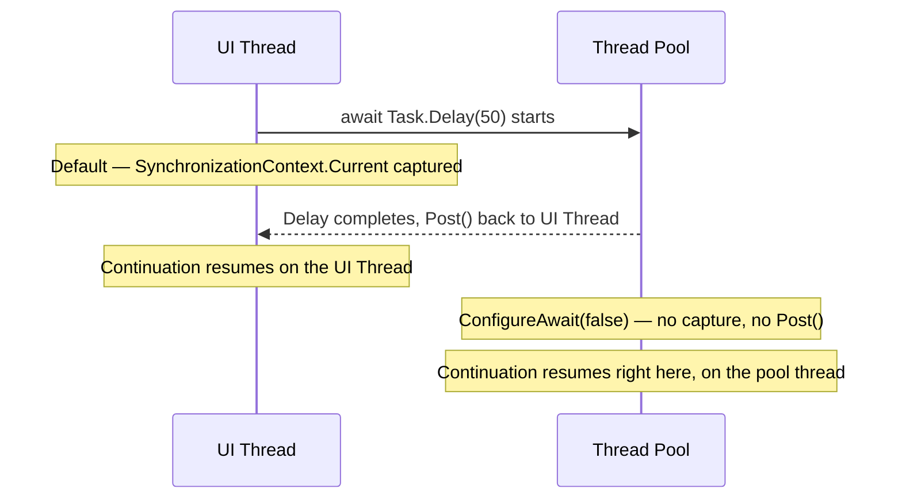
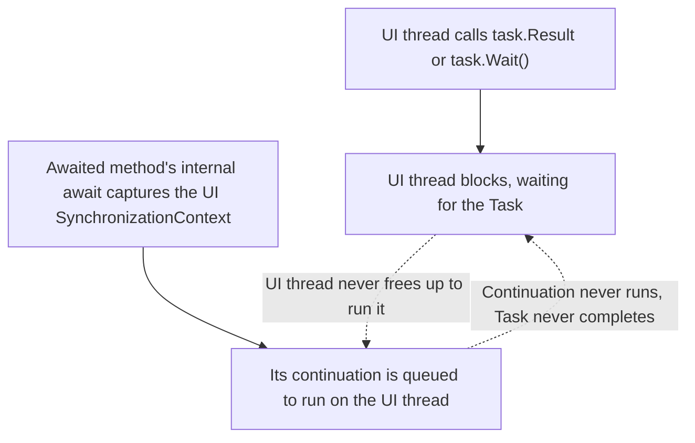

# ConfigureAwait and SynchronizationContext

## Introduction

Before reading this lesson, you should already be comfortable with **[Exception Handling in Async Code](../07-concurrency-parallel-async/07-14-exception-handling-in-async-code.md)**, and with the broader shape of `async`/`await` this module has built up to this point — an `await` expression suspends a method without blocking its thread, and execution resumes once the awaited `Task` completes. What none of the earlier lessons said explicitly is *which* thread that resumption happens on, or why it sometimes matters enormously and sometimes doesn't matter at all. This lesson answers that directly: it introduces `SynchronizationContext`, the mechanism that decides where an `await`'s continuation resumes, and `ConfigureAwait(false)`, the tool that opts a specific `await` out of that decision entirely.

By the end of this lesson, you will be able to:

- Explain what `SynchronizationContext` is and what it means for an `await` to "capture" one
- Explain what `ConfigureAwait(false)` does, and why reusable library code should generally use it
- Explain why ASP.NET Core installs no `SynchronizationContext` by default, unlike WPF, WinForms, and classic ASP.NET
- Reproduce, and explain the cause of, the classic deadlock from blocking on async code with `.Result` or `.Wait()`
- Decide, for a given piece of code, whether `ConfigureAwait(false)` is worth adding

## ConfigureAwait and SynchronizationContext — A Layman's Perspective

Picture a hospital where a doctor, mid-consultation with a patient in Exam Room 4, orders a blood test. The test itself doesn't need to happen in Room 4 — a lab technician down the hall draws the sample, walks it to the lab, and runs it through shared equipment that a dozen other doctors' orders are also using at the same time. None of that lab work cares which exam room sent the order.

But here is the part the hospital's paging system is built entirely around: when the results are ready, they cannot be handed to just any doctor who happens to be walking past. They have to go back to the exact doctor who ordered them, in Exam Room 4 specifically, because that doctor is the only one with the patient's chart open, mid-sentence in an explanation that depends on those numbers. So before the sample is sent off, the hospital's system quietly notes "this order came from Room 4, ordered by this doctor" — and no matter how many other tests are queued ahead of it, or which lab technician or which piece of equipment actually processes it, the result gets paged back to that specific room and that specific doctor the moment it's ready.

Now picture a second, very different order: the hospital's own supply system notices a shelf of test tubes running low and requests a fresh box from the central warehouse. Nobody in any exam room is waiting on a "your test tubes have arrived" page, and no specific person needs to personally receive that notification. Whichever warehouse worker happens to be free can restock the shelf and move on, without paging anyone back to anywhere. Insisting on routing that notification back to some specific room and person would just slow the whole warehouse down for no reason, because nobody there is standing by, waiting on it, mid-sentence.

That is the entire difference this lesson is about. A doctor's patient-facing consultation is like code running on a UI thread, or, historically, a classic web request thread: it captures exactly where it needs to resume, because whatever comes next genuinely has to continue on that same thread — updating the same window, finishing the same response. The warehouse restock, by contrast, is like the internal, reusable plumbing inside a library method: it has no legitimate reason to insist on resuming anywhere specific, and forcing it to do so anyway only adds pointless overhead, one more page sent to one more room that was never actually waiting.

`SynchronizationContext` is the hospital's paging system, quietly noting where to resume. `ConfigureAwait(false)` is the warehouse worker saying, up front, "don't bother paging me back to any particular room — just let whoever's free pick this up." In C#, that is the exact distinction between letting an `await` capture and resume on its original context, and explicitly declining to with `ConfigureAwait(false)`.

## ConfigureAwait and SynchronizationContext — A Programming Language Perspective

`SynchronizationContext` (`System.Threading`) is an abstraction representing "a place code can be scheduled to run." Certain hosts install one automatically: WPF and WinForms install a context tied to the single UI message-loop thread, and classic ASP.NET (`System.Web`, pre-.NET-Core) installed one per request. When an `await` expression suspends a method, the compiler-generated state machine captures `SynchronizationContext.Current` at that point, if one exists, and, once the awaited `Task` completes, uses that context's `Post` method to marshal the continuation back onto it — which is why code immediately after `await dialog.ShowAsync()` in a WPF app can safely touch a `TextBlock` without any explicit thread check.

`Task.ConfigureAwait(bool continueOnCapturedContext)` — also available on `Task<T>`, `ValueTask`, and `ValueTask<T>` — returns an awaitable that controls this behavior for that one `await`. Passing `false` skips capturing any context and simply resumes the continuation on whatever thread-pool thread completed the awaited operation. ASP.NET Core installs no `SynchronizationContext` at all by default, so this capture-and-restore step largely doesn't happen there — one reason `ConfigureAwait(false)` matters less in ASP.NET Core application code, though it remains good practice in reusable library code that might run under any host at all.

## How to Use ConfigureAwait and Observe SynchronizationContext in C#

Seeing `SynchronizationContext` capture in action requires an actual context to capture — a plain console app has none by default, so the example below installs a small custom one, `SingleThreadSynchronizationContext`, that behaves the way WPF's or WinForms' does: it queues work and runs it, one item at a time, on a single dedicated thread standing in for a UI thread. Execution starts on that thread, then runs two local `async Task` methods back to back: one awaits `Task.Delay` normally — the implicit default, equivalent to `ConfigureAwait(true)` — and one awaits it with `ConfigureAwait(false)`. Watch which thread each method is on immediately before and immediately after its `await`.


*Figure 1: The default `await` marshals its continuation back through the captured context; `ConfigureAwait(false)` lets it continue wherever it happens to be.*

```csharp
// Program.cs — .NET 10 / C# 14
using System.Collections.Concurrent;

int uiThreadId = 0;

var uiContext = new SingleThreadSynchronizationContext();
Thread uiThread = new(() => uiContext.RunOnCurrentThread());
uiThread.Start();

uiContext.Post(async _ =>
{
    uiThreadId = Environment.CurrentManagedThreadId;
    Console.WriteLine("Started on the simulated UI thread.");

    await RunWithDefaultConfigureAwait(uiThreadId);
    await RunWithConfigureAwaitFalse(uiThreadId);

    uiContext.Complete();
}, null);

uiThread.Join();

async Task RunWithDefaultConfigureAwait(int uiThreadId)
{
    Console.WriteLine($"[default] before await — on UI thread: {Environment.CurrentManagedThreadId == uiThreadId}");
    await Task.Delay(50); // implicit ConfigureAwait(true): capture and resume here
    Console.WriteLine($"[default] after await  — on UI thread: {Environment.CurrentManagedThreadId == uiThreadId}");
}

async Task RunWithConfigureAwaitFalse(int uiThreadId)
{
    Console.WriteLine($"[false]   before await — on UI thread: {Environment.CurrentManagedThreadId == uiThreadId}");
    await Task.Delay(50).ConfigureAwait(false); // don't capture — resume on whatever thread finishes the delay
    Console.WriteLine($"[false]   after await  — on UI thread: {Environment.CurrentManagedThreadId == uiThreadId}");
}

class SingleThreadSynchronizationContext : SynchronizationContext
{
    private readonly BlockingCollection<(SendOrPostCallback Callback, object? State)> _queue = new();

    public override void Post(SendOrPostCallback d, object? state) => _queue.Add((d, state));

    public void Complete() => _queue.CompleteAdding();

    public void RunOnCurrentThread()
    {
        SetSynchronizationContext(this);
        foreach ((SendOrPostCallback callback, object? state) in _queue.GetConsumingEnumerable())
        {
            callback(state);
        }
    }
}
```

**Console Output:**

```text
Started on the simulated UI thread.
[default] before await — on UI thread: True
[default] after await  — on UI thread: True
[false]   before await — on UI thread: True
[false]   after await  — on UI thread: False
```

Both methods start on the UI thread, so both "before await" lines print `True` — nothing has suspended yet. The difference shows up on the "after await" lines: the default `await` captured `SynchronizationContext.Current` before suspending, so when `Task.Delay` finished, the continuation was posted back through `SingleThreadSynchronizationContext.Post` and ran on the same dedicated UI thread again. The `ConfigureAwait(false)` version captured nothing, so its continuation simply ran on whichever thread-pool thread the delay's timer completed on — a different thread entirely.

## Real-Time Example: ConfigureAwait in a Banking/ATM Application

We extend the Banking/ATM case study with a small ATM front end, `AtmScreen`, and a reusable service layer, `AccountService`. `AccountService` represents the kind of library code that has no idea what's calling it — it could be an ATM kiosk, a mobile banking app, or a batch job — so its own `await` uses `ConfigureAwait(false)`, avoiding a pointless hop back through whatever context called it. `AtmScreen`, by contrast, represents the UI layer: it enforces that its display can only be updated from the thread it was bound to, exactly like a real UI control would.

```csharp
// Program.cs — .NET 10 / C# 14 — Real-Time Example
using System.Collections.Concurrent;
using System.Globalization;

var uiContext = new SingleThreadSynchronizationContext();
Thread uiThread = new(() => uiContext.RunOnCurrentThread());
uiThread.Start();

var accountService = new AccountService();
var atmScreen = new AtmScreen();

uiContext.Post(async _ =>
{
    atmScreen.BindToThread(Environment.CurrentManagedThreadId);

    atmScreen.Show("Contacting bank...");
    decimal balance = await accountService.GetBalanceAsync("1234567890124477");
    // No ConfigureAwait(false) here: this await's continuation must land back
    // on the UI thread, because it's about to touch the screen.
    atmScreen.Show($"Balance: {Usd(balance)}");

    uiContext.Complete();
}, null);

uiThread.Join();

static string Usd(decimal amount) => amount.ToString("C", CultureInfo.GetCultureInfo("en-US"));

class AccountService
{
    // Library-style service code: it never touches UI, so it declines to
    // resume on whatever context happened to call it.
    public async Task<decimal> GetBalanceAsync(string accountNumber)
    {
        await Task.Delay(50).ConfigureAwait(false);
        return 812.47m;
    }
}

class AtmScreen
{
    private int _uiThreadId;

    public void BindToThread(int uiThreadId) => _uiThreadId = uiThreadId;

    public void Show(string text)
    {
        if (Environment.CurrentManagedThreadId != _uiThreadId)
        {
            throw new InvalidOperationException("AtmScreen can only be updated from the UI thread it was bound to.");
        }

        Console.WriteLine($"[ATM screen] {text}");
    }
}

class SingleThreadSynchronizationContext : SynchronizationContext
{
    private readonly BlockingCollection<(SendOrPostCallback Callback, object? State)> _queue = new();

    public override void Post(SendOrPostCallback d, object? state) => _queue.Add((d, state));

    public void Complete() => _queue.CompleteAdding();

    public void RunOnCurrentThread()
    {
        SetSynchronizationContext(this);
        foreach ((SendOrPostCallback callback, object? state) in _queue.GetConsumingEnumerable())
        {
            callback(state);
        }
    }
}
```

**Console Output:**

```text
[ATM screen] Contacting bank...
[ATM screen] Balance: $812.47
```

Notice that `GetBalanceAsync` uses `ConfigureAwait(false)` internally, yet `atmScreen.Show(...)` still runs safely afterward. That works because the *outer* `await accountService.GetBalanceAsync(...)` call — the one inside the UI callback — did not use `ConfigureAwait(false)`, so it captured the ATM's UI context itself, independent of what happened inside the service method. This is the pattern to internalize: library code declines to capture context for its own internal awaits, while the outermost, UI-facing `await` keeps the default so the code that follows it can safely update the screen.

## await vs await.ConfigureAwait(false)

The contrast is really about who owns the decision of where to resume. A plain `await` says "resume wherever this method started," which is exactly right when the code after the `await` needs to touch something thread-affine — a UI control, an `HttpContext` in a host that still uses one. `await x.ConfigureAwait(false)` says "I don't care where this resumes," which is exactly right when the code after it is just more plumbing — another service call, a calculation, a log line — with no dependency on any specific thread.

Blocking on an unfinished async call makes the difference dangerous rather than just theoretical. Calling `.Result` or `.Wait()` on a `Task` from a thread that owns a `SynchronizationContext` — a WPF button-click handler, say — blocks that thread until the awaited operation finishes. But if the method being awaited used a plain `await` internally (no `ConfigureAwait(false)`), its continuation needs to run back on that exact same thread — the one now blocked, waiting for the continuation to finish before it will unblock. Neither side can proceed: the classic async deadlock, and the reason `.Result`/`.Wait()` on UI or classic-ASP.NET code is treated as a near-guaranteed bug.


*Figure 2: The classic deadlock — the blocked thread and the only thread that can finish the work are the same thread.*

| Aspect | `await` (default) | `await x.ConfigureAwait(false)` |
|---|---|---|
| Captures `SynchronizationContext.Current` | Yes, if one exists | No |
| Resumes on | The captured context (e.g., the UI thread) | Whichever thread completed the awaited operation |
| Safe to touch UI/thread-affine state after | Yes | No — not guaranteed |
| Typical home | Application/UI-facing code, top-level handlers | Reusable library and service-layer code |
| Overhead | One extra `Post` hop through the context | None — no marshaling |
| Deadlock risk when blocked on with `.Result`/`.Wait()` | High, on a context-owning thread | Much lower — no context to deadlock against |

## Related Concepts Worth Knowing Alongside ConfigureAwait

`ConfigureAwait` and `SynchronizationContext` sit at the intersection of several ideas covered elsewhere in this module — each worth revisiting with this lesson in mind:

1. **[`Task` and `Task<T>`](../07-concurrency-parallel-async/07-11-task-and-task-t.md)** — the type every `ConfigureAwait` call is made on.
2. **[async/await Fundamentals](../07-concurrency-parallel-async/07-12-async-await-fundamentals.md)** — the suspension-and-resumption mechanics this lesson adds a resumption *location* to.
3. **[Composing Tasks: `WhenAll`, `WhenAny`, `ContinueWith`](../07-concurrency-parallel-async/07-13-composing-tasks-whenall-whenany.md)** — `ContinueWith` exposes its own, separate `TaskContinuationOptions` for controlling where a continuation runs.
4. **[Race Conditions and Deadlocks](../07-concurrency-parallel-async/07-04-race-conditions-and-deadlocks.md)** — the general deadlock concept this lesson's `.Result`/`.Wait()` scenario is a specific, async-flavored case of.
5. **[Synchronous vs Asynchronous Execution — Comparison](../07-concurrency-parallel-async/07-25-sync-vs-async-execution-comparison.md)** — the broader comparison this lesson's UI-thread-safety concern is one piece of.
6. **[Common Async Pitfalls](../07-concurrency-parallel-async/07-18-common-async-pitfalls.md)** — where the `.Result`/`.Wait()` deadlock introduced here gets its full before/after treatment.

## What You've Learned & What's Next

An `await` captures the current `SynchronizationContext`, if one exists, so its continuation can resume in the right place — a UI thread, most commonly; `ConfigureAwait(false)` opts a specific `await` out of that capture, which reusable library code should generally do since it has no legitimate reason to insist on any particular thread, and doing so anyway is what turns blocking on an async call into a deadlock.

Continue your learning journey with **[CancellationToken and IProgress\<T\>](../07-concurrency-parallel-async/07-16-cancellationtoken-and-iprogress.md)**, where we cover how a long-running async operation can be cooperatively cancelled and can report its progress back to whoever started it.

---
*Applies to: .NET 10 / C# 14. Last reviewed 2026-08-16.*
