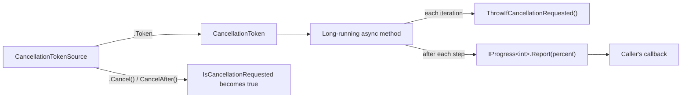
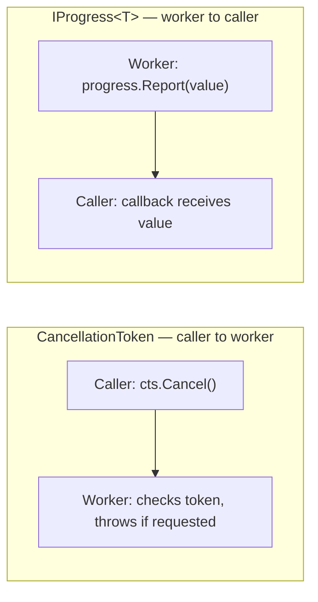

# CancellationToken and IProgress<T>

## Introduction

Before reading this lesson, you should already be comfortable with **[ConfigureAwait and SynchronizationContext](../07-concurrency-parallel-async/07-15-configureawait-and-synccontext.md)** — specifically the idea that a `Progress<T>` callback, like an `await` continuation, can be marshaled back onto a captured context. This lesson introduces two mechanisms that both rely on cooperation rather than force: `CancellationToken`, which lets calling code *ask* a long-running async operation to stop early, and `IProgress<T>`, which lets that same operation report how far along it is while it runs. Neither mechanism works unless the long-running method itself actively participates — nothing about either one can reach in and change what a method is doing against its will.

By the end of this lesson, you will be able to:

- Create a `CancellationTokenSource`, obtain its `CancellationToken`, and request cancellation with `Cancel()` or `CancelAfter()`
- Explain why cancellation is cooperative — a method must check the token itself, nothing forces it to stop
- Use `ThrowIfCancellationRequested()` to turn a cancellation request into an `OperationCanceledException`
- Report incremental progress from a long-running async method using `IProgress<T>`/`Progress<T>`
- Combine both mechanisms in one method that can be cancelled early and reports progress while it runs

## CancellationToken and IProgress\<T\> — A Layman's Perspective

Picture ordering a large custom cake from a bakery for a same-day event. Once the order is placed, you can't reach into the kitchen and physically stop the baker's hands mid-motion — that isn't how any real kitchen works, and it would be dangerous even if it were possible. What you *can* do is post a note on the kitchen's order board: "if this note appears, please stop after finishing whatever step you're on." A responsible baker checks that board between steps — after the batter's mixed, after each layer bakes, after the frosting's applied — and if the note is there, stops cleanly at the next natural break rather than mid-pour. That's the entire deal: you post a request to stop, the baker checks for it periodically and honors it if seen, but nothing about posting the note magically halts an action already in progress.

Meanwhile, because a whole custom cake can take hours, you'd like some sense of where things stand without walking into the kitchen every ten minutes to ask. So a runner is set up: every time the baker finishes a meaningful step, they hand the runner a card — "layers baked," "frosting applied," "80% done" — and the runner brings that card straight to your table, without you lifting a finger.

Both arrangements share the same quiet honesty: they only work because the baker chooses to participate. A baker who never checks the order board will finish the cake regardless of how many notes pile up. A baker who never hands the runner a card will leave you sitting at your table with no idea whether anything is happening at all. Posting a note and appointing a runner are both requests made *to* the kitchen, not commands issued *over* it.

Bring these back to code: a `CancellationTokenSource` is the note board, and the `CancellationToken` handed to the baking method is the note itself — requesting a stop happens once, from outside, but honoring it is entirely up to the method that received the token, which must actually check it every so often. `IProgress<T>` is the runner, and `Progress<T>` is the specific runner assigned to carry cards back to your exact table. Neither forces anything on the method doing the actual work; both simply give it a well-defined way to cooperate, if it chooses to.

## CancellationToken and IProgress\<T\> — A Programming Language Perspective

`CancellationTokenSource` (`System.Threading`) is the owner of a cancellation request: it exposes a `Token` property returning a `CancellationToken`, and a `Cancel()` method (or `CancelAfter(TimeSpan)` for a delayed request) that flips `IsCancellationRequested` to `true` on every token derived from that source. A `CancellationToken` itself is a lightweight, readonly struct — it can only be *observed*, never used to trigger cancellation; only the `CancellationTokenSource` that produced it can do that. A method that wants to support cancellation accepts a `CancellationToken` parameter and checks it periodically, most idiomatically via `token.ThrowIfCancellationRequested()`, which throws `OperationCanceledException` the instant it's called, if a cancellation was requested. Many framework async APIs — `Task.Delay`, `HttpClient.SendAsync`, stream reads — accept a token directly and honor it internally.

`IProgress<T>` is a single-method interface, `void Report(T value)`, decoupling "something producing updates" from "something displaying them." `Progress<T>` is the built-in implementation: it captures the current `SynchronizationContext` when constructed and marshals each `Report` call onto it, which is why a `Progress<T>` built on a UI thread can safely update a progress bar from inside its callback.

## How to Use CancellationToken and IProgress\<T\> in C#

A cancellable, progress-reporting method takes both a `CancellationToken` and an `IProgress<T>` as parameters, checks the token before or during each unit of work, and calls `Report` after completing each one. The example below counts to ten, one step every 100 milliseconds, while a `CancellationTokenSource` is set to cancel after 250 milliseconds — partway through.


*Figure 1: The token flows from source to method; progress flows from method back to caller — two independent, cooperative channels.*

```csharp
// Program.cs — .NET 10 / C# 14
using var cts = new CancellationTokenSource();
cts.CancelAfter(TimeSpan.FromMilliseconds(250)); // simulate a caller requesting cancellation partway through

var progress = new Progress<int>(percent => Console.WriteLine($"Progress: {percent}%"));

try
{
    await CountToAsync(10, progress, cts.Token);
    Console.WriteLine("Completed without cancellation.");
}
catch (OperationCanceledException)
{
    Console.WriteLine("Operation was cancelled.");
}

static async Task CountToAsync(int count, IProgress<int> progress, CancellationToken cancellationToken)
{
    for (int i = 1; i <= count; i++)
    {
        cancellationToken.ThrowIfCancellationRequested();
        await Task.Delay(100, cancellationToken);
        progress.Report(i * 100 / count);
    }
}
```

**Console Output:**

```text
Progress: 10%
Progress: 20%
Operation was cancelled.
```

The first two 100-millisecond steps complete before the 250-millisecond cancellation fires, so their progress reports print normally. The third call to `Task.Delay(100, cancellationToken)` is still running when `cts.CancelAfter` triggers cancellation — `Task.Delay` itself honors the token, throwing `OperationCanceledException` immediately rather than waiting out the remaining delay, which is why the loop never reaches `i == 3`'s `Report` call at all.

## Real-Time Example: Cancellable Progress in E-Commerce Order Batch Processing

We extend the E-Commerce Order Processing case study with an overnight warehouse job: `OrderBatchProcessor` works through a queue of orders — charging payment and reserving stock for each — and reports progress after every order so a monitoring dashboard stays current. If a warehouse operator cancels the batch partway through (modeled here with `CancelAfter`), the processor must stop cleanly rather than silently finishing orders nobody asked it to finish.

```csharp
// Program.cs — .NET 10 / C# 14 — Real-Time Example
List<Order> orders =
[
    new Order("ORD-1001", 129.99m),
    new Order("ORD-1002", 54.50m),
    new Order("ORD-1003", 210.00m),
    new Order("ORD-1004", 89.25m),
    new Order("ORD-1005", 45.00m),
];

using var cts = new CancellationTokenSource();
cts.CancelAfter(TimeSpan.FromMilliseconds(250)); // the warehouse operator cancels the batch partway through

var progress = new Progress<OrderBatchProgress>(p =>
    Console.WriteLine($"[{p.Processed}/{p.Total}] Processed {p.LastOrderId} — {p.PercentComplete}% complete"));

var processor = new OrderBatchProcessor();

try
{
    await processor.ProcessOrdersAsync(orders, progress, cts.Token);
    Console.WriteLine("Batch completed successfully.");
}
catch (OperationCanceledException)
{
    Console.WriteLine("Batch processing was cancelled by the operator.");
}

class OrderBatchProcessor
{
    public async Task ProcessOrdersAsync(
        IReadOnlyList<Order> orders,
        IProgress<OrderBatchProgress> progress,
        CancellationToken cancellationToken)
    {
        for (int i = 0; i < orders.Count; i++)
        {
            cancellationToken.ThrowIfCancellationRequested();

            await Task.Delay(100, cancellationToken); // simulate charging payment + reserving stock

            int processed = i + 1;
            progress.Report(new OrderBatchProgress(orders[i].OrderId, processed, orders.Count, processed * 100 / orders.Count));
        }
    }
}

record Order(string OrderId, decimal Total);

record OrderBatchProgress(string LastOrderId, int Processed, int Total, int PercentComplete);
```

**Console Output:**

```text
[1/5] Processed ORD-1001 — 20% complete
[2/5] Processed ORD-1002 — 40% complete
Batch processing was cancelled by the operator.
```

Only two of the five orders finish before the 250-millisecond cancellation lands mid-delay on the third. Crucially, nothing about `Order` `ORD-1003` gets left half-processed — the cancellation is checked, and the delay throws, *before* any payment or stock-reservation logic for that order would run, which is exactly the discipline a real batch job needs: stop cleanly between units of work, never partway through one.

## CancellationToken vs IProgress\<T\>

Both mechanisms in this lesson share the same cooperative spirit — neither can force a method to do anything — but they move information in opposite directions and serve opposite purposes. A `CancellationToken` carries a request *into* the long-running method: "stop early if you can." `IProgress<T>` carries information *out of* it: "here's how far I've gotten." A method can support either independently, or both together as the examples above do, but supporting one implies nothing about the other — a method can be fully cancellable while reporting no progress at all, or vice versa.


*Figure 2: Cancellation flows caller-to-worker; progress flows worker-to-caller. Both depend on the worker choosing to participate.*

| Aspect | `CancellationToken` | `IProgress<T>` |
|---|---|---|
| Direction of information flow | Caller → long-running method | Long-running method → caller |
| Purpose | Request an early stop | Report status/percentage while running |
| Who must cooperate | The method being called — it must check the token | The method being called — it must call `Report` |
| Enforced by the runtime? | No — purely cooperative | No — purely cooperative |
| Typical implementation | `CancellationTokenSource` + `CancellationToken` | `Progress<T>`, capturing a `SynchronizationContext` |
| What happens if the method ignores it | Runs to completion regardless of the request | Caller simply receives no updates, silently |

## Related Concepts Worth Knowing Alongside Cancellation and Progress

1. **[`Task` and `Task<T>`](../07-concurrency-parallel-async/07-11-task-and-task-t.md)** — the return type every cancellable, progress-reporting method in this lesson still builds on.
2. **[Composing Tasks: `WhenAll`, `WhenAny`, `ContinueWith`](../07-concurrency-parallel-async/07-13-composing-tasks-whenall-whenany.md)** — combine cancellable tasks the same way any other tasks are combined.
3. **[`Semaphore` and `SemaphoreSlim`](../07-concurrency-parallel-async/07-07-semaphore-and-semaphoreslim.md)** — `WaitAsync(CancellationToken)` accepts the same kind of token this lesson introduces.
4. **[Async Streams with `IAsyncEnumerable<T>`](../07-concurrency-parallel-async/07-17-async-streams-iasyncenumerable.md)** — `await foreach` has its own `WithCancellation` extension built on this exact token.
5. **[Common Async Pitfalls](../07-concurrency-parallel-async/07-18-common-async-pitfalls.md)** — where forgetting to pass a token through a chain of async calls becomes a real, easy-to-make mistake.

## What You've Learned & What's Next

`CancellationTokenSource` and `CancellationToken` let calling code request that a long-running async operation stop early, but only ever cooperatively — a method must check `ThrowIfCancellationRequested()` (or similar) on its own, since nothing external can force it to stop mid-step. `IProgress<T>`, most often via `Progress<T>`, lets that same operation report incremental status back to its caller, one `Report` call at a time. Both patterns depend entirely on the long-running method choosing to participate.

Continue your learning journey with **[Async Streams with IAsyncEnumerable\<T\>](../07-concurrency-parallel-async/07-17-async-streams-iasyncenumerable.md)**, where we cover how a method can `yield return` results one at a time as they become available, rather than making the caller wait for an entire collection to finish.

---
*Applies to: .NET 10 / C# 14. Last reviewed 2026-08-16.*
