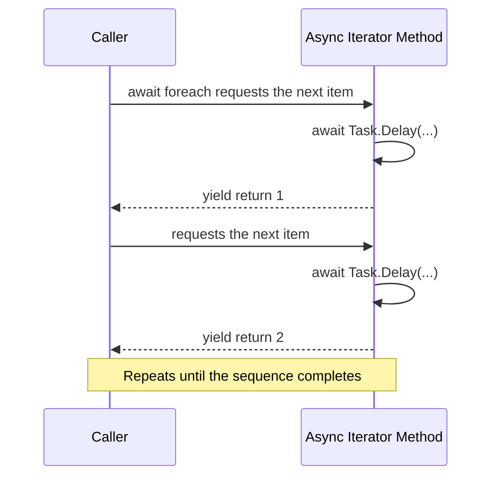
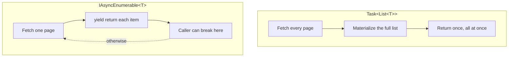

# Async Streams with IAsyncEnumerable<T>

## Introduction

Before reading this lesson, you should already be comfortable with **[CancellationToken and IProgress<T>](../07-concurrency-parallel-async/07-16-cancellationtoken-and-iprogress.md)** and, further back, with `Task<T>` as "a single value that will be ready later." This lesson introduces a third shape entirely: a *sequence* of values that becomes ready one at a time, over time. `IAsyncEnumerable<T>`, consumed with `await foreach`, lets a method hand results to its caller as each one becomes available, rather than making the caller wait for every single result before seeing the first one.

By the end of this lesson, you will be able to:

- Explain what `IAsyncEnumerable<T>` represents and how it differs from both `IEnumerable<T>` and `Task<List<T>>`
- Write an async iterator method combining `async`, `await`, and `yield return` in a single method
- Consume an async stream with `await foreach`
- Stop consuming an async stream early with `break`, without fetching results that are never needed
- Recognize paginated API results as the most common real-world use case for async streams

## Async Streams — A Layman's Perspective

Imagine asking a research assistant to find every relevant book across twelve branch libraries for a big project. One way to work: the assistant calls all twelve branches, waits for every single one to answer, compiles one master list from every response, and hands you the complete list at the very end. You get everything at once — but if branch eleven takes forever to pick up the phone, you sit there with nothing, unable to start reading branch one's results even though the assistant learned about them twenty minutes ago.

The other way: the assistant calls branch one, and the moment they answer, reads you their list over the phone right then — then calls branch two while you're already looking over branch one's books, reads you branch two's list the moment it comes in, and so on. The total amount of work is identical — same twelve branches, same phone calls, same books — but you experience it completely differently: results trickling in continuously, rather than one long silence followed by everything at once.

There's a second advantage buried in that second approach, and it's the more important one. Suppose the very first book on branch one's list turns out to be exactly the one you needed, and you no longer care about the other eleven branches at all. In the "wait for everything" approach, the assistant has already called every branch before you ever found that out — that work is done and can't be undone. In the "report as you go" approach, you can simply say "stop, that's the one I needed" the moment you hear it, and the assistant never bothers calling branches four through twelve at all.

That's exactly what an async stream in C# offers a caller: results delivered one at a time, as they're ready, with the freedom to stop asking for more the moment enough is enough. The assistant's own way of working — calling one branch, waiting on that one specific line to ring back without losing her place, then reporting and moving to the next — mirrors an async iterator method that suspends on an `await`, resumes exactly where it left off, and hands back one result at a time with `yield return`.

## Async Streams — A Programming Language Perspective

`IAsyncEnumerable<T>` (`System.Collections.Generic`) is the asynchronous counterpart to `IEnumerable<T>`: instead of a synchronous `IEnumerator<T>` whose `MoveNext()` returns immediately, its asynchronous enumerator exposes a `MoveNextAsync()` returning a `ValueTask<bool>`, allowing the *production* of the next element to itself involve awaiting I/O. `await foreach` is the consuming syntax built specifically for it, analogous to a plain `foreach` over `IEnumerable<T>`.

An **async iterator method** is any method declared `async` and returning `IAsyncEnumerable<T>` that contains one or more `yield return` statements — a combination the compiler has supported since C# 8, generating a state machine that can both suspend on `await` and yield values via `yield return`, in any order, as many times as needed. This differs from an ordinary iterator method (returning `IEnumerable<T>`, covered in [Custom Iterators with `yield`](../03-collections-generics/03-14-custom-iterators-with-yield.md)), which may `yield return` but may never `await`, and from a plain `async Task<List<T>>` method, which may `await` freely but can only hand back its entire result at the very end, all at once.

## How to Write and Consume an Async Stream in C#

An async iterator method looks almost identical to an ordinary iterator method, with one addition: `await` is now legal inside it, anywhere a real asynchronous wait is needed before the next value is ready. The caller consumes it with `await foreach` instead of a plain `foreach`.


*Figure 1: Each `await foreach` iteration asks the async iterator for exactly one more item, which may itself involve an asynchronous wait before it's ready.*

```csharp
// Program.cs — .NET 10 / C# 14
await foreach (int number in CountUpAsync(5))
{
    Console.WriteLine($"Received: {number}");
}

static async IAsyncEnumerable<int> CountUpAsync(int count)
{
    for (int i = 1; i <= count; i++)
    {
        await Task.Delay(100); // simulate an I/O-bound step producing the next value
        yield return i;
    }
}
```

**Console Output:**

```text
Received: 1
Received: 2
Received: 3
Received: 4
Received: 5
```

Every line above is separated in real time by roughly 100 milliseconds, but nothing in `Program.cs` had to manage that timing explicitly — `await foreach` simply asked `CountUpAsync` for the next value, and `CountUpAsync` suspended on its own `await Task.Delay(100)` before handing one back. The caller never waited for all five values to exist before seeing the first one.

## Real-Time Example: Streaming Catalog Search Results in a Library System

We extend the Library/Inventory Management case study with `LibraryCatalogClient`, whose `SearchAsync` method models a search across a paginated catalog API — three pages of results, each requiring its own simulated network round trip. Rather than waiting for every page to arrive before returning anything, `SearchAsync` streams each book the moment its page has been fetched, letting the caller stop searching the instant it finds what it needed.

```csharp
// Program.cs — .NET 10 / C# 14 — Real-Time Example
var catalog = new LibraryCatalogClient();

Console.WriteLine("Streaming search results for 'clean code':");
await foreach (Book book in catalog.SearchAsync("clean code"))
{
    Console.WriteLine($"  Found: {book.Title} by {book.Author} (available: {book.CopiesAvailable})");

    if (book.CopiesAvailable == 0)
    {
        Console.WriteLine($"  '{book.Title}' is out — stopping search early, no need to fetch remaining pages.");
        break;
    }
}

class LibraryCatalogClient
{
    private static readonly Book[][] Pages =
    [
        [new Book("Clean Code", "Robert C. Martin", 2), new Book("Clean Architecture", "Robert C. Martin", 0)],
        [new Book("Working Effectively with Legacy Code", "Michael Feathers", 1)],
        [new Book("Refactoring", "Martin Fowler", 3)],
    ];

    public async IAsyncEnumerable<Book> SearchAsync(string keyword)
    {
        foreach (Book[] page in Pages)
        {
            await Task.Delay(75); // simulate a network round-trip fetching the next page of results
            foreach (Book book in page)
            {
                yield return book;
            }
        }
    }
}

record Book(string Title, string Author, int CopiesAvailable);
```

**Console Output:**

```text
Streaming search results for 'clean code':
  Found: Clean Code by Robert C. Martin (available: 2)
  Found: Clean Architecture by Robert C. Martin (available: 0)
  'Clean Architecture' is out — stopping search early, no need to fetch remaining pages.
```

The `break` fires after the second book, from page one — pages two and three, and the simulated network delay each would have cost, are never fetched at all. In a real catalog system backed by a genuinely paginated REST API, that's not a minor efficiency detail: a search that could plausibly span hundreds of pages only ever pays for the pages a caller actually needed to see, because `await foreach` requests the next item lazily, one at a time, rather than the whole result set up front.

## IAsyncEnumerable\<T\> vs Task\<List\<T\>\>

Both approaches eventually deliver the same information, but they differ in exactly when the caller gets to see any of it, and in what the caller can do about that. A method returning `Task<List<T>>` must finish gathering every element before it can return at all — the caller `await`s once and then has the complete list, all at once, or nothing yet. A method returning `IAsyncEnumerable<T>` can hand back its first element the moment it exists, while later elements are still being produced, and the caller decides, item by item, whether to keep asking for more.

That difference in control is the real reason to reach for `IAsyncEnumerable<T>`: it isn't primarily about raw speed — fetching all three catalog pages back-to-back doesn't take less total time than streaming them — it's about giving the caller the option to stop early and about never holding an entire, possibly enormous, result set in memory at once.


*Figure 2: `Task<List<T>>` returns everything together, once; `IAsyncEnumerable<T>` returns items one at a time, and the caller can stop the loop at any point.*

| Aspect | `Task<List<T>>` | `IAsyncEnumerable<T>` |
|---|---|---|
| When the first item reaches the caller | Only after every item is fetched | As soon as the first item is ready |
| Consumption syntax | `await` once, then a plain `foreach` | `await foreach` directly |
| Can the caller stop early and skip remaining work | No — all fetching already happened | Yes — `break` stops requesting further items |
| Memory footprint | Entire collection materialized at once | One item at a time, unless the caller buffers it |
| Typical use | Small, bounded result sets | Paginated APIs, large or open-ended streams |

## Related Concepts Worth Knowing Alongside Async Streams

1. **[`IEnumerable<T>` and `IEnumerator<T>`](../03-collections-generics/03-13-ienumerable-and-ienumerator.md)** — the synchronous interface `IAsyncEnumerable<T>` mirrors, one `MoveNextAsync()` at a time.
2. **[Custom Iterators with `yield`](../03-collections-generics/03-14-custom-iterators-with-yield.md)** — the `yield return` syntax this lesson combines with `await` for the first time.
3. **[`Task` and `Task<T>`](../07-concurrency-parallel-async/07-11-task-and-task-t.md)** — the single-value asynchronous shape `IAsyncEnumerable<T>` extends into a sequence.
4. **[CancellationToken and IProgress<T>](../07-concurrency-parallel-async/07-16-cancellationtoken-and-iprogress.md)** — `await foreach` supports its own `WithCancellation(token)` extension for stopping a stream early.
5. **[Common Async Pitfalls](../07-concurrency-parallel-async/07-18-common-async-pitfalls.md)** — where forgetting that `await foreach` still needs proper exception handling around it gets a closer look.

## What You've Learned & What's Next

`IAsyncEnumerable<T>`, produced by an async iterator method that mixes `await` with `yield return`, lets a method stream results back to its caller one at a time, as each becomes ready, instead of forcing the caller to wait for the entire collection. Consumed with `await foreach`, it also lets the caller stop early with `break`, skipping any work that would have produced results nobody needed — exactly the behavior a paginated API search should have.

Continue your learning journey with **[Common Async Pitfalls](../07-concurrency-parallel-async/07-18-common-async-pitfalls.md)**, the capstone of this module's Asynchronous Programming lessons, where we bring together everything from `Task` through async streams to fix a set of real, easy-to-make async mistakes.

---
*Applies to: .NET 10 / C# 14. Last reviewed 2026-08-16.*
