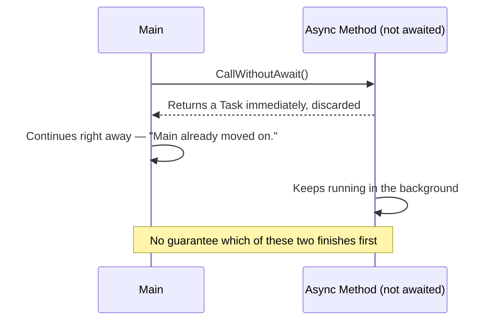
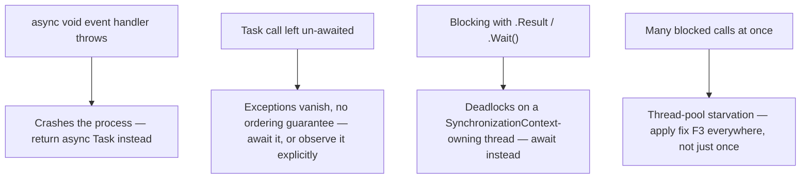

# Common Async Pitfalls

## Introduction

Before reading this lesson, you should already be comfortable with **[Async Streams with IAsyncEnumerable<T>](../07-concurrency-parallel-async/07-17-async-streams-iasyncenumerable.md)** and, really, with the entire Asynchronous Programming arc of this module — what `Task`/`Task<T>` represent, how `async`/`await` suspends and resumes a method, how to compose multiple tasks together, how exceptions propagate through awaited code, what a `SynchronizationContext` captures and how `ConfigureAwait(false)` opts out of it, how cooperative cancellation and progress reporting work, and how an async stream delivers results one at a time. This lesson is the sub-area's capstone, and it introduces no new syntax at all. Instead, it asks the question every lesson before it was quietly building the vocabulary to answer: **what actually goes wrong when all of this is misused, and how do you recognize it in real code?**

By the end of this lesson, you will be able to:

- Explain why `async void` should be reserved for event handlers, and what happens when an exception escapes one
- Reproduce, and explain the cause of, the classic deadlock from blocking on async code with `.Result` or `.Wait()`
- Explain thread-pool starvation as the same blocking habit repeated at scale
- Recognize a "fire-and-forget" bug caused by calling a `Task`-returning method without awaiting it
- Fix all four pitfalls in a realistic Banking/ATM code sample, comparing the buggy version against the corrected one

## Common Async Pitfalls — A Layman's Perspective

Picture a busy restaurant kitchen on its worst night, when four different things start going wrong at once, each in its own way.

First, one line cook has a habit: whenever a dish goes wrong — burnt, dropped, whatever — he doesn't tell anyone. He quietly tosses it in the bin and starts the next order, and nobody at the pass, the register, or the dining room ever finds out anything went wrong at all, until a customer is sitting at their table forty minutes later with nothing to eat and no explanation. Nobody was watching for his mistakes, because nobody was ever told to.

Second, a different cook has an even worse habit: whenever they're expecting a slow ingredient — a stock that needs to simmer for twenty minutes — they don't go work on something else while it simmers. They plant themselves directly in the kitchen's single narrow doorway and simply stand there, refusing to let anyone else pass, waiting for that one stock to finish, because they've decided they personally need to watch it complete before they'll move an inch. Nobody else can get past that doorway while he's standing in it — not to grab a plate, not to deliver an order — even though every other ticket in the kitchen has nothing to do with his stock.

Third, imagine that doorway-blocking habit isn't just one cook's quirk — it's how the whole kitchen was trained to work, and on the busiest night of the year, five, then ten, then fifteen cooks all end up standing in doorways at once, each waiting on some slow ingredient, each refusing to do anything else in the meantime. Very quickly there simply aren't enough cooks left free to grab a single new ticket off the printer, and the whole kitchen, capable of far more, grinds to a halt — not because there wasn't enough food to make, but because everyone capable of making it was standing still, blocking a doorway.

Fourth, a fourth cook starts assembling a complicated dessert, gets halfway through, and wanders off to chat about something else entirely, never coming back to finish plating it or hand it to a server. The dessert isn't wrong, exactly — it's just abandoned, half-made, with nobody even aware it was ever started, let alone that it never finished.

Every one of these is a different failure, but they share the same root: someone quietly broke an unwritten rule about how work is supposed to flow through the kitchen — report failures, don't block the doorway waiting on something you don't personally need to watch, don't let blocking become the whole staff's default habit, and never walk away from something you started without seeing it through. C# code built on `async`/`await` has the exact same four unwritten rules, and this lesson is about what happens when code breaks each one — and how to write it so it doesn't.

## Common Async Pitfalls — A Programming Language Perspective

**`async void`** is the one place C# allows an asynchronous method to return nothing at all, reserved specifically for event handlers, whose delegate signature (`EventHandler`, UI framework click handlers, and similar) already fixes a `void` return type. Unlike `async Task`, an `async void` method gives its caller no `Task` to await, observe, or catch exceptions from; any exception thrown inside one propagates to the `SynchronizationContext` (or the thread pool, absent one) current when the method started — typically terminating the process rather than being catchable by an ordinary `try`/`catch` around the call site.

**Blocking on an incomplete `Task`** with `.Result` or `.Wait()` stalls the calling thread until that `Task` completes. On a thread that owns a `SynchronizationContext` — a UI thread, or a classic ASP.NET request thread — if the awaited method's own internal `await` captured that same context, its continuation is queued to run on the very thread now blocked waiting for it: a deadlock, as covered in [ConfigureAwait and SynchronizationContext](../07-concurrency-parallel-async/07-15-configureawait-and-synccontext.md).

**Thread-pool starvation** is the same blocking habit at scale: each `.Result`/`.Wait()` call occupies a thread-pool thread doing nothing but waiting, and enough of them can exhaust the pool's available threads faster than its own growth heuristics can compensate, starving unrelated work across the whole application.

Finally, calling a `Task`-returning method without `await`ing or otherwise observing its result is a **fire-and-forget** call — the compiler even warns about it (`CS4014`) — and it still runs, but any exception it throws is silently attached to a `Task` nobody is watching.

## How to Spot a Forgotten `await`

The most deceptively easy pitfall to introduce is simply calling an `async Task` method and not putting `await` in front of it. The code compiles — with a warning — and the called method still runs, but the calling method has already moved on to its next line before that work finishes, with no guarantee about which one completes first.


*Figure 1: A call without `await` hands back control immediately — the calling method and the called method now run concurrently, with no ordering guarantee between them.*

```csharp
// Program.cs — .NET 10 / C# 14
Console.WriteLine("Calling without await...");
CallWithoutAwait(); // CS4014 warning: this call is not awaited
Console.WriteLine("Main already moved on.");

await Task.Delay(50); // demo-only pacing so the background work has time to print
Console.WriteLine("--");

Console.WriteLine("Calling with await...");
await CallWithAwait();
Console.WriteLine("Main only got here after the work finished.");

static async Task CallWithoutAwait()
{
    await Task.Delay(20);
    Console.WriteLine("  (fire-and-forget) work finished.");
}

static async Task CallWithAwait()
{
    await Task.Delay(20);
    Console.WriteLine("  (awaited) work finished.");
}
```

**Console Output:**

```text
Calling without await...
Main already moved on.
  (fire-and-forget) work finished.
--
Calling with await...
  (awaited) work finished.
Main only got here after the work finished.
```

Notice the ordering in the first half: `"Main already moved on."` prints *before* `"(fire-and-forget) work finished."`, because the call to `CallWithoutAwait()` handed control straight back to `Main` without waiting for anything. In the second half, `await CallWithAwait()` guarantees the opposite order every time — the work genuinely finishes before `Main` continues. The bug isn't that the fire-and-forget call fails; it's that nothing about it is guaranteed, including whether it finishes before the process exits.

## Real-Time Example: Fixing Async Bugs in a Banking/ATM Withdrawal Flow

We extend the Banking/ATM case study with an `AtmMachine` handling withdrawal requests against a `BankAccount`. The version below compiles and runs, but it carries three of this lesson's pitfalls at once. Read it first, then compare it against the fixed version that follows.

**Before (buggy):**

```csharp
// Program.cs — .NET 10 / C# 14 — Real-Time Example: BEFORE (buggy)
using System.Globalization;

AppDomain.CurrentDomain.UnhandledException += (sender, e) =>
{
    var ex = (Exception)e.ExceptionObject;
    Console.WriteLine($"[UNHANDLED] {ex.GetType().Name}: {ex.Message}");
    Console.WriteLine("The process crashes here — nothing after this point runs.");
};

var atm = new AtmMachine(new BankAccount("1234567890124477", 500.00m));

Console.WriteLine("-- Withdrawal request: $200 --");
atm.OnWithdrawRequested(200.00m); // Bug #1: async void — Main has no Task to await
await Task.Delay(100); // demo-only pacing so the fire-and-forget log line has time to print

Console.WriteLine("-- Withdrawal request: $400 (exceeds the remaining balance) --");
atm.OnWithdrawRequested(400.00m); // this one throws, and nothing can catch it
await Task.Delay(100);

Console.WriteLine("Session complete."); // never reached

class AtmMachine(BankAccount account)
{
    // Bug #1: async void — no Task for calling code to observe or catch.
    public async void OnWithdrawRequested(decimal amount)
    {
        decimal newBalance = await account.WithdrawAsync(amount);
        Console.WriteLine($"  Approved for {account.MaskedAccountNumber}. New balance: {BankAccount.Usd(newBalance)}");

        // Bug #2: fire-and-forget — never awaited, so its exceptions vanish
        // and it isn't guaranteed to finish before the caller moves on.
        account.LogTransactionAsync(amount);
    }
}

class BankAccount(string accountNumber, decimal balance)
{
    public string MaskedAccountNumber { get; } = $"****{accountNumber[^4..]}";
    public decimal Balance { get; private set; } = balance;

    public static string Usd(decimal amount) => amount.ToString("C", CultureInfo.GetCultureInfo("en-US"));

    public async Task<decimal> WithdrawAsync(decimal amount)
    {
        await Task.Delay(20); // simulate a call to a core banking service

        // Bug #3: blocking on async work with .Result instead of awaiting.
        // This happens not to deadlock only because a console app has no
        // SynchronizationContext to fight over — the same line deadlocks in
        // a WPF or classic ASP.NET app (see "ConfigureAwait and
        // SynchronizationContext" earlier in this module).
        bool fraudCheckPassed = CheckForFraudAsync(amount).Result;

        if (!fraudCheckPassed || amount > Balance)
        {
            throw new InvalidOperationException($"Withdrawal of {Usd(amount)} for {MaskedAccountNumber} declined: insufficient funds or failed fraud check.");
        }

        Balance -= amount;
        return Balance;
    }

    public async Task LogTransactionAsync(decimal amount)
    {
        await Task.Delay(10);
        Console.WriteLine($"  [log] {MaskedAccountNumber} withdrawal of {Usd(amount)} recorded.");
    }

    private static async Task<bool> CheckForFraudAsync(decimal amount)
    {
        await Task.Delay(5);
        return amount <= 1000.00m;
    }
}
```

**Console Output:**

```text
-- Withdrawal request: $200 --
  Approved for ****4477. New balance: $300.00
  [log] ****4477 withdrawal of $200.00 recorded.
-- Withdrawal request: $400 (exceeds the remaining balance) --
[UNHANDLED] InvalidOperationException: Withdrawal of $400.00 for ****4477 declined: insufficient funds or failed fraud check.
The process crashes here — nothing after this point runs.
```

The first withdrawal happens to work, and its fire-and-forget log line happens to print in time — but only because of the artificial `Task.Delay(100)` pacing this demo added just to make the output observable at all; nothing in `AtmMachine` itself guarantees that ordering. The second withdrawal is the real damage: a perfectly ordinary declined withdrawal — the kind any ATM handles constantly — throws an exception inside an `async void` method, and with no `Task` to carry it anywhere, it takes down the entire process.

**After (fixed):**

```csharp
// Program.cs — .NET 10 / C# 14 — Real-Time Example: AFTER (fixed)
using System.Globalization;

var atm = new AtmMachine(new BankAccount("1234567890124477", 500.00m));

Console.WriteLine("-- Withdrawal request: $200 --");
await atm.RequestWithdrawAsync(200.00m);

Console.WriteLine("-- Withdrawal request: $400 (exceeds the remaining balance) --");
await atm.RequestWithdrawAsync(400.00m);

Console.WriteLine("Session complete.");

class AtmMachine(BankAccount account)
{
    // Fix #1: async Task instead of async void — exceptions are now
    // observable through the returned Task instead of crashing the process.
    public async Task RequestWithdrawAsync(decimal amount)
    {
        try
        {
            decimal newBalance = await account.WithdrawAsync(amount);
            Console.WriteLine($"  Approved for {account.MaskedAccountNumber}. New balance: {BankAccount.Usd(newBalance)}");

            // Fix #2: awaited, so completion is guaranteed before this
            // method returns, and any exception surfaces right here.
            await account.LogTransactionAsync(amount);
        }
        catch (InvalidOperationException ex)
        {
            Console.WriteLine($"  Declined: {ex.Message}");
        }
    }
}

class BankAccount(string accountNumber, decimal balance)
{
    public string MaskedAccountNumber { get; } = $"****{accountNumber[^4..]}";
    public decimal Balance { get; private set; } = balance;

    public static string Usd(decimal amount) => amount.ToString("C", CultureInfo.GetCultureInfo("en-US"));

    public async Task<decimal> WithdrawAsync(decimal amount)
    {
        await Task.Delay(20);

        // Fix #3: awaited instead of blocked on — no thread is ever held
        // hostage waiting on this, regardless of what kind of thread called it.
        bool fraudCheckPassed = await CheckForFraudAsync(amount);

        if (!fraudCheckPassed || amount > Balance)
        {
            throw new InvalidOperationException($"Withdrawal of {Usd(amount)} for {MaskedAccountNumber} declined: insufficient funds or failed fraud check.");
        }

        Balance -= amount;
        return Balance;
    }

    public async Task LogTransactionAsync(decimal amount)
    {
        await Task.Delay(10);
        Console.WriteLine($"  [log] {MaskedAccountNumber} withdrawal of {Usd(amount)} recorded.");
    }

    private static async Task<bool> CheckForFraudAsync(decimal amount)
    {
        await Task.Delay(5);
        return amount <= 1000.00m;
    }
}
```

**Console Output:**

```text
-- Withdrawal request: $200 --
  Approved for ****4477. New balance: $300.00
  [log] ****4477 withdrawal of $200.00 recorded.
-- Withdrawal request: $400 (exceeds the remaining balance) --
  Declined: Withdrawal of $400.00 for ****4477 declined: insufficient funds or failed fraud check.
Session complete.
```

Every artificial `Task.Delay` pacing hack from the buggy version is gone — properly awaiting the whole chain makes the ordering deterministic on its own, with no help needed. The declined withdrawal is now just a normal, handled outcome: `RequestWithdrawAsync` returns a `Task` its caller can `await`, its `try`/`catch` catches the exact exception `WithdrawAsync` throws, and the process finishes cleanly and prints `"Session complete."` In a real ATM, the difference between these two versions is the difference between "a customer's card gets declined" and "every ATM in the building goes dark because one customer didn't have enough money."

## Before vs After — The Four Fixes at a Glance

Each of this lesson's four pitfalls shares the same shape: code that technically compiles and often even runs correctly under light load, right up until the one input or the one moment of real concurrency that exposes it. That's what makes all four dangerous in practice — they tend to survive casual testing and surface later, in production, under exactly the conditions a test environment rarely reproduces.


*Figure 2: All four pitfalls trace back to the same habit — refusing to let `await` do the waiting.*

| Pitfall | What goes wrong | Real-world consequence | Fix |
|---|---|---|---|
| `async void` (outside event handlers) | The exception has no `Task` to attach to | Unhandled exception crashes the entire process | Return `async Task` everywhere except genuine event handlers |
| Blocking with `.Result`/`.Wait()` | The awaited method's continuation may need the very thread now blocked | Deadlock, on any thread that owns a `SynchronizationContext` | `await` instead of blocking, all the way up the call chain |
| Sync-over-async at scale | Each blocked call ties up a thread-pool thread doing nothing | Thread-pool starvation under load — the whole app slows or stalls | The same fix as above, applied consistently, not just in one hot path |
| Forgetting to `await` a `Task` | The call still runs, but nobody observes its result or exceptions | Silent failures, no guarantee the work finishes before the caller moves on | `await` it, or explicitly store/observe it if truly intended to run unwaited |

## Asynchronous Programming at a Glance

This capstone rests on every lesson in the Asynchronous Programming sub-area — each one is worth revisiting now that they all fit together:

1. **[Introduction to Asynchronous Programming](../07-concurrency-parallel-async/07-10-introduction-to-async-programming.md)** — why asynchronous code exists at all, and what problem it solves.
2. **[`Task` and `Task<T>`](../07-concurrency-parallel-async/07-11-task-and-task-t.md)** — the type every pitfall in this lesson revolves around, misused or otherwise.
3. **[async/await Fundamentals](../07-concurrency-parallel-async/07-12-async-await-fundamentals.md)** — the suspension-and-resumption mechanics behind every fix above.
4. **[Exception Handling in Async Code](../07-concurrency-parallel-async/07-14-exception-handling-in-async-code.md)** — why an awaited `Task`'s exception is catchable, and an `async void`'s is not.
5. **[ConfigureAwait and SynchronizationContext](../07-concurrency-parallel-async/07-15-configureawait-and-synccontext.md)** — the exact mechanism that turns a blocked `.Result` call into a deadlock.
6. **[CancellationToken and IProgress<T>](../07-concurrency-parallel-async/07-16-cancellationtoken-and-iprogress.md)** — cooperative patterns that, like everything here, only work if the code participates honestly.

## What You've Learned & What's Next

`async void` should be reserved for genuine event handlers, because any exception it throws has no `Task` to attach to and crashes the process instead of being catchable. Blocking on async code with `.Result` or `.Wait()` risks deadlocking any thread that owns a `SynchronizationContext`, and doing it repeatedly starves the thread pool even without a full deadlock. Calling a `Task`-returning method without `await`ing it lets the work run, unobserved, with no guarantee it finishes — or reports its failures — before anything else does. All four pitfalls share the same root cause: code that quietly stops letting `await` do the waiting it was designed to do.

Continue your learning journey with **[Parallel.For and Parallel.ForEach](../07-concurrency-parallel-async/07-19-parallel-for-and-foreach.md)**, the first lesson of this module's Parallel Programming section, where the focus shifts from *asynchronous* code — waiting efficiently — to genuinely *parallel* code — doing multiple pieces of CPU-bound work at the same time.

---
*Applies to: .NET 10 / C# 14. Last reviewed 2026-08-16.*
