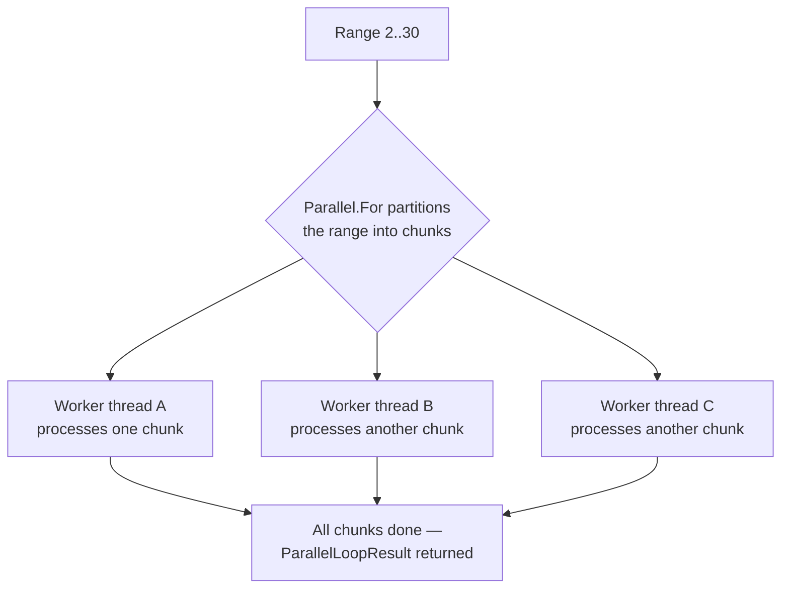
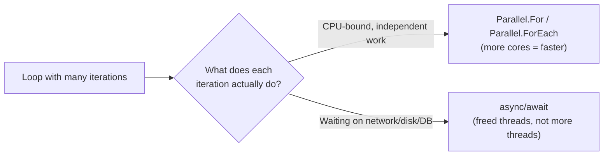

# Parallel.For and Parallel.ForEach

## Introduction

Before reading this lesson, you should already be comfortable with **[Common Async Pitfalls](../07-concurrency-parallel-async/07-18-common-async-pitfalls.md)**, and more broadly with the idea that `async`/`await` exists to stop a thread from sitting blocked on something it's merely *waiting* for — a network call, a disk read, a database round-trip. This lesson turns to a different, complementary problem: what do you do when the work isn't waiting on anything at all, but is instead genuinely, continuously keeping a CPU core busy, and you have thousands of independent chunks of it to get through? Awaiting harder doesn't help there. What helps is spreading the work across every core the machine actually has, and that's exactly what `Parallel.For` and `Parallel.ForEach` are for.

By the end of this lesson, you will be able to:

- Recognize when a loop's iterations are good candidates for parallelization (CPU-bound, independent of one another)
- Use `Parallel.For` to parallelize a loop over a numeric range
- Use `Parallel.ForEach` to parallelize a loop over an existing collection
- Control how many cores a parallel loop is allowed to use with `ParallelOptions.MaxDegreeOfParallelism`
- Explain why parallelizing an I/O-bound loop doesn't help, and reach for `async`/`await` instead

## Parallel.For and Parallel.ForEach — A Layman's Perspective

Picture a fruit-packing warehouse with one enormous bin holding two thousand apples that all need the exact same treatment: inspected for bruising, wiped down, and placed in a crate. Critically, inspecting apple number 847 tells you absolutely nothing about apple number 12, and doing apple 12 first or apple 847 first changes nothing about the outcome — every apple's fate depends only on that one apple. That independence is the whole story. If you put one worker on the bin, two thousand apples get done one at a time, back to back. But if you put four workers on the same bin, each simply grabbing the next apple whenever their hands are free, four apples get inspected during the same stretch of time it used to take to inspect one — because there are genuinely four sets of hands now, not because any single worker got faster.

This is precisely what `Parallel.For` and `Parallel.ForEach` do to a loop: they don't make one iteration run quicker, they run *many* iterations at the exact same instant, one per available worker, until the whole bin is empty. The warehouse manager doesn't hand out apples one at a time by walking back and forth constantly, either — that would waste more time coordinating than inspecting. Instead, each worker is trusted to just keep reaching into the bin and grabbing whatever's next, and the manager only steps back in once every apple in the entire bin has been handled by somebody.

Now picture a completely different job at the same warehouse: waiting for a delivery truck to arrive from the regional distribution center before the day's shipment can be logged. Adding a second, third, or fourth worker to stand at the loading dock and stare down the road doesn't make the truck arrive any sooner — there's nothing to divide up, because the entire task *is* the waiting. Four idle workers staring at an empty road accomplish exactly what one idle worker staring at the same road accomplishes: nothing, until the truck actually shows up. This is the crucial line this lesson draws: apple-inspection is CPU-bound, independent, repeatable work — more hands genuinely finish it faster. Truck-waiting is I/O-bound waiting — more hands change nothing, and the only real improvement is freeing those workers to go do something else useful while the wait plays out, which is a job for `async`/`await`, not for more parallel workers.

The other detail worth sitting with: those four workers are still bounded by how many pairs of hands the warehouse actually has. Hiring forty workers for a two-thousand-apple bin doesn't mean forty apples get inspected simultaneously forever — eventually workers start bumping elbows, waiting for a free spot at the inspection table, or just standing around with nothing new to grab. There's a natural ceiling, set by the warehouse's physical layout, past which adding more hands stops helping and starts getting in the way. `Parallel.For` and `Parallel.ForEach` work inside that same kind of ceiling, set by how many CPU cores the machine running your program actually has.

## Parallel.For and Parallel.ForEach — A Programming Language Perspective

`Parallel.For` and `Parallel.ForEach` are static methods on the `System.Threading.Tasks.Parallel` class, part of the Task Parallel Library. `Parallel.For(int fromInclusive, int toExclusive, Action<int> body)` partitions the numeric range into chunks and schedules those chunks as work items on the `ThreadPool`, running `body` for each index; `Parallel.ForEach<TSource>(IEnumerable<TSource> source, Action<TSource> body)` does the equivalent over an existing collection. Both return a `ParallelLoopResult`, whose `IsCompleted` property is `true` once every partition has finished without an early `Break()`/`Stop()` or unhandled exception. Both methods **block the calling thread** until every iteration is done — conceptually the same guarantee `Thread.Join` gives you for a single thread, just for however many worker threads the runtime actually used. An overload of each accepts a `ParallelOptions` instance, whose `MaxDegreeOfParallelism` property caps how many iterations may run concurrently; left at its default of `-1`, the runtime decides based on `Environment.ProcessorCount` and current load. None of this is new to C# 14 — the `Parallel` class has existed since .NET 4.0 — but it remains the direct, current tool for CPU-bound data-parallel loops in .NET 10.

## How to Use Parallel.For and Parallel.ForEach in C#

The pattern below deliberately avoids calling `Console.WriteLine` from inside the loop body. Multiple iterations running at the same instant on different threads would interleave their output unpredictably — instead, each iteration writes its own result into its own slot of a pre-sized array (no two iterations ever touch the same slot, so there's nothing to coordinate), and the results are printed afterward, in order, once the loop has fully finished.


*Figure 1: `Parallel.For` splits a range into chunks, hands each chunk to a worker thread, and only returns once every chunk has finished.*

```csharp
// Program.cs — .NET 10 / C# 14
const int upperBound = 30; // exclusive
bool[] isPrime = new bool[upperBound];

ParallelLoopResult result = Parallel.For(2, upperBound, i =>
{
    isPrime[i] = IsPrime(i);
});

Console.WriteLine($"Loop completed: {result.IsCompleted}");
Console.Write("Primes below 30: ");
Console.WriteLine(string.Join(", ", Enumerable.Range(2, upperBound - 2).Where(i => isPrime[i])));

static bool IsPrime(int number)
{
    if (number < 2) return false;
    for (int divisor = 2; divisor * divisor <= number; divisor++)
    {
        if (number % divisor == 0) return false;
    }
    return true;
}
```

**Console Output:**

```text
Loop completed: True
Primes below 30: 2, 3, 5, 7, 11, 13, 17, 19, 23, 29
```

`Parallel.For(2, 30, ...)` partitions the range `[2, 30)` across however many worker threads the runtime decides to use, and every one of those workers writes into a distinct index of `isPrime` — no two iterations ever race on the same array slot, so there's no shared-state hazard to guard against here at all. The calling thread doesn't move past the `Parallel.For` call until every single index has been processed, which is why `result.IsCompleted` and the final `Console.WriteLine` are guaranteed to see a fully populated array, regardless of which worker happened to finish which index first.

## Real-Time Example: Nightly Loyalty Point Recalculation in E-Commerce Order Processing

We continue building on the `Order` record from Lesson 07-01's Real-Time Example. A retailer's nightly batch job recalculates loyalty points for every order placed that day — a tiered calculation (double points for orders of $500 or more) that's pure, independent, CPU-bound math per order, making it a natural fit for `Parallel.ForEach`. We also cap concurrency explicitly with `ParallelOptions.MaxDegreeOfParallelism`, simulating a shared server where the batch job shouldn't be allowed to claim every available core.

```csharp
// Program.cs — .NET 10 / C# 14 — Real-Time Example
using System.Collections.Concurrent;
using System.Globalization;

List<Order> orders =
[
    new Order("ORD-10042", 249.99m),
    new Order("ORD-10043", 512.40m),
    new Order("ORD-10044", 89.50m),
    new Order("ORD-10045", 730.10m),
    new Order("ORD-10046", 415.00m)
];

var loyaltyPoints = new ConcurrentDictionary<string, int>();
ParallelOptions options = new() { MaxDegreeOfParallelism = 2 };

Parallel.ForEach(orders, options, order =>
{
    loyaltyPoints[order.OrderId] = CalculateLoyaltyPoints(order);
});

Console.WriteLine("Nightly loyalty point recalculation (MaxDegreeOfParallelism = 2):");
foreach (Order order in orders.OrderBy(o => o.OrderId))
{
    Console.WriteLine($"  {order.OrderId}: {Usd(order.Total)} -> {loyaltyPoints[order.OrderId]} points");
}

static int CalculateLoyaltyPoints(Order order)
{
    int basePoints = (int)(order.Total / 10m);
    return order.Total >= 500m ? basePoints * 2 : basePoints;
}

static string Usd(decimal amount) => amount.ToString("C", CultureInfo.GetCultureInfo("en-US"));

record Order(string OrderId, decimal Total);
```

**Console Output:**

```text
Nightly loyalty point recalculation (MaxDegreeOfParallelism = 2):
  ORD-10042: $249.99 -> 24 points
  ORD-10043: $512.40 -> 102 points
  ORD-10044: $89.50 -> 8 points
  ORD-10045: $730.10 -> 146 points
  ORD-10046: $415.00 -> 41 points
```

Setting `MaxDegreeOfParallelism = 2` means at most two orders are ever being scored at the same physical instant, no matter how many cores the machine has — useful when this batch job shares a server with a customer-facing storefront that also needs CPU headroom. Each order's point calculation depends on nothing but that one order's own total, which is exactly why capping or raising the degree of parallelism only ever changes *how fast* the batch finishes, never *what* it computes. `ConcurrentDictionary<string, int>` gives every worker a safe place to record its result without needing a lock, since concurrent writes to different keys don't conflict.

## When Parallelizing a Loop Actually Pays Off

Not every loop benefits from `Parallel.For`/`Parallel.ForEach`, and reaching for it reflexively can make a program slower, not faster. The deciding question is always the same one the warehouse analogy raised: is each iteration doing real, independent CPU work, or is it mostly waiting on something external? A loop that resizes a thousand images, hashes a thousand records, or scores a thousand orders is CPU-bound and independent — parallelizing it lets multiple cores genuinely share the load. A loop that calls a web API, queries a database, or reads a file for each item is I/O-bound — the CPU is mostly idle during each iteration regardless of how many threads you throw at it, and `Parallel.ForEach` would just create a pile of threads all blocked waiting, which is strictly worse than a handful of `async`/`await` calls that free their threads entirely while they wait.


*Figure 2: The nature of the iteration's work — not habit — decides whether a loop belongs to this lesson or to Module 07's async/await lessons.*

There's a second, subtler cost worth naming: even genuinely CPU-bound loops carry overhead from partitioning the work and coordinating threads. For a loop over five items, that coordination overhead can easily exceed the time saved, making a plain sequential `foreach` faster in practice. `Parallel.For`/`Parallel.ForEach` earn their keep on large collections doing meaningfully expensive per-item work — exactly the nightly batch-job shape shown above, not a three-item lookup table.

| Aspect | Sequential `foreach` | `Parallel.For` / `Parallel.ForEach` |
|---|---|---|
| Iterations in flight at once | One | Up to `MaxDegreeOfParallelism` (or as many as the runtime decides) |
| Best suited for | Small collections, or iterations with dependencies on each other | Large collections, CPU-bound, independent iterations |
| Overhead | Effectively none | Partitioning and thread-coordination overhead |
| Ordering | Always processes items in source order | No ordering guarantee across iterations |
| Wrong tool for | — | I/O-bound loops (waiting on network/disk/DB) |

## Types and Variants of Parallel Looping in C#

`Parallel.For` and `Parallel.ForEach` have several overloads and companions worth knowing about as you go deeper:

1. **[Parallel.Invoke](../07-concurrency-parallel-async/07-20-parallel-invoke.md)** — running a fixed, known set of independent actions concurrently, rather than looping over a collection.
2. **`Parallel.For<TLocal>`** — an overload that gives each partition its own thread-local accumulator, merged at the end, useful for parallel aggregation like a running sum.
3. **`ParallelLoopState`** — passed into the loop body to support early termination via `Break()` or `Stop()`.
4. **`ParallelOptions.CancellationToken`** — lets an external caller cooperatively cancel an in-progress parallel loop.
5. **[PLINQ — Parallel LINQ](../07-concurrency-parallel-async/07-21-plinq-parallel-linq.md)** — a query-syntax alternative to `Parallel.ForEach` for parallelizing a LINQ pipeline.
6. **`Partitioner.Create`** — a custom partitioning strategy, covered in depth in [Data Partitioning and Degree of Parallelism](../07-concurrency-parallel-async/07-23-data-partitioning-degree-of-parallelism.md).

## What You've Learned & What's Next

`Parallel.For` and `Parallel.ForEach` divide a CPU-bound loop's independent iterations across the machine's available cores, blocking the caller until every iteration has finished, with `ParallelOptions.MaxDegreeOfParallelism` giving you direct control over how many cores the loop is allowed to use at once. The whole payoff depends on the work being genuinely CPU-bound and independent — for I/O-bound waiting, `async`/`await` remains the right tool, not more threads.

Continue your learning journey with **[Parallel.Invoke](../07-concurrency-parallel-async/07-20-parallel-invoke.md)**, where we look at running a fixed handful of distinct, known operations concurrently — a different shape of problem than looping over a collection.

---
*Applies to: .NET 10 / C# 14. Last reviewed 2026-08-16.*
