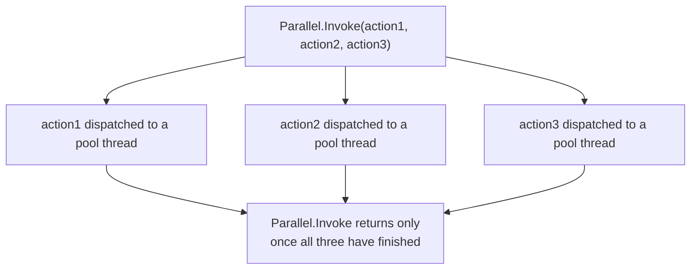
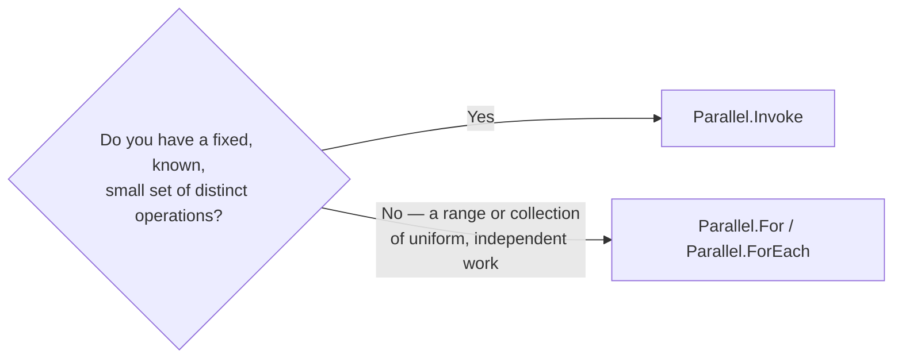

# Parallel.Invoke

## Introduction

Before reading this lesson, you should already be comfortable with **[Parallel.For and Parallel.ForEach](../07-concurrency-parallel-async/07-19-parallel-for-and-foreach.md)** — parallelizing a loop's many identical, independent iterations across cores. This lesson looks at a different shape of problem entirely: not "run this same operation a thousand times over a thousand items," but "run these three or four completely different, specific operations, each exactly once, at the same time." That's precisely what `Parallel.Invoke` is built for.

By the end of this lesson, you will be able to:

- Use `Parallel.Invoke` to run a fixed, known set of independent actions concurrently
- Explain how `Parallel.Invoke` differs from `Parallel.For`/`Parallel.ForEach` in the kind of work it fits
- Pass `ParallelOptions` to `Parallel.Invoke` to cap its degree of concurrency
- Recognize when `Parallel.Invoke` is the wrong fit — variable-size collections, or I/O-bound waits
- Handle exceptions raised by multiple `Parallel.Invoke` actions via `AggregateException`

## Parallel.Invoke — A Layman's Perspective

Picture a store manager opening up in the morning, with a short, fixed list of jobs that all need doing before the doors unlock: unlock the register and count the starting cash drawer, walk the sales floor and switch on every display light, and start the coffee machine in the break room. Notice something about this list that's different from the apple-inspection bin from the previous lesson: there isn't a pile of a thousand identical tasks here. There are exactly three named, distinct jobs, each with its own specific instructions, and none of them depend on any of the others finishing first. The manager doesn't need to loop through "task number one, task number two, task number three" the way a warehouse worker loops through apple after apple — each job simply gets assigned to whichever staff member is free, all three start at once, and the manager just waits until every one of them reports back done.

This is the exact shape of problem `Parallel.Invoke` solves. It isn't for "do this one thing to every item in a big pile" — that's still `Parallel.For`/`Parallel.ForEach`'s job. It's for "do these specific, different things, all of which happen to be safe to do at the same time." The register count, the light switches, and the coffee machine don't share any equipment and don't care what order they finish in, so handing all three to different people simultaneously is pure upside — the store opens in roughly however long the *slowest* of the three jobs takes, instead of the sum of all three.

Now suppose one of those three jobs goes wrong — the register drawer won't open because of a jammed lock. A well-run store doesn't want the other two staff members to just freeze and wait to see what happens with the drawer; the lights should still get switched on and the coffee should still get made regardless. But the manager absolutely does want to know, once everyone reports back, that the drawer failed — not buried silently, but reported clearly alongside whatever else succeeded. That's the second half of what this lesson covers: when one of several concurrently dispatched jobs fails, the failure doesn't get lost, and it doesn't stop the other independent jobs from finishing — it just gets collected and reported once everything is done.

## Parallel.Invoke — A Programming Language Perspective

`Parallel.Invoke`, a static method on `System.Threading.Tasks.Parallel`, has the signature `public static void Invoke(params Action[] actions)`, along with an overload accepting a leading `ParallelOptions` parameter. Each `Action` passed in is scheduled as a separate work item on the `ThreadPool`, and the calling thread blocks until every one of them has run to completion — conceptually equivalent to starting a `Task` per action and calling `Task.WaitAll` on all of them, but expressed as a single, simpler call. Unlike `Parallel.For`/`Parallel.ForEach`, there's no notion of partitioning a range or collection here; the number and identity of operations is fixed and known at the call site. If one or more actions throw, `Parallel.Invoke` still waits for every action to finish (or fail) before returning, then rethrows every captured exception wrapped together inside a single `AggregateException`, whose `InnerExceptions` property lists each one. This behavior is unchanged since .NET 4.0; it remains the direct tool in .NET 10 for dispatching a small, fixed set of independent operations concurrently.

## How to Use Parallel.Invoke in C#

`Parallel.Invoke` takes any number of `Action` delegates — lambdas, method groups, or local functions — as separate arguments, and schedules all of them to run concurrently before returning once every single one has finished.


*Figure 1: `Parallel.Invoke` dispatches every named action at once and blocks until all of them are done — regardless of which one finishes first.*

```csharp
// Program.cs — .NET 10 / C# 14
Console.WriteLine("Starting three independent startup checks...");

Parallel.Invoke(
    () => CheckDatabaseConnection(),
    () => WarmUpCache(),
    () => LoadConfiguration()
);

Console.WriteLine("All startup checks complete.");

static void CheckDatabaseConnection()
{
    Thread.Sleep(60);
    Console.WriteLine("  [Database] connection verified");
}

static void WarmUpCache()
{
    Thread.Sleep(30);
    Console.WriteLine("  [Cache] warmed up");
}

static void LoadConfiguration()
{
    Thread.Sleep(10);
    Console.WriteLine("  [Configuration] loaded");
}
```

**Console Output:**

```text
Starting three independent startup checks...
  [Configuration] loaded
  [Cache] warmed up
  [Database] connection verified
All startup checks complete.
```

`Parallel.Invoke` schedules all three actions onto the thread pool essentially at once, and the exact interleaving of the three inner lines depends on OS and thread-pool scheduling — here the deliberately different sleep durations make the fastest check (`Configuration`, at 10ms) report first and the slowest (`Database`, at 60ms) report last, though on a heavily loaded machine that ordering could shift slightly. What's guaranteed, regardless of timing, is that "All startup checks complete." only ever prints after every one of the three has actually finished — exactly the same blocking guarantee `Parallel.For` gives you, just for a fixed set of named operations instead of a loop.

## Real-Time Example: ATM Self-Checks Before a Withdrawal

We extend the Banking/ATM domain with a pre-withdrawal self-check: before dispensing cash, the machine needs to verify the card network link, verify the cash dispenser mechanism, and load today's fraud-rule set — three distinct, known operations, not a loop over a collection, which makes `Parallel.Invoke` the natural fit. This example also shows what happens when one of those checks fails.

```csharp
// Program.cs — .NET 10 / C# 14 — Real-Time Example
Console.WriteLine("ATM self-check before dispensing cash for withdrawal request...");

try
{
    Parallel.Invoke(
        () => VerifyCardNetwork(),
        () => VerifyCashDispenser(),
        () => VerifyFraudRules()
    );

    Console.WriteLine("All self-checks passed. Proceeding with withdrawal.");
}
catch (AggregateException ex)
{
    Console.WriteLine($"Self-check failed with {ex.InnerExceptions.Count} error(s):");
    foreach (Exception inner in ex.InnerExceptions)
    {
        Console.WriteLine($"  - {inner.Message}");
    }
    Console.WriteLine("Withdrawal aborted.");
}

static void VerifyCardNetwork()
{
    Thread.Sleep(20);
    Console.WriteLine("  [Card network] link verified");
}

static void VerifyFraudRules()
{
    Thread.Sleep(5);
    Console.WriteLine("  [Fraud rules] today's rule set loaded");
}

static void VerifyCashDispenser()
{
    Thread.Sleep(10);
    throw new InvalidOperationException("Cash dispenser jam detected in tray 2");
}
```

**Console Output:**

```text
ATM self-check before dispensing cash for withdrawal request...
  [Fraud rules] today's rule set loaded
  [Card network] link verified
Self-check failed with 1 error(s):
  - Cash dispenser jam detected in tray 2
Withdrawal aborted.
```

The two successful checks may print in a slightly different relative order depending on scheduling, but the failure summary always prints only after all three checks have finished, success or not — `Parallel.Invoke` doesn't abandon the card-network and fraud-rule checks just because the dispenser check threw. Instead, it lets every action run to completion, collects the one exception that occurred, and surfaces it as a single `AggregateException` once everything is done. In a real ATM, this matters enormously: you want to know about *every* problem discovered during the self-check in one pass, not just the first one encountered, and you never want an unrelated failure to silently prevent an otherwise-healthy check from running at all.

## Parallel.Invoke vs Parallel.For/Parallel.ForEach

Both constructs dispatch work to the thread pool and block until everything finishes, but they answer different questions. `Parallel.For`/`Parallel.ForEach` answer "run this *same* operation over every item in a range or collection," where the number of iterations is often large and driven by data you don't know the exact size of until runtime. `Parallel.Invoke` answers "run these *specific, different* operations, a fixed and usually small number of them, known by name at the point you write the call." Reaching for `Parallel.Invoke` to process a collection means writing out one lambda per item by hand, which doesn't scale; reaching for `Parallel.ForEach` to run three unrelated startup checks means wrapping them awkwardly in a collection of delegates just to loop over three things you could have simply named.


*Figure 2: The shape of the work — named operations vs. a data-driven collection — decides which construct fits.*

| Aspect | `Parallel.Invoke` | `Parallel.For` / `Parallel.ForEach` |
|---|---|---|
| Input shape | A fixed, named set of `Action` delegates | A numeric range or a collection, often large |
| Typical operation count | Small and known at compile time | Potentially large and known only at runtime |
| Exception handling | All actions run to completion; failures collected into one `AggregateException` | Same aggregation behavior, across however many iterations threw |
| Degree-of-parallelism control | `ParallelOptions` overload | `ParallelOptions.MaxDegreeOfParallelism` |
| Typical use | A handful of distinct startup/shutdown/validation steps | Bulk, uniform, data-driven CPU-bound work |

## Types and Variants Related to Parallel.Invoke

1. **[Parallel.For and Parallel.ForEach](../07-concurrency-parallel-async/07-19-parallel-for-and-foreach.md)** — the data-parallel counterpart for looping over a range or collection.
2. **`Parallel.Invoke` with `ParallelOptions`** — capping `MaxDegreeOfParallelism` when the number of actions exceeds available cores.
3. **`Task.WaitAll`** — a lower-level alternative: start `Task`s explicitly, then wait for all of them, giving finer control over how each is created.
4. **`Task.WhenAll` (async)** — the non-blocking counterpart, used when the "actions" are I/O-bound rather than CPU-bound.
5. **[PLINQ — Parallel LINQ](../07-concurrency-parallel-async/07-21-plinq-parallel-linq.md)** — parallelizing a LINQ query pipeline rather than either fixed actions or a manual loop.
6. **`AggregateException.Flatten()`** — collapsing nested aggregate exceptions from parallel operations into a single flat list.

## What You've Learned & What's Next

`Parallel.Invoke` runs a fixed, named set of independent actions concurrently, blocking until every one of them finishes and collecting any failures into a single `AggregateException` rather than losing them or stopping the other actions early. It's the right tool for a handful of distinct, known operations — for a data-driven collection of uniform work, `Parallel.For`/`Parallel.ForEach` from the previous lesson remains the better fit.

Continue your learning journey with **[PLINQ — Parallel LINQ](../07-concurrency-parallel-async/07-21-plinq-parallel-linq.md)**, where we look at parallelizing a LINQ query itself with `.AsParallel()`.

---
*Applies to: .NET 10 / C# 14. Last reviewed 2026-08-16.*
